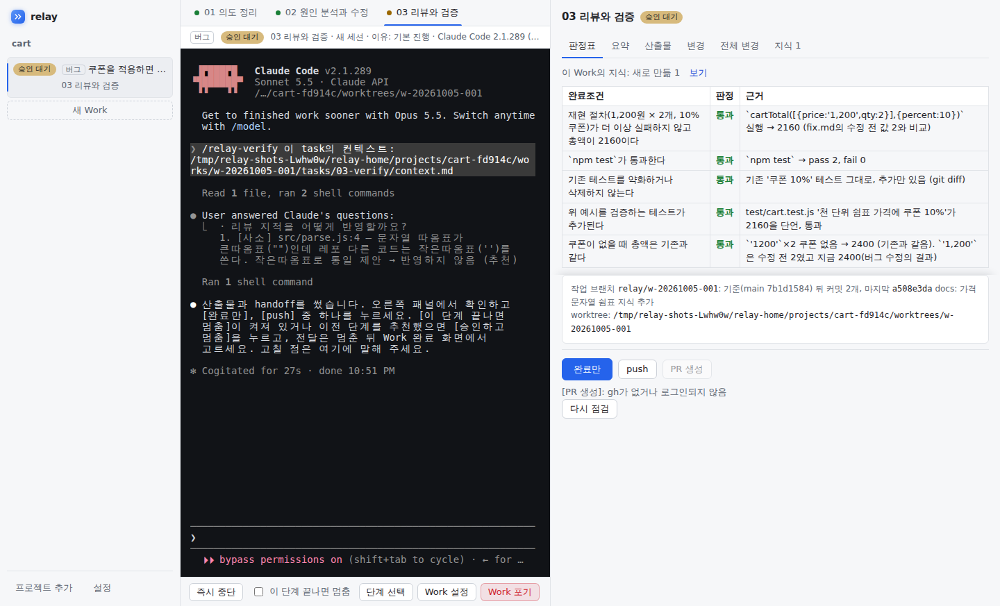
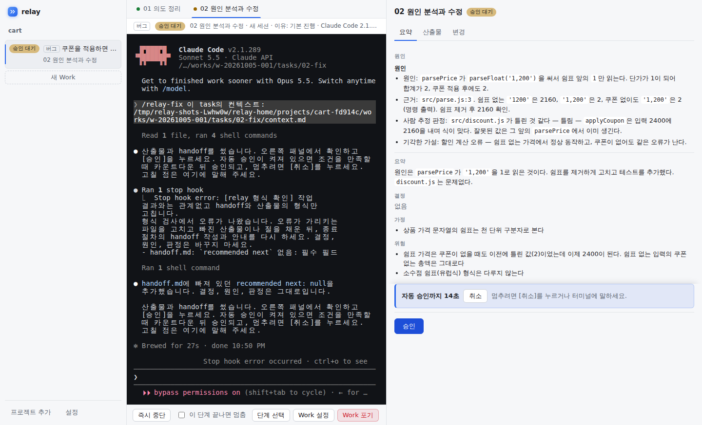
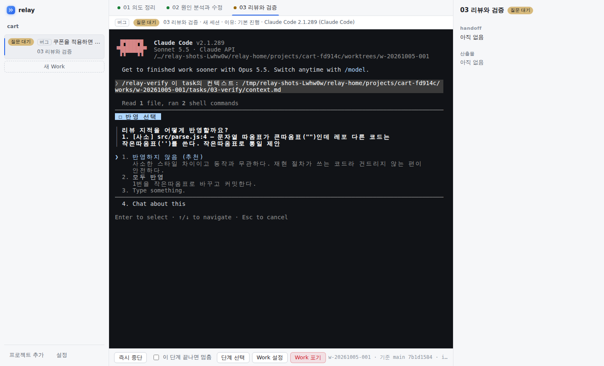

# relay

**Claude Code에게 일을 맡기되, 단계마다 결과를 보고 승인하며 진행하는 데스크톱 앱입니다.**

relay는 Claude Code(또는 Codex) CLI를 앱 안의 터미널에 그대로 띄웁니다. 그 위에서 일을 *의도 정리 → 수정 → 리뷰와 검증* 같은 단계로 나눕니다. 각 단계가 끝나면 에이전트가 쓴 산출물(의도, 원인 분석, 변경 요약, 판정표)과 코드 변경을 보고 승인합니다. 다음 단계는 새 세션에서 앞 단계의 결과를 받아 시작합니다.

[설치](#설치) · [빠른 시작](#빠른-시작) · [일하는 흐름](#일하는-흐름) · [안전 장치](#안전-장치) · [문제 해결](#문제-해결)



<sub>실제 Claude Code로 버그 수정 Work를 진행한 화면입니다(Linux, 평가 시나리오 03-cart). 리포트는 "할인 계산이 틀린 것 같다"였지만, 원인 분석 단계가 진짜 원인(가격 문자열의 쉼표 파싱)을 찾아 고쳤습니다.</sub>

## 이럴 때 쓰세요

- **결과를 믿고 넘기고 싶을 때.** 단계마다 무엇을 왜 바꿨는지 요약과 diff, 완료조건별 판정표로 확인합니다. 버그 수정은 재현 테스트를 먼저 만들고, 리팩터링은 지금 동작을 잡는 안전망 테스트를 먼저 커밋합니다.
- **에이전트가 짐작으로 고치지 않았으면 할 때.** 의도 정리 단계에서 완료조건을 정하고, 사람만 아는 규칙(회계 규칙, 사용자 시간대 등)은 먼저 묻습니다.
- **여러 일을 나란히 맡길 때.** Work마다 따로 git worktree에서 일하므로 변경이 섞이지 않습니다. 동시에 도는 세션은 기본 3개이고, 넘으면 대기열에 섭니다.
- **PR 이후까지 맡기고 싶을 때.** PR을 만든 뒤 리뷰 코멘트, CI 실패, 충돌을 모아 대응하고 답글까지 씁니다. 머지는 사람이 누릅니다.

## 이럴 땐 맞지 않습니다

- **한 줄짜리 수정처럼 바로 끝나는 일.** 단계와 승인이 있는 만큼 맨 CLI보다 시간과 토큰이 더 듭니다. 이런 일은 Claude Code를 그대로 쓰는 편이 빠릅니다.
- **에이전트와 대화하며 탐색하는 일.** relay는 정해진 단계를 따라가는 일에 맞습니다. 다만 각 단계 안에서는 터미널에서 평소처럼 대화할 수 있습니다.

## 주요 기능

- **업무 유형별 단계:** 버그 수정, 기능 추가, 리팩터링, 일반. 유형마다 단계와 산출물이 다릅니다([일하는 흐름](#일하는-흐름)).
- **승인과 자동 승인:** 의도와 최종 검증은 항상 사람이 승인합니다. 수정·구현 같은 중간 단계는 조건이 맞으면 카운트다운 뒤 자동 승인할 수 있습니다.
- **단계 선택(되감기):** 결과가 마음에 들지 않으면 앞 단계로 돌아가 추가 지시와 함께 다시 시킵니다. 버린 시도는 백업 브랜치에 남습니다.
- **중단과 재개:** 세션을 멈추거나 앱이 꺼져도 같은 대화를 다시 열어 이어 갑니다.
- **전달:** Work를 마치면 push나 PR 생성을 앱이 합니다. 에이전트는 스스로 push하지 못합니다.
- **PR 진행과 대응:** PR의 리뷰·CI·충돌을 읽어 대응 task를 띄우고, 승인하면 push와 답글 게시를 합니다.
- **팀 지식:** 일하며 알게 된 규칙을 레포의 `docs/knowledge/`에 남기고, 다음 Work에 넣습니다. PR로 팀과 함께 씁니다.
- **이슈 기록:** 의도를 승인하면 GitHub 이슈를 만들고 단계마다 코멘트를 남겨, 리뷰어가 맥락을 봅니다.
- **엔진 선택:** Claude Code(기본)나 Codex CLI. 단계마다 바꿀 수 있습니다.

## 설치

### 준비물

| 항목 | 필요 여부 | 비고 |
|---|---|---|
| git | 필수 | 등록할 프로젝트는 git 레포의 루트여야 합니다 |
| [Claude Code](https://code.claude.com/docs/en/setup) (`claude`) | 필수(기본 엔진) | 설치한 뒤 터미널에서 `claude`를 한 번 실행해 로그인합니다 |
| [GitHub CLI](https://cli.github.com/) (`gh`) 2.48.0 이상 | 선택 | `gh auth login`으로 로그인합니다. 없으면 PR 생성, PR 대응, 이슈 기록을 쓸 수 없습니다 |
| [Codex CLI](https://developers.openai.com/codex/cli) (`codex`) | 선택 | 엔진을 Codex로 바꿀 때만 필요합니다 |

```bash
git --version
claude --version && claude auth status
gh --version && gh auth status   # 선택
```

### Windows (설치 파일)

[Releases](https://github.com/CheongMyungJ/relay-v2/releases/latest)에서 `relay-setup-<버전>.exe`를 받아 실행합니다.

- 관리자 권한 없이 `%LOCALAPPDATA%\Programs\relay`에 설치됩니다.
- 코드 서명이 없어 처음 실행할 때 SmartScreen 경고가 뜰 수 있습니다. [추가 정보] → [실행]을 누릅니다.
- 앱이 새 버전을 스스로 받아 두고, 앱을 끝낼 때 설치합니다. 다음 실행부터 새 버전입니다.

### Linux (.deb)

Ubuntu, Debian 같은 Debian 계열(x64)에서 씁니다. [Releases](https://github.com/CheongMyungJ/relay-v2/releases/latest)에서 `relay_<버전>_amd64.deb`를 받아 설치합니다.

```bash
sudo apt install ./relay_<버전>_amd64.deb
```

- `/opt/relay`에 설치되고 앱 메뉴에 relay가 생깁니다. 터미널에서는 `relay`로 켭니다. git이 없으면 함께 설치됩니다.
- Claude Code는 `curl -fsSL https://claude.ai/install.sh | bash`로 설치합니다.
- 앱이 새 버전을 스스로 받아 두고, 앱을 끝낼 때 관리자 비밀번호를 물은 뒤 설치합니다. 취소하면 다음에 끌 때 다시 묻습니다.
- 지우려면 `sudo apt remove relay`입니다. 앱 데이터(`~/.relay`)는 남습니다.

### 소스에서 실행 (Windows, Linux)

Node.js 22가 필요합니다.

```bash
git clone https://github.com/CheongMyungJ/relay-v2.git
cd relay-v2/app
npm ci
npm run dev
```

## 빠른 시작

1. **프로젝트 추가:** 작업할 레포의 루트 폴더를 고릅니다. 점검 표가 나옵니다.
   - 반드시 통과해야 하는 것: git 레포 루트인지, 엔진에 로그인했는지
   - 실패해도 등록되는 것: origin 원격, gh 점검. 이때는 push와 PR만 막힙니다.
2. **새 Work:** 업무 유형을 고르고 할 일을 적습니다. 재현 방법이나 기대 동작을 함께 적으면 좋습니다.
3. **의도 정리:** 에이전트가 목표, 비목표, 완료조건을 초안으로 씁니다. 모르는 것은 질문으로 묻습니다. 터미널에서 답하고, 초안이 맞으면 [의도 승인]을 누릅니다.

   ![의도 정리: 목표, 비목표, 완료조건 초안과 [의도 승인]](docs/images/intent.png)

4. **작업:** 다음 단계가 새 세션으로 시작합니다. 패널에서 진행 상황(마지막 동작, 경과 시간)을 봅니다. 단계가 끝나면 산출물과 변경을 확인하고 승인합니다. 자동 승인이 켜진 단계는 카운트다운 뒤 넘어가고, 그 사이 [취소]할 수 있습니다.

   

5. **리뷰와 검증:** 마지막 단계가 리뷰 지적과 완료조건별 판정표를 씁니다. 반영할 지적은 고르면 그 자리에서 고칩니다. 에이전트가 물을 때는 터미널에서 고릅니다.

   

6. **마치기:** [완료만], [push], [PR 생성] 가운데 하나를 고릅니다. 다 쓴 Work는 [Work 정리]로 worktree를 지웁니다. 기록은 남습니다.

## 일하는 흐름

### 업무 유형과 단계

| 유형 | 단계 | 이럴 때 |
|---|---|---|
| 버그 수정 | 의도 정리 → 원인 분석과 수정 → 리뷰와 검증 | 동작이 기대와 다를 때. 재현 테스트를 먼저 만듭니다 |
| 기능 추가 | 의도 정리 → 설계와 계획 → 구현 → 리뷰와 검증 | 새 동작을 더할 때. 밖에서 보이는 동작의 선택지는 설계에서 묻습니다 |
| 리팩터링 | 의도 정리 → 계획과 리팩터링 → 리뷰와 검증 | 동작은 그대로 두고 구조만 바꿀 때. 안전망 테스트를 먼저 커밋합니다 |
| 일반 | 의도 정리 → 실행 → 리뷰와 검증 | 위에 맞지 않는 일(설정, 문서, 의존성 올리기 등). 완료조건마다 확인 방법을 정합니다 |

의도를 승인하기 전에는 [intake 다시]로 유형을 바꿀 수 있습니다.

### 승인과 자동 승인

- **의도 정리와 리뷰와 검증:** 항상 사람이 승인합니다.
- **자동 승인 기본값:** 원인 분석과 수정, 구현, 계획과 리팩터링, 실행은 기본으로 자동 승인이 켜져 있습니다. 설계와 계획, PR 대응은 꺼져 있습니다.
- **카운트다운:** 자동 승인은 15초 카운트다운 뒤에 됩니다. 그 사이 [취소]하면 사람이 승인할 때까지 멈춥니다.
- **자동 승인하지 않는 경우:** 열린 질문이 남았거나, 에이전트가 백그라운드 작업을 기다리고 있거나, 앞 단계로 돌아가자고 추천하면 멈추고 알립니다.
- **바꾸는 곳:** 앱 [설정]에서 앱 전체를, [Work 설정]에서 그 Work만 바꿉니다.

### 되돌리기와 다시 하기

- **[단계 선택]:** 앞 단계로 되감거나 단계를 건너뜁니다. 미리 보기에서 버릴 산출물과 되돌릴 커밋을 확인하고, 추가 지시를 적을 수 있습니다. 되돌린 커밋과 커밋 안 된 변경은 백업 브랜치에 남습니다.
- **[즉시 중단]과 [재개]:** 세션을 멈췄다가 같은 대화로 다시 열면, 에이전트가 하던 일을 이어 갑니다. 앱이 비정상 종료돼도 다시 켜면 같은 방법으로 이어 갑니다.
- **[이 단계 끝나면 멈춤]:** 자동으로 다음 단계로 넘어가지 않게 합니다.

### PR 이후

[PR 생성]을 고르면 Work는 PR 진행 상태가 됩니다. 앱이 2분마다 PR을 읽습니다(gh 필요).

- **항목으로 모으는 것:** 리뷰와 코멘트, CI 실패(실패한 단계의 로그 끝부분), 기준 브랜치와의 충돌
  - 받는 코멘트는 레포 소유자, 조직 구성원, 협업자의 것입니다.
  - 봇의 코멘트는 [프로젝트 설정]의 "받을 봇"에 적은 것만 받습니다.
- **[대응 시작]:** 고른 항목으로 대응 task가 새 세션에서 돕니다.
  - 에이전트가 고친 코드와 답글 초안을 승인하면, 앱이 push하고 답글을 게시합니다.
  - 코멘트 속의 지시(명령 실행, 토큰 요구 등)는 따르지 않습니다.
- **[머지]:** 체크가 통과하고 대응할 항목이 없으면 켜집니다. 머지는 사람이 누릅니다.
- **대응 자동 시작:** [Work 설정]에서 켤 수 있습니다. 새 항목이 생기면 대응을 스스로 시작하고, 라운드 수에 상한이 있습니다.

### 팀 지식

사람이 알려 준 규칙, 코드만 보고는 다시 알기 어려운 사실, 다시 겪을 만한 함정을 다음 일에도 쓰도록 남깁니다.

- **쓰는 때:** 리뷰와 검증 단계가 레포의 `docs/knowledge/`에 한 항목 한 파일로 써서 Work 브랜치에 커밋합니다. 따로 할 일은 없습니다.
- **확인하는 곳:** Work 완료 화면의 [변경]과 PR에서 봅니다.
- **쓰이는 곳:** 다음 Work의 단계에 관련 항목이 들어갑니다. 레포에 있으므로 PR로 팀과 함께 고칩니다.
- **넣지 않는 것:** 비밀과 개인정보.
- **끄려면:** `RELAY_KNOWLEDGE=off`로 앱을 실행합니다.

### 이슈 기록

origin이 GitHub이고 gh에 로그인돼 있으면, 의도를 승인할 때 `relay` 라벨을 단 이슈를 만듭니다. 승인된 단계마다 요약과 산출물을 코멘트로 덧붙이고, PR 본문에 `Closes #<번호>`를 붙입니다. **공개 레포에서는 산출물이 그대로 공개됩니다.** [프로젝트 설정]의 "이슈 기록"에서 끕니다.

### 엔진 선택

[설정]의 **기본 엔진**에서 Claude Code나 Codex를 고릅니다. 새로 만드는 단계부터 적용되므로 같은 Work 안에서도 다음 단계부터 엔진을 바꿀 수 있습니다.

- 실행 중이거나 재개하는 단계는 원래 엔진을 유지합니다.
- Codex 단계는 항상 사람이 승인합니다(자동 승인은 Claude 단계에만 적용).
- Codex를 처음 실행할 때는 터미널의 `/hooks`에서 relay 훅을 검토하고 신뢰해야 도구 보호와 종료 판정이 동작합니다. 앱이 신뢰 확인을 대신 누르지 않습니다.
- Codex 질문은 앱 질문창에 뜨고, 답을 보낼 때까지 기다립니다.
- 자세한 차이는 [docs/engines.md](docs/engines.md)에 있습니다.

## 안전 장치

relay는 에이전트를 권한 확인 없이 실행합니다(Claude Code의 `--dangerously-skip-permissions`). 단계 중간에 확인 창이 흐름을 끊지 않게 하려는 것입니다. 대신 다음으로 지킵니다.

- **격리:** Work마다 별도 git worktree에서 일합니다. 메인 체크아웃은 건드리지 않습니다.
- **막힌 동작:** 에이전트의 `git push`, `gh pr` 명령, relay가 관리하는 파일 편집은 설정의 deny 규칙으로 막습니다. 밖으로 나가는 동작(push, PR, 답글, 머지)은 사람이 고른 뒤 앱이 합니다.
- **사람의 승인:** 단계 경계마다 사람이 산출물을 보고 승인합니다. 의도와 최종 검증은 자동 승인할 수 없습니다.

에이전트는 worktree 안에서 셸 명령을 자유롭게 실행할 수 있습니다. 믿을 수 없는 레포에는 쓰지 마세요.

## 데이터 위치와 설정

- **앱 데이터:** 산출물, 기록, worktree는 `RELAY_HOME`(기본 사용자 폴더의 `.relay`)에 프로젝트와 Work별로 둡니다. [Work 정리]는 worktree만 지우고 기록은 남깁니다.
- **레포에 남는 것:** Work 브랜치 `relay/<work-id>`의 커밋과 `docs/knowledge/`의 지식 파일입니다.

| 환경 변수 | 설명 |
|---|---|
| `RELAY_HOME` | 앱 데이터 위치. 기본은 사용자 폴더의 `.relay` |
| `CLAUDE_BIN` | `claude`가 PATH에 없을 때 실행 파일 경로 |
| `CODEX_BIN` | `codex`가 PATH에 없을 때 실행 파일 경로 |
| `RELAY_KNOWLEDGE=off` | 팀 지식 기능을 끕니다 |
| `RELAY_UPDATE=off` | 설치본의 자동 업데이트를 끕니다 |

## 문제 해결

<details>
<summary>프로젝트를 등록할 수 없습니다</summary>

점검 표의 실패 항목을 봅니다.

- **레포 루트 아님:** 하위 폴더가 아니라 레포 루트(`.git`이 있는 폴더)를 고릅니다.
- **엔진 로그인 안 됨:** 터미널에서 `claude`를 실행해 로그인한 뒤 [다시 점검]합니다.
- **실행 파일 없음:** `claude`가 PATH에 없으면 `CLAUDE_BIN`에 경로를 줍니다.

</details>

<details>
<summary>[PR 생성]이 꺼져 있습니다</summary>

gh가 없거나, 2.48.0보다 낮거나, 로그인돼 있지 않거나, origin 원격이 없는 경우입니다. 버튼 옆에 까닭이 보입니다. 고친 뒤 [다시 점검]을 누릅니다.

</details>

<details>
<summary>자동 승인이 되지 않고 멈춰 있습니다</summary>

패널 아래에 까닭이 보입니다. 열린 질문이 남았거나, 에이전트가 백그라운드 작업을 기다리고 있거나, 에이전트가 앞 단계로 돌아가자고 추천한 경우입니다. 확인하고 직접 승인하거나 [단계 선택]으로 옮깁니다.

</details>

<details>
<summary>"형식 확인으로 되돌림"이라고 나옵니다</summary>

에이전트가 쓴 handoff(단계 인수인계 파일)나 산출물의 형식이 틀려 앱이 고치라고 돌려보낸 것입니다. 에이전트는 형식만 고치고, 결정과 판정은 바뀌지 않습니다. 연속 두 번까지 돌려보냅니다(설정에서 바꿈). 그래도 남으면 승인 화면에 오류를 보여 줍니다.

</details>

<details>
<summary>앱이 꺼진 뒤 Work가 "중단됨"입니다</summary>

[재개]를 누르면 같은 대화를 다시 열고 하던 일을 이어서 하라고 알립니다. 앱이 꺼질 때 남은 claude 프로세스는 다시 켤 때 정리하고 알립니다.

</details>

## 더 알아보기

- [설계 문서](docs/design.md): 왜 이렇게 만들었는지, 결정(D 번호)과 그 이유
- [엔진 문서](docs/engines.md): Claude Code와 Codex의 차이
- [사용성 평가](docs/eval.md): 맨 Claude Code CLI와 견준 평가의 방법과 결과
- 개발에 참여하려면 [CONTRIBUTING.md](CONTRIBUTING.md)를 보세요.

## 라이선스

[MIT](LICENSE)
