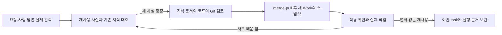

# 팀에서 사용하는 방법

이 구현은 지식관리 이전 `0247049`에서 출발한 실험 브랜치다. 기존 M17이 있는 main의 자동 마이그레이션은 아니다. 비교 결과와 적용 범위는 [최종 실험 보고서](08-final-evaluation.md)를 함께 읽는다.

1. 실험 브랜치의 Relay를 기존 README대로 실행한다. `app/`에서 `npm ci`, `npm run dev`를 사용하고 설치·로그인한 Codex를 엔진으로 선택한다. 실험은 gpt-6.1-sol / medium으로 수행했다.
2. 평소처럼 Work를 시작하고 필요한 업무 사실을 답한다. 코드를 고치는 단계가 재사용할 만한 확인 사실이나 실제 실패를 해결한 새 검증 절차를 `.relay/knowledge.md`에 정리한다. 별도 지식 입력 화면이나 저장소 설정은 없다.
3. 코드와 같은 전체 diff에서 지식의 범위·근거·원출처를 확인한다. 잘못된 내용은 기존 터미널 수정 지시로 바로잡고 다시 검토한다. 현재 성공한 테스트를 업무 정책 확인으로 바꾸지 않는다.
4. 승인한 코드와 지식을 같은 Git 변경으로 merge한다. 동료가 pull한 뒤 새 Work/task를 시작하면 커밋된 지식 스냅샷이 제공된다. 개인 Relay home이나 대화 내역을 복사하지 않는다. 이미 실행 중인 task는 시작할 때의 스냅샷을 계속 사용한다.
5. 정책이 바뀌면 변경된 범위와 규칙을 명시한다. 영향받는 사실을 대체하고 원발견과 변경 근거를 남긴다. 이번 작업과 무관하다는 이유로 다른 활성 사실을 삭제하지 않는다. 모르는 사항은 그대로 미확정으로 남긴다.
6. 같은 지식의 재사용만 있었다면 공유 문서는 그대로 둔다. 적용 확인과 실제 명령·결과는 이번 task의 산출물에서 확인한다. 새 날짜·Work 번호·테스트 수만 붙이는 것은 지식 갱신이 아니다.

지식 파일은 프로젝트에 속하고 Git을 통해 팀에 공유된다. 자격 증명, 개인 정보, 머신 절대 경로나 원격 URL을 지식으로 기록하지 않는다. 자동 첨부 예산은12,000바이트이며 이를 넘으면 해당 커밋의 Git blob을 검색해 필요한 범위를 읽는다. 파일 크기 때문에 활성 사실을 잘라내지 않는다.

추출·중복 판단·정정의 의미 판단은 모델이 하고 기존 diff 검토로 확인한다. 자동 진실 판별기나 검색 서버는 없다. 실제 여러 사람이 동시에 수정하는 Git 충돌, 오래된 정책의 조직적 폐기, 장기간의 사람 검토 시간은 이번 실험에서 측정하지 않았다.

마지막 실험에서는 “이번에는 slug를 변경하지 말라”는 작업 범위가 지속 정책으로 기록되고 다음 작업에서 정책 대체로 해석됐다. 자동 verify도 잡지 못했다. 지식 diff를 볼 때 일회성 비목표가 장기 규칙으로 바뀌지 않았는지 확인해야 한다. 실행 이력 누적 억제와 별개로 남은 의미 판단의 한계다.
