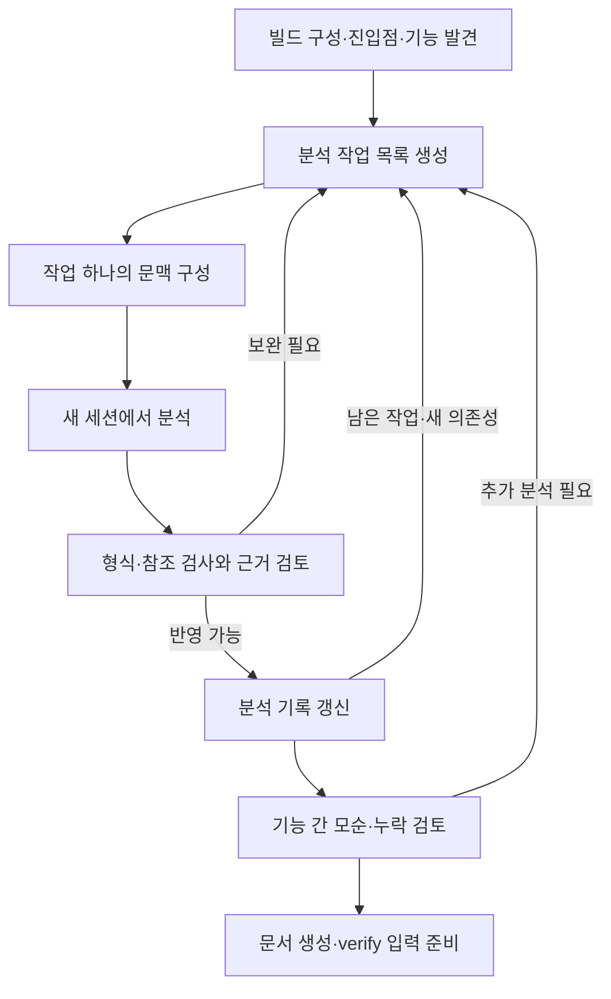

# 요구사항 추출 Work: 논의 기록과 설계 제안

- 작성일: 2026-10-08
- 논의 브랜치: `docs/requirements-extraction-flow-20261008`
- 소스 조사 기준: `main`의 `2bbdb6d60a221d85cd3560fc2a222593728d8641`
- 상태: **방향에 대한 긍정적 피드백을 받은 설계 제안. 상세 계약과 구현은 미확정.**
- 이번 변경: 다음 세션에서 논의를 이어가기 위한 문서만 추가한다. 앱·스킬·기존 승인 정책의 동작을 변경하지 않는다.
- 이어서 시작하기: [다음 세션용 프롬프트](requirements-extraction-next-session.md)

이 문서는 이전 대화 없이도 문제의식, 현재 코드의 제약, 제안의 이유, 남은 결정을 복원하기 위한 기록이다. 아래의 제안을 이미 구현된 기능이나 확정된 제품 정책으로 해석하지 않는다. 설계 결정을 확정하면 [개발 안내](../CONTRIBUTING.md)에 따라 [design.md](design.md)의 D 결정으로, 구현 결정을 확정하면 [implementation.md](implementation.md)의 I 결정으로 옮긴다. 이 문서에는 아직 D/I 번호를 부여하지 않는다.

## 1. 사용자의 목표와 대화에서 확인한 요구

복잡한 레거시 펌웨어에서 기능·비기능 요구사항과 하드웨어·통신 제약을 역으로 추출하고, 그 결과를 재설계와 새 구현의 입력으로 사용하려는 목적이다. 실제 펌웨어 저장소를 분석한 결과는 아직 없으며, 이번 논의 대상은 그 작업을 수행할 **relay-v2의 새 업무 유형**이다.

사용자가 특히 지적한 문제는 다음과 같다.

- 사람이 먼저 보드 한 종류나 통신 기능 하나를 골라 주지 않아도, AI가 구성과 기능을 발견하고 분석 순서를 정할 수 있어야 한다.
- 저장소가 크고 작업이 길어지면 한 번의 프롬프트와 대화 이력만으로는 품질을 유지하기 어렵다.
- 컴팩션 이후 작업 지침, 예외, 근거, 미해결 문제가 희석될 수 있으므로 이를 보완할 장치가 필요하다.
- 이 흐름을 relay-v2의 새로운 type으로 구성하고 싶다.
- 이번 세션에서는 설계 논의를 문서와 브랜치로 보존하고, 구현 논의는 다른 세션에서 이어간다.

사용자는 아래의 구성 제안을 긍정적으로 평가했다. 다만 개별 필드·상태·승인·복구 정책까지 하나씩 확정한 것은 아니다. 기존 사용자의 목표를 다시 처음부터 질문하지 말고, 미확정 설계 사항부터 논의를 이어간다.

## 2. 추출 결과의 의미

코드에서 직접 복원하는 것은 **현재 구현된 동작**이다. 제품의 원래 의도, 구현되지 않은 요구사항, 새 제품에서 보존할 동작은 다른 근거와 판단이 필요하다.

| 구분               | 추출 가능한 내용                                          | 주의점                                                     |
| ------------------ | --------------------------------------------------------- | ---------------------------------------------------------- |
| 기능               | 명령 처리, 상태 전이, 데이터 변환, 오류 처리, 재시도·복구 | 기존 버그와 호환성 동작이 섞일 수 있다                     |
| 비기능             | 타임아웃 설정, 우선순위, 버퍼·메모리 구조                 | 설정값·측정값과 제품의 보장 기준을 구분한다                |
| 하드웨어·통신 제약 | 레지스터 접근, 프레임, 초기화 순서, ISR·DMA 의존성        | 데이터시트·정오표·회로도·상대 장치 동작으로 보강한다       |
| 구현 선택          | 태스크 분할, 폴링, 전역 상태, 모듈 경계                   | 재설계에서 바꿀 수 있는 구현을 필수 제약으로 굳히지 않는다 |

예를 들어 `timeout = 100`만 보고 “100ms 이내 응답해야 한다”를 만들면 안 된다. 단위, 타이머 주기, 카운터 의미, 적용 빌드와 호출 경로를 확인해야 한다. 단위가 ms여도 현재의 대기시간이 새 제품의 허용 응답시간이라는 뜻은 아니다.

코드 분석, 외부 사양, 실기기 관찰, 제품 채택 결정을 구분한다. 여러 AI의 동의나 여러 요약에서 같은 문장이 반복된다는 이유로 근거 상태를 승격하지 않는다. 관찰된 최대 지연은 최악 지연의 보장을 대신하지 않는다.

## 3. 조사한 relay-v2의 현재 구조

다음은 조사 기준 커밋에서 확인한 사실이다. 링크는 이 저장소의 파일을 가리킨다. 다음 세션의 소스가 달라졌으면 해당 심볼과 동작을 다시 확인한다.

| 현재 구조                                                       | 소스와 함의                                                                                                                                                                                                                                                                              |
| --------------------------------------------------------------- | ---------------------------------------------------------------------------------------------------------------------------------------------------------------------------------------------------------------------------------------------------------------------------------------- |
| `WorkType`은 `bugfix`, `feature`, `refactor`, `spec`, `general` | [shared/work.ts](../app/src/shared/work.ts)의 타입·라벨·목록이 확장 지점이다                                                                                                                                                                                                             |
| 유형마다 고정 선형 파이프라인이 있다                            | [core/pipeline.ts](../app/src/core/pipeline.ts)의 `PIPELINES`, `defaultNext`, `recommendableNodes`. 같은 단계 반복을 추천해서 자동 루프를 만드는 구조가 아니다                                                                                                                           |
| 승인하면 기본 다음 단계의 task를 만든다                         | [core/machine.ts](../app/src/core/machine.ts)의 `approveNow`. 이전 단계 추천은 멈추고 단계 선택으로 처리한다                                                                                                                                                                             |
| `TaskRecord`는 하나의 CLI 세션을 가진다                         | [shared/work.ts](../app/src/shared/work.ts)의 `TaskRecord`, `TaskSession`. 여러 독립 분석 실행과 재시도를 위한 모델은 별도로 필요하다                                                                                                                                                    |
| 시작 시 스킬·context를 준비하고 버전을 기록한다                 | [main/work.ts](../app/src/main/work.ts)의 `startSession`. 시작 커밋, 스킬 해시, 엔진 버전을 기록한다                                                                                                                                                                                     |
| 다음 단계의 context를 파일로 구성한다                           | [core/context.ts](../app/src/core/context.ts)의 `buildContext`. 승인된 의도·결정·기각·handoff·산출물 경로를 활용한다                                                                                                                                                                     |
| 같은 세션 재개는 기존 스킬과 context를 유지한다                 | [main/work.ts](../app/src/main/work.ts)의 `resumeSession`. 분석 기록이 바뀌어도 자동으로 최신 작업 패킷을 구성하는 것은 아니다                                                                                                                                                           |
| 새 세션으로 다시 시작하는 기능은 분석 checkpoint 복구와 다르다  | [core/machine.ts](../app/src/core/machine.ts)의 재시작 전이와 [main/work.ts](../app/src/main/work.ts)의 `approvedBefore`. 이전의 미승인 task를 일반 입력으로 이어받지 않는다                                                                                                             |
| Codex는 압축 뒤 지시를 재주입한다                               | [main/work.ts](../app/src/main/work.ts)의 `SessionStart` 처리. startup/resume/clear/compact에서 스킬과 context 경로를 전달한다                                                                                                                                                           |
| Claude의 재주입 경로는 Codex와 다르다                           | [core/settings.ts](../app/src/core/settings.ts)의 훅 목록에는 `SessionStart`/`PreCompact`가 없다. [design.md](design.md)의 D31은 Claude Code의 스킬 재주입 관찰을 바탕으로 공통 규칙을 합친 스킬을 약 5,000토큰 안에 두는 목표를 설명한다. 엔진·버전에 무관한 보장으로 일반화하지 않는다 |
| 산출물 수집은 task 디렉터리 바로 아래의 Markdown 중심이다       | [adapters/store.ts](../app/src/adapters/store.ts)의 `taskFiles`, `artifacts`. JSON을 `NODE_INFO.artifacts`에 추가하는 것만으로 읽기·검사·화면 표시가 해결되지 않는다                                                                                                                     |
| handoff 검사는 내용의 정당성을 판단하지 않는다                  | [core/validate.ts](../app/src/core/validate.ts)는 형식 검사다. [core/approval.ts](../app/src/core/approval.ts)는 일부 형식 오류를 무시하고 승인하는 경로도 가진다                                                                                                                        |
| 의도·최종 검증은 수동 승인이다                                  | [core/approval.ts](../app/src/core/approval.ts)의 `approvalMode`. 현재 Codex task도 자동 승인하지 않는다                                                                                                                                                                                 |
| `spec`은 사람과 설계 결정을 정하는 유형이다                     | [skills/spec/SKILL.md](../skills/spec/SKILL.md)는 주제 목록과 각 설계 결정을 사람에게 묻는다. 자율적 요구사항 추출과 목적이 다르다                                                                                                                                                       |
| handoff는 간결한 인수인계이고 열린 질문의 의미가 좁다           | [skills/_common.md](../skills/_common.md). 분석 기록 전체를 넣을 곳이 아니며, `open_questions`는 실제로 물었으나 답을 받지 못한 질문이다                                                                                                                                                 |
| 기존 세션 풀은 실행 동시성 제한이다                             | [main/pool.ts](../app/src/main/pool.ts)의 `SessionPool`. 앱 재시작 뒤의 분석 작업 큐를 복원하는 영속 스케줄러는 아니다                                                                                                                                                                   |

기존 `docs/knowledge/`도 전체 분석 기록의 대체물이 아니다. 재사용 가능한 팀 규칙과 특정 소스·빌드에 의존하는 요구사항 후보를 구분해야 한다. 추정 후보를 지식으로 일괄 배포해서 다른 Work에서 확정 사실로 재사용하지 않도록 한다.

## 4. 제안하는 외부 흐름

새 Work type은 `requirements`, 화면 이름은 “요구사항 추출”로 제안한다.

```ts
// 제안: 아직 등록되지 않았다.
requirements: ['intake', 'extract', 'verify']
```

| 단계      | 역할                                                       | 산출물 방향                                          |
| --------- | ---------------------------------------------------------- | ---------------------------------------------------- |
| `intake`  | 분석 목적, 대상 저장소, 제외 범위, 자료, 완료 기준을 정리  | 기존 의도 초안과 승인된 `intent.md`                  |
| `extract` | 구성·기능 발견, 분석 작업 생성, 경로 추적, 근거 검토, 통합 | 구조화된 분석 기록과 사람이 읽을 `extraction.md`     |
| `verify`  | 근거의 타당성, 누락·모순, 완료 기준, 최종 문서 검토        | requirements용 `verification.md`, `pr.md`, 최종 문서 |

`intake`에서 사용자가 보드·기능을 먼저 선택하도록 요구하지 않는다. “저장소 전체의 구성과 기능을 조사한다”도 유효한 범위다. AI는 보드·빌드 후보를 찾고, 실제 출하 구성을 확인할 수 없으면 후보 상태를 유지한다. 범위나 비용 때문에 선택이 필요할 때만 근거와 선택지를 제시한다.

기존 의도·최종 승인 틀을 재사용하는 방향이다. 내부 분석 실행의 자동 진행과 제품 단계 승인은 다른 의미로 설계한다. 현재 relay가 이미 이 내부 실행을 지원하거나, Codex task를 자동 승인할 수 있다는 뜻은 아니다.

추출 후에는 요구사항 문서를 입력으로 기존 `spec` Work에서 재설계를 논의하고, `feature` 등으로 구현을 나누는 연결을 제안했다. 이번 type이 추출부터 재설계·전체 재구현까지 한 Work에서 자동 완료하는 범위는 아니다.

## 5. `extract` 내부의 반복 실행

외부 파이프라인은 세 단계로 유지하고, 내부에 앱이 관리하는 작은 분석 작업의 실행기를 둔다. 기존의 `recommended_next`, 되감기, 수동 단계 선택을 반복 실행 수단으로 사용하지 않는다.



초기 발견 작업은 빌드 설정, 조건부 컴파일, 실행 진입점, 명령 테이블, 태스크, ISR, DMA, 공유 상태 등을 조사한다. 정적 분석·심볼 인덱스·컴파일러 결과로 얻을 수 있는 사실은 도구로 확보하고, AI는 이를 연결하여 해석한다. 단순 문서 검색만으로 실행 의존성을 모두 해결했다고 보지 않는다.

분석 단위의 예:

- 한 명령의 정상·오류·타임아웃·재시도 경로
- 특정 상태의 진입·종료 조건과 비동기 변경 지점
- 시간 상수의 단위와 계산 경로
- 공유 상태를 사용하는 태스크·ISR 사이의 관계
- 보드별 초기화·전원·복구 순서의 차이
- 여러 기능에 걸친 동시성·타이밍·데이터 보존 제약

파일별 설명 생성으로 끝내지 않고 시나리오와 의존성을 추적한다. 초기 탐색, 작업 계획, 근거 검토, 통합, 최종 검증도 커지면 분할한다. 마지막에 전체 분석 기록을 한 세션에 넣어야만 완료되는 구조를 피한다.

## 6. 작업과 실행의 데이터 모델

기존 Work/Task 아래에 다음 개념을 추가하는 방향이다. 이름과 필드의 최종 스키마는 미확정이다.

| 개념           | 의미                          | 필요한 정보                                                                        |
| -------------- | ----------------------------- | ---------------------------------------------------------------------------------- |
| `AnalysisUnit` | 수행할 분석 작업              | ID, 목적, 구성·시나리오 범위, 의존성, 완료 조건, 상태, 결과 참조                   |
| `AnalysisRun`  | 그 작업을 실행한 한 번의 시도 | 실행 ID, 작업 ID, 세션 ID, 엔진·스킬 버전, 입력 revision·패킷 해시, 결과·검사 기록 |
| 작업 패킷      | 한 실행이 받는 고정 입력      | 계약, 목표, 원본 위치, 관련 기록 일부, 미확인 사항, 예산, 산출물 계약              |
| 결과 제안      | AI가 제출하는 변경            | 새 관찰·후보·근거·충돌, 후속 작업, 완료 또는 미완료 이유                           |
| checkpoint     | 미완료 탐색을 복원할 기록     | 확인한 범위, 남은 경로, 필요한 원본, 다음 확인 지점                                |

`AnalysisUnit`과 `AnalysisRun`을 나누면 보완 실행을 해도 동일 작업을 추적할 수 있고, 어느 입력으로 어느 결론을 냈는지 남길 수 있다. 작업 완료와 실행 종료는 다르다. 프로세스가 끝났거나 결과 JSON이 존재한다는 이유만으로 의미적 분석이 완료됐다고 보지 않는다.

현재 `TaskRecord.session`과 하위 run의 세션을 어떻게 연결할지, 훅·터미널·대기열을 어느 실행 ID에 연결할지는 다음 논의에서 확정한다. 동일 상태를 부모와 자식에 각각 저장해 서로 다른 세션을 가리키는 일이 없도록 해야 한다.

## 7. 근거와 요구사항 기록

| 종류                    | 의미                                                 |
| ----------------------- | ---------------------------------------------------- |
| `evidence`              | 버전이 고정된 코드·문서·측정 결과와 위치             |
| `observation`           | 근거에서 확인한 현재 구현 동작                       |
| `requirement_candidate` | 조건·동작·결과로 정리한 요구사항 후보                |
| `constraint`            | 적용 구성과 이유가 명시된 제약 후보 또는 확인된 제약 |
| `unknown`               | 확인하지 못한 항목과 필요한 추가 자료·행동           |
| `conflict`              | 양립하지 않는 주장과 각각의 근거                     |
| `coverage`              | 구성·기능·상태·오류 경로별 조사 상태                 |

각 주장에는 적용 범위, 수치와 단위, 근거 ID, 추론 여부, 검토 기록, 검증 방법을 연결한다. 서로 다른 빌드의 동작을 중복이라고 판단해 하나로 합치지 않는다.

다음 축은 분리한다.

1. **근거 종류:** 코드 / 외부 사양 / 측정 / 추론.
2. **검토 상태:** 미검토 / 근거 확인 / 반증 또는 충돌 / 보완 필요 등.
3. **제품 채택 결정:** 미결정 / 유지 / 변경 / 제외 등.

위 값들은 개념 예시이며 최종 enum은 아니다. “근거 확인”은 코드 해석이나 측정 사실을 확인했다는 뜻이지, 그 동작을 새 제품에 채택했다는 뜻이 아니다. 요구사항 문장에는 현재 동작의 기술과 새 제품의 규범적 기준을 구분해서 표시한다.

소스 기준은 Work 시작 커밋, 서브모듈 커밋, 빌드 구성, 외부 자료 버전으로 고정한다. 문서 출력 때문에 Work 브랜치에 커밋이 추가돼도 분석 대상 펌웨어의 기준 커밋을 자동으로 바꾸지 않는다. 소스나 빌드를 바꾸는 경우는 명시적으로 재기준화하고 관련 결과를 재검토한다.

## 8. 영속 저장과 반영 계약

아래는 배치 예시다. 경로와 파일 분할은 미확정이며, 앱 소유 상태와 AI의 제출물을 구분하는 것이 핵심이다.

```text
<WorkDir>/
  work.json
  intent.md
  requirements/
    manifest.json          # 고정 소스·자료·계약 버전
    state.json             # 현재 revision 등 앱 소유 상태
    revisions/
      000001.json          # 작업·주장·근거·분석 범위의 불변 스냅샷
      000002.json
    runs/
      r-0001/
        packet.json        # 앱이 만든 입력
        context.md         # 이번 실행에 필요한 문맥
        result.json        # AI의 결과 제안
        checkpoint.json    # 미완료 탐색 기록
  tasks/
    02-extract/
      extraction.md        # 사람이 볼 요약
      handoff.md
```

앱이 정식 분석 기록의 유일한 작성자가 되고, AI는 자신의 실행 결과와 checkpoint를 제출한다. 기존 앱 소유 파일 보호도 확장하되, 도구 deny 규칙만으로 모든 셸 쓰기를 완전히 격리했다고 주장하지 않는다. 파일 무결성·버전 검사와 결과 반영 검사를 함께 둔다.

반영 시 검사할 항목:

- 스키마와 필수 필드, 고유 ID, 근거 참조의 유효성
- 소스·빌드·계약 버전, 입력 revision과 결과의 일치
- 실행 ID와 결과 식별자를 통한 중복 반영 방지
- 허용된 상태 전이와 미확정·충돌 항목의 추적 가능성
- 완료하지 않은 의존성의 누락 여부
- 분석 대상 소스가 기준에서 달라졌는지 여부

원본 위치가 존재한다는 검사만으로 의미적 해석의 타당성이 보장되지는 않는다. 검토 작업이 원본을 다시 읽고 주장을 대조하며, 필요한 경우 사양·테스트·측정을 요구한다.

기존 `writeFileAtomic`은 단일 파일 단위다. 여러 JSON을 순서대로 쓰는 것만으로 전체 상태가 원자적으로 바뀌지는 않는다. 초기 제안은 **불변 revision을 먼저 저장하고 현재 revision 포인터를 마지막에 원자적으로 교체**하는 방식이다. 작업 상태와 반영한 결과 식별자도 같은 revision에 포함해 “결과는 반영됐으나 작업은 미완료”인 중간 상태를 복구할 수 있게 한다.

오래된 revision을 기준으로 제출된 결과는 그대로 반영하지 않는다. 순차 실행을 먼저 구현하고, 병렬화 시 독립 변경의 합병·재검증 정책을 별도로 정한다. 분석 기록의 깨진 참조나 중복 반영 오류는 일반 handoff의 “오류 무시하고 승인”으로 통과시키지 않는 방향이다.

## 9. 컨텍스트·컴팩션·재개

각 run은 새 컨텍스트에서 다음을 받는다.

> 짧은 고정 계약 + 승인된 분석 범위 + 이번 작업 패킷 + 관련 분석 기록 일부 + 원본 근거 위치

전체 대화, 누적 handoff, 전체 증거 기록을 매번 넣지 않는다. 요약은 탐색 안내로 쓰고 원본 증거를 대신하지 않는다. 관련 심볼·호출 관계·공유 상태·빌드 조건을 조회할 수 있는 경로를 유지한다.

- 규칙은 버전 관리하고 실행 시 다시 주입한다. 파일에 “읽어라”라고 적는 것만으로 모든 실행이 준수한다고 가정하지 않는다.
- 입력 스냅샷은 고정한다. 재개 때는 최신 반영 revision과 checkpoint로 새 입력을 구성한다.
- 토큰 사용량을 신뢰성 있게 얻을 수 있으면 응답·추가 탐색 공간을 남기고 작업을 분할한다. 얻을 수 없으면 작업 크기·도구 출력·실행 횟수 등의 제한을 쓴다.
- 중간 작업을 완료할 수 없으면 확인한 사실과 미완료 지점을 저장하고 후속 작업을 만든다. 컨텍스트 한도 도달을 작업 완료로 처리하지 않는다.
- 작업 계획과 통합 검토를 하는 AI도 거대한 장기 대화에 의존하지 않게 한다.
- 새 세션에서도 적용 규칙·현재 작업·미확정 항목·원본 근거를 복원할 수 있어야 한다.

Claude와 Codex의 압축·세션 종료·재개 훅을 같은 것으로 가정하지 않는다. 새 이벤트나 CLI 옵션이 필요하면 실제 계약과 지원 버전을 확인하고 `app/test/contract/`에 반영한다. 첫 구현은 토큰 임계값이나 압축 직전 훅에 전적으로 의존하지 않는, 짧은 작업마다 새 세션을 여는 방식으로 제안한다.

## 10. 질문·승인·중단·되감기

| 발견한 문제                         | 처리 방향                                         |
| ----------------------------------- | ------------------------------------------------- |
| 코드에서 더 조사할 수 있다          | 후속 분석 작업 생성                               |
| 데이터시트나 실기기 측정이 필요하다 | 외부 근거 필요 항목으로 기록하고 독립 분석은 진행 |
| 범위·예산·제품 의도를 결정해야 한다 | 필요한 시점에 근거와 선택지를 묶어 질문           |
| 실제로 사람에게 물었고 답이 없다    | 기존 `handoff.open_questions` 의미에 맞게 기록    |
| 실행 실패·잘린 결과·버전 불일치     | 결과 미반영, 원인을 보존하고 재시도 또는 보완     |

미확인 사항을 전부 `open_questions`에 넣지 않는다. 그렇다고 실제로 답이 필요한 질문을 숨기거나 자동 승인 조건을 우회하지도 않는다.

내부 run의 결과 반영은 사용자에 의한 단계 승인이나 제품 채택 승인이 아니다. Codex의 기존 task 수동 승인 정책을 유지하면서 내부 작업을 자동 진행시키려면 별도의 실행 완료 계약이 필요하다. 유효한 결과, 실행의 정지·종료 상태, 남은 백그라운드 작업을 어떻게 확인할지 엔진별로 정한다. 이 계약이 없는데 Stop이나 프로세스 종료만 보고 다음 run으로 넘어가지 않는다.

중단·앱 종료 후에는 반영된 revision을 읽어 남은 작업을 복원한다. 늦게 도착한 이전 run의 훅·결과가 현재 run을 바꾸지 못하게 실행 식별자를 검사한다.

되감기 시에는 해당 시점의 분석 revision에서 새 시도를 시작하는 방향이다. 폐기된 결론을 현재의 유효한 입력에 섞지 않으며, 이력은 보존한다. 기존의 “현재 문서 위에서 이어서”와 분석 revision을 계속 쓸지의 관계, 기준 소스 변경 시 무효화 범위는 아직 정해야 한다.

## 11. 산출물·화면·후속 Work

Work의 실행 기록은 `<RELAY_HOME>`에 남기고, 전달할 결과는 대상 레포의 `docs/requirements/` 등 합의한 위치에 저장해 기존 push/PR 전달 흐름을 활용한다. 최종 경로·파일 형식은 미확정이다.

최종 결과에 포함할 내용:

- 분석 대상 소스·구성과 제외 범위
- 기능·비기능 요구사항 후보 및 제약
- 조건·동작·결과와 수치·단위
- 원본까지 추적 가능한 근거 연결
- 미확정 사항, 충돌, 외부 자료·실기기 검증 필요 항목
- 분석 범위와 누락 가능성, 검증 계획
- 재설계에서 유지·변경·제외 여부를 결정해야 할 항목

후속 세션이 앱의 로컬 절대 경로에 접근하지 못해도 근거를 찾을 수 있어야 한다. 소스 커밋·상대 경로·심볼·자료 버전과 필요한 구조화 데이터를 함께 내보내는 방향이다. Markdown만 렌더링하고 구조화된 ID·근거를 잃지 않게 한다.

화면은 현재 작업, 발견한 분석 항목과 처리 상태, 근거 검토 상태, 미확정·충돌·외부 검증 필요 항목을 보여준다. “발견한 작업 100% 처리”를 “모든 요구사항 발견”이라고 표시하지 않는다. 최종 검증에서도 분석을 마쳤다는 판정과 제품 요구사항을 모두 확정했다는 판정을 구분한다.

## 12. 예상 변경 지점

새 모듈 이름은 제안이다. 기존 `core`는 Node/Electron API를 import하지 않는 규칙을 유지한다. 이미 큰 `main/work.ts`에 분석 루프 전체를 추가하지 않는 방향이다.

| 영역                                                  | 변경 방향                                                               |
| ----------------------------------------------------- | ----------------------------------------------------------------------- |
| `app/src/shared/work.ts`                              | `requirements`와 표시 이름·선택 목록                                    |
| `app/src/core/pipeline.ts`                            | `extract`, 단계 순서, 필수 요약 산출물, 되감기 정책                     |
| `docs/contracts/handoff.v1.schema.json` 및 생성 타입  | 새 노드와 기존 handoff 계약의 연결. 생성본만 손으로 수정하지 않는다     |
| `app/src/shared/config.ts`, `core/config.ts`, UI 설정 | 스킬·엔진·질문·승인 설정의 처리                                         |
| 신규 `shared/requirements.ts`                         | 작업·실행·근거·요구사항·revision 타입                                   |
| 신규 `core/requirements.ts`                           | 작업 선택, 상태 전이, 검사와 결과 반영의 순수 로직                      |
| 신규 `core/requirements-context.ts`                   | 제한된 작업 패킷과 context 구성                                         |
| 신규 `adapters/requirements-store.ts`                 | 스냅샷·실행 기록·원본 참조 읽기와 저장                                  |
| 신규 `main/requirements.ts`                           | 세션 실행·재개·검사·다음 run 예약                                       |
| 기존 세션 풀·엔진 어댑터·훅·터미널                    | 하위 run 식별과 실행 수명 관리. 기존 task 실행과의 공유 범위를 정한다   |
| `skills/extract/` 및 공용 스킬                        | 전용 추출 규칙, requirements용 work-start·verify·필요시 pr-respond 구간 |
| `skills/assemble.mjs`, `skills/check.mjs`             | 새 유형·스킬 등록, 조립과 정적 검사                                     |
| 상태 조회 API·renderer                                | 진행 범위·근거·미확정·복구 상태 표시                                    |
| `core/validate.ts`, 별도 분석 검사                    | 기존 Markdown 형식 검사와 구조화된 근거 검사를 연결                     |
| `core/settings.ts`, `core/codex.ts` 등                | 새 앱 소유 상태의 보호·무결성 검사                                      |

## 13. 구현 순서와 검증 제안

1. **계약 확정:** 작업 완료, 근거 상태, 제품 채택 상태, 미확정 처리, 세션 완료와 재개 계약을 정한다.
2. **순수 로직과 저장:** 작업·run·revision 모델, 결과 검사, 중복 반영 방지, 스냅샷 복구를 구현한다.
3. **순차 실행:** 한 번에 하나의 run을 새 세션으로 실행한다. 첫 발견부터 후속 작업 생성까지 연결한다.
4. **검토와 산출물:** 근거 검토, 기능 간 통합, verify, 문서 출력과 진행 UI를 연결한다.
5. **품질 평가:** 컴팩션·재시작·펌웨어 특유의 함정을 포함한 평가로 누락과 잘못된 확정을 측정한다.
6. **필요시 병렬화:** 독립 작업의 실행과 충돌·revision 처리를 추가한다. 다중 에이전트는 첫 구현의 필수 조건이 아니다.

[CLAUDE.md](../CLAUDE.md)의 시험 계층을 따른다. 한 동작은 맞는 가장 낮은 층에서 자세히 확인하고, 상위 층은 연결을 확인한다.

- 단위: 작업 선택과 의존성, 미확정·충돌 보존, 잘못된 상태 승격 거부, 서로 다른 빌드의 결론 분리.
- 어댑터: 잘린 결과, 원본 참조·해시 불일치, revision 저장 중 종료, 재시작 뒤 중복 반영 방지.
- 흐름: 중간 run을 종료하고 대화 기록 없이 새 세션으로 다음 작업과 근거를 복원, 늦은 훅·중복 Stop·오래된 결과 거부, 되감기 후 폐기된 결론 제외.
- 계약: 실제 CLI에 존재하는 이벤트·필드·옵션만 사용. 새 실행 완료 규약을 각 엔진에서 확인.
- 실제 모델·평가: 규칙과 미확정 상태의 유지, 근거 없는 수치 확정, ISR·DMA·공유 상태·오류 경로 누락, 추출과 검토의 실제 품질.

핵심 회귀 시나리오는 **대화를 모두 잃고 재시작해도 이미 반영한 결과를 중복 처리하지 않으며, 원본 근거와 미확정 사항을 보존하고 다음 작업을 수행하는가**이다. 평가용 정답과 함정은 분석 에이전트의 입력에서 분리한다.

## 14. 다음에 결정할 사항

질문은 한 번에 모두 던지기보다 의존성이 높은 것부터 소수씩 논의한다. 이미 코드로 확인할 수 있는 사실은 먼저 조사한다.

| 순서 | 미확정 사항                                     | 현재 제안·판단 기준                                                                                                                                     |
| ---- | ----------------------------------------------- | ------------------------------------------------------------------------------------------------------------------------------------------------------- |
| 1    | 이 Work의 “완료”가 무엇인가                     | 근거가 연결된 후보·제약·미확정·검증 계획의 제출과 제품 요구사항 채택을 분리한다. 자료가 부족해도 분석 완료로 보고할 조건과 계속 막아야 할 조건을 정한다 |
| 2    | `AnalysisUnit`·`AnalysisRun`과 Task/세션의 관계 | 부모는 제품 단계, 자식은 내부 실행. 세션 소유권·훅·터미널·풀 연결과 중복 상태를 정리한다                                                                |
| 3    | 엔진별 내부 run 완료·자동 진행 계약             | 기존 단계 승인과 분리하되 미완료 실행을 끝난 것으로 오인하지 않아야 한다. Codex 제한과 실제 지원 계약을 확인한다                                        |
| 4    | 순차 실행 MVP의 범위·예산·중단 기준             | 사람의 보드·기능 사전 선택 없이 시작한다. 무한 탐색·재시도 방지와 부분 결과의 의미를 정한다                                                             |
| 5    | 구조화된 기록과 revision 계약                   | 필수 필드, 근거 단위, 원자성, 오래된 결과, 충돌·미확정의 해소 이력을 정한다                                                                             |
| 6    | 재개·되감기·기준 소스 변경                      | 어느 결과를 재사용하고 어느 것을 다시 검토할지 정한다                                                                                                   |
| 7    | 스킬과 문맥 분할                                | 고정 계약, run 종류별 절차, 공통 종료 규칙, verify의 분할 실행을 정한다                                                                                 |
| 8    | 출력·UI·후속 Work 입력                          | 최종 경로, 구조화 데이터 동봉, 근거 링크, 분석 범위 표시, 채택 결정 인계를 정한다                                                                       |
| 9    | 첫 평가 시나리오와 성공 기준                    | 코드 근거의 정확성, 미확정 보존, 알려진 경로 누락, 재시작 복구, 사람 검토 비용을 평가한다                                                               |

현재 추천은 외부 세 단계와 순차 run을 먼저 구현하는 것이지만, 위 계약을 정하기 전에는 구현 확정으로 취급하지 않는다. 다음 논의에서 결정한 내용과 이유, 남은 문제를 이 문서에 갱신해 대화 밖에 보존한다.
