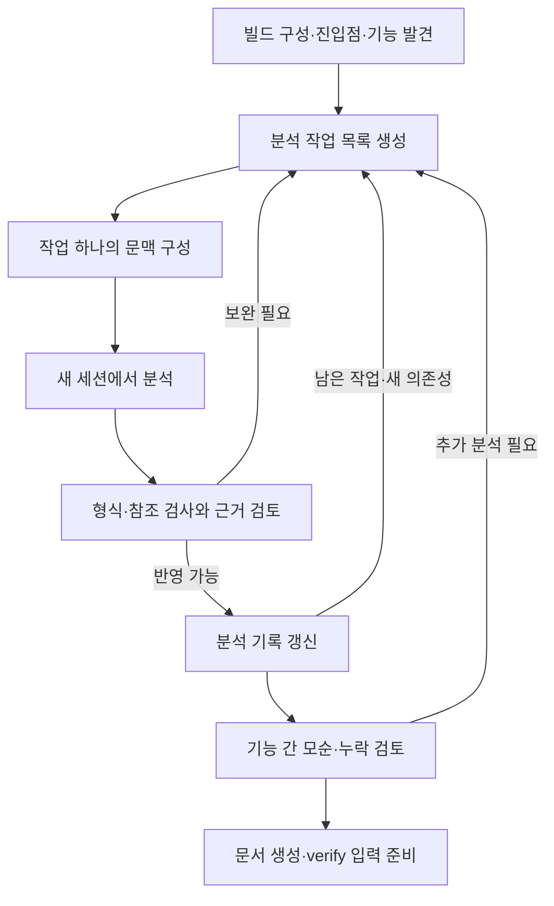

# 요구사항 추출 Work: 논의 기록과 설계 제안

- 작성일: 2026-10-08
- 논의 브랜치: `docs/requirements-extraction-flow-20261008`
- 소스 조사 기준: `main`의 `2bbdb6d60a221d85cd3560fc2a222593728d8641`
- 상태: **방향에 대한 긍정적 피드백을 받은 설계 제안. 14절 1~3번과 7번(extract 스킬 지침)의 큰 방향은 2차 논의에서, 9·4·5번(평가, 예산과 범위, 기록 계약)의 뼈대는 3차 논의에서 정했다([15.5절](#155-결정-기록)의 결정 1~42). 나머지 상세 계약과 구현은 미확정.**
- 이번 변경: 다음 세션에서 논의를 이어가기 위한 문서만 추가한다. 앱·스킬·기존 승인 정책의 동작을 변경하지 않는다.
- 2차 논의(2026-10-08): 전제를 다시 확인했다. 앱 코드는 조사 기준 커밋과 같다. 브랜치에는 이 문서와 다음 세션 안내만 더해졌다. 3절을 바로잡고 3.1~3.2절을 더했으며, 14절 1~3번은 [15절](#15-2차-논의-완료의-의미와-내부-run-실행재개-계약), 7번은 [16절](#16-extract-스킬-지침-구성)에서 논의한다.
- 3차 논의(2026-10-08): 전제를 다시 확인했다. 앱 코드는 여전히 조사 기준 커밋과 같고 `main`도 그 커밋이다. 코드는 바뀌지 않았고, 3절·3.1절·3.2절과 15·16절의 인용 가운데 빠지거나 틀린 것을 바로잡았다. 14절 9번(평가), 4번(예산과 범위), 5번(기록 계약)은 [17절](#17-3차-논의-평가-예산과-범위-기록-계약)에서 논의해 결정 17~38로 정했고, 정합성 점검에서 찾은 빈칸을 결정 39~42로 정했다.
- 4차 작업(2026-10-09): 사람에게 묻지 않고 구현 전 녹화, 결과 스키마 v0, 평가 하네스와 픽스처 둘, 기준선·A/A 측정을 했다. 녹화한 사실과 진행은 [17.4절](#174-4차-작업-구현-전-녹화-결과-스키마-v0-평가-하네스-측정), AI가 정한 것은 [15.5.1절](#1551-ai가-정한-결정4차-작업-2026-10-09)의 결정 43~이다. 평가 도구와 규약은 [extract-eval.md](extract-eval.md).
- 이어서 시작하기: [다음 세션용 프롬프트](requirements-extraction-next-session.md)

이 문서는 이전 대화 없이도 문제의식, 현재 코드의 제약, 제안의 이유, 남은 결정을 복원하기 위한 기록이다. 아래의 제안을 이미 구현된 기능이나 확정된 제품 정책으로 해석하지 않는다. 설계 결정을 확정하면 [개발 안내](../CONTRIBUTING.md)에 따라 [design.md](design.md)의 D 결정으로, 구현 결정을 확정하면 [implementation.md](implementation.md)의 I 결정으로 옮긴다. 이 문서에는 아직 D/I 번호를 부여하지 않는다. 구현을 시작할 때 구현 PR에서 한꺼번에 옮긴다([15.5절](#155-결정-기록)의 결정 8).

## 1. 사용자의 목표와 대화에서 확인한 요구

복잡한 레거시 펌웨어에서 기능·비기능 요구사항과 하드웨어·통신 제약을 역으로 추출하고, 그 결과를 재설계와 새 구현의 입력으로 사용하려는 목적이다. 실제 펌웨어 저장소를 분석한 결과는 아직 없으며, 이번 논의 대상은 그 작업을 수행할 **relay-v2의 새 업무 유형**이다.

사용자가 특히 지적한 문제는 다음과 같다.

- 사람이 먼저 보드 한 종류나 통신 기능 하나를 골라 주지 않아도, AI가 구성과 기능을 발견하고 분석 순서를 정할 수 있어야 한다.
- 저장소가 크고 작업이 길어지면 한 번의 프롬프트와 대화 이력만으로는 품질을 유지하기 어렵다.
- 컴팩션 이후 작업 지침, 예외, 근거, 미해결 문제가 희석될 수 있으므로 이를 보완할 장치가 필요하다.
- 이 흐름을 relay-v2의 새로운 type으로 구성하고 싶다.
- 이번 세션에서는 설계 논의를 문서와 브랜치로 보존하고, 구현 논의는 다른 세션에서 이어간다.

사용자는 아래의 구성 제안을 긍정적으로 평가했다. 다만 개별 필드·상태·승인·복구 정책까지 하나씩 확정한 것은 아니다. 기존 사용자의 목표를 다시 처음부터 질문하지 말고, 미확정 설계 사항부터 논의를 이어간다.

## 2. 추출 결과의 의미

코드에서 직접 복원하는 것은 **현재 구현된 동작**이다. 제품의 원래 의도, 구현되지 않은 요구사항, 새 제품에서 보존할 동작은 다른 근거와 판단이 필요하다.

| 구분               | 추출 가능한 내용                                          | 주의점                                                     |
| ------------------ | --------------------------------------------------------- | ---------------------------------------------------------- |
| 기능               | 명령 처리, 상태 전이, 데이터 변환, 오류 처리, 재시도·복구 | 기존 버그와 호환성 동작이 섞일 수 있다                     |
| 비기능             | 타임아웃 설정, 우선순위, 버퍼·메모리 구조                 | 설정값·측정값과 제품의 보장 기준을 구분한다                |
| 하드웨어·통신 제약 | 레지스터 접근, 프레임, 초기화 순서, ISR·DMA 의존성        | 데이터시트·정오표·회로도·상대 장치 동작으로 보강한다       |
| 구현 선택          | 태스크 분할, 폴링, 전역 상태, 모듈 경계                   | 재설계에서 바꿀 수 있는 구현을 필수 제약으로 굳히지 않는다 |

예를 들어 `timeout = 100`만 보고 “100ms 이내 응답해야 한다”를 만들면 안 된다. 단위, 타이머 주기, 카운터 의미, 적용 빌드와 호출 경로를 확인해야 한다. 단위가 ms여도 현재의 대기시간이 새 제품의 허용 응답시간이라는 뜻은 아니다.

코드 분석, 외부 사양, 실기기 관찰, 제품 채택 결정을 구분한다. 여러 AI의 동의나 여러 요약에서 같은 문장이 반복된다는 이유로 근거 상태를 승격하지 않는다. 관찰된 최대 지연은 최악 지연의 보장을 대신하지 않는다.

## 3. 조사한 relay-v2의 현재 구조

다음은 조사 기준 커밋에서 확인한 사실이다. 링크는 이 저장소의 파일을 가리킨다. 다음 세션의 소스가 달라졌으면 해당 심볼과 동작을 다시 확인한다.

| 현재 구조                                                       | 소스와 함의                                                                                                                                                                                                                                                                                                                                                                                                                                                                                                                                                                                                                                                                                                                                                                                                                                                                                                                                                                                                                    |
| --------------------------------------------------------------- | ------------------------------------------------------------------------------------------------------------------------------------------------------------------------------------------------------------------------------------------------------------------------------------------------------------------------------------------------------------------------------------------------------------------------------------------------------------------------------------------------------------------------------------------------------------------------------------------------------------------------------------------------------------------------------------------------------------------------------------------------------------------------------------------------------------------------------------------------------------------------------------------------------------------------------------------------------------------------------------------------------------------------------ |
| `WorkType`은 `bugfix`, `feature`, `refactor`, `spec`, `general` | [shared/work.ts](../app/src/shared/work.ts)의 `WorkType`, `WORK_TYPE_LABEL`, `WORK_TYPE_SHORT`, `WORK_TYPES`가 확장 지점이다. 같은 유형 목록을 `Record<WorkType>`나 `WORK_TYPES`로 쓰는 표가 [core/pipeline.ts](../app/src/core/pipeline.ts)의 `KEEP_CODE`, [shared/config.ts](../app/src/shared/config.ts)의 `SETTING_GROUP_LABEL`, 렌더러의 Work 생성 창, `skills/assemble.mjs`의 `TYPES`(순서까지 `WORK_TYPES`와 같아야 한다), `app/eval/lib/kind.mjs`, `skills/check.mjs`의 `PR_MARK`에도 있다. 렌더러 설정 화면의 묶음 배열 `GROUPS`와 `kind.mjs`의 `WORDS`는 타입 검사가 없어, 빠뜨리면 새 유형의 설정 묶음이 소리 없이 숨거나 bugfix 낱말로 바뀐다(I87). general(M18)과 spec(M20)은 순서에 기대는 로직을 고치지 않고(I57) 이 유형 표에 더해 새 노드의 노드 단위 표(`NODE_INFO`, handoff 스키마의 `recommended_next.node`와 생성본, `shared/config.ts`의 스킬·자동 승인 표, `review.ts`의 단계 요약, `check.mjs`)와 유형 고유 검사를 넓혔다(I85, I87~I89, I103~I106). 새 노드 `extract`에도 노드 단위 표가 모두 해당한다 |
| 유형마다 고정 선형 파이프라인이 있다                            | [core/pipeline.ts](../app/src/core/pipeline.ts)의 `PIPELINES`, `defaultNext`, `recommendableNodes`. 같은 단계 반복을 추천해서 자동 루프를 만드는 구조가 아니다. 같은 단계를 `recommended_next`로 쓰면 형식 오류이고, 오류를 무시하고 승인해도 `stopsForRecommendation`이 멈춘다                                                                                                                                                                                                                                                                                                                                                                                                                                                                                                                                                                                                                                                                                                                                                |
| 승인하면 기본 다음 단계의 task를 만든다                         | [core/machine.ts](../app/src/core/machine.ts)의 `approveNow`는 승인 기록, 살아 있는 세션 종료, `decisions.md` 추가, intake면 intent 확정을 한 뒤 다음 task를 만든다. 이전 단계뿐 아니라 같은 단계·파이프라인 밖 노드 추천과 [이 단계 끝나면 멈춤]에서도 멈춘다. 사람 승인과 자동 승인이 모두 이 함수를 거친다. 내부 run의 반영을 여기에 태우면 세션 종료·결정 로그·다음 task 생성이 함께 일어난다                                                                                                                                                                                                                                                                                                                                                                                                                                                                                                                                                                                                                              |
| `TaskRecord`는 하나의 CLI 세션을 가진다                         | [shared/work.ts](../app/src/shared/work.ts)의 `TaskRecord.session`은 하나다. 세션 id는 `/clear` 등으로 바뀌면 따라간다(`followSession`, D110). [이 단계 새 세션으로 다시]는 같은 task에 세션을 더하지 않고 새 `TaskRecord`를 만든다(`retry`, D114). 훅 경로, 터미널 버퍼, `pty.log`, 파일 감시, 살아 있는 세션 맵, 풀 자리, 설정 파일, `context.md`가 모두 task id나 task 디렉터리를 키로 쓰고, 상태 기계는 마지막 task(`currentTask`)의 신호만 받는다. 여러 독립 분석 실행과 재시도를 위한 모델은 별도로 필요하다                                                                                                                                                                                                                                                                                                                                                                                                                                                                                                             |
| 시작 시 스킬·context를 준비하고 버전을 기록한다                 | [main/work.ts](../app/src/main/work.ts)의 `startSession`. 시작 커밋, 스킬 해시, 엔진 버전을 기록한다. 엔진·모델·추론 수준은 task를 만드는 전이(`withEngines`)에서 스킬 이름으로 정해 task에 고정한다                                                                                                                                                                                                                                                                                                                                                                                                                                                                                                                                                                                                                                                                                                                                                                                                                           |
| 다음 단계의 context를 파일로 구성한다                           | [core/context.ts](../app/src/core/context.ts)의 `buildContext`. 의도와 결정은 Work의 앱 소유 파일(`intent.md`, `decisions.md`)에서 해시를 확인해(D124) 읽고, 폐기된 task의 결정은 뺀다. 기각·직전 handoff·산출물 경로는 앞서 승인된 task(`approvedBefore`)에서 온다. 입력을 모으는 것은 [main/work.ts](../app/src/main/work.ts)의 `context`다. `context.md`는 `startSession`에서 한 번 쓰고 재개 때 다시 만들지 않는다                                                                                                                                                                                                                                                                                                                                                                                                                                                                                                                                                                                                         |
| 같은 세션 재개는 기존 스킬과 context를 유지한다                 | [main/work.ts](../app/src/main/work.ts)의 `resumeSession`은 스킬을 다시 배포하지도, `context.md`를 다시 쓰지도 않는다. 분석 기록이 바뀌어도 최신 작업 패킷이 들어가지 않는다                                                                                                                                                                                                                                                                                                                                                                                                                                                                                                                                                                                                                                                                                                                                                                                                                                                   |
| 새 세션으로 다시 시작하는 기능은 분석 checkpoint 복구와 다르다  | [이 단계 새 세션으로 다시]는 [core/machine.ts](../app/src/core/machine.ts)의 `retry`(D114)이고, 앱 재시작 조정은 `restarted`(D75, D78)로 서로 다른 전이다. `retry`는 같은 노드의 새 task를 만들고, 앞 task는 승인되지 않아 [main/work.ts](../app/src/main/work.ts)의 `approvedBefore`에서 빠진다. 이어받는 것은 단계 선택 지시뿐이다(D327)                                                                                                                                                                                                                                                                                                                                                                                                                                                                                                                                                                                                                                                                                     |
| Codex는 압축 뒤 지시를 재주입한다                               | [main/work.ts](../app/src/main/work.ts)의 `SessionStart` 처리. `source`(startup/resume/clear/compact)를 가리지 않고 같은 응답을 준다. 내용은 처음 배포한 스킬과 처음 쓴 `context.md`의 경로라 최신 패킷이 아니다. 사람이 훅을 신뢰하기 전에는 오지 않는다. 압축 뒤 유지는 실제 Codex에서 한 번 관찰했고, Codex 훅 본문의 계약 녹화본은 없다(3.1절)                                                                                                                                                                                                                                                                                                                                                                                                                                                                                                                                                                                                                                                                             |
| Claude의 재주입 경로는 Codex와 다르다                           | [core/settings.ts](../app/src/core/settings.ts)의 훅 목록에는 `SessionStart`/`PreCompact`가 없다. [design.md](design.md)의 D31은 Claude Code의 스킬 재주입 관찰(2.1.283, 수동 `/compact`, D95)을 바탕으로 공통 규칙을 합친 스킬을 약 5,000토큰 안에 두는 목표를 설명한다. 엔진·버전에 무관한 보장으로 일반화하지 않는다. 곁 세션은 실행·재개 때마다 `--append-system-prompt-file`로 안내를 붙인다(D386)                                                                                                                                                                                                                                                                                                                                                                                                                                                                                                                                                                                                                        |
| 산출물 수집은 task 디렉터리 바로 아래의 `.md`만 본다            | [adapters/store.ts](../app/src/adapters/store.ts)의 `taskFiles`, `artifacts`는 하위 폴더와 `.md`가 아닌 파일을 읽지 않는다. JSON을 `NODE_INFO.artifacts`에 넣으면 늘 "없음" 오류가 난다. 앱이 task 디렉터리의 JSON을 따로 읽고 쓰는 선례는 지식 검토의 `knowledge-review.json`이다                                                                                                                                                                                                                                                                                                                                                                                                                                                                                                                                                                                                                                                                                                                                             |
| handoff 검사는 내용의 정당성을 판단하지 않는다                  | [core/validate.ts](../app/src/core/validate.ts)는 형식 검사다. [core/approval.ts](../app/src/core/approval.ts)에서 사람 승인의 [오류 무시하고 승인]은 기본으로 열린 경로이고, 넘길 수 없는 오류는 intake 초안의 머리글 오류와 초안 없음(D90, D112, D134), PR 대응의 `replies.md`(D204)뿐이다. `status`를 읽지 못하면 필수 산출물 검사도 건너뛴다. 자동 승인은 오류를 넘기지 않는다                                                                                                                                                                                                                                                                                                                                                                                                                                                                                                                                                                                                                                             |
| 의도·최종 검증은 수동 승인이다                                  | [core/approval.ts](../app/src/core/approval.ts)의 `approvalMode`. 엔진이 `claude`가 아니면 늘 수동이고, Codex task는 `holdsNow`에서도 `completion_unknown`으로 막힌다. 근거는 D 번호가 아니라 [engines.md](engines.md)의 E8·Q4다(Codex의 Stop에는 백그라운드·예약 작업 정보가 없다)                                                                                                                                                                                                                                                                                                                                                                                                                                                                                                                                                                                                                                                                                                                                            |
| `spec`은 사람과 설계 결정을 정하는 유형이다                     | [skills/spec/SKILL.md](../skills/spec/SKILL.md)는 주제 목록과 각 설계 결정을 사람에게 묻는다. 자율적 요구사항 추출과 목적이 다르다                                                                                                                                                                                                                                                                                                                                                                                                                                                                                                                                                                                                                                                                                                                                                                                                                                                                                             |
| handoff는 간결한 인수인계이고 열린 질문의 의미가 좁다           | [skills/_common.md](../skills/_common.md). 분석 기록 전체를 넣을 곳이 아니며, `open_questions`는 실제로 물었으나 답을 받지 못한 질문이다. 예외로 "모름" 답 때문에 진행할 수 없을 때와 사람이 마무리를 요청했을 때 못 한 항목도 둘 수 있다. 열린 질문은 자동 승인을 멈춘다                                                                                                                                                                                                                                                                                                                                                                                                                                                                                                                                                                                                                                                                                                                                                      |
| 기존 세션 풀은 실행 동시성 제한이다                             | [main/pool.ts](../app/src/main/pool.ts)의 `SessionPool`은 메모리 카운터와 FIFO 대기열이다. 앱 재시작 때 대기열을 비우고 기다리던 task를 중단됨으로 둔다(D78). 정리 세션은 풀을 쓰고 곁 세션은 쓰지 않는다(D385)                                                                                                                                                                                                                                                                                                                                                                                                                                                                                                                                                                                                                                                                                                                                                                                                                |

기존 `docs/knowledge/`도 전체 분석 기록의 대체물이 아니다. 재사용 가능한 팀 규칙과 특정 소스·빌드에 의존하는 요구사항 후보를 구분해야 한다. 추정 후보를 지식으로 일괄 배포해서 다른 Work에서 확정 사실로 재사용하지 않도록 한다.

### 3.1 2차 확인에서 보탠 사실

1차 조사에서 다루지 않았지만 14절 1~3번에 직접 걸리는 기존 동작이다. 같은 기준 커밋에서 확인했다.

| 확인한 사실                              | 소스와 함의                                                                                                                                                                                                                                                                                                                                                                                                                                                                                                                                                                                                                                                                                                                                                                                                     |
| ---------------------------------------- | --------------------------------------------------------------------------------------------------------------------------------------------------------------------------------------------------------------------------------------------------------------------------------------------------------------------------------------------------------------------------------------------------------------------------------------------------------------------------------------------------------------------------------------------------------------------------------------------------------------------------------------------------------------------------------------------------------------------------------------------------------------------------------------------------------------- |
| 비대화형 모델 호출 경로가 있다           | [adapters/claude.ts](../app/src/adapters/claude.ts)의 `claudeJson`(`claude -p --output-format json --json-schema --tools '' --no-session-persistence`)과 [adapters/codex.ts](../app/src/adapters/codex.ts)의 `codexJson`(`codex exec --ephemeral --sandbox read-only --output-schema -o`). 호출자는 verify의 지식 검토(D300, D334) 하나다. PTY·풀·훅·프로세스 기록 없이 종료 코드와 구조화 출력으로 끝을 판정한다. 지금은 도구가 없거나 읽기 전용이다. 실행 기반인 [adapters/exec.ts](../app/src/adapters/exec.ts)의 `run`은 출력을 끝까지 모으고, POSIX에서 시간 초과면 직계 자식만 끝낸다                                                                                                                                                                                                                     |
| task가 아닌 앱 관리 세션이 둘 있다       | 정리 세션(D126)과 곁 세션(D385~D392)이 [main/work.ts](../app/src/main/work.ts)의 공통 틀 `AuxSession`을 쓴다. 따로 id·훅 토큰을 메모리에 두고, 살아 있는 동안만 프로세스 기록(`cleanup_process`, `side.process`)을 `work.json`에 둔다. `events.jsonl`과 `pty.log`에는 남기지 않는다. 앱을 다시 켜면 세션은 없고 남은 프로세스를 끝낸다. 예외로 곁 세션의 대화 id(`side.session_id`)는 남아 재시작 뒤에도 이어 연다(D389). 세션 종류는 [core/recovery.ts](../app/src/core/recovery.ts)의 `recordedProcesses`, `restarted`, `WorkState`, 렌더러 탭, 가짜 CLI 등에 하드코딩되어 있다. Claude 곁 세션은 UserPromptSubmit 훅만 받아 턴 끝 신호가 없다                                                                                                                                                                |
| 늦은 훅을 막는 장치는 실행 단위로 있다   | 실행·재개마다 새 훅 토큰(해제하면 403), 처리 줄의 세션 객체 대조(D144), PTY pid 비교, 자동 승인 카운트다운의 `started_at` 대조. 토큰 해제는 질문 처리만 끊고 이미 토큰 확인을 지난 훅은 계속 돌아서 D144 대조가 따로 필요하다. 모두 task id 단위다. 디스크에 남는 결과 파일에는 이런 보호가 없다. 훅 본문에 실행(프로세스) 단위 식별자는 없다. Claude는 새 세션을 앱이 정한 `--session-id`로 띄우므로 본문의 `session_id`가 `/clear` 전까지 그 값이지만, [재개]는 같은 id라 프로세스를 가르지 못한다(D144). task id는 훅 URL 경로에 있다                                                                                                                                                                                                                                                                        |
| 원자성은 파일 하나 단위다                | [adapters/store.ts](../app/src/adapters/store.ts)의 `writeFileAtomic`은 임시 파일 쓰기·fsync·rename이다. 상태의 기준은 `work.json` 하나이고(I11), Work마다 처리 줄 하나로 전이를 차례로 한다. 쓰기 전에 파일을 다시 읽어 마지막으로 쓴 내용과 비교하고, 다르면 바뀐 내용을 `work.json.changed-<시각>`으로 남긴 뒤 앱 상태로 덮어쓴다. 쓰기를 거부하는 비교(CAS)가 아니다. 전이마다 `work.json`을 먼저 쓴 뒤 `events.jsonl`, `decisions.md` 등을 차례로 쓰므로 여러 파일이 함께 바뀌지는 않는다. 여러 단계 작업은 `work.json`의 진행 중 작업 기록(D77)으로 끊긴 곳을 알고 [다시 시도]·[무시]를 받는다(D122, D123)                                                                                                                                                                                                |
| 앱 소유 파일 보호는 정확한 이름 목록이다 | [core/settings.ts](../app/src/core/settings.ts)의 Claude deny 규칙, [core/codex.ts](../app/src/core/codex.ts)의 Codex 도구 가드, 곁 세션·정리 세션 설정 모두 Work 루트의 파일 이름과 이전 task 디렉터리를 기준으로 한다. 제안한 `requirements/` 하위는 지금 어디에도 걸리지 않는다. 앱 밖에서 바뀐 앱 소유 파일의 처리는 파일마다 다르다(D124). `request.md`·`intent.md`·`decisions.md`는 경고하고 바뀐 내용을 쓴다. `work.json`은 바뀐 내용을 옆 파일로 남기고 앱 상태로 다시 쓴다. `pr-items.json`은 확인하지 않는다(D191)                                                                                                                                                                                                                                                                                    |
| 계약 녹화 범위                           | Claude는 2.1.293을 `claude -p --dangerously-skip-permissions --settings <훅>`으로 녹화한다(`app/test/contract/`). 도구를 쓰는 실행의 UserPromptSubmit·PreToolUse·PostToolUse·PostToolUseFailure·Stop(`background_tasks`, `session_crons`, `transcript_path` 포함)·SessionEnd 본문과 실행 옵션 이름이 있다. `-p` 결과 JSON의 필드(`subtype`, `num_turns` 등)와 백그라운드 작업이 남았을 때 `-p`가 끝나는 방식은 녹화본에 없다. `--tools`는 옵션 이름만 녹화됐고 앱은 빈 목록으로만 쓴다. 비어 있지 않은 목록으로 도구를 쓰는 `-p`, `AskUserQuestion`을 빼는 동작, `--allowedTools`·`--disallowedTools`·`--permission-mode`는 녹화본에 없다. [계약] 실제 시험은 도구를 끈 `claudeJson`의 `structured_output`·`usage`·`total_cost_usd`를 실행 때 확인할 뿐 녹화하지 않는다. Codex는 계약 정의와 녹화본이 모두 없다 |
| 사용량                                   | 앱은 대화형 세션의 사용량을 읽지 않는다. 평가 도구는 실행마다 둔 설정 폴더(`CLAUDE_CONFIG_DIR`)의 대화 기록을 훑어 사용량을 센다. 훅 본문의 `transcript_path`도 대화 기록을 가리키지만 그것을 읽는 코드는 없다. `claude -p`와 `codex exec`는 끝난 뒤 사용량을 준다. 실행 중 턴·예산 상한 옵션은 레포(녹화본 포함)에 근거가 없다. 설치된 2.1.294의 `--help`에는 `-p` 전용 `--max-budget-usd`가 있고 턴 상한은 없다. 바이너리 문자열에는 숨은 `--max-turns`와 결과 `subtype`의 `error_max_turns`·`error_max_budget_usd`가 보인다(녹화 아님)                                                                                                                                                                                                                                                                       |
| 알림                                     | OS 알림은 그 Work를 보고 있지 않을 때 보낸다. 배지가 사람이 필요한 상태로 바뀔 때(D81), 자동 승인 카운트다운 시작과 보류(D130), 대기열 자동 시작(D81), 정리 세션 질문, PR 진행 사건(대응 거리 들어옴, 머지 가능, PR 닫힘·밖에서 머지됨, 자동 대응의 시작·상한 도달·시작 실패, 자동 승인한 대응의 실패. D171, D184, D211)이 그때다. 배지가 중단됨·대기·작업 중으로 바뀐 것은 알리지 않는다. 앱은 `StopFailure`를 구독하지 않아 API 오류로 끝난 턴은 작업 중으로 남는다. 시작 실패 알림은 설계 9절 후보(점검 A25)다                                                                                                                                                                                                                                                                                               |
| 이슈 기록                                | 이슈 기록(D336~D349)이 켜져 있으면 승인된 task마다 산출물 전문을 이슈 코멘트로 올리고, 비밀 검사나 미리보기는 없다(D343). Work를 끝내면 끝 코멘트를 달고 앱이 만든 이슈는 닫는다(D346, D347). 사람이 지정한 기존 이슈(D338)는 닫지 않는다                                                                                                                                                                                                                                                                                                                                                                                                                                                                                                                                                                       |

### 3.2 제안이 닿는 설계 원칙과 결정

✅는 사용자가 직접 정한 결정이라 바꾸려면 사용자와 다시 정한다([design.md](design.md) 2절).

| 원칙·결정                       | 내용                                                                                                                                                      | 제안과의 관계                                                                                                       |
| ------------------------------- | --------------------------------------------------------------------------------------------------------------------------------------------------------- | ------------------------------------------------------------------------------------------------------------------- |
| 1.1 목표                        | 각 단계(task)는 새 CLI 세션에서 실행한다                                                                                                                  | 한 단계 안에 여러 세션(run)을 두는 것은 새 구조다                                                                   |
| 1.2 비목표, D1, D2              | 헤드리스 스트림을 파싱해 CLI UI를 재구현하지 않는다. CLI는 PTY로 임베드한다. 구조화된 정보는 훅·파일·git 옆 채널로 받는다                                 | run을 헤드리스로 돌리면 예외 결정이 필요하다                                                                        |
| 1.2 비목표                      | 실행 중인 세션에 텍스트를 주입하지 않는다. task 안 작업을 통제하지 않는다. 세션 전환을 숨기지 않는다(새 task는 새 탭)                                     | run 사이의 자동 진행과 run을 보여 주는 방식에 걸린다                                                                |
| D3                              | 에이전트 파일에 앱 상태를 쓰지 않는다(경쟁과 위조)                                                                                                        | 앱이 분석 기록의 유일한 작성자라는 8절의 직접 선례다. D3의 앞 절(산출물과 handoff는 스킬이 쓴다)은 결정 15가 바꾼다 |
| D5                              | 다음 task는 파이프라인 순서가 정하고, 벗어나는 이동은 사람만 정한다                                                                                       | run이 task가 아니면 걸리지 않는다. run을 task로 두면 걸린다                                                         |
| D7 ✅                           | 검사 결과에 앱이 자동으로 반응하지 않는다. 예외는 PR 대응 자동 시작(D154)                                                                                 | 앱이 run 결과를 검사해 반영하고 다음 run을 띄우는 것은 새 예외다                                                    |
| D18 ✅                          | 살아 있는 세션은 합계 상한과 대기열을 따른다                                                                                                              | run도 자리를 쓰는지 정한다. 자리를 쥔 부모 세션이 run의 끝을 기다리면 교착이다                                      |
| D19                             | 토큰 예산을 두지 않는다(`context.md`)                                                                                                                     | run 패킷의 예산(6절, 9절)은 이 결정의 범위를 좁히는 일이다                                                          |
| D24 ✅                          | 질문은 `AskUserQuestion`으로 하고, 권한 확인을 꺼도 사람 답을 기다린다                                                                                    | 사람 없이 도는 run이 질문하면 멈춘다                                                                                |
| D72 ✅                          | Work마다 자동 승인과 질문 방식을 덮어쓴다. PR 대응 자동 시작도 Work별로 덮어쓴다(D154 ✅, `WORK_KEYS` 셋). 엔진은 앱 설정이고 task를 만들 때 고정한다(E5) | run 자동 진행·상한을 둘 곳을 정한다                                                                                 |
| D75, D76, D78 ✅                | 재시작 때 자동 재개·자동 승인을 하지 않고, 고아 프로세스를 끝내고, 대기열을 비운다                                                                        | run 큐의 재시작 규칙이다                                                                                            |
| D114 ✅                         | 새 세션이면 새 task다("task는 CLI 세션 하나")                                                                                                             | run을 `TaskRecord`로 둘지 가르는 선례다                                                                             |
| D129 ✅, E8                     | Claude는 Stop의 백그라운드·예약 작업이 비어야 자동 승인한다. Codex는 그 정보가 없어 수동이다                                                              | 엔진별 run 완료 계약의 출발점이다                                                                                   |
| D15, D351, D355, D362, D364 ✅  | 전달 방식은 verify 뒤의 일이라 완료조건이 아니다. spec은 정하지 않은 것을 이유와 함께 남기고 채택은 PR 리뷰·머지로 한다                                   | 완료의 의미(15.1절)의 선례다                                                                                        |
| I46                             | 앞 턴의 유효한 handoff로 승인 대기가 될 수 있다(알려진 제약)                                                                                              | "결과 파일이 있다"를 완료로 보면 같은 문제가 run에 생긴다                                                           |
| 설계 9절 후보(D235 ✅, D352 ✅) | 긴 일을 계획 단계마다·주제 묶음마다 task로 나누기                                                                                                         | run을 task 밖에 두면 이 후보와 다른 길이라 이유를 남긴다                                                            |

## 4. 제안하는 외부 흐름

새 Work type은 `requirements`, 화면 이름은 “요구사항 추출”로 제안한다.

```ts
// 제안: 아직 등록되지 않았다.
requirements: ['intake', 'extract', 'verify']
```

| 단계      | 역할                                                       | 산출물 방향                                          |
| --------- | ---------------------------------------------------------- | ---------------------------------------------------- |
| `intake`  | 분석 목적, 대상 저장소, 제외 범위, 자료, 완료 기준을 정리  | 기존 의도 초안과 승인된 `intent.md`                  |
| `extract` | 구성·기능 발견, 분석 작업 생성, 경로 추적, 근거 검토, 통합 | 구조화된 분석 기록과 사람이 읽을 `extraction.md`     |
| `verify`  | 근거의 타당성, 누락·모순, 완료 기준, 최종 문서 검토        | requirements용 `verification.md`, `pr.md`, 최종 문서 |

`intake`에서 사용자가 보드·기능을 먼저 선택하도록 요구하지 않는다. “저장소 전체의 구성과 기능을 조사한다”도 유효한 범위다. AI는 보드·빌드 후보를 찾고, 실제 출하 구성을 확인할 수 없으면 후보 상태를 유지한다. 범위나 비용 때문에 선택이 필요할 때만 근거와 선택지를 제시한다.

기존 의도·최종 승인 틀을 재사용하는 방향이다. 내부 분석 실행의 자동 진행과 제품 단계 승인은 다른 의미로 설계한다. 현재 relay가 이미 이 내부 실행을 지원하거나, Codex task를 자동 승인할 수 있다는 뜻은 아니다.

추출 후에는 요구사항 문서를 입력으로 기존 `spec` Work에서 재설계를 논의하고, `feature` 등으로 구현을 나누는 연결을 제안했다. 이번 type이 추출부터 재설계·전체 재구현까지 한 Work에서 자동 완료하는 범위는 아니다.

## 5. `extract` 내부의 반복 실행

외부 파이프라인은 세 단계로 유지하고, 내부에 앱이 관리하는 작은 분석 작업의 실행기를 둔다. 기존의 `recommended_next`, 되감기, 수동 단계 선택을 반복 실행 수단으로 사용하지 않는다.



초기 발견 작업은 빌드 설정, 조건부 컴파일, 실행 진입점, 명령 테이블, 태스크, ISR, DMA, 공유 상태 등을 조사한다. 정적 분석·심볼 인덱스·컴파일러 결과로 얻을 수 있는 사실은 도구로 확보하고, AI는 이를 연결하여 해석한다. 단순 문서 검색만으로 실행 의존성을 모두 해결했다고 보지 않는다.

분석 단위의 예:

- 한 명령의 정상·오류·타임아웃·재시도 경로
- 특정 상태의 진입·종료 조건과 비동기 변경 지점
- 시간 상수의 단위와 계산 경로
- 공유 상태를 사용하는 태스크·ISR 사이의 관계
- 보드별 초기화·전원·복구 순서의 차이
- 여러 기능에 걸친 동시성·타이밍·데이터 보존 제약

파일별 설명 생성으로 끝내지 않고 시나리오와 의존성을 추적한다. 초기 탐색, 작업 계획, 근거 검토, 통합, 최종 검증도 커지면 분할한다. 마지막에 전체 분석 기록을 한 세션에 넣어야만 완료되는 구조를 피한다.

## 6. 작업과 실행의 데이터 모델

기존 Work/Task 아래에 다음 개념을 추가하는 방향이다. 이름과 필드의 최종 스키마는 미확정이다.

| 개념           | 의미                          | 필요한 정보                                                                        |
| -------------- | ----------------------------- | ---------------------------------------------------------------------------------- |
| `AnalysisUnit` | 수행할 분석 작업              | ID, 목적, 구성·시나리오 범위, 의존성, 완료 조건, 상태, 결과 참조                   |
| `AnalysisRun`  | 그 작업을 실행한 한 번의 시도 | 실행 ID, 작업 ID, 세션 ID, 엔진·스킬 버전, 입력 revision·패킷 해시, 결과·검사 기록 |
| 작업 패킷      | 한 실행이 받는 고정 입력      | 계약, 목표, 원본 위치, 관련 기록 일부, 미확인 사항, 예산, 산출물 계약              |
| 결과 제안      | AI가 제출하는 변경            | 새 관찰·후보·근거·충돌, 후속 작업, 완료 또는 미완료 이유                           |
| checkpoint     | 미완료 탐색을 복원할 기록     | 확인한 범위, 남은 경로, 필요한 원본, 다음 확인 지점                                |

`AnalysisUnit`과 `AnalysisRun`을 나누면 보완 실행을 해도 동일 작업을 추적할 수 있고, 어느 입력으로 어느 결론을 냈는지 남길 수 있다. 작업 완료와 실행 종료는 다르다. 프로세스가 끝났거나 결과 JSON이 존재한다는 이유만으로 의미적 분석이 완료됐다고 보지 않는다.

현재 `TaskRecord.session`과 하위 run의 세션을 어떻게 연결할지, 훅·터미널·대기열을 어느 실행 ID에 연결할지는 다음 논의에서 확정한다. 동일 상태를 부모와 자식에 각각 저장해 서로 다른 세션을 가리키는 일이 없도록 해야 한다.

## 7. 근거와 요구사항 기록

| 종류                    | 의미                                                 |
| ----------------------- | ---------------------------------------------------- |
| `evidence`              | 버전이 고정된 코드·문서·측정 결과와 위치             |
| `observation`           | 근거에서 확인한 현재 구현 동작                       |
| `requirement_candidate` | 조건·동작·결과로 정리한 요구사항 후보                |
| `constraint`            | 적용 구성과 이유가 명시된 제약 후보 또는 확인된 제약 |
| `unknown`               | 확인하지 못한 항목과 필요한 추가 자료·행동           |
| `conflict`              | 양립하지 않는 주장과 각각의 근거                     |
| `coverage`              | 구성·기능·상태·오류 경로별 조사 상태                 |

각 주장에는 적용 범위, 수치와 단위, 근거 ID, 추론 여부, 검토 기록, 검증 방법을 연결한다. 서로 다른 빌드의 동작을 중복이라고 판단해 하나로 합치지 않는다.

다음 축은 분리한다.

1. **근거 종류:** 코드 / 외부 사양 / 측정 / 추론.
2. **검토 상태:** 미검토 / 근거 확인 / 반증 또는 충돌 / 보완 필요 등.
3. **제품 채택 결정:** 미결정 / 유지 / 변경 / 제외 등.

위 값들은 개념 예시이며 최종 enum은 아니다. “근거 확인”은 코드 해석이나 측정 사실을 확인했다는 뜻이지, 그 동작을 새 제품에 채택했다는 뜻이 아니다. 요구사항 문장에는 현재 동작의 기술과 새 제품의 규범적 기준을 구분해서 표시한다.

소스 기준은 Work 시작 커밋, 서브모듈 커밋, 빌드 구성, 외부 자료 버전으로 고정한다. 문서 출력 때문에 Work 브랜치에 커밋이 추가돼도 분석 대상 펌웨어의 기준 커밋을 자동으로 바꾸지 않는다. 소스나 빌드를 바꾸는 경우는 명시적으로 재기준화하고 관련 결과를 재검토한다.

## 8. 영속 저장과 반영 계약

아래는 배치 예시다. 경로와 파일 분할은 미확정이며, 앱 소유 상태와 AI의 제출물을 구분하는 것이 핵심이다. 3차 논의에서 기준 위치와 revision 형태를 정했다(결정 32, 33). 현재 revision의 포인터는 `state.json`이 아니라 `work.json`에 두고, revision은 전체 스냅샷이 아니라 변경분과 일부 스냅샷이다. run 디렉터리는 앱만 쓰고, run의 scratch는 `requirements/` 밖에 둔다(결정 42).

```text
<WorkDir>/
  work.json
  intent.md
  requirements/
    manifest.json          # 고정 소스·자료·계약 버전
    state.json             # 현재 revision 등 앱 소유 상태
    revisions/
      000001.json          # 작업·주장·근거·분석 범위의 불변 스냅샷
      000002.json
    runs/
      r-0001/
        packet.json        # 앱이 만든 입력
        context.md         # 이번 실행에 필요한 문맥
        result.json        # AI의 결과 제안
        checkpoint.json    # 미완료 탐색 기록
  tasks/
    02-extract/
      extraction.md        # 사람이 볼 요약
      handoff.md
```

앱이 정식 분석 기록의 유일한 작성자가 되고, AI는 자신의 실행 결과와 checkpoint를 제출한다. 기존 앱 소유 파일 보호도 확장하되, 도구 deny 규칙만으로 모든 셸 쓰기를 완전히 격리했다고 주장하지 않는다. 파일 무결성·버전 검사와 결과 반영 검사를 함께 둔다.

반영 시 검사할 항목(3차 논의에서 막는 검사와 경고만 하는 검사로 나눴다. 결정 37):

- 스키마와 필수 필드, 고유 ID, 근거 참조의 유효성
- 소스·빌드·계약 버전, 입력 revision과 결과의 일치
- 실행 ID와 결과 식별자를 통한 중복 반영 방지
- 허용된 상태 전이와 미확정·충돌 항목의 추적 가능성
- 완료하지 않은 의존성의 누락 여부
- 분석 대상 소스가 기준에서 달라졌는지 여부

원본 위치가 존재한다는 검사만으로 의미적 해석의 타당성이 보장되지는 않는다. 검토 작업이 원본을 다시 읽고 주장을 대조하며, 필요한 경우 사양·테스트·측정을 요구한다.

기존 `writeFileAtomic`은 단일 파일 단위다. 여러 JSON을 순서대로 쓰는 것만으로 전체 상태가 원자적으로 바뀌지는 않는다. 초기 제안은 **불변 revision을 먼저 저장하고 현재 revision 포인터를 마지막에 원자적으로 교체**하는 방식이다. 작업 상태와 반영한 결과 식별자도 같은 revision에 포함해 “결과는 반영됐으나 작업은 미완료”인 중간 상태를 복구할 수 있게 한다.

오래된 revision을 기준으로 제출된 결과는 그대로 반영하지 않는다. 순차 실행을 먼저 구현하고, 병렬화 시 독립 변경의 합병·재검증 정책을 별도로 정한다. 분석 기록의 깨진 참조나 중복 반영 오류는 일반 handoff의 “오류 무시하고 승인”으로 통과시키지 않는 방향이다.

## 9. 컨텍스트·컴팩션·재개

각 run은 새 컨텍스트에서 다음을 받는다.

> 짧은 고정 계약 + 승인된 분석 범위 + 이번 작업 패킷 + 관련 분석 기록 일부 + 원본 근거 위치

전체 대화, 누적 handoff, 전체 증거 기록을 매번 넣지 않는다. 요약은 탐색 안내로 쓰고 원본 증거를 대신하지 않는다. 관련 심볼·호출 관계·공유 상태·빌드 조건을 조회할 수 있는 경로를 유지한다.

- 규칙은 버전 관리하고 실행 시 다시 주입한다. 파일에 “읽어라”라고 적는 것만으로 모든 실행이 준수한다고 가정하지 않는다.
- 입력 스냅샷은 고정한다. 재개 때는 최신 반영 revision과 checkpoint로 새 입력을 구성한다.
- 토큰 사용량을 신뢰성 있게 얻을 수 있으면 응답·추가 탐색 공간을 남기고 작업을 분할한다. 얻을 수 없으면 작업 크기·도구 출력·실행 횟수 등의 제한을 쓴다.
- 중간 작업을 완료할 수 없으면 확인한 사실과 미완료 지점을 저장하고 후속 작업을 만든다. 컨텍스트 한도 도달을 작업 완료로 처리하지 않는다.
- 작업 계획과 통합 검토를 하는 AI도 거대한 장기 대화에 의존하지 않게 한다.
- 새 세션에서도 적용 규칙·현재 작업·미확정 항목·원본 근거를 복원할 수 있어야 한다.

Claude와 Codex의 압축·세션 종료·재개 훅을 같은 것으로 가정하지 않는다. 새 이벤트나 CLI 옵션이 필요하면 실제 계약과 지원 버전을 확인하고 `app/test/contract/`에 반영한다. 첫 구현은 토큰 임계값이나 압축 직전 훅에 전적으로 의존하지 않는, 짧은 작업마다 새 세션을 여는 방식으로 제안한다.

## 10. 질문·승인·중단·되감기

| 발견한 문제                         | 처리 방향                                         |
| ----------------------------------- | ------------------------------------------------- |
| 코드에서 더 조사할 수 있다          | 후속 분석 작업 생성                               |
| 데이터시트나 실기기 측정이 필요하다 | 외부 근거 필요 항목으로 기록하고 독립 분석은 진행 |
| 범위·예산·제품 의도를 결정해야 한다 | 필요한 시점에 근거와 선택지를 묶어 질문           |
| 실제로 사람에게 물었고 답이 없다    | 기존 `handoff.open_questions` 의미에 맞게 기록    |
| 실행 실패·잘린 결과·버전 불일치     | 결과 미반영, 원인을 보존하고 재시도 또는 보완     |

미확인 사항을 전부 `open_questions`에 넣지 않는다. 그렇다고 실제로 답이 필요한 질문을 숨기거나 자동 승인 조건을 우회하지도 않는다.

내부 run의 결과 반영은 사용자에 의한 단계 승인이나 제품 채택 승인이 아니다. Codex의 기존 task 수동 승인 정책을 유지하면서 내부 작업을 자동 진행시키려면 별도의 실행 완료 계약이 필요하다. 유효한 결과, 실행의 정지·종료 상태, 남은 백그라운드 작업을 어떻게 확인할지 엔진별로 정한다. 이 계약이 없는데 Stop이나 프로세스 종료만 보고 다음 run으로 넘어가지 않는다.

중단·앱 종료 후에는 반영된 revision을 읽어 남은 작업을 복원한다. 늦게 도착한 이전 run의 훅·결과가 현재 run을 바꾸지 못하게 실행 식별자를 검사한다.

되감기 시에는 해당 시점의 분석 revision에서 새 시도를 시작하는 방향이다. 폐기된 결론을 현재의 유효한 입력에 섞지 않으며, 이력은 보존한다. 기존의 “현재 문서 위에서 이어서”와 분석 revision을 계속 쓸지의 관계, 기준 소스 변경 시 무효화 범위는 아직 정해야 한다.

## 11. 산출물·화면·후속 Work

Work의 실행 기록은 `<RELAY_HOME>`에 남기고, 전달할 결과는 대상 레포의 `docs/requirements/` 등 합의한 위치에 저장해 기존 push/PR 전달 흐름을 활용한다. 최종 경로·파일 형식은 미확정이다.

최종 결과에 포함할 내용:

- 분석 대상 소스·구성과 제외 범위
- 기능·비기능 요구사항 후보 및 제약
- 조건·동작·결과와 수치·단위
- 원본까지 추적 가능한 근거 연결
- 미확정 사항, 충돌, 외부 자료·실기기 검증 필요 항목
- 분석 범위와 누락 가능성, 검증 계획
- 재설계에서 유지·변경·제외 여부를 결정해야 할 항목

후속 세션이 앱의 로컬 절대 경로에 접근하지 못해도 근거를 찾을 수 있어야 한다. 소스 커밋·상대 경로·심볼·자료 버전과 필요한 구조화 데이터를 함께 내보내는 방향이다. Markdown만 렌더링하고 구조화된 ID·근거를 잃지 않게 한다.

화면은 현재 작업, 발견한 분석 항목과 처리 상태, 근거 검토 상태, 미확정·충돌·외부 검증 필요 항목을 보여준다. “발견한 작업 100% 처리”를 “모든 요구사항 발견”이라고 표시하지 않는다. 최종 검증에서도 분석을 마쳤다는 판정과 제품 요구사항을 모두 확정했다는 판정을 구분한다.

## 12. 예상 변경 지점

새 모듈 이름은 제안이다. 기존 `core`는 Node/Electron API를 import하지 않는 규칙을 유지한다. 이미 큰 `main/work.ts`에 분석 루프 전체를 추가하지 않는 방향이다.

| 영역                                                  | 변경 방향                                                               |
| ----------------------------------------------------- | ----------------------------------------------------------------------- |
| `app/src/shared/work.ts`                              | `requirements`와 표시 이름·선택 목록                                    |
| `app/src/core/pipeline.ts`                            | `extract`, 단계 순서, 필수 요약 산출물, 되감기 정책                     |
| `docs/contracts/handoff.v1.schema.json` 및 생성 타입  | 새 노드와 기존 handoff 계약의 연결. 생성본만 손으로 수정하지 않는다     |
| `app/src/shared/config.ts`, `core/config.ts`, UI 설정 | 스킬·엔진·질문·승인 설정의 처리                                         |
| 신규 `shared/requirements.ts`                         | 작업·실행·근거·요구사항·revision 타입                                   |
| 신규 `core/requirements.ts`                           | 작업 선택, 상태 전이, 검사와 결과 반영의 순수 로직                      |
| 신규 `core/requirements-context.ts`                   | 제한된 작업 패킷과 context 구성                                         |
| 신규 `adapters/requirements-store.ts`                 | 스냅샷·실행 기록·원본 참조 읽기와 저장                                  |
| 신규 `main/requirements.ts`                           | 세션 실행·재개·검사·다음 run 예약                                       |
| 기존 세션 풀·엔진 어댑터·훅·터미널                    | 하위 run 식별과 실행 수명 관리. 기존 task 실행과의 공유 범위를 정한다   |
| `skills/extract/` 및 공용 스킬                        | 전용 추출 규칙, requirements용 work-start·verify·필요시 pr-respond 구간 |
| `skills/assemble.mjs`, `skills/check.mjs`             | 새 유형·스킬 등록, 조립과 정적 검사                                     |
| 상태 조회 API·renderer                                | 진행 범위·근거·미확정·복구 상태 표시                                    |
| `core/validate.ts`, 별도 분석 검사                    | 기존 Markdown 형식 검사와 구조화된 근거 검사를 연결                     |
| `core/settings.ts`, `core/codex.ts` 등                | 새 앱 소유 상태의 보호·무결성 검사                                      |

## 13. 구현 순서와 검증 제안

평가의 순서는 3차 논의에서 정했다(결정 16~18, 17절의 진행 순서). run 단위 평가 하네스와 기준선은 지침 문구와 앱 구현보다 먼저 만든다. 아래 5의 품질 평가는 앱 구현 뒤의 extract 루프 평가이고, 재시작·중복 반영의 정확성은 [흐름] 시험이 본다(결정 17).

1. **계약 확정:** 작업 완료, 근거 상태, 제품 채택 상태, 미확정 처리, 세션 완료와 재개 계약을 정한다.
2. **순수 로직과 저장:** 작업·run·revision 모델, 결과 검사, 중복 반영 방지, 스냅샷 복구를 구현한다.
3. **순차 실행:** 한 번에 하나의 run을 새 세션으로 실행한다. 첫 발견부터 후속 작업 생성까지 연결한다.
4. **검토와 산출물:** 근거 검토, 기능 간 통합, verify, 문서 출력과 진행 UI를 연결한다.
5. **품질 평가:** 컴팩션·재시작·펌웨어 특유의 함정을 포함한 평가로 누락과 잘못된 확정을 측정한다.
6. **필요시 병렬화:** 독립 작업의 실행과 충돌·revision 처리를 추가한다. 다중 에이전트는 첫 구현의 필수 조건이 아니다.

[CLAUDE.md](../CLAUDE.md)의 시험 계층을 따른다. 한 동작은 맞는 가장 낮은 층에서 자세히 확인하고, 상위 층은 연결을 확인한다.

- 단위: 작업 선택과 의존성, 미확정·충돌 보존, 잘못된 상태 승격 거부, 서로 다른 빌드의 결론 분리.
- 어댑터: 잘린 결과, 원본 참조·해시 불일치, revision 저장 중 종료, 재시작 뒤 중복 반영 방지.
- 흐름: 중간 run을 종료하고 대화 기록 없이 새 세션으로 다음 작업과 근거를 복원, 늦은 훅·중복 Stop·오래된 결과 거부, 되감기 후 폐기된 결론 제외.
- 계약: 실제 CLI에 존재하는 이벤트·필드·옵션만 사용. 새 실행 완료 규약을 각 엔진에서 확인.
- 실제 모델·평가: 규칙과 미확정 상태의 유지, 근거 없는 수치 확정, ISR·DMA·공유 상태·오류 경로 누락, 추출과 검토의 실제 품질.

핵심 회귀 시나리오는 **대화를 모두 잃고 재시작해도 이미 반영한 결과를 중복 처리하지 않으며, 원본 근거와 미확정 사항을 보존하고 다음 작업을 수행하는가**이다. 평가용 정답과 함정은 분석 에이전트의 입력에서 분리한다.

## 14. 다음에 결정할 사항

질문은 한 번에 모두 던지기보다 의존성이 높은 것부터 소수씩 논의한다. 이미 코드로 확인할 수 있는 사실은 먼저 조사한다.

| 순서 | 미확정 사항                                     | 현재 제안·판단 기준                                                                                                                                     |
| ---- | ----------------------------------------------- | ------------------------------------------------------------------------------------------------------------------------------------------------------- |
| 1    | 이 Work의 “완료”가 무엇인가                     | 근거가 연결된 후보·제약·미확정·검증 계획의 제출과 제품 요구사항 채택을 분리한다. 자료가 부족해도 분석 완료로 보고할 조건과 계속 막아야 할 조건을 정한다 |
| 2    | `AnalysisUnit`·`AnalysisRun`과 Task/세션의 관계 | 부모는 제품 단계, 자식은 내부 실행. 세션 소유권·훅·터미널·풀 연결과 중복 상태를 정리한다                                                                |
| 3    | 엔진별 내부 run 완료·자동 진행 계약             | 기존 단계 승인과 분리하되 미완료 실행을 끝난 것으로 오인하지 않아야 한다. Codex 제한과 실제 지원 계약을 확인한다                                        |
| 4    | 순차 실행 MVP의 범위·예산·중단 기준             | 사람의 보드·기능 사전 선택 없이 시작한다. 무한 탐색·재시도 방지와 부분 결과의 의미를 정한다                                                             |
| 5    | 구조화된 기록과 revision 계약                   | 필수 필드, 근거 단위, 원자성, 오래된 결과, 충돌·미확정의 해소 이력을 정한다                                                                             |
| 6    | 재개·되감기·기준 소스 변경                      | 어느 결과를 재사용하고 어느 것을 다시 검토할지 정한다                                                                                                   |
| 7    | 스킬과 문맥 분할                                | 고정 계약, run 종류별 절차, 공통 종료 규칙, verify의 분할 실행을 정한다                                                                                 |
| 8    | 출력·UI·후속 Work 입력                          | 최종 경로, 구조화 데이터 동봉, 근거 링크, 분석 범위 표시, 채택 결정 인계를 정한다                                                                       |
| 9    | 첫 평가 시나리오와 성공 기준                    | 코드 근거의 정확성, 미확정 보존, 알려진 경로 누락, 재시작 복구, 사람 검토 비용을 평가한다                                                               |

현재 추천은 외부 세 단계와 순차 run을 먼저 구현하는 것이지만, 위 계약을 정하기 전에는 구현 확정으로 취급하지 않는다. 다음 논의에서 결정한 내용과 이유, 남은 문제를 이 문서에 갱신해 대화 밖에 보존한다.

1~3번의 제안과 결정은 15절, 7번은 16절, 9·4·5번은 17절에 적는다.

## 15. 2차 논의: 완료의 의미와 내부 run 실행·재개 계약

14절 1~3번을 논의한다. 각 항목은 제안, 이유, 사람의 결정, 남은 문제로 적는다. 사람이 정한 항목은 **결정**으로 표시한다. D/I 번호는 공식 설계로 옮길 때 붙인다.

### 15.1 완료의 의미 (14절 1번)

**결정:** 이 Work의 완료는 **분석 결과의 제출**이다. verify를 사람이 승인하고 전달하면 완료다. 제품 요구사항의 채택은 Work 밖에서 한다. 레포 문서의 PR 리뷰·머지로 문서를 받아들이고, 유지·변경·제외는 후속 spec Work가 정한다. 각 항목의 채택 결정 칸은 "미결정"으로 내보낸다.

이유:

- verify 뒤에 일어나는 일은 verify가 판정할 수 없다. 전달 방식을 완료조건에 넣지 않는 D15와 같은 논리다.
- spec이 같은 모양이다. 정하지 않은 것은 이유와 함께 따로 둔 절에 남기고(D355, D364), verify는 결정의 좋고 나쁨이 아니라 일관성과 근거를 본다(D362). 채택은 PR 리뷰·머지로 한다(D351, D370).
- 코드에서 복원하는 것은 현재 동작이다(2절). 채택에는 코드 밖의 판단이 필요하다.

**완료를 막는 것과 알리는 것(결정):**

| 구분         | 항목                                                                                                                     | 처리                                                                                                                    |
| ------------ | ------------------------------------------------------------------------------------------------------------------------ | ----------------------------------------------------------------------------------------------------------------------- |
| 기록 무결성  | 깨진 근거 참조, 기준 커밋과 다른 원본, 반영되지 않았거나 도는 run, 끝난 상태가 없는 분석 항목, 구조화 기록의 스키마 오류 | 승인을 막는다. [오류 무시하고 승인]으로도 넘길 수 없다. 앱이 내보내는 구조화 데이터의 전제라서다(D90, D204와 같은 까닭) |
| 인식의 빈 곳 | 미확정, 충돌, 외부 자료·실기기 검증 필요, 낮은 분석 범위, 미검토 후보, 판정 불가                                         | 막지 않는다. 결과 문서와 완료 화면에 강조해 보이고, 미검토 후보에는 표시를 붙인다                                       |

인식의 빈 곳으로 완료를 막으면 에이전트가 억지로 "해소"하려 하게 되어, 근거 상태를 승격하지 않는다는 2절 원칙을 깬다. 자료가 없어 남는 미확정은 정상적인 결과다.

**intent 기본 완료조건(초안):**

1. 분석 대상 소스·빌드 구성 후보와 제외 범위가 기준 커밋과 함께 있다.
2. 발견한 분석 항목마다 끝난 상태(완료 / 외부 근거 필요 / 범위 밖·보류와 이유)가 있다.
3. 모든 요구사항 후보와 제약이 기준 커밋의 원본 위치로 이어진다.
4. 미확정·충돌·외부 검증 필요 항목이 따로 둔 절에 이유, 필요한 자료와 함께 있다.
5. 분석 범위와 누락 가능성, 검증 계획이 있다.

**extract가 끝나는 때(제안. 예산은 결정 24~31):** 대기 중인 분석 항목이 없고, 마지막 통합·누락 검토 run이 새 항목을 만들지 않으면 정상으로 끝난다. 예산 상한에 닿으면 멈추고 사람이 고른다. 예산을 늘려 계속하거나, 범위를 줄여 계속하거나, 부분 분석으로 verify에 넘긴다(결정 26). 부분 분석은 결과 문서와 완료 화면에 그렇게 표시한다. "발견한 항목을 모두 처리함"을 "요구사항을 모두 찾음"으로 표시하지 않는다(11절).

남은 문제: 이슈 기록이 켜진 레포에서 extract 산출물 전문을 이슈 코멘트로 올릴지(D343), Work 완료로 이슈를 닫는 표시가 "분석 제출"로 읽히게 할지.

### 15.2 run 실행 방식 (14절 2번)

| 방식                  | 내용                                                                                                                                                                                                         | 장점                                                                                                                                                                                                                                                                                             | 단점                                                                                                                                                                                                                                                                                             |
| --------------------- | ------------------------------------------------------------------------------------------------------------------------------------------------------------------------------------------------------------ | ------------------------------------------------------------------------------------------------------------------------------------------------------------------------------------------------------------------------------------------------------------------------------------------------ | ------------------------------------------------------------------------------------------------------------------------------------------------------------------------------------------------------------------------------------------------------------------------------------------------ |
| A. 헤드리스 run       | run 하나 = `claude -p` 프로세스 하나. 도구를 켜고(`--dangerously-skip-permissions`), 앱 훅(`--settings`), `--output-format json`, `--json-schema`를 준다. 결과는 앱이 프로세스 출력의 구조화 출력으로 받는다 | 끝 판정이 프로세스 종료라 Stop 해석의 약점(I46, Esc로 끊긴 턴, `StopFailure`)이 없다. 끝낸 프로세스의 출력은 읽지 않으므로 늦은 결과가 구조적으로 생기지 않는다. 사람이 끼어들지 않아 입력이 패킷뿐이다. 진행 표시는 훅으로 받아 화면을 파싱하지 않는다(D2). `-p`와 앱 훅의 조합은 녹화본에 있다 | 1.2 비목표·D1의 예외다(스트림을 파싱하지는 않지만 터미널 대신 run 목록 화면을 둔다). 실행 수명 관리(트리 종료, pid 기록, 풀, [즉시 중단])를 새로 만든다. 도구를 켠 `-p`의 결과 필드, 백그라운드 작업이 남았을 때의 종료, `--json-schema`와 도구의 병용, `AskUserQuestion`의 동작을 녹화해야 한다 |
| B. 대화형 run         | run마다 PTY 세션과 탭. 결과는 run 디렉터리의 파일                                                                                                                                                            | 사람이 보고 끼어들 수 있다. 기존 터미널 경로를 쓴다                                                                                                                                                                                                                                              | 끝 판정이 Stop + 결과 파일이라 I46류 문제와 늦은 파일 쓰기 보호가 새로 필요하다. 사람이 끼어들면 입력이 패킷만이 아니다. Codex는 `completion_unknown`이라 자동 진행할 수 없다. task id 키인 실행 자원을 run 키로 넓혀야 한다                                                                     |
| C. run = `TaskRecord` | run마다 extract 노드의 task                                                                                                                                                                                  | 기존 상태 기계·터미널·재시작을 그대로 쓴다                                                                                                                                                                                                                                                       | run마다 승인·`decisions.md`·이슈 코멘트·되감기 기준이 생긴다. 파이프라인과 단계 승인의 뜻이 흐려지고 task가 수백 개가 된다                                                                                                                                                                       |

**결정: A.** 첫 구현의 엔진은 Claude뿐이다. 사람 없이 도는 작은 작업에는 "끝났는가"가 분명해야 하고, 엔진의 턴 해석 없이 그것을 주는 것은 A뿐이다. run의 입력이 패킷뿐이어야 재현과 검토가 된다. 9절 후보(D235, D352)는 긴 일을 task로 나누는 길이지만, 그 경우 run마다 단계 승인·되감기 기준이 생겨 C의 단점을 그대로 갖는다.

A를 고르면 따라오는 것(제안):

- extract task는 자기 CLI 세션이 없다. 앱이 run을 돌리는 단계라는 상태 표현이 필요하다. 지금은 "작업 중인데 세션 없음"을 재시작 조정이 "띄우는 중"으로 읽고, [재개]는 그 노드 스킬의 새 세션을 띄우며, [즉시 중단]은 살아 있는 세션이나 대기열의 task에만 보인다.
- `extraction.md`와 `handoff.md`는 앱이 revision과 summarize run의 서술로 렌더링하고, 기존 승인 화면을 쓴다(결정 15. 처음 제안은 마지막 정리 run이 두 파일을 쓰는 것이었다).
- run은 세션 상한(D18)의 자리를 하나 쓴다. extract task 자신은 자리를 쥐지 않으므로 교착이 없다.
- run 안에서는 사람에게 묻지 않는다. 사람이 정할 것은 결과의 "사람 결정 필요" 항목으로 내고, 앱이 모아서 묻는다(결정 7). 묻는 화면은 아직 정하지 않았다.
- run의 대화 기록은 남겨(세션 저장을 끄지 않는다) 사람이 나중에 볼 수 있게 한다.
- Codex는 계약 정의와 녹화본이 없고 `codex exec`의 백그라운드 작업 처리도 확인하지 않았다. Codex run은 계약을 만든 뒤 따로 정한다.

### 15.3 run 완료 판정 계약 (14절 3번)

1~3과 "성공한 결과만 반영한다"는 정했다(15.5절). 4는 결정 34로 바꿨고, 5의 막는 검사와 실패 단위는 결정 37로 정했다. 3의 "필드가 없으면 실패"와 반영 방식의 세부는 제안이다(반영 방식의 뼈대는 결정 32, 33).

run은 아래를 **모두** 만족할 때만 성공이다.

1. 앱이 띄운 그 프로세스가 종료 코드 0으로 끝났다. 앱이 끝냈거나 시간 초과면 실패다.
2. 결과 JSON이 오류가 아니고(`is_error`), 구조화 출력이 있고, run 결과 스키마를 통과한다.
3. 이 run의 훅 토큰으로 받은 마지막 Stop의 `background_tasks`와 `session_crons`가 빈 배열이다. 필드가 없으면 비어 있는 것으로 보는 D129와 달리, run에서는 실패로 본다. CLI가 바뀌어 신호가 사라졌을 때 조용히 넘어가지 않게 하기 위해서다.
4. 결과가 앱이 띄운 그 프로세스의 출력이고, 그 run을 띄울 때 적은 입력 revision이 지금의 revision과 같다. 에이전트는 run id와 revision을 쓰지 않는다(결정 34, D88).
5. 반영 검사(8절)를 통과한다. 분석 대상 worktree가 기준 커밋 그대로인지도 본다.

성공한 결과만 반영한다. 반영은 불변 revision 파일을 먼저 쓰고, `work.json` 전이 한 번으로 현재 revision, 분석 항목의 상태, 반영한 run id를 함께 바꾼다. 상태의 기준을 `work.json` 하나로 두는 I11, 쓰기 전 비교(D124), 재시작 조정을 그대로 쓰기 위해서다. 같은 run id는 두 번 반영하지 않는다. 결과가 "미완료 + checkpoint"면 이것도 성공한 결과로 반영하고, 그 항목을 열린 채로 두거나 후속 항목을 만든다. 컨텍스트 한도에 닿은 것은 완료가 아니다(9절).

실패하면 반영하지 않고 까닭(종료 코드, 결과의 오류 종류, 스키마 오류, 시간 초과, 남은 백그라운드 작업)을 run 기록에 남긴다.

### 15.4 끊김·재개·자동 진행

앞의 세 항목(원자적 run, 재시작, 자동 진행)과 멈추는 조건의 대부분은 정했다(15.5절). 고아 revision 파일의 처리는 결정 33, 늦은 결과를 띄운 프로세스에 묶는 것은 결정 34로 정했다. 나머지(훅의 run 토큰 등)는 제안이다.

- run은 원자적이다. 반영되거나 버려진다. 끊긴 run을 `--resume`으로 잇지 않는다. 다음 시도는 최신 반영 revision과 (있으면) 반영된 checkpoint로 만든 새 패킷의 새 run이다. 잃는 것은 많아야 run 하나다.
- 앱 재시작은 D75·D76·D78과 같다. 살아남은 run 프로세스는 기록한 pid와 시작 시각으로 찾아 끝내고, 돌던 run은 결과를 버린다. run 큐를 자동으로 잇지 않고 [재개]를 보인다.
- 자동 진행: 성공한 결과를 반영하면 앱이 다음 run을 띄운다. D7의 새 예외다(PR 대응 자동 시작 D154처럼). 범위는 extract 안의 run이고, 단계 승인은 기존 규칙을 따른다.
- revision 파일을 쓴 뒤 `work.json` 전이 전에 끊기면 참조되지 않는 revision 파일이 남는다. 읽을 때 무시하고 정리한다.
- 늦은 결과와 훅: 앱은 지금 살아 있는 run 프로세스의 출력만 읽는다. 훅은 run마다 토큰을 두고, 처리 줄에서 run 객체를 대조한다(D144와 같은 방식).
- 멈추는 조건: 사람의 [멈춤], 연속 실패(결정 6), 돌릴 항목 없이 사람 결정만 남음(결정 7), 반영의 무결성 오류(결정 38의 기록 파일 문제), 기준 소스 변경(run이 worktree를 바꾼 경우 포함, 결정 39), 앱 재시작은 정했다. 예산은 3차 논의에서 정했다: run 수 상한(검문, 결정 24, 26)에 닿거나 주간 한도에 실제로 걸리면(결정 29) 멈춘다. 비용·사용량 상한은 두지 않는다(결정 24). 5시간 창의 사용량 한도는 멈추지 않고 재설정까지 기다렸다 잇는다(결정 29). 멈추면 까닭을 보이고 알린다. 지금 OS 알림은 사람이 필요한 배지 변화, 자동 승인 카운트다운·보류, 대기열 자동 시작, PR 진행 사건(D184)에 간다(D81, D184, 3.1절). run의 멈춤·실패·보류는 어디에도 들지 않으므로 새 배지나 알림 조건이 필요하다. PR 자동 대응의 상한 도달 알림(D171)이 가까운 선례다.

### 15.5 결정 기록

2026-10-08에 사람이 정했다. 결정 24·28은 사람이 직접 적은 안을 바탕으로 했고, 같은 날 사람이 바로잡았다(주간 사용량 50% 하한은 제품 기능이 아니라 시험 조건이다). 나머지는 모두 추천안을 골랐다.

| #   | 질문                                              | 결정                                                                                                                                                                                                                                                                                                                                                                                                                                                                                           | 이유                                                                                                                                                                                                                                                                                     |
| --- | ------------------------------------------------- | ---------------------------------------------------------------------------------------------------------------------------------------------------------------------------------------------------------------------------------------------------------------------------------------------------------------------------------------------------------------------------------------------------------------------------------------------------------------------------------------------- | ---------------------------------------------------------------------------------------------------------------------------------------------------------------------------------------------------------------------------------------------------------------------------------------- |
| 1   | 이 Work의 완료는 무엇인가                         | 분석 결과의 제출이다. verify 승인과 전달로 완료한다. 제품 채택은 Work 밖(레포 문서의 PR 리뷰·머지, 후속 spec Work)에서 하고, 항목의 채택 칸은 "미결정"으로 내보낸다                                                                                                                                                                                                                                                                                                                            | verify 뒤의 일은 verify가 판정할 수 없다(D15의 논리). spec과 같은 모양이다(D351, D355, D364). 코드가 주는 것은 현재 동작이다                                                                                                                                                             |
| 2   | 무엇이 완료를 막는가                              | 기록 무결성 오류(깨진 근거 참조, 기준 커밋과 다른 원본, 반영되지 않았거나 도는 run, 끝난 상태가 없는 분석 항목, 스키마 오류)만 막고, [오류 무시하고 승인]으로도 넘길 수 없다. 미확정·충돌·외부 검증 필요·판정 불가는 강조해 보이기만 한다                                                                                                                                                                                                                                                      | 앱이 내보내는 구조화 데이터의 전제다(D90, D204와 같은 까닭). 인식의 빈 곳으로 막으면 근거 없는 확정을 부른다                                                                                                                                                                             |
| 3   | 분석 run을 어떻게 돌리나                          | 헤드리스 `claude -p` run이다. 끝은 종료 코드 0, 결과 스키마 통과, Stop의 백그라운드·예약 작업 없음으로 판정한다. 사람은 run에 끼어들지 않는다. 첫 구현은 Claude만 쓴다                                                                                                                                                                                                                                                                                                                         | 사람 없이 도는 작은 작업에는 끝이 분명해야 하고 입력이 패킷뿐이어야 한다. Codex는 계약과 녹화본이 없다                                                                                                                                                                                   |
| 4   | run 사이 진행과 끊김                              | 성공한 결과를 반영하면 앱이 다음 run을 띄운다. run은 원자적이어서 끊기면 결과를 버리고 최신 revision에서 새 run으로 다시 한다(`--resume` 없음). 앱을 다시 켜면 자동으로 잇지 않고 [재개]를 보인다                                                                                                                                                                                                                                                                                              | AI가 스스로 진행하는 것이 목표다. 끊겨도 잃는 것은 run 하나다. 재시작 규칙은 D75, D78과 같다                                                                                                                                                                                             |
| 5   | extract 단계의 승인                               | 자동 승인을 켤 수 있는 단계로 두고 기본은 끈다. 켜면 handoff 조건(4.3)과 기록 무결성 검사로 판정한다. 판정하는 때의 세부는 정하지 않았다                                                                                                                                                                                                                                                                                                                                                       | extract의 끝은 분석 범위와 미확정을 보고 부분 분석으로 넘길지 정하는 큰 판단 지점이다. 설계와 계획(design)이 기본 끔인 것과 같은 꼴이다(D234)                                                                                                                                            |
| 6   | run이 실패하면                                    | 같은 항목이 연속 2회 실패하면 그 항목만 실패·보류로 두고 다른 항목을 계속한다. 항목과 관계없이 연속 3회 실패, 반영의 무결성 오류, 기준 소스 변경이면 전체를 멈추고 알린다. 횟수는 설정으로 바꿀 수 있다                                                                                                                                                                                                                                                                                        | 일시적 오류마다 사람을 부르지 않되, 로그인 만료나 CLI 변경 같은 전체 장애가 모든 항목을 실패로 태우며 예산을 쓰지 않게 한다. 형식 오류 되돌림 2회(D21), PR 자동 대응 상한 3(D171)이 선례다                                                                                               |
| 7   | run 결과의 "사람 결정 필요" 항목                  | 생기면 바로 배지와 알림으로 알리고, 그 결정에 걸린 항목만 기다린다. 돌릴 항목이 없으면 멈춘다. 질문은 모아 한 번에 묻는다(D27). 단순한 자료 부족은 결정이 아니라 미확정으로 기록한다                                                                                                                                                                                                                                                                                                           | 결정 하나 때문에 전체가 서지 않고, 사람이 늦게 봐도 진행된다                                                                                                                                                                                                                             |
| 8   | 공식 설계로 옮기는 때                             | 구현을 시작할 때 구현 PR에서 design.md의 D 번호(구현 결정은 implementation.md의 I 번호)로 한꺼번에 옮긴다. 그때까지는 이 절이 기록이다                                                                                                                                                                                                                                                                                                                                                         | 남은 계약과 서로 얽혀 있다. M20(D350~D375)과 M21(D385~D392)도 구현 PR에서 번호를 붙였다                                                                                                                                                                                                  |
| 9   | extract run에 지침을 넘기는 길과 원본(16.2, 16.3) | 앱이 `skills/extract/`의 고정 계약·종류 절차·렌즈 카드를 run마다 조립해 `--append-system-prompt-file`로 주고, 패킷은 표준 입력, 결과 모양은 `--json-schema`로 준다. `_common.md`와 슬래시 스킬 경로는 쓰지 않는다. 구현 전 녹화로 확정한다                                                                                                                                                                                                                                                     | `_common.md`의 대화형 규칙이 헤드리스 run과 부딪힌다. 곁 세션(D386)과 지식 검토(D300)의 선례가 있고, run마다 새로 넣어 원자적 run과 맞는다                                                                                                                                               |
| 10  | run 종류(16.4)                                    | survey, trace(렌즈 7개를 매개변수로), review(맹검 재유도와 반박을 한 run에), integrate, summarize의 5종. 계획 run은 두지 않고 AI가 낸 우선순위로 앱이 고른다                                                                                                                                                                                                                                                                                                                                   | 렌즈가 달라도 절차는 같아 원본과 시험 면적이 작다. D5와 "AI가 순서를 정한다"를 함께 지킨다                                                                                                                                                                                               |
| 11  | 펌웨어 방법의 강제(16.6)                          | 렌즈 점검표 ID를 결과 스키마의 필수 키로 둔다. 값은 다룸(참조), 해당 없음(검색 기록 필수), 모름, 못 닿음이다. 수치는 유도 고리·단위 상태·성격 칸으로 받는다                                                                                                                                                                                                                                                                                                                                    | 문구만으로는 따름이 흔들려 앱 검사를 더한 선례가 있다(D291, D305, 지식 실험 K7). 슬롯이 없으면 가까운 칸에 억지로 넣는다(E10, E11)                                                                                                                                                       |
| 12  | AI 검토의 상태 권한(16.7)                         | 내리기만 한다. 불일치와 반박은 충돌·보완 필요·범위 과장·반증으로 내리고, 일치와 반박 실패는 검토 이력으로만 둔다. 근거 확인은 도구 사실, 외부 사양과 사람의 수용, verify의 사람 표본 확인으로만 닿는다                                                                                                                                                                                                                                                                                         | AI의 동의로 승격하지 않는다(2절). 처음에는 Claude만 써서 생산과 검토의 오답이 겹친다. 미검토는 완료를 막지 않는다(결정 2)                                                                                                                                                                |
| 13  | run 안 교정(16.8)                                 | 제출 때 앱이 앵커·참조·구성을 검사해 훅으로 되돌린다(2회까지, D21). 지적된 앵커만 고치거나 철회한다. 남은 불일치는 run을 반려한다. 에이전트용 검증 명령은 두지 않는다                                                                                                                                                                                                                                                                                                                          | D29(✅)의 틀 안이다. 줄 번호 하나로 run 전체와 실패 횟수를 잃지 않는다                                                                                                                                                                                                                   |
| 14  | 도구 사실의 주체와 시점(16.10)                    | 단계적으로 한다. 첫 구현은 앱이 빌드 없이 만드는 사실과 run이 scratch에서 트리 밖으로 쓰는 도구(tool_output 근거)뿐이다. 구성별 빌드 인덱스는 다음 단계에 앱이 별도 체크아웃에서, intake가 허용할 때 만든다                                                                                                                                                                                                                                                                                    | 대상 툴체인을 쓸 수 있는지 모른다. 도구가 없을 때의 갈래(inference 표시)가 어차피 필요하다                                                                                                                                                                                               |
| 15  | `extraction.md`와 extract handoff의 작성자(16.9)  | 앱이 revision에서 렌더링한다. summarize run은 `{글, refs}` 서술과 handoff 요약·risks만 낸다. D3을 "앱이 에이전트의 구조화 출력을 직렬화한다"로 해석한다                                                                                                                                                                                                                                                                                                                                        | 구조화 ID와 근거를 잃지 않고, 전체 기록을 한 세션에 넣지 않으며, 서술이 검토 상태를 세탁하지 못한다                                                                                                                                                                                      |
| 16  | 지침과 평가의 순서(16.11)                         | 평가를 먼저 만든다. 함정을 심은 합성 펌웨어로 개발용과 봉인 hold-out을 나누고 기준선을 잰 뒤, 지침 문구를 바꿀 때마다 잰다                                                                                                                                                                                                                                                                                                                                                                     | 지식 실험에서 문구 하나(K6)가 가정을 사람에게 되묻게 했고(E6, K8로 고침) 기록을 소극적으로 만들었을 수 있다(E5, K7). 둘 다 평가로 잡았다                                                                                                                                                 |
| 17  | 첫 평가의 단위(17.1)                              | run 단위 하네스를 먼저 만든다. 하네스가 지침 판마다 지시를 조립하고, 손으로 쓴 패킷과 결과 스키마 v0으로 도구를 켠 `claude -p`를 불러 정답 파일과 대조한다. 앱 구현 뒤 화면 없는 `Relay`로 extract 루프 전체 평가를 더한다. 루프를 평가 쪽에 흉내 내지 않는다                                                                                                                                                                                                                                  | 지침은 run 단위로 주므로 문구의 효과를 바로 잰다. 재시작·중복 반영 같은 루프의 정확성은 [흐름] 층의 몫이다. 루프 흉내는 앱 로직을 두 번 구현해 어긋난다                                                                                                                                  |
| 18  | 첫 평가의 범위(17.1)                              | survey와 trace의 네 렌즈(command, timing, variant, shared). review, integrate, summarize는 루프 평가로 미룬다                                                                                                                                                                                                                                                                                                                                                                                  | survey가 사람 지정 없는 발견을, 네 렌즈가 기능 요구와 오류 경로, 시간 상수, 구성 병합, ISR·DMA를 잰다. 나머지 종류는 앱이 만드는 입력(결정 12의 질문, 반영된 기록)이 필요하다                                                                                                            |
| 19  | 평가의 기준선(17.1)                               | 최소 지시 판: 같은 하네스·패킷·결과 스키마 v0(16.6 초안 점검표 포함)에 한 문단 과제 설명만 준다. 쪽 이름은 조립본 해시다. 스키마 없는 맨 `claude -p`는 예산이 남으면 한 번 참고로만 본다                                                                                                                                                                                                                                                                                                       | 바꾼 것 하나만 달라야 차이가 문구의 효과다(지식 실험의 base 빌드). 스키마를 같게 두어 결정 11을 다시 열지 않는다                                                                                                                                                                         |
| 20  | 픽스처를 만드는 법(17.1)                          | 손으로 쓴 완전 합성. 레거시 모양(레지스터 헤더, Makefile 구성 타깃, `#ifdef` 보드, 생성 config 헤더, 죽은 코드, 틀린 주석, 측정 로그)으로 쓰고 clang 크로스 컴파일로 구성마다 컴파일되게 한다. 시범에서 천장이면 함정을 강하게 고친다                                                                                                                                                                                                                                                          | 정답을 정확히 알고 기계로 확인한다. 공개 펌웨어는 학습한 동작으로 코드를 읽지 않고 맞힐 수 있고 라이선스와 정답 비용이 든다                                                                                                                                                              |
| 21  | 평가의 채점(17.1)                                 | 혼합한다. 결정론: 앵커·인용(기준 커밋의 git 객체), worktree 불변, 매크로 값·구성 활성(`clang -E -dM`), 점검표 키·enum, 누출 카나리. 판정 모델(통과 규칙은 코드, 판정 캐시와 `--redo`): 주장과 정답 항목의 정렬, 의미상 금지 주장. 손으로 쓴 `reference.json`의 만점과 `traps/*.json`의 검출을 모델 없이 `npm run test:eval`에서 확인한다                                                                                                                                                       | 기계로 확실히 가를 것은 기계로, 판단만 모델로 한다(issue-judge, 지식 실험의 선례). 측정이 틀려 결론이 뒤집히는 일(eval-findings E1)을 막는다                                                                                                                                             |
| 22  | 평가의 크기와 hold-out(17.1)                      | 개발용 둘(작은 두 보드 bare-metal 약 1.5~3천 줄, 중간 RTOS·ISR·DMA·프로토콜 약 5~8천 줄)과 hold-out 하나. hold-out은 다른 세션이 만들어 사람 열쇠로 봉인하고 16.6 점검표 밖 함정 범주를 하나 이상 넣는다. 쪽·시나리오마다 회차 5, 문구를 바꾸기 전에 A/A 한 번                                                                                                                                                                                                                                 | 실행마다 항목이 수십 개라 픽스처가 적어도 표본이 크다. 점검표 밖 범주가 있어야 과적합이 드러난다(K5)                                                                                                                                                                                     |
| 23  | 지침 판의 채택 기준(17.1)                         | 모양을 지금 고정하고 숫자는 기준선과 A/A 뒤, 문구를 바꾸기 전에 정한다. 주지표 PM-A 잘못된 확정 수, PM-B 알려진 항목 재현율. 한 주지표의 95% 구간이 좋은 쪽이고 다른 주지표의 퇴보가 한도 안이면 채택한다. 관문(0): 누출 카나리, worktree 변경. 보조: 소극화, 지어낸 앵커, 비용·시간, 사람 검토 비용의 대리 지표                                                                                                                                                                               | 결과를 본 뒤 기준을 맞추는 일과 근거 없는 숫자를 함께 피한다(지식 실험 규약). 근거 없는 확정이 가장 해롭고(2절), 스스로 발견하는 것이 목표다                                                                                                                                             |
| 24  | Work 예산의 단위(17.2)                            | run 수 상한(검문)으로만 멈춘다. 비용 상한이 아니라 진행 검문이자 폭주 방지다. 비용·사용량 상한(USD, 구독 주간 사용량 하한)은 두지 않고, 비용·토큰은 아는 만큼 보이기만 한다                                                                                                                                                                                                                                                                                                                    | 사람이 정했다. 처음 기록은 사람이 적은 "run 수와 구독 주간 사용량이 50% 남을 때까지"를 제품 기능으로 읽었으나, 주간 하한은 시험 조건이었다고 사람이 바로잡았다(결정 28로 옮김). run 수는 앱이 정확히 세는 단위이고(D171의 꼴), 상한에서 부분 분석으로 넘기는 길(결정 26)이 이것에 걸린다 |
| 25  | run 하나의 상한(17.2)                             | 하드 시간 상한(앱이 트리째 끝내고 실패로 셈)에 부드러운 마감을 더한다. 마감이 지나면 앱 훅이 탐색 도구를 PreToolUse에서 거부하며 확인한 것과 checkpoint로 미완료를 내라는 이유를 주고, 구조화 출력은 허용해 성공한 미완료로 반영한다. `--max-budget-usd`는 녹화 뒤 다시 보고 `--max-turns`는 쓰지 않는다                                                                                                                                                                                       | 강제 종료만 있으면 상한에 닿는 run은 전부를 잃는다. 에이전트는 `-p` 안에서 지난 시간을 스스로 재지 않고, 마감에 닿아도 신호를 받지 못한다(Bash로 시각을 볼 수는 있으나 지킨다는 보장이 없다). 결정 13과 같은 길이다. `--max-turns`는 `--help`에 없어 계약 규칙에 걸린다                  |
| 26  | 예산 상한에 닿으면(17.2)                          | 다음 run을 띄우기 전에 판정한다. 도는 run은 끝내고 반영한 뒤 멈춘다. [계속 +N], [범위 줄이고 계속], [부분 분석으로 넘기기]를 준다. 부분 분석이면 앱이 남은 열린 항목에 "보류: 예산 상한"과 이유를 붙이고 summarize run 하나는 상한 밖에서 허용한다. 결과 문서와 완료 화면에 부분 분석으로 표시한다                                                                                                                                                                                             | 잃는 run이 없다. 앱이 끝난 상태를 붙여야 결정 2와 부분 분석 표시(15.1)가 함께 선다. 범위 줄이기는 4절의 "범위·비용 때문에 선택이 필요할 때만 묻는다"에 맞다                                                                                                                              |
| 27  | 기본 범위(17.2)                                   | 사람이 말하지 않으면 발견한 모든 구성과 자체 코드를 추적한다. 벤더 HAL, RTOS 커널, 서드파티 라이브러리는 내부를 추적하지 않고 경계로 둔다. 설정 헤더, 초기화 매개변수, 클럭·링커 스크립트, 호출 경계, 도구가 생성한 초기화 값은 범위 안이다. survey가 벤더 판정의 근거를 남기고, 넓히는 것은 intake나 "사람 결정 필요: 범위·예산 확대"로 한다                                                                                                                                                  | 제품 제약은 벤더 설정과 경계에 드러나고 벤더 내부는 대개 구현 선택이다. 내부를 모두 추적하면 단위가 몇 배가 된다                                                                                                                                                                         |
| 28  | 구독 사용량 확인(17.1, 17.2)                      | 제품의 extract는 run 전에 구독 사용량을 확인하지 않는다. 주간 사용량 50% 하한은 평가 하네스의 시험 조건이다: 하네스가 run을 띄우기 전마다 `get_usage`(모델 호출 없음)로 주간 사용률을 확인하고, 남은 비율이 50%에 닿거나 읽지 못하면 멈춘다. 도는 run 하나만큼은 넘을 수 있다                                                                                                                                                                                                                  | 사람이 바로잡았다. 제품에는 비용 상한을 두지 않는다(결정 24). 시험은 사람이 지켜보지 않는 긴 반복이라 남은 절반을 다른 일에 남긴다. `get_usage`는 실험 기능이라 바뀔 수 있고, 하네스의 일이라 앱의 계약에는 걸리지 않는다                                                                |
| 29  | 구독 사용량 한도로 run이 실패하면(17.2)           | 실패로 세지 않고(결정 6 밖) 결과를 버린다. 5시간 창이면 재설정 시각까지 기다렸다 같은 항목부터 잇는다. 앱이 켜져 있는 동안만이고, 재시작하면 결정 4대로 [재개]를 보인다. 기다리는 동안 배지, 남은 시간, [멈춤]을 보인다. 주간 한도면 멈추고 알린다. 재설정 시각은 실패한 run의 오류에 실린 `rate_limit_info`에서 읽고(녹화로 확인), 읽지 못하면 멈추고 [재개]를 보인다. 녹화 전에는 오류를 가를 수 없으므로 결정 6대로 동작한다                                                                | 한도에 걸린 run을 항목 실패로 세면 엉뚱한 항목이 보류된다. 긴 실행을 사람이 5시간마다 눌러 주지 않아도 된다                                                                                                                                                                              |
| 30  | 예산 기본값(17.2)                                 | 잠정: Work당 100 run, run 하드 30분, 부드러운 마감 15분, 같은 항목이 연속 3번 미완료면 "보류: 수렴 안 됨"과 마지막 checkpoint로 끝난 상태를 붙이고 다른 항목을 계속한다. 결정 6의 2·3회는 그대로다. 평가 시범(결정 17)으로 보정한다                                                                                                                                                                                                                                                            | 중간 규모(어림 110~270 run)에서 한두 번 멈춰 사람이 진행과 부분 결과를 본다(D171이 작은 상한을 둔 까닭). 결정 6은 실패만 세서 성공한 미완료가 반복되면 한 항목이 예산을 태운다                                                                                                           |
| 31  | 예산 값의 위치(17.2)                              | 기본값(run 상한, 시간, 미완료 상한, 실패 횟수)은 앱 설정의 새 절 "요구사항 추출"에 둔다(D70). Work마다 늘린 양과 쓴 run 수는 `work.json`의 상태와 이벤트로 두고, 상한은 판정 때 "앱 설정 + 늘린 양"으로 계산한다(D73, D171). Work 설정(D72)과 intent에는 두지 않는다                                                                                                                                                                                                                           | 늘린 예산은 이력이 있는 소비 기록이다. intent는 에이전트가 쓰고 앱이 구조로 읽지 않는다(D3)                                                                                                                                                                                              |
| 32  | 분석 기록의 기준 위치(17.3)                       | `work.json`에는 포인터만 둔다: 현재 revision 번호와 그 파일의 해시, 다음 전역 ID 번호, 도는 run(pid, 시작 시각, 입력 revision, 패킷·지침·스키마 해시), 횟수·예산 카운터. 단위·주장·근거·coverage는 `requirements/`의 불변 파일에 둔다. 반영은 파일을 먼저 쓰고 `work.json` 전이 한 번으로 마친다. 8절 초안의 `state.json`은 두지 않는다                                                                                                                                                        | 상태의 기준이 하나다(I11). `work.json`을 작게 둔다(D191). 커밋 지점이 하나라 진행 중 작업 기록(D77)이 필요 없다                                                                                                                                                                          |
| 33  | revision의 형태(17.3)                             | 반영마다 변경분을 불변 파일로 쓴다(전역 ID가 붙은 추가·상태 변경, 원인 run·앱·사람, parent, `schema_version`). 스냅샷은 현재·단계 경계·K개마다만 두는 캐시다. 번호는 재사용하지 않고 parent로 계보를 잇는다. 되감기로 버린 계보도 이력으로 남긴다. 포인터보다 뒤 번호의 고아 파일은 무시하고 정리한다. 실패한 run의 디렉터리는 진단용으로 남기되 입력으로 쓰지 않는다                                                                                                                          | 전체 스냅샷은 저장량이 run 수의 제곱으로 는다. 되감기는 단계 단위라 중간 스냅샷이 필요 없다. 변경분은 run별 변경 화면과 검토에 바로 쓰인다                                                                                                                                               |
| 34  | run 결과 묶기와 오래된 결과(17.3)                 | 결과는 앱이 띄운 프로세스의 출력과 그때 적은 패킷 해시·입력 revision에 묶는다. 에이전트는 run id와 revision을 쓰지 않는다(15.3절 4번을 바꾼다). 입력 revision이 지금과 같을 때만 반영한다. run 도중의 사람 답이나 앱 변경(보류 등)은 그 run을 반영하거나 실패로 처리한 직후 revision으로 만든다                                                                                                                                                                                                | 순차 실행이 먼저다(8절). 사람이 답할 때마다 run을 버리지 않는다. 앱이 아는 값을 에이전트가 쓰면 틀릴 기회만 는다(D88)                                                                                                                                                                    |
| 35  | 근거의 단위(17.3)                                 | 근거는 전역 ID가 있는 개체다. 에이전트는 앵커(레포 상대 경로, 줄 범위, 인용, 종류. tool_output이면 출력 파일과 명령, external_spec이면 자료 id와 위치)만 쓰고, 앱이 커밋(기준 커밋 또는 서브모듈 gitlink), blob sha, 대조 결과를 붙인다. 같은 (blob, 범위)는 하나로 합치고 주장·충돌·반박이 근거 ID로 가리킨다                                                                                                                                                                                 | 7절이 근거를 따로 된 종류로 둔다. 반대 앵커와 충돌이 같은 근거를 가리킨다. blob sha로 재기준화 때 바뀌지 않은 파일의 주장을 살리고, 내보낸 뒤에도 로컬 경로 없이 확인한다                                                                                                                |
| 36  | 결과 스키마의 원본(17.3)                          | `docs/contracts`에는 종류마다 기본 스키마 하나를 두고, 점검표와 질문 칸은 비워 둔다. 앱이 렌즈 카드의 점검표 ID와 review의 질문 키를 필수 키로 넣어 run마다 조립한다. 넘긴 바이트를 run 디렉터리에 두고 해시를 남기며 ajv도 그 바이트로 검사한다                                                                                                                                                                                                                                               | 점검표 ID는 평가 뒤 고칠 것이라 원본이 렌즈 카드 한 곳이어야 한다. `check.mjs`가 "카드의 ID = 조립한 스키마의 필수 키"를 본다(D87의 꼴). 결정 11(필수 키)을 지킨다                                                                                                                       |
| 37  | 반영 검사의 실패 단위(17.3)                       | 하나라도 걸리면 run 전체를 반려하고 결정 6의 실패로 센다. 막는 검사: 스키마, 지역 키의 중복·없는 키 참조, 되돌림 뒤에도 남은 인용 불일치, 기준 커밋에 없는 경로(code 근거만, 결정 42), 기록에 없는 구성 이름, "다룸"인데 참조 없음, "해당 없음"인데 검색 기록 없음, 설명 못 한 쓰기가 남았는데 완료, worktree가 기준과 다름(항목 실패로 세지 않고 전체를 멈춘다, 결정 39), Stop의 백그라운드 작업. 경고만: 열지 않은 파일의 인용, 기존 단위와 겹치는 후속 단위(앱이 합침), 결과 크기 목표 초과 | 원자적 run(결정 4), 인용 불일치 반려(결정 13)와 같은 모양이라 지침이 단순하다. 걸린 주장만 빼면 그것을 가리키는 점검표·충돌·후속이 깨진다. 되돌림(결정 13)이 run 안에서 고칠 기회를 주므로 반려는 드물어야 한다                                                                          |
| 38  | 분석 기록이 앱 밖에서 바뀌면(17.3)                | 변경분 파일이나 포인터가 가리키는 파일이 없거나 해시가 다르면 무결성 오류로 멈추고(결정 6) 어느 파일인지 보인다. 스냅샷은 캐시라 다르면 변경분에서 다시 만들고 경고한다. `requirements/`를 task·곁 세션·정리 세션의 deny 규칙과 Codex 가드, run의 설정에 더한다. deny가 셸 쓰기를 다 막지 못하므로 해시 검사가 뒷받침이다                                                                                                                                                                      | 불변 파일의 해시가 다르면 실수나 손상밖에 없다. D124처럼 바뀐 내용을 쓰면 구조화 기록이 반영 검사 없이 바뀌어 결정 2와 부딪친다                                                                                                                                                          |
| 39  | run 뒤 worktree가 기준과 다르면(17.3)             | 그 run을 반려하되 항목 실패로 세지 않고, 결정 6의 기준 소스 변경으로 보아 전체를 멈추고 알린다. 낱말을 나눈다: 결정 37의 나머지 막는 검사에 걸린 것은 결과의 결함(항목 실패), 반영의 무결성 오류는 결정 38의 기록 파일 문제(전체 멈춤)다                                                                                                                                                                                                                                                       | 정합성 점검에서 결정 6과 37이 같은 사건을 다르게 처리함을 찾았다. worktree 변경은 저절로 돌아오지 않아, 항목 실패로 세면 다음 run들이 줄줄이 걸려 엉뚱한 항목이 보류된다. 앱이 되돌리면 사람이 둔 변경까지 지울 수 있다                                                                  |
| 40  | 연속 횟수를 세는 법(17.2)                         | 같은 항목(과 16.4의 가상 키)에서 실패와 미완료는 서로의 연속을 끊지 않고, 완료(끝난 상태)만 끊는다. 사용량 한도로 버린 run(결정 29)은 어느 연속에도 들지 않고 끊지도 않으며 run 수 상한(결정 24)에도 넣지 않는다. 시간 초과 등 실패한 run은 run 수에 넣는다                                                                                                                                                                                                                                    | 결정 6은 실패만, 결정 30은 미완료만 세서, 둘이 번갈아 나오면 어느 상한에도 닿지 않고 한 항목이 run 상한까지 쓴다. 버린 run에는 진행이 없다                                                                                                                                               |
| 41  | run 도중 받은 사람 답(17.3)                       | 받는 즉시 `requirements/` 아래 불변 파일로 쓰고, 그 해시를 `work.json`의 반영 대기 입력에 둔다. run을 반영하거나 버린 직후와 재시작 때 이것부터 revision으로 만든다                                                                                                                                                                                                                                                                                                                            | 결정 34대로 run 뒤에 반영하되, 그 사이 앱이 꺼져도 답을 잃지 않는다. 결정 38의 해시 보호를 같이 받는다                                                                                                                                                                                   |
| 42  | run의 scratch와 tool_output 근거(17.3)            | `requirements/runs/r-N`(지침·스키마 바이트, 패킷, 결과, checkpoint)은 앱만 쓴다. 결과와 checkpoint도 앱이 프로세스 출력에서 쓴다. run의 scratch는 `requirements/` 밖(예: `<WorkDir>/scratch/r-N`)에 둔다. 반영할 때 앱이 tool_output 출력 파일을 `requirements/` 아래 불변 파일로 옮기고 내용 해시를 근거에 붙인다. 결정 37의 "기준 커밋에 없는 경로" 검사는 code 근거에만 건다                                                                                                                | 결정 38의 deny는 막을 경로를 하나하나 적는 꼴이라 `requirements/` 아래 한 곳만 열기 어렵다. tool_output 파일이 바뀌거나 지워지면 근거가 깨지고(결정 2), 내보낸 뒤에도 확인할 수 있어야 한다                                                                                              |

결정 1~8은 15절, 결정 9~16은 16절, 결정 17부터는 17절의 질문이다. 결정 39~42는 3차 논의를 마친 뒤 문서 정합성 점검에서 찾은 빈칸을 물어 정했다.

공식 설계로 옮길 때 함께 바꿀 기존 결정이 있다. D7(✅)에는 extract 안 run의 자동 진행을 예외로 더한다(결정 4). 1.2 비목표와 D1에는 헤드리스 run을 예외로 더한다(결정 3). D3에는 앱이 에이전트의 구조화 출력을 직렬화하는 경우를 적는다(결정 15). D129의 run용 판정(필드가 없으면 실패)은 아직 제안이고, D129가 ✅라 정할 때 사람과 다시 정한다. D7에는 5시간 창이 풀린 뒤 앱이 run을 잇는 것도 함께 적는다(결정 29). D19(토큰 예산을 두지 않음)는 입력 크기의 결정이라 run 패킷의 크기 목표(16.10)만 걸리고, run 수 상한은 새 D로 둔다(결정 24).

#### 15.5.1 AI가 정한 결정(4차 작업, 2026-10-09)

4차 작업(구현 전 녹화, 결과 스키마 v0, 평가 하네스, 측정), 5차 작업(봉인 hold-out, 결정 64~68, [17.5절](#175-5차-작업-봉인-hold-out)), 6차 작업(지침 문구와 측정, 결정 69~77, [17.6절](#176-6차-작업-지침-문구와-측정)), 7차 작업(층 빼기와 지침 v2, 결정 78~82, [17.7절](#177-7차-작업-층-빼기와-지침-v2)), 8차 작업(지침 v3, 결정 83~84, [17.8절](#178-8차-작업-지침-v3과-채택)), 9차 작업(hold-out 확인, 결정 85~86, [17.9절](#179-9차-작업-v3의-봉인-hold-out-확인)), 10차 작업(구성별 빌드 인덱스와 메모리 배치 점검표, 결정 87~89, [17.10절](#1710-10차-작업-구성별-빌드-인덱스와-메모리-배치-점검표)), 11차 작업(개발용 측정, 결정 90~91, [17.11절](#1711-11차-작업-v4-문구와-제출-검사의-개발용-측정)), 12차 작업(앱 구현의 설계와 첫 PR, 결정 92~100, [17.12절](#1712-12차-작업-앱-구현의-설계-결정)), 13차 작업(앱 구현의 다음 PR, 결정 101~104, [17.12.1절](#17121-첫-구현의-진행과-다음-할-일)), 14차 작업(실제 펌웨어 시범 준비, 결정 105~, [17.13절](#1713-14차-작업-실제-펌웨어-시범-준비))은 사람에게 묻지 않고 진행하라는 지시에 따라 AI가 정했다. 14차 작업에서는 사람이 남겨 둔 "남은 설계 논의"까지 AI가 정하게 했다. 결정 1~42와 기존 relay 선례에 가장 잘 맞는 안을 골랐고, 결정 1~42와 design.md의 ✅ 결정은 바꾸지 않았다. 모두 **AI가 정함**이며 사람이 검토해 바꿀 수 있다. 근거가 된 녹화는 [17.4절](#174-4차-작업-구현-전-녹화-결과-스키마-v0-평가-하네스-측정)에 있다.

| #   | 질문                                                                                           | 고른 안 (AI가 정함)                                                                                                                                                                                                                                                                                                                                                                                                                                                                                                                                                                                                                                                                                                                                                                                                                                                                                                                                                                      | 이유                                                                                                                                                                                                                                                                                                                                                                                                                                                                                                                                                                                                                                         | 버린 대안                                                                                                                                                                                                                             |
| --- | ---------------------------------------------------------------------------------------------- | ---------------------------------------------------------------------------------------------------------------------------------------------------------------------------------------------------------------------------------------------------------------------------------------------------------------------------------------------------------------------------------------------------------------------------------------------------------------------------------------------------------------------------------------------------------------------------------------------------------------------------------------------------------------------------------------------------------------------------------------------------------------------------------------------------------------------------------------------------------------------------------------------------------------------------------------------------------------------------------------- | -------------------------------------------------------------------------------------------------------------------------------------------------------------------------------------------------------------------------------------------------------------------------------------------------------------------------------------------------------------------------------------------------------------------------------------------------------------------------------------------------------------------------------------------------------------------------------------------------------------------------------------------- | ------------------------------------------------------------------------------------------------------------------------------------------------------------------------------------------------------------------------------------- |
| 43  | run의 출력 형식                                                                                | `--output-format stream-json --verbose`로 받고 `system/init`, `rate_limit_event`, `result` 세 메시지만 읽는다. 나머지 줄은 저장만 한다                                                                                                                                                                                                                                                                                                                                                                                                                                                                                                                                                                                                                                                                                                                                                                                                                                                   | init으로 run마다 격리(도구·MCP·스킬·플러그인)를 확인하고, rate_limit_event로 한도의 종류와 재설정 시각을 읽는다(결정 29). result의 필드는 json과 같다. 화면을 다시 만들지 않으므로 1.2 비목표·D1의 "스트림을 파싱해 UI를 재구현"에 걸리지 않는다                                                                                                                                                                                                                                                                                                                                                                                             | `--output-format json`(15.2 초안): 사용량 한도로 실패한 run의 재설정 시각과 격리 확인을 읽을 길이 없다                                                                                                                                |
| 44  | run의 격리 옵션                                                                                | `--setting-sources ''`, `--strict-mcp-config`, `--disable-slash-commands`, `--tools Read,Grep,Glob,Bash,Write`(AskUserQuestion·Agent 없음), worktree 쓰기 deny(`Write(//worktree/**)`, `Edit(…)`)                                                                                                                                                                                                                                                                                                                                                                                                                                                                                                                                                                                                                                                                                                                                                                                        | 녹화에서 `--tools` 목록과 상관없이 claude.ai 커넥터의 MCP 도구가 실렸고, 환경에 따라 번들 스킬이 init에 실렸다. 사용자 설정의 플러그인도 빼야 입력이 패킷뿐이다(결정 3). deny는 bypass에서도 Write를 막았다                                                                                                                                                                                                                                                                                                                                                                                                                                  | `--bare`(settings 훅을 건너뛰고 API 키 인증만, 결정 3·13과 맞지 않음), `--safe-mode`(훅까지 끔), `--restricted`(bypass를 거부해 scratch 쓰기도 묻는다), `--disallowedTools`·`--permission-prompts none`(목록 방식이 더 좁다)          |
| 45  | 구조화 출력의 run 안 교정 길(결정 13)                                                          | 1번 길(PreToolUse에서 StructuredOutput 호출을 거부하고 이유를 준다)만 쓴다. 2번 길(Stop 되돌림)은 쓰지 않는다                                                                                                                                                                                                                                                                                                                                                                                                                                                                                                                                                                                                                                                                                                                                                                                                                                                                            | 녹화: 구조화 출력을 낸 뒤의 Stop 되돌림은 기록에 남을 뿐 run을 잇지 않는다. 1번 길은 이유가 tool_result로 전달되고 sonnet이 지적한 칸만 고쳐 다시 냈다. **결정 13과 부딪친 점**: 13의 2번 길이 `--json-schema` run에서 성립하지 않아, 가장 덜 바꾸는 길로 1번 길만 남겼다                                                                                                                                                                                                                                                                                                                                                                    | 초안 파일을 scratch에 쓰게 하고 Stop에서 검사(2번 길): 성립하지 않는다                                                                                                                                                                |
| 46  | Windows에서 claude 실행 파일과 스키마 크기                                                     | npm 설치의 `claude.cmd` 대신 그 옆의 `node_modules/@anthropic-ai/claude-code/bin/claude.exe`를 바로 띄운다(shim이 하는 일과 같음). argv 스키마 크기 목표를 16.10의 잠정 6,000자에서 12,000자로 고친다                                                                                                                                                                                                                                                                                                                                                                                                                                                                                                                                                                                                                                                                                                                                                                                    | 녹화: cmd.exe로 감싸면 명령 줄 전체가 8,191자에서 막힌다(스키마 7,966자 통과, 8,166자 실패). claude.exe는 30,000자를 받는다. trace 조립 스키마가 6.6~6.7천 자라 cmd.exe로는 경로 인자를 더하면 넘친다. cmd.exe의 인용 처리 위험도 없어진다                                                                                                                                                                                                                                                                                                                                                                                                   | 스키마 줄이기(`$defs` 이름 줄이기로 230자뿐), 스키마 파일 경로 인자(`--json-schema`는 인라인 JSON만 받는다, 녹화), cmd.exe 유지                                                                                                       |
| 47  | 결과 스키마 원본의 이름과 언어                                                                 | `docs/contracts/extract-<종류>.v0.schema.json`(생성 타입 `ExtractSurvey`, `ExtractTrace`). 필드 설명은 영어(L3로 렌더링되어 지시가 되므로 D98), 맨 위 title·description은 사람용 한국어. 종류마다 공통 `$defs`를 두고 `check.mjs`가 같은지 본다                                                                                                                                                                                                                                                                                                                                                                                                                                                                                                                                                                                                                                                                                                                                          | 17.3절의 "생성기가 첫 `.` 앞으로 이름을 지어 다섯이 모두 `ExtractRun`" 문제를 이름 규칙으로 푼다. 결정 36의 "종류마다 기본 스키마 하나"와 맞다                                                                                                                                                                                                                                                                                                                                                                                                                                                                                               | 한 파일에 여러 종류(`$defs` 공유): 생성 타입과 결정 36이 어긋난다                                                                                                                                                                     |
| 48  | 점검표의 원본(결정 36)                                                                         | 렌즈 카드 `skills/extract/lenses/<렌즈>.md`에 `## Checklist` 표(ID와 영어 뜻)만 둔다. 다른 절(Scope, Trace, Pitfalls, …)은 기준선 뒤에 쓴다                                                                                                                                                                                                                                                                                                                                                                                                                                                                                                                                                                                                                                                                                                                                                                                                                                              | 결정 36(원본은 카드 한 곳)과 결정 16(문구는 기준선 뒤)을 함께 지킨다. ID는 16.6 초안 그대로다                                                                                                                                                                                                                                                                                                                                                                                                                                                                                                                                                | 별도 JSON 원본(결정 36과 어긋남), 카드 전체를 지금 쓰기(결정 16과 어긋남)                                                                                                                                                             |
| 49  | 최소 지시 판(결정 19)의 내용                                                                   | 종류마다 한 문단 과제 설명 + 스키마 설명과 카드 뜻에서 기계로 렌더링한 필드 안내(L3)                                                                                                                                                                                                                                                                                                                                                                                                                                                                                                                                                                                                                                                                                                                                                                                                                                                                                                     | 필드 안내가 없으면 `unit_status`나 `basis` 같은 값의 뜻을 추측해 측정이 문구 효과가 아니라 스키마 해독력을 잰다. L3는 스키마 원본에서 기계로 나오므로 "문구"가 아니다                                                                                                                                                                                                                                                                                                                                                                                                                                                                        | 과제 설명만, 설명을 argv 스키마에 남기기(크기, 결정 9의 L3·L4 나눔과 어긋남)                                                                                                                                                          |
| 50  | 평가의 모델                                                                                    | run은 sonnet(이 PC에서 `claude-sonnet-5-5`), effort medium. 판정은 sonnet, 도구 없음                                                                                                                                                                                                                                                                                                                                                                                                                                                                                                                                                                                                                                                                                                                                                                                                                                                                                                     | 기존 평가 도구의 기본값과 같다(`eval/run.mjs`, `knowledge-quality.mjs`). 앱의 기본 모델은 CLI 기본값이라 계정마다 다르다                                                                                                                                                                                                                                                                                                                                                                                                                                                                                                                     | opus(비용), haiku 판정(지식 실험에서 판정 품질을 확인한 것이 sonnet)                                                                                                                                                                  |
| 51  | 시험의 사용량 하한(결정 28)을 읽지 못할 때                                                     | 이 PC(구독 max)에서는 `get_usage`가 답해 결정 28대로 주간 사용률(seven_day와 limits의 weekly 묶음 가운데 최대)이 50%에 닿으면 멈춘다. 읽지 못하면 결과 폴더의 `calls.jsonl`로 실제 claude 호출(run과 판정)을 150번까지로 묶는다                                                                                                                                                                                                                                                                                                                                                                                                                                                                                                                                                                                                                                                                                                                                                          | 사람의 지시: get_usage가 사용량을 주지 않는 환경이면 150회로 묶는다                                                                                                                                                                                                                                                                                                                                                                                                                                                                                                                                                                          | 읽지 못하면 바로 멈춤(결정 28 원문. 토큰 인증 환경에서 평가를 못 돌린다)                                                                                                                                                              |
| 52  | 사용량 한도 실패를 가르는 법(결정 29)                                                          | stream-json에서 `rate_limit_event`의 `status: rejected`, assistant 메시지의 `error: rate_limit`이나 `api_error: usage_limit_reached`, 또는 result의 `api_error_status: 429`면 한도 실패로 본다. 종류는 `rateLimitType`, 재설정 시각은 `resetsAt`(epoch 초). 종류가 주간이거나 재설정 시각을 못 읽으면 멈춘다                                                                                                                                                                                                                                                                                                                                                                                                                                                                                                                                                                                                                                                                             | 한도에 닿아야 녹화되므로 이번에는 바이너리 문자열과 성공 run의 `rate_limit_event` 모양으로 정한 **가정**이다(17.4절, 내 PC에서 확인할 것)                                                                                                                                                                                                                                                                                                                                                                                                                                                                                                    | 녹화 전까지 결정 6대로 실패로 셈(결정 29 원문의 임시 동작): 하네스가 한도에서 엉뚱한 run을 실패로 남긴다                                                                                                                              |
| 53  | 실패한 run을 주지표에 넣는가                                                                   | 넣지 않는다. 실패율을 보조 지표로 따로 보고, 쪽 사이 실패율이 크게 다르면 비교를 보류한다                                                                                                                                                                                                                                                                                                                                                                                                                                                                                                                                                                                                                                                                                                                                                                                                                                                                                                | 실패 원인(사용량, 하네스, 시간 초과)이 품질과 섞인다. 제품은 실패한 run을 다시 돌린다(결정 4)                                                                                                                                                                                                                                                                                                                                                                                                                                                                                                                                                | 실패를 PM-B 0, PM-A 0으로 셈(실패가 많은 쪽이 PM-A에서 이득)                                                                                                                                                                          |
| 54  | 결정론 규칙과 판정 모델의 경계                                                                 | 인벤토리·구성·경계 규칙은 survey 결과에만, 수치·점검표 규칙은 trace 결과에만 돈다. 같은 정답 항목이 다른 종류의 과제에 걸리면 그 과제에서는 판정 모델이 가른다                                                                                                                                                                                                                                                                                                                                                                                                                                                                                                                                                                                                                                                                                                                                                                                                                           | 필드가 없는 결과에 결정론 규칙을 돌리면 늘 통과해 금지 주장을 놓친다(구현 중 찾음)                                                                                                                                                                                                                                                                                                                                                                                                                                                                                                                                                           | 항목마다 결정론·판정을 손으로 둘 다 쓰기(정답 파일이 두 배)                                                                                                                                                                           |
| 55  | 판정 모델 답의 통과 규칙(결정 21)                                                              | 가리킨 key가 결과에 있어야 인정한다(`"unknown u1"`처럼 절 이름을 붙이면 마지막 낱말을 key로 읽는다). 답이 없는 recall은 판정 불가로 분모에서 빼고(issue-judge와 같음), 답이 없는 must_not은 위반으로 세지 않고 따로 보인다                                                                                                                                                                                                                                                                                                                                                                                                                                                                                                                                                                                                                                                                                                                                                               | 시범 run에서 판정 모델이 절 이름을 붙인 key를 내 맞는 판정이 모두 버려졌다. 통과 규칙을 코드에 둔다는 결정 21의 꼴을 지킨다                                                                                                                                                                                                                                                                                                                                                                                                                                                                                                                  | key 대조 없이 found만 믿기                                                                                                                                                                                                            |
| 56  | 수치의 결정론 대조                                                                             | symbol로 정답 수치에 잇고(symbol이 빌 때만 expr), 값 글에서 (수, 단위) 후보를 모두 모아 그 구성의 기대값과 하나라도 맞으면 맞음, 여러 구성을 한 값으로 합쳤는데 일부만 맞으면 병합, 맞는 것이 없으면 틀린 값, 코드로 유도할 수 없는 단위를 derived 시간 단위로 내면 근거 없는 확정. 수치 오류는 과제의 렌즈와 상관없이 센다(다른 렌즈의 run이 낸 틀린 확정도 기록에 들어간다)                                                                                                                                                                                                                                                                                                                                                                                                                                                                                                                                                                                                            | 모델은 값을 글로 쓴다("20 tick = 200 ms (21 tick이면 210 ms)"). expr에는 계산에 쓴 다른 기호가 나와 엉뚱한 정답에 잇는다(시범 run의 "g_ticks wrap")                                                                                                                                                                                                                                                                                                                                                                                                                                                                                          | 값 칸의 첫 수만 보기                                                                                                                                                                                                                  |
| 57  | 픽스처의 컴파일 확인(결정 20, 21)                                                              | `check-fixtures.mjs`가 `CC`, clang, `python -m ziglang cc`(pip의 ziglang에 clang 동봉) 순으로 찾아 구성마다 모든 소스를 `-Wall -Wextra`로 컴파일하고 정답의 핵심 상수를 `_Static_assert`로 본다. libc는 최소 헤더 스텁. 컴파일러가 없으면 건너뛴다. `npm run test:eval`에 넣었다                                                                                                                                                                                                                                                                                                                                                                                                                                                                                                                                                                                                                                                                                                         | 이 PC에 clang·gcc가 없다. 사람의 PC에 LLVM을 설치하지 않고 scratch의 venv에서 같은 확인을 한다. 매크로 값은 채점 때가 아니라 정답을 만들 때 기계로 확인하고 정답 파일에 둔다                                                                                                                                                                                                                                                                                                                                                                                                                                                                 | LLVM 설치, 정답 상수를 손으로만 확인                                                                                                                                                                                                  |
| 58  | 시범이 천장일 때(결정 20)                                                                      | e1 시범 5 run에서 PM-B가 1.0에 가까워 함정을 강하게 고쳤다: beta만 Makefile의 `-D`로 시간 초과를 덮어쓰고, `delay_ms`는 1틱=1 ms를 가정한다. 시간 패킷은 기호를 나열하지 않는다. e2는 처음부터 데이터시트가 필요한 값, 실행 중 등록, 우선순위 규칙 위반 같은 어려운 함정으로 썼다                                                                                                                                                                                                                                                                                                                                                                                                                                                                                                                                                                                                                                                                                                        | 결정 20의 "시범에서 천장이면 함정을 강하게"를 따른다                                                                                                                                                                                                                                                                                                                                                                                                                                                                                                                                                                                         | 그대로 측정(가르지 못하는 주지표, eval-findings E7·지식 실험의 천장)                                                                                                                                                                  |
| 59  | 두 번째 시범도 e1에서 천장일 때                                                                | 다시 고치지 않고 측정한다. e1(강하게 고친 두 과제 n=1에서 PM-B 1.0)은 퇴보를 잡는 지킴이로, e2(PM-B 0.86~0.96, PM-A 0~1)가 개선을 가르는 몫을 맡는다. 측정 뒤 과제별 분포로 다시 판단하고 보고에 남긴다                                                                                                                                                                                                                                                                                                                                                                                                                                                                                                                                                                                                                                                                                                                                                                                  | 시범은 과제마다 1 run이라 천장인지 가를 수 없다. 함정을 더 고치면 측정이 하루 더 밀리고, 같은 모델이 쉽게 맞히는 함정을 억지로 어렵게 만들면 실제 레거시와 멀어진다. 지침 문구가 나쁘게 바뀌면 e1도 떨어지므로 퇴보 탐지에는 쓸모가 있다                                                                                                                                                                                                                                                                                                                                                                                                     | 세 번째 강화 뒤 측정                                                                                                                                                                                                                  |
| 60  | 판정 모델을 표본 확인한 뒤의 교정(17.1 남은 문제)                                              | 기준선 100 run의 판정을 사람 대신 AI가 손으로 대조했다. 처음 판정은 금지 주장 13건 가운데 맞음 8건(약 60%), 알려진 항목에서 거짓 놓침이 여럿이었다. 그래서 측정의 한도를 정하기 전에 판정만 고쳤다: 금지 주장마다 위반 문장 인용과 유보 여부(hedged: 공칭·가정·문서 주장·외부 자료 필요·빠진 예외를 함께 적음)를 받고 유보면 코드가 위반으로 세지 않는다. 항목의 괄호 안은 예시라 다 나오지 않아도 된다. 판정 effort는 high. 뜻이 넓던 금지 주장 다섯(m.polling_constraint, m.only_writer, m.wdt_exact, m.iwdg_exact, m.timebase_exact)과 알려진 항목 셋(r.var.baud, r.var.console, r.var.channels)의 글을 좁혔다. 고친 뒤 판정이 낸 위반 8건은 분명함 5, 경계 3, 분명한 잘못 0이었다                                                                                                                                                                                                                                                                                                    | 지식 실험의 판정 표본 확인(E12: 9건 중 6)과 같은 문제가 나왔다. 두 쪽에 같은 도구를 쓰고, 고친 때가 한도를 정하기 전이라 결과를 본 뒤 기준을 맞추는 일이 아니다. 통과 규칙은 코드에 둔다(결정 21)                                                                                                                                                                                                                                                                                                                                                                                                                                            | 판정을 opus로 바꿈(비용), 판정 없이 결정론만(의미 항목을 못 잰다), 고치지 않고 측정(주지표 PM-A의 4할이 판정 잡음)                                                                                                                    |
| 61  | `get_usage`가 오래된 값을 줄 때                                                                | 하네스는 `get_usage`와 가장 최근 run의 `rate_limit_event.unifiedWindows`(@internal) 가운데 큰 사용률로 하한을 판정한다. 판정 호출 전에는 결과 폴더의 run들이 본 가장 큰 값을 쓴다                                                                                                                                                                                                                                                                                                                                                                                                                                                                                                                                                                                                                                                                                                                                                                                                        | 측정 중 `get_usage`는 주간 8%, 5시간 6%에 머물렀는데 같은 때 run의 `rate_limit_event`는 주간 9~10%, 5시간 13~22%였다(녹화). 하한을 늦게 알면 결정 28을 어긴다                                                                                                                                                                                                                                                                                                                                                                                                                                                                                | `get_usage`만(오래된 값), `rate_limit_event`만(@internal이고 run이 없을 때 못 읽음)                                                                                                                                                   |
| 62  | 주지표 한도의 숫자(결정 23)                                                                    | 새 쪽 B를 기준선 base와 견줘 채택하는 조건: 관문(누출 카나리, worktree 변경) 0, 실패율이 base보다 10%p 넘게 높지 않음, 그리고 (PM-A 차이 B−base의 95% 구간 상한 < 0이고 PM-B 차이의 하한 ≥ −0.03) 또는 (PM-B 차이의 하한 > 0이고 PM-A 차이의 상한 ≤ +0.25). 차이는 시나리오·과제 10층 bootstrap(`report.mjs --pair`)이고 쪽마다 층당 5회다. 채택한 판은 봉인 hold-out에서 같은 규칙으로 한 번 확인한다                                                                                                                                                                                                                                                                                                                                                                                                                                                                                                                                                                                   | A/A(같은 base 두 번)의 차이가 PM-A 0.10 [−0.02, 0.22], PM-B 0.005 [−0.011, 0.020]였다. 퇴보 한도는 A/A 구간 반폭(PM-A 0.12, PM-B 0.016)의 약 두 배로 잡아, 잡음만으로는 한도를 넘지 않고 기준선 수준(PM-A 0.25/run)만큼 나빠지면 막는다                                                                                                                                                                                                                                                                                                                                                                                                      | 한도를 A/A 반폭 그대로(잡음으로 좋은 판을 버린다), 점 추정만 보기(결정 23과 어긋남)                                                                                                                                                   |
| 63  | 예산 기본값의 보정(결정 30)                                                                    | 제안: run 수 상한 100과 하드 30분, 연속 미완료 3은 그대로, 부드러운 마감은 15분에서 10분으로 줄인다. 실제 레거시 레포의 첫 시범에서 다시 잰다                                                                                                                                                                                                                                                                                                                                                                                                                                                                                                                                                                                                                                                                                                                                                                                                                                            | 기준선 100 run: 평균 2.1분, p95 3.9분, 최대 8.9분, 부드러운 마감에 닿은 run 0. 10분은 p95의 2.5배이고, 마감은 run을 잃지 않고 미완료로 바꾸므로(녹화) 짧게 둬도 손실이 작다. 하드 30분은 최대의 3.4배라 정상 run을 끊지 않는다. 비용은 run당 평균 $0.34(목록 가격, p95 $0.67)라 100 run이 약 $34~67, 순차로 3.5~7시간이다. 픽스처가 1.6~4.9천 줄이라 실제 레포(수만 줄)에서는 run이 더 길 수 있어 상한은 줄이지 않는다                                                                                                                                                                                                                       | 모두 그대로(10분이면 충분한 근거가 있음), 하드도 줄임(작은 픽스처만으로는 근거가 약함)                                                                                                                                                |
| 64  | 요구사항 추출 hold-out의 자리와 이름(결정 22)                                                  | 시나리오 id는 `h`와 숫자로 시작한다(이번 것은 h1). 평문은 `app/.gitignore`의 `eval/extract/scenarios/h[0-9]*/`로 빼고, 봉인 이름은 내용을 드러내지 않는 `extract-h1`이다. 묶음 안의 경로는 `eval/` 기준(`extract/scenarios/<id>/`)이라 풀면 제자리에 놓여 하네스와 시험이 그대로 잡는다                                                                                                                                                                                                                                                                                                                                                                                                                                                                                                                                                                                                                                                                                                  | 하네스·시험을 고치지 않고 풀린 시나리오를 쓴다. 평문을 실수로 커밋하는 길을 막는다. 지식 실험의 h1·h2는 `eval/scenarios/`에 풀려 겹치지 않는다                                                                                                                                                                                                                                                                                                                                                                                                                                                                                               | 별도 폴더(하네스에 봉인 시나리오 경로를 더해야 한다), 평문을 레포 밖에 두기(풀 때마다 옮겨야 한다)                                                                                                                                    |
| 65  | 봉인 방식과 `unseal.sh`의 인자(17.1 남은 문제)                                                 | 기존 `unseal.sh`의 매개변수(AES-256-CBC, PBKDF2 200,000번, SHA-256)를 쓰는 `seal.sh <이름> <경로>...`를 더하고 `unseal.sh [이름]`(기본 `holdout`)으로 고친다. 해시 파일 이름을 `<이름>.SHA256SUMS`, `<이름>.PLAIN.SHA256SUMS`로 통일하려고 기존 두 파일을 옮겼다(내용 그대로). 묶음은 이름순·고정 시각·고정 소유자로 만든다. 열쇠는 무작위 256비트(hex 64자)이고 사람에게만 알린다                                                                                                                                                                                                                                                                                                                                                                                                                                                                                                                                                                                                       | 사람의 지시(기존 방식, 인자를 받게). 규칙 하나로 두 봉인을 풀고 지식 실험의 명령(인자 없는 `unseal.sh`)은 그대로 돈다. 같은 내용이면 평문 해시가 같아 다시 봉인해도 견줄 수 있다                                                                                                                                                                                                                                                                                                                                                                                                                                                             | AES-256-GCM이나 age(기존과 다른 도구), 기존 해시 파일 이름을 예외로 남기기                                                                                                                                                            |
| 66  | hold-out의 내용을 어디에 적는가                                                                | 함정 범주와 내용을 레포에 적지 않는다. 문서에는 크기와 "16.6절 점검표 밖의 범주를 하나 이상 넣었다"만 적고 범주는 사람에게만 보고했다. 정답·패킷·reference·함정을 만드는 `make-fixtures.py`는 시나리오 폴더에 두어 함께 봉인한다                                                                                                                                                                                                                                                                                                                                                                                                                                                                                                                                                                                                                                                                                                                                                         | 지침 문구를 쓰는 세션이 이 레포를 읽는다. 범주가 적혀 있으면 그 범주를 겨냥한 문구가 들어가 hold-out이 점검표 과적합을 드러내지 못한다(결정 22, K5)                                                                                                                                                                                                                                                                                                                                                                                                                                                                                          | 문서에 범주 적기, 생성 도구를 레포에 두기(정답이 드러난다)                                                                                                                                                                            |
| 67  | hold-out의 꼴                                                                                  | 개발용과 같은 다섯 과제(결정 18), 같은 패킷 틀(Source, Intent, Configurations, Unit, Limits)과 비슷한 정도의 범위 글, 같은 정답 파일 필드와 채점 규칙이다. 패킷은 점검표 밖 범주를 가리키지 않는다. 구성은 둘이고 레포의 부트로더는 구성마다 함께 컴파일한다. 앵커의 줄 번호는 생성 도구가 레포에서 인용을 찾아 정한다                                                                                                                                                                                                                                                                                                                                                                                                                                                                                                                                                                                                                                                                   | 결정 62의 "같은 규칙으로 한 번 확인"은 과제·패킷·채점이 같아야 성립한다. 패킷이 범주를 가리키면 점검표 밖 범주가 점검표 안 범주와 다르지 않게 된다. 줄 번호를 손으로 적으면 픽스처를 고칠 때 reference가 어긋난다                                                                                                                                                                                                                                                                                                                                                                                                                            | lifecycle·protocol 렌즈 과제를 더하기(결정 18의 첫 범위를 넓히고 기준선이 없다)                                                                                                                                                       |
| 68  | hold-out의 시범 run(결정 20)                                                                   | 실제 모델로 시범을 돌리지 않았다. 천장 여부는 채택한 판을 확인할 때 base와 함께 돌려 본다. 두 쪽 모두 천장이면 그 확인은 가르지 못한 것으로 보고하고 새 hold-out을 만든다                                                                                                                                                                                                                                                                                                                                                                                                                                                                                                                                                                                                                                                                                                                                                                                                                | 결정 20의 시범과 함정 강화는 개발용의 규칙이다. hold-out을 base의 결과를 보고 고치면 base에 맞춘 시나리오가 된다. 사용량도 아낀다                                                                                                                                                                                                                                                                                                                                                                                                                                                                                                            | 시범 5 run 뒤 강화(hold-out이 기준선에 맞춰진다)                                                                                                                                                                                      |
| 69  | 16.10 크기 목표의 단위(6차 작업)                                                               | 목표 숫자(L1 4,000, 종류 절차 2,500, 렌즈 3,000, 조립본 12,000)는 D95의 어림 토큰(글자 수 ÷ 4)으로 읽는다. `check.mjs` [6b]가 층과 조립본을 재고 넘으면 경고만 한다. argv 스키마 목표(결정 46의 12,000자)는 그대로 글자 수다                                                                                                                                                                                                                                                                                                                                                                                                                                                                                                                                                                                                                                                                                                                                                             | 16.10 원문이 "글자 수÷4 어림(D95)으로 재고"라고 한다. 글자 수로 읽으면 기계로 렌더링한 필드 안내(L3)만으로 6.6~6.9천 자라 조립본 12,000자 안에 L1·L2·렌즈 목표(합 9,500자)가 들어갈 수 없어 목표끼리 어긋난다                                                                                                                                                                                                                                                                                                                                                                                                                                | 글자 수로 읽기(목표끼리 모순), 목표를 새로 정하기(16.10을 다시 연다)                                                                                                                                                                  |
| 70  | 렌즈 카드에서 trace run이 받는 것(16.2 L2b, 16.3)                                              | `## Scope`, `## Trace`, `## Pitfalls`, `## Phrasing`, `## Example`만 카드의 차례로 준다. `## Checklist`의 뜻은 이미 필드 안내(L3)의 "Checklist keys"로 가므로 빼고, `## Review questions`는 review run의 몫이라 쓰지 않았다(결정 18로 평가 밖). 사람용 HTML 주석은 지시 바이트에서 뺀다. 고르는 일은 `skills/extract/run.mjs`의 순수 함수(`lensLayer`, `layerText`, `section`), 읽기는 `load.mjs`의 `loadLayers`가 한다. `buildRun`은 바꾸지 않았다                                                                                                                                                                                                                                                                                                                                                                                                                                                                                                                                      | 같은 뜻을 두 번 주지 않는다. 조립을 앱·`check.mjs`·하네스가 한 모듈로 함께 써야 평가한 바이트와 제품의 바이트가 같다(16.3). `buildRun`이 그대로라 base의 바이트(쪽 `base-af9c68c6`)가 바뀌지 않았다                                                                                                                                                                                                                                                                                                                                                                                                                                          | 카드 전체를 주기(점검표 뜻이 두 번), 하네스에서 절을 고르기(제품과 갈라진다)                                                                                                                                                          |
| 71  | 예시와 반례, 앱 검사 목록의 원본(16.3, 16.11 [정적])                                           | 렌즈마다 정규 예시 하나를 카드의 `## Example`에 JSON 조각(결과의 일부 필드)으로 둔다. `check.mjs`가 빈 결과에 끼워 조립한 스키마와 규칙을 통과하는지 본다. 앱이 제출 때 보는 규칙은 `skills/extract/rules.mjs`의 표 하나(13개, 결과만으로 가르는 11개는 검사 함수)가 원본이고, L1의 "What the app checks on submit"은 규칙 id를 주석으로 적어 `check.mjs`가 같은지 본다. 반례는 `skills/extract/counter/<규칙>.json`(가상의 팬 제어기)이며 스키마는 통과하고 그 규칙에서만 실패해야 한다. 16.3의 `examples/<kind>.json` 파일은 두지 않았다                                                                                                                                                                                                                                                                                                                                                                                                                                               | 에이전트가 보는 예시와 검사하는 예시가 같아야 어긋나지 않는다. "앱이 이 줄을 확인한다"만으로 따른 관찰(E6)이 있어 L1에 검사 목록을 두고, 그 목록이 규칙 표와 갈라지지 않게 한다. 반례가 다른 규칙에도 걸리면 규칙의 경계가 흐려진다                                                                                                                                                                                                                                                                                                                                                                                                          | 예시를 별도 파일로만 두기(지시에 안 실리거나 두 벌), 검사 목록을 손으로만 쓰기(규칙과 갈라짐)                                                                                                                                         |
| 72  | 과적합(K5)을 정적으로 막는 법                                                                  | `check.mjs` [6b]가 지시 층마다 개발용 시나리오 레포의 매크로(밑줄이 있고 5자 이상)와 밑줄이 있는 함수 이름 약 700개, 영역 낱말(modbus, picortos, nimbus, thermostat, rs485)이 없는지 본다. 예시는 평가 시나리오와 다른 가상 장치(충전기, 펌프, 조명, 수위계, 팬)로 썼다. 함정의 주제는 16.5·16.6에 이미 있는 일반 규칙(구성 병합, 근거 없는 단위, 관찰값의 보장화, 구현 선택과 제약, 부재의 검색 기록)으로만 다뤘고 픽스처의 특정 함정(특정 핀, 특정 명령, 특정 타이머)은 가리키지 않았다                                                                                                                                                                                                                                                                                                                                                                                                                                                                                                | 지침을 쓰는 세션이 정답 파일과 함정을 볼 수 있어, 사람의 눈만으로는 픽스처 이름이 새어 들어가는 것을 막기 어렵다. hold-out(결정 22)은 마지막 확인이고 정적 검사는 매번 돈다                                                                                                                                                                                                                                                                                                                                                                                                                                                                  | 금지어를 손으로 적기(빠뜨림), 검사 없음                                                                                                                                                                                               |
| 73  | 금지마다 대신 적을 곳(D230의 꼴, 16.5)의 검사                                                  | 금지(do not, don't, never)가 든 줄에 기록할 곳이나 대신 할 일(instead, put, record, write, go to, use, keep, 필드 이름 등)이 같은 줄에 있어야 한다. 넓은 금지("do not guess/assume")와 앱의 일(상태·문서 파일 쓰기, 다음 단위 고르기, 사람에게 확인, AskUserQuestion)은 금지 문구로 막는다                                                                                                                                                                                                                                                                                                                                                                                                                                                                                                                                                                                                                                                                                               | 16.5와 16.9가 `check.mjs`의 금지어 검사를 정했다. 꼴 검사는 낱말 기준의 근사라 사람이 읽어 고치는 것을 대신하지 않는다                                                                                                                                                                                                                                                                                                                                                                                                                                                                                                                       | 꼴 검사 없이 금지어만(D230의 꼴을 지키는지 모름)                                                                                                                                                                                      |
| 74  | get_usage가 사용량을 주지 않는 환경의 측정 설계(결정 51과 기준선 재측정의 충돌)                | 이 세션(클라우드 컨테이너, Claude Code 2.1.295)은 `get_usage`가 `rate_limits_available: false`라 사람의 규칙대로 실제 claude 호출을 세션 전체 150번으로 묶는다(한 결과 폴더 `results/m2`의 `calls.jsonl`). run마다 판정이 한 번이라 run 약 75개다. 기준선 결과 폴더가 없고 Claude Code가 바뀌어(2.1.294 → 2.1.295) base를 다시 돌려야 하는데, 쪽마다 50 run(+판정 50)씩 두 쪽이면 200번이라 들어가지 않는다. 그래서: (1) 단계 1은 개선을 가르는 e2(결정 59)에서 base(이름표 N)와 v1(이름표 B)을 같은 때에 회차 5로 돌려(각 25 run) 결정 62의 규칙을 그 다섯 층에 건다. (2) 단계 2(남은 약 50번)는 B가 채택되면 v1을 e1에서 회차 5로 돌려 저장한 기준선(A, 2026-10-09)과 견줘 퇴보가 한도 안인지 보고, 채택되지 않으면 원인을 보고 한 번 고친 판(B2)을 e2에서 다시 잰다. e1의 같은 때 base는 돌리지 않는다                                                                                                                                                                                | 바꾼 것 하나만 다르고 같은 때에 견준다는 조건(결정 19, 사람의 지시)을 개선이 갈리는 층에서 지키고, 회차 5와 한도(결정 62)는 그대로 둔다. e1은 기준선에서 천장이라(PM-B 0.96~1.00) 퇴보를 지키는 몫이고, 2.1.294와 2.1.295의 차이는 e2의 base 재측정(N 대 A)으로 함께 본다                                                                                                                                                                                                                                                                                                                                                                    | 두 쪽을 회차 2~3으로 줄이기(결정 22·62의 회차와 한도가 맞지 않음), 저장한 기준선만으로 견주기(사람의 지시와 어긋남), 결과 폴더를 나눠 폴더마다 150번(상한을 넘겨 쓰는 꼼수)                                                           |
| 75  | 저장한 기준선을 읽는 법과 채택 판정의 코드                                                     | `report.mjs`에 `--runs <저장본.runs.json>`(run마다의 점수를 행으로 읽음), `--runs-out`(이번 run들을 같은 꼴로 남김), `--adopt`(`--pair 새 쪽,기준선`에 결정 62의 규칙을 코드로 판정, 두 쪽이 함께 있는 층만)를 더했다. 관문 칸이 없는 옛 저장본은 관문 위반 0으로 읽는다(2026-10-09 보고서의 값). 저장본에서 다시 낸 A/A가 보고서의 숫자(PM-A 0.100 [−0.020, 0.220], PM-B 0.005 [−0.011, 0.020])와 같다                                                                                                                                                                                                                                                                                                                                                                                                                                                                                                                                                                                  | 결과 폴더는 git에 넣지 않으므로 기준선을 다시 쓰려면 저장본이 있어야 한다. 판정을 손으로 하면 층 고르기나 부등호에서 틀릴 수 있다(결정 21의 "통과 규칙은 코드")                                                                                                                                                                                                                                                                                                                                                                                                                                                                              | 저장본을 결과 폴더 모양으로 되살리기(가짜 run 파일), 손으로 판정                                                                                                                                                                      |
| 76  | run이 사용률을 알려 주는데 `get_usage`는 주지 않을 때                                          | 이 환경에서 `get_usage`는 `rate_limits_available: false`인데 run의 `rate_limit_event.unifiedWindows`는 주간 12%, 5시간 3%를 줬다(첫 run). 하네스는 결정 61대로 그 값을 쓰면 150번 상한을 풀고 50% 하한으로 바뀐다. 사람의 지시("get_usage가 사용량을 주지 않는 환경이면 150회")를 문자대로 따라, `run.mjs`·`score.mjs`에 `--always-cap`을 더해 `get_usage`가 없으면 run이 본 사용률이 있어도 호출 상한을 함께 건다(50% 하한도 그대로 본다). 이번 측정은 모두 이 옵션으로 돌렸다                                                                                                                                                                                                                                                                                                                                                                                                                                                                                                          | 지시가 `get_usage`를 이름으로 짚었고, 사용량을 더 쓰는 쪽으로 지시를 넓혀 읽지 않는다. 상한을 지키면 측정은 결정 74처럼 줄어들지만 되돌릴 수 없는 사용은 생기지 않는다                                                                                                                                                                                                                                                                                                                                                                                                                                                                       | 결정 61대로 50% 하한만 쓰기(지시를 넓혀 읽음), 하네스를 고치지 않고 손으로 세기(동시 run에서 넘길 수 있음)                                                                                                                            |
| 77  | 단계 1에서 v1을 채택하지 않았을 때의 한 번 고침과 그 측정                                      | 원인을 일반 규칙으로만 고쳤다: trace 절차에 "쓰기 전에 단위의 지도(정의, 호출, 소비 지점)를 레포 전체에서 만들고 모두 따라간다, 점검표 칸이 다 찼다고 done이 아니다", survey 절차에 "결과를 쓰기 전 진입점 종류마다 레포 전체를 다시 검색", timing 카드의 범위에 "그 경로의 대기(바쁜 반복, 막는 호출, 경계로의 호출)와 그것을 둘러싼 시간 초과·감시 창"을 더했다. 고친 판(이름표 B2, 쪽 `v1-f75eee78`)은 남은 호출(46)에 맞춰 e2에서 회차 4로 쟀다(20 run + 판정 20)                                                                                                                                                                                                                                                                                                                                                                                                                                                                                                                    | 단계 1에서 v1은 run이 일찍 끝났다(trace-timing 턴 6 대 9~14, 항목 21~29 대 31~37, 비용 $0.30 대 $0.74). 놓친 항목이 특정 함정 하나가 아니라 탐색 폭에서 나왔으므로 탐색을 넓히는 일반 규칙이 맞다. timing 카드의 "시간 상수 묶음"이라는 범위가 대기를 범위 밖으로 읽게 했다. 회차 5(25 run, 50번)는 상한을 넘는다                                                                                                                                                                                                                                                                                                                            | 특정 놓친 항목(송신 끝의 방향 전환, 수신 DMA)을 가리키는 문구(K5 과적합), 고치지 않고 보고만(사람이 허락한 한 번을 쓰지 않음), 회차 5로 돌리고 판정 일부를 빼기(측정이 불완전)                                                        |
| 78  | 7차 작업의 사용량 상한과 결과 폴더                                                             | 사람이 "150회 상한 안 걸어도 된다, 200회로 해도 된다"고 했다. 7차 작업의 새 호출을 200번으로 묶고(`--always-cap --max-calls 200`), 새 결과 폴더 `results/m3`의 `calls.jsonl`로 센다. 6차의 144번(m2)은 넣지 않는다. 지침 판의 채택 기준은 사람이 고른 대로 결정 62(재현율을 지키는 쪽) 그대로다                                                                                                                                                                                                                                                                                                                                                                                                                                                                                                                                                                                                                                                                                          | 사람의 지시. 새 폴더라 6차의 기록과 섞이지 않고, 6차의 base(N, e2)는 m2에서 그대로 읽어 같은 때의 기준선으로 쓴다(같은 날, 같은 환경)                                                                                                                                                                                                                                                                                                                                                                                                                                                                                                        | 6차와 합해 200(남는 56번으로는 측정이 안 됨)                                                                                                                                                                                          |
| 79  | 결과를 본 뒤 고친 채점(17.6.2의 측정 오류)                                                     | 둘을 고치고 모든 쪽을 결정론으로만 다시 채점했다(판정은 입력 해시가 같아 다시 부르지 않음): 초당 틱(`tick/s`)을 Hz로 읽기, 인벤토리 이름에서 공백·밑줄·하이픈만 다른 꼴을 같은 이름으로 보기("DMA1 stream5" = "DMA1_Stream5"). 고치기 전후의 숫자를 함께 남긴다: B−N PM-B −0.045 → −0.042, B2−N −0.077 → −0.068, 판정은 그대로다                                                                                                                                                                                                                                                                                                                                                                                                                                                                                                                                                                                                                                                         | 결과물을 읽어 보니 두 쪽 모두 항목을 적었는데 꼴 때문에 놓침으로 셌다(수신 DMA는 base도 같은 틈에 걸림). 두 쪽에 똑같이 적용하고 판정을 바꾸지 않아, 결과에 맞춰 기준을 고친 것이 아니라 측정 오류를 고친 것이다. 정답 파일은 고치지 않았다                                                                                                                                                                                                                                                                                                                                                                                                  | 정답 파일에 토큰 더하기(시나리오마다 손으로, hold-out에는 못 함), 고치지 않기(측정 오류를 알고도 둠)                                                                                                                                  |
| 80  | 층 빼기의 범위                                                                                 | 재현율 손실이 가장 큰 e2 trace-timing 하나에서 L1만(계약 + base의 한 문단), L2+렌즈만(계약 없음)을 회차 4로 돌렸다(8 run). 전부(B2)와 base(N)는 6차의 run을 쓴다                                                                                                                                                                                                                                                                                                                                                                                                                                                                                                                                                                                                                                                                                                                                                                                                                         | 손실의 대부분(PM-B 0.80 대 0.93)과 가장 뚜렷한 놓침(경계 쪽 대기 시간 0/9 대 3/5)이 이 과제에 있었다. 층마다 다섯 과제를 다 돌리면 100번이 넘는다                                                                                                                                                                                                                                                                                                                                                                                                                                                                                            | 다섯 과제 모두(사용량), 층 빼기 없이 바로 v2(원인을 모름)                                                                                                                                                                             |
| 81  | 지침 v2의 방향                                                                                 | 층 빼기에서 손실이 L1에서 왔으므로(L1만 PM-B 0.78, L2+렌즈만 0.97) L1을 고쳤다: 맨 앞에 "Coverage first"(먼저 다 찾아 적는다, 규칙은 표시하는 법이지 버리는 기준이 아니다, 근거가 약하면 근거 종류를 달아 적는다), Inputs에 경계 규칙(경계의 내부는 추적하지 않지만 호출은 범위 안: 헤더·주석·문서에서 하는 일, 걸리는 시간, 막는 것을 읽어 `doc_claim`으로, 결정 27), Numbers에 "링크가 끊겨도 수치는 남기고 주석의 공칭 수치는 `doc_claim`으로". timing 카드의 함정도 같은 꼴로 고쳤다. v1에서 잘못된 확정을 줄인 규칙(구성 병합 금지, 단위 상태, 틱으로 남기기, 부재의 검색 기록)은 그대로다                                                                                                                                                                                                                                                                                                                                                                                          | v1의 L1은 "앵커가 없으면 적지 않는다"로 읽혔다(결과물에 주제가 아예 없음: 경계 쪽 대기 시간 언급 base 5/5, v1류 1/9). 결정 27은 호출 경계와 도구가 생성한 값을 범위 안에 두는데 v1의 L1·L2가 경계를 "읽지 않는다"로만 말했다. 특정 함정을 가리키지 않는 일반 원칙이다                                                                                                                                                                                                                                                                                                                                                                        | L1 빼기(PM-A 감소의 상당 부분이 L1+렌즈 조합에서 옴: L2+렌즈만 PM-A 0.50, 전부 0.25), 렌즈마다 "더 찾으라" 덧붙이기(B2에서 효과 없음)                                                                                                 |
| 82  | v2(C)를 한 번 고친 판(C2)의 측정                                                               | C의 남은 잘못된 확정이 몰린 두 조합만 고쳤다: survey 절차(어느 구성에서도 닿지 않는 처리기는 `inventory`에 두지 않고 `not_found`에 검색과 함께), shared 카드(접근의 주기·시간 초과는 원문이 같아도 구성마다 변환 뒤 값이 다르면 구성별 `values`로). L1과 다른 카드·절차는 그대로라 trace.command·timing·variant의 지시 바이트가 C와 같다(해시로 확인). 그래서 바뀐 4층(두 시나리오의 survey, trace-shared)만 회차 4로 새로 돌리고(16 run + 판정 16), 나머지 6층은 C의 run을 `report.mjs --as C=C2@<시나리오>.<과제>`로 C2에 묶어 10층으로 판정한다                                                                                                                                                                                                                                                                                                                                                                                                                                       | 각 층은 C2가 넘기는 바이트 그대로로 잰 run이라 측정이 성립한다. 남은 사용량(34번)으로 10층을 다시 돌릴 수 없다. 변환 뒤 구성별 값 규칙은 원래 L1(Configurations)에 둘 일반 규칙인데, L1을 바꾸면 모든 층을 다시 재야 해 이번에는 shared 카드에 두었다(다음 판에서 L1로 옮기고 다시 잰다)                                                                                                                                                                                                                                                                                                                                                     | L1에 규칙 두기(10층을 다시 재야 함, 100번), 고치지 않기(사람이 허락한 한 번을 쓰지 않음), 바뀐 층을 회차 5로(40번, 상한 초과)                                                                                                         |
| 83  | 지침 v3의 내용                                                                                 | 결정 82가 shared 카드에 임시로 둔 "원문이 같아도 구성마다 변환 뒤 값이 다르면 구성별로, 아니면 변환을 열어 둔 구성별 항목으로"를 L1의 Configurations로 옮기고 shared 카드에서 뺐다. 다른 문구는 C2 그대로다(쪽 `v1-8af1509f`, 커밋 b5195bc)                                                                                                                                                                                                                                                                                                                                                                                                                                                                                                                                                                                                                                                                                                                                              | 구성 규칙은 모든 run 종류에 참이라 L1의 몫이다(16.5의 "구성" 묶음). 바꾼 것을 하나로 두어야 C2와의 차이가 그 규칙의 자리 효과다                                                                                                                                                                                                                                                                                                                                                                                                                                                                                                              | 다른 남은 잘못된 확정(폴링 한계를 제약으로)도 함께 고치기: 이미 L1 Statements에 있는 규칙이라 문구를 더해도 새 정보가 없다                                                                                                            |
| 84  | v3 측정의 사용량 배분                                                                          | 사람이 허락한 200번(결정 78)을 새 결과 폴더 `results/m4`의 `calls.jsonl` 하나로 센다. v3(이름표 D)는 두 시나리오·회차 5(50 run + 판정 50). 남는 것으로 base(N)를 같은 때에 회차 6~9로 늘린다(e2는 m2, e1은 m3 폴더에 더하고 `--calls-file`로 m4에서 함께 센다, 40 run + 판정 40). 20번은 끊긴 run에 대비해 남긴다                                                                                                                                                                                                                                                                                                                                                                                                                                                                                                                                                                                                                                                                        | L1이 바뀌어 모든 층을 다시 재야 한다. PM-A의 흩어짐은 잘못된 확정이 많은 base 쪽이 크므로(e2 trace-timing 0~3건), 기준선 표본을 늘리는 것이 구간을 가장 많이 좁힌다. 같은 환경(2.1.295)이고 v3와 같은 때에 돈다                                                                                                                                                                                                                                                                                                                                                                                                                              | v3를 회차 10(기준선 표본은 그대로), 고친 판을 위한 사용량 남기기(10층을 다시 재는 데 100번이라 남지 않음)                                                                                                                             |
| 85  | hold-out 확인의 기록에서 시나리오를 가리키는 법(결정 66)                                       | 레포의 보고서·저장본·문서에는 시나리오 id를 `h1`로 줄여 적는다(봉인 이름 `extract-h1`과 같은 정도). 보고서의 잘못된 확정·놓친 항목 줄은 지우고 저장본의 violated·missed·softened 칸은 비운다. 함정 범주·내용·항목 id·놓친 것의 설명은 사람에게만 보고한다                                                                                                                                                                                                                                                                                                                                                                                                                                                                                                                                                                                                                                                                                                                                | 풀린 시나리오 id는 장치의 영역을 드러낸다. 결정 64가 봉인 이름을 내용을 드러내지 않게 정한 뜻을 따른다. 저장본의 숫자(PM-A, PM-B, 관문, 비용, 시간)와 `--runs`로 다시 낸 판정은 그대로 남는다                                                                                                                                                                                                                                                                                                                                                                                                                                                | id 그대로 적기, 저장본을 남기지 않기                                                                                                                                                                                                  |
| 86  | hold-out 확인에서 v3가 떨어진 뒤의 지시 판                                                     | v3를 채택 판에서 내린다. 채택한 판이 없는 동안 `skills/extract`의 문구(v3)는 잠정 기본값으로 두고 이 세션에서 고치지 않는다. 앱의 requirements 구현 PR은 지시 원본을 파일 그대로 읽으므로 조립·규칙 표·정적 검사 쪽은 진행할 수 있으나, 지시 판을 "채택"으로 적지 않는다. hold-out `extract-h1`은 소진으로 보고 다음 판의 확인에는 새 hold-out을 만든다                                                                                                                                                                                                                                                                                                                                                                                                                                                                                                                                                                                                                                  | 결정 62는 채택한 판을 hold-out에서 같은 규칙으로 한 번 확인하는 것이다. 결과를 본 뒤 같은 hold-out에서 다시 재면 개발용이 된다. 잠정 기본값을 두는 것은 앱 구현이 지시 판과 따로 갈 수 있게 한 16.3절·결정 70의 배치와 맞다                                                                                                                                                                                                                                                                                                                                                                                                                  | base를 기본값으로 되돌리기(개발용 10층의 PM-A 이득을 버림), 같은 hold-out을 회차를 늘려 다시 재기                                                                                                                                     |
| 87  | 구성별 빌드 인덱스의 내용과 자리(16.9 "심볼·구성 활성", 16.10)                                 | 구성마다 소스를 전처리(`-E -dD`, 줄 표시)해 살아 있는 줄을, 컴파일(`-c`)한 목적 파일의 ELF 심볼 표에서 정의된 심볼(강한 정의 / weak 기본 정의뿐)을 모은다. 꼴과 읽기(ELF 심볼 표, 줄 표시, 규칙 판정)는 `skills/extract/build-index.mjs`(앱·하네스·`check.mjs` 공용, 읽지 않는 순수 함수), 컴파일러를 부르는 쪽은 첫 구현으로 하네스의 `app/eval/extract/lib/build-index.mjs`(scenario.json의 build, `check-fixtures.mjs`와 같은 인자, 공용 `lib/cc.mjs`)다. 링크는 하지 않는다                                                                                                                                                                                                                                                                                                                                                                                                                                                                                                          | 심볼만으로는 `#if` 안에서 등록되는 명령(개발용 구성 병합 함정 둘)을 못 가르고, 줄만으로는 벡터 표의 weak 기본 처리기를 못 가른다. ELF를 직접 읽어 `nm`·`objdump`(툴체인마다 이름이 다르고 zig cc 환경에 없음)에 기대지 않는다. 링크는 링커 스크립트와 툴체인에 매여 시나리오마다 깨지기 쉬워, "빌드에 들어간다"까지만 보고 "불린다·등록된다"는 보지 않는다                                                                                                                                                                                                                                                                                   | `nm`·맵 파일, compile_commands.json으로 파일 단위만 보기(`#if` 안을 못 봄), 인덱스를 패킷으로 에이전트에게 주기(결정 13: 앱이 제출 때 본다)                                                                                           |
| 88  | 제출 검사 규칙 `config_active`의 범위와 하네스의 쓰임                                          | survey의 `inventory` 항목만 본다. 이름이 식별자이고 어느 구성에서든 강하게 정의되면 주장한 구성마다 강한 정의가 있어야 하고, 아니면 어느 구성에서든 살아 있는 줄을 가리키는 code 앵커 가운데 하나가 그 구성에서 살아 있어야 한다. 가를 수 없는 항목과 인덱스에 없는 구성(후보)은 넘긴다. 규칙 표(`rules.mjs`, needs `build`)와 L1 앱 검사 목록에 더하고 반례를 둔다. 하네스는 `run.mjs --build-index`일 때만 PreToolUse에서 StructuredOutput을 이 규칙으로 검사해 2회까지 되돌리고(결정 13·45), 그 뒤 제출은 받아 남은 문제를 run.json의 `submitCheck`에 남긴다(실패로 치지 않음). 기본은 끔                                                                                                                                                                                                                                                                                                                                                                                             | 개발용 reference 둘에서 오탐이 없고, survey 함정 가운데 구성 병합 둘(e1, e2)만 잡고 다른 범주(없는 DMA, 후보 구성 확정, 놓침, 등록되지 않는 처리기)는 건드리지 않는다. trace의 observations로 넓히면 "그 구성에는 없다" 같은 서술을 잘못 걸 수 있다. 기본을 끈 것은 지금까지의 측정(기준선, v1~v3)의 조건을 바꾸지 않기 위해서다. 남은 문제의 반려(결정 37)는 앱 구현 PR의 몫이다                                                                                                                                                                                                                                                            | 앱의 모든 규칙을 하네스 제출 검사에 넣기(측정 조건이 한꺼번에 바뀜), 남은 문제를 run 실패로 치기                                                                                                                                      |
| 89  | 메모리 배치 점검표의 자리                                                                      | 새 렌즈를 만들지 않고 variant 렌즈에 `memory_layout`(구성별 링커 스크립트, 섹션 자리, 리셋을 넘는 RAM과 그것을 먼저 지우는 것, DMA가 닿지 않는 영역), shared 렌즈에 `dma_memory`(DMA 버퍼가 그 DMA가 닿는 메모리에 있는지, 구성별)를 더하고, lifecycle의 `across_reset` 뜻에 자리와 지우는 것을 더한다. Trace 절에 칸마다 할 일, variant Pitfalls에 "배치를 말하는 주석은 링커 스크립트로 확인하기 전까지 `doc_claim`, 리셋을 넘는다고 쓰기 전에 리셋 뒤 먼저 도는 코드를 본다"를 둔다                                                                                                                                                                                                                                                                                                                                                                                                                                                                                                   | 17.9 뒤 사람이 요청했다. 메모리 배치는 구성 차이와 DMA 공유의 일부라 기존 렌즈에 들고, 새 렌즈는 과제 꼴(결정 18)과 평가를 바꾼다. 이 판은 h1의 결과를 본 뒤 만들었으므로 h1(소진)은 이 판의 확인에 쓰지 않는다                                                                                                                                                                                                                                                                                                                                                                                                                              | 새 렌즈 memory, command 렌즈에도 더하기(렌즈마다 칸이 늘어 크기가 커지고 흩어짐)                                                                                                                                                      |
| 90  | 11차 측정(상한 300)의 배분                                                                     | 결과 폴더 `results/m5`의 `calls.jsonl` 하나에 `--always-cap --max-calls 300`. base(N)와 v4 문구(W)는 두 시나리오·다섯 과제·회차 5(각 50 run), v4 + 제출 검사(WI)는 survey만 회차 5(10 run)로 같은 때에 돌린다. WI의 trace 8층은 같은 지시 바이트의 W run을 `report.mjs --as W=WI@<시나리오>.<과제>`로 묶는다(결정 82의 선례)                                                                                                                                                                                                                                                                                                                                                                                                                                                                                                                                                                                                                                                             | 제출 검사 `config_active`는 survey의 inventory만 보므로 trace 결과에서는 걸릴 수 없다. trace 층의 WI와 W는 같은 조건이라 다시 돌리면 호출만 든다(세 쪽을 다 돌리면 run 150 + 판정 150으로 상한에 여유가 없음). 실제로 run 110 + 끊긴 run 1 + 판정 110 = 221번이었다                                                                                                                                                                                                                                                                                                                                                                          | 세 쪽 모두 10층(300번, 끊긴 run이 하나라도 나면 넘침), 회차를 줄이기                                                                                                                                                                  |
| 91  | 측정 중 동시 실행 수를 바꾼 것                                                                 | N이 끝난 뒤 동시 1로 돌던 W를 멈추고 동시 4로 다시 띄웠다. 끊긴 run 하나(W e2 trace-command 회차 3)는 지우고 `calls.jsonl`에 `interrupted`로 넣어 상한에 셌고, 하네스가 끝난 run은 건너뛰고 그 run부터 다시 돌렸다                                                                                                                                                                                                                                                                                                                                                                                                                                                                                                                                                                                                                                                                                                                                                                       | claude 넷 상한(17.6.2) 안에서 남은 W 24 run의 시간을 약 50분 줄인다. run 조건(지시, 패킷, 모델, 마감)은 같고 동시 실행 수는 run 하나의 조건이 아니다                                                                                                                                                                                                                                                                                                                                                                                                                                                                                         | 그대로 두기(약 50분 더)                                                                                                                                                                                                               |
| 92  | extract 단계의 자리(4절, 15.2)                                                                 | `WorkType`에 `requirements`(화면 이름 "요구사항 추출", 짧은 이름 "요구사항"), 파이프라인 `intake → extract → verify`, handoff 스키마의 노드에 `extract`. extract의 `NodeInfo`는 앱이 run을 돌리는 단계라는 표시를 두고 스킬을 배포하지 않으며 CLI 세션을 띄우지 않는다. 필수 산출물은 `extraction.md`. intake와 verify는 기존 스킬에 requirements 유형 블록 한 문단만 둔다(구간 설계는 다음 PR)                                                                                                                                                                                                                                                                                                                                                                                                                                                                                                                                                                                          | 4절의 제안 그대로다. 노드를 따로 두어야 승인·되감기·단계 선택이 단계 단위로 그대로 돈다. 사람이 고른 첫 PR 범위(17.12)가 intake·verify 구간을 다음으로 미뤘다                                                                                                                                                                                                                                                                                                                                                                                                                                                                                | extract를 별도 Work 종류로, run마다 task(15.2 C)                                                                                                                                                                                      |
| 93  | 기록 파일과 포인터(결정 32·33·42)                                                              | `requirements/revisions/NNNNNN.json`(불변 변경분: 번호, parent, 원인 run·앱·사람, 더한 단위·주장·근거·사람 결정, 단위 상태 바꿈, 사람 답), `requirements/runs/r-NNNN/`(지침·스키마 바이트, 패킷, stdout, 훅 기록, 결과, run.json), run의 scratch는 `scratch/r-NNNN`. `work.json`의 `requirements`에 현재 revision 번호와 그 파일 해시, 다음 전역 ID, 도는 run(id, pid, 시작 시각, 단위, 입력 revision, 패킷·지침·스키마 해시), run 수, 연속 실패, 반영 대기 사람 답의 해시. 이번 PR은 스냅샷 파일을 두지 않고 변경분을 접어 만든다. 변경분 스키마는 `docs/contracts/requirements-revision.v0.schema.json`                                                                                                                                                                                                                                                                                                                                                                                | 결정 32·33·42의 꼴 그대로다. 스냅샷은 캐시라(결정 38) 첫 구현에서 빼도 무결성이 같고, 수백 run까지는 접는 비용이 작다                                                                                                                                                                                                                                                                                                                                                                                                                                                                                                                        | 매번 전체 스냅샷, `state.json`                                                                                                                                                                                                        |
| 94  | 전역 ID와 근거                                                                                 | 종류별 접두어와 Work 안 순번: 단위 `u-0001`, 주장 `c-0001`, 근거 `e-0001`, 사람 결정 `h-0001`. 재사용하지 않고 다음 번호를 포인터 옆에 둔다. 근거는 code·doc_claim 앵커를 (경로, 줄 범위, 인용)으로 합치고 기준 커밋과 blob sha를 붙인다(결정 35). 주장은 결과의 key가 있는 항목 하나이고 원문(지역 key와 refs 포함)을 그대로 두되 앵커만 근거 ID로 바꾼다                                                                                                                                                                                                                                                                                                                                                                                                                                                                                                                                                                                                                               | 17.3의 제안이다. 결과를 원문 그대로 두면 지역 key의 refs를 다시 쓰지 않아도 run 안의 연결이 남는다                                                                                                                                                                                                                                                                                                                                                                                                                                                                                                                                           | UUID, 주장 종류별 정규화 표(다음 PR의 내보내기와 함께)                                                                                                                                                                                |
| 95  | 단위와 고르는 차례                                                                             | extract를 시작하면 survey 단위 하나를 만든다. survey의 `units`와 trace의 `followups`가 trace 단위가 되고, 같은 렌즈와 같은 범위 글(공백·대소문자 무시)의 열린 단위가 있으면 합친다(경고, 결정 37). `depends_on`은 같은 결과의 지역 key만 전역 ID로 잇고 나머지는 버린다. 고르는 차례: 열린 사람 결정에 걸리지 않고 의존이 끝난 열린 단위 가운데 우선순위(high, medium, low), 만든 차례. 끝난 상태는 done, needs_external, out_of_scope와 앱이 붙이는 failed(같은 항목 연속 실패 2, 결정 6), stalled(연속 미완료 3, 결정 30)다. 미완료는 checkpoint와 함께 열린 채로 남고 다음 run의 패킷에 들어간다                                                                                                                                                                                                                                                                                                                                                                                      | 16.4의 run 종류와 결정 6·30·40 그대로다. 사람 결정에 걸린 단위만 기다린다(결정 7): 결정의 `refs`가 가리키는 결과 안의 단위가 걸린다                                                                                                                                                                                                                                                                                                                                                                                                                                                                                                          | 앱이 survey 없이 단위를 만들기                                                                                                                                                                                                        |
| 96  | 패킷                                                                                           | 평가의 손으로 쓴 패킷과 같은 꼴(Source, Intent, Configurations, Unit, Limits)을 앱이 만든다. Intent는 승인된 `intent.md` 본문, Configurations는 반영된 survey의 구성(이름, 상태, 선택, 빌드 명령), Unit은 렌즈·목적·범위와 (있으면) 마지막 checkpoint, 사람 결정은 답한 것의 질문과 답 원문. 관련 기록 일부(9절, 16.12 남은 문제)는 이번 PR에서 넣지 않는다                                                                                                                                                                                                                                                                                                                                                                                                                                                                                                                                                                                                                              | 평가가 잰 조건(결정 17)과 같아야 평가 결과가 앱에 이어진다. 관련 기록의 고르는 규칙은 아직 정하지 않았다                                                                                                                                                                                                                                                                                                                                                                                                                                                                                                                                     | 기록 전체를 넣기(크기)                                                                                                                                                                                                                |
| 97  | run 실행과 판정(15.3)                                                                          | `skills/extract`의 `buildRun`·`runArgs`를 앱이 그대로 쓰고(결정 9), run마다 훅 토큰을 등록한다. PreToolUse의 StructuredOutput을 규칙 표의 결과만으로 가르는 규칙과 `config_known`으로 검사해 2회까지 되돌린다(결정 13·45). 부드러운 마감 뒤에는 탐색 도구를 거부한다(결정 25). 성공: 종료 코드 0, `is_error` 아님, 조립 스키마 통과, 마지막 Stop에 `background_tasks`·`session_crons`가 있고 비어 있음(17.12 사람 결정), 입력 revision이 지금과 같음, worktree가 기준과 같음, 반영 검사(규칙 표 전부와 기준 커밋의 경로·인용 대조) 통과. worktree가 다르면 전체를 멈추고(결정 39), 사용량 한도는 결정 29·52대로 실패로 세지 않는다                                                                                                                                                                                                                                                                                                                                                       | 평가 하네스(`app/eval/extract/lib/runner.mjs`)가 같은 조건으로 돌아 계약과 녹화가 확인됐다. 지시 바이트가 평가와 같아야 v4의 측정이 앱에 이어진다                                                                                                                                                                                                                                                                                                                                                                                                                                                                                            | 앱 안에 지시 조립을 다시 쓰기                                                                                                                                                                                                         |
| 98  | 멈춤과 재개                                                                                    | 사람이 고른 상태 규칙(17.12)에 더해: 멈추는 까닭(사람, 연속 실패, 결정만 남음, 무결성 오류, 기준 소스 변경, run 상한, 주간 사용량 한도, 재시작)을 `work.json`의 `requirements.halt`에 두고 패널에 보인다. 멈추면 task는 `interrupted`이고 [재개]는 세션 대신 run 루프를 다시 시작한다. 재시작 조정은 기록한 run의 pid와 시작 시각이 맞을 때만 트리를 끝낸다(D76)                                                                                                                                                                                                                                                                                                                                                                                                                                                                                                                                                                                                                         | 기존 상태와 버튼을 그대로 쓰기로 했다(17.12). 멈춘 까닭을 남겨야 [재개]가 무엇을 다시 하는지 보인다                                                                                                                                                                                                                                                                                                                                                                                                                                                                                                                                          | 새 TaskStatus                                                                                                                                                                                                                         |
| 99  | extract의 끝과 승인                                                                            | 열린 단위와 열린 사람 결정이 없으면 앱이 기록에서 `extraction.md`(구성, 단위별 끝난 상태, 요구사항 후보·제약·미확정·충돌, 근거 위치)와 `handoff.md`(status awaiting_approval, recommended_next verify, open_questions에 미확정 수)를 렌더링하고 task를 승인 대기로 둔다. 예산 상한(결정 26)에 닿으면 멈추고 [계속 +N]만 준다([범위 줄이고 계속], [부분 분석으로 넘기기]는 다음 PR)                                                                                                                                                                                                                                                                                                                                                                                                                                                                                                                                                                                                       | 결정 15(앱이 렌더링)와 기존 승인 화면을 쓴다. summarize·integrate run은 다음 PR이다                                                                                                                                                                                                                                                                                                                                                                                                                                                                                                                                                          | 마지막 정리 run이 두 파일을 쓰기                                                                                                                                                                                                      |
| 100 | 첫 PR의 화면과 답 받기(17.12.1)                                                                | 패널 맨 위의 진행 상자(extract task를 볼 때만): 쓴 run/상한, 끝난·남은·멈춘 단위 수, 지금 run의 단위 목적과 도구, 멈춘 까닭(`HALT_LABEL`)과 내용, 사용량 대기. 사람 결정은 같은 상자의 양식(보기를 고르거나 직접 적기)으로 받고, 보낸 답은 반영 대기로 보이며 다시 받지 않는다. run 상한으로 멈추면 [계속 +20]이 상한을 늘리고 [재개]처럼 잇는다. 루프의 포인터 갱신은 처리 줄 안에서 그때의 반영 대기 답을 이어받고 이번에 revision으로 만든 답만 뺀다. 가운데 터미널 자리는 안내 글이고 머리 띠는 "앱이 run을 돌림"이다. 예산은 결정 30의 잠정값이고 `RelayOptions.requirementsBudget`로 시험이 줄인다                                                                                                                                                                                                                                                                                                                                                                                 | 사람이 고른 "앱 화면의 양식"(17.12)과 기존 패널 조각(이슈 줄)의 꼴을 따랐다. 답이 루프의 갱신과 엇갈려 사라지면 사람이 다시 물어야 하고 고아 답 파일이 남는다. +N의 크기는 문서에 없어 기본 상한(100)의 5분의 1로 두었다                                                                                                                                                                                                                                                                                                                                                                                                                     | run 목록 화면, 별도 대화상자로 묻기, 앱 설정 절을 먼저 만들기                                                                                                                                                                         |
| 101 | 실행 출력 근거의 인용 대조(13차 작업, 결정 13·37·42)                                           | tool_output 앵커의 줄 범위와 인용을 앵커가 적은 출력 파일과 대조해 제출 검사(2회 되돌림)와 반영 검사에 건다. 대조는 code 앵커의 `quote_match`와 같은 방식(Read 줄 번호 머리·공백 무시, `...`로 나눈 조각의 차례)이고 규칙 id도 `quote_match` 그대로다. 출력 파일을 찾지 못해도 같은 규칙의 문제다. 제출 검사는 제출마다 scratch의 파일을 새로 읽고, 반영 검사는 사본(`requirements/outputs/`)을 쓰는 것과 같은 reader로 읽어 대조한 바이트가 사본의 바이트다                                                                                                                                                                                                                                                                                                                                                                                                                                                                                                                             | 실제 run에서 출력 1행을 가리킨 앵커의 인용이 10~11행에 있었다(checks.md). 새 규칙 id를 두면 `check.mjs`가 L1의 앱 검사 목록과 규칙 표가 같기를 요구해 L1 문구를 고쳐야 하는데, 이번 작업은 지침을 고치지 않는다. 되돌림 이유 글이 실제 줄 내용과 인용이 있는 줄을 알려 L1에 없어도 고칠 수 있다(code 앵커의 되돌림에서 모델이 그렇게 고쳤다, 17.11). 없는 출력 파일은 결정 2가 완료를 막는 깨진 근거 참조라 run 안에서 고치게 한다. 경로 검사(`path_at_base`)는 결정 42대로 code 근거에만 둔다                                                                                                                                               | 새 규칙 id `output_quote_match`(L1을 고쳐야 한다. 다음 지침 세션에 L1의 "Each `code` anchor's ... quote" 줄을 넓히자고 제안), 경고만(틀린 근거가 반영된 채 남는다), 사본을 먼저 쓰고 그것으로 대조(반려된 run의 사본이 고아로 남는다) |
| 102 | 앱 설정의 "요구사항 추출" 절(결정 31)의 모양과 범위                                            | `config.json`의 `requirements_budget` 객체 하나(`RequirementsBudget`과 같은 여섯 키: `run_limit`, `hard_minutes`, `soft_minutes`, `unit_failures`, `failures_in_row`, `unit_incompletes`). 기본값은 결정 30의 잠정값 그대로다(부드러운 마감 15분, 결정 63의 10분 제안은 실제 레거시 시범 전이라 바꾸지 않음). 범위: run 상한 1~1000, 시간 상한 2~240분, 부드러운 마감 1~239분이고 시간 상한보다 짧아야 함, 연속 횟수 1~10. 파일의 틀린 값은 그 값만 기본값으로(마감이 상한 이상이면 둘 다) 되돌리고 경고하며, 설정 화면은 준 값만 바꾸고 틀리면 아무것도 바꾸지 않는다. 루프가 run마다 그때의 값을 읽으므로 다음 run부터 쓴다(도는 run의 마감은 띄울 때 값). 설정 화면은 "자동 대응" 아래 "요구사항 추출" 절에 여섯 칸을 둔다. [계속 +N]의 N(20, 결정 100)과 Work 설정(D72)에는 두지 않는다. `RelayOptions.requirementsBudget`은 앱 설정 위에 덮어쓰는 시험의 자리로 남긴다                                                                                                              | 자동 승인·질문 방식처럼 한 절을 한 객체로 두는 config.json의 꼴이고, 루프가 쓰는 타입과 같아 옮겨 담지 않는다. 결정 31이 Work 설정과 intent에 두지 않는다고 했다. 마감이 상한 이상이면 결정 25의 미완료 길이 사라진다. 범위는 기존 정수 설정처럼 쓸모없는 값만 막는 넓은 범위다(D21의 되돌림 0~8처럼). +N은 멈춘 화면의 단추 크기라 예산 값이 아니다                                                                                                                                                                                                                                                                                         | 평평한 키 여섯(`requirements_run_limit` 등, 절이 흩어진다), Work 설정에도 두기(결정 31과 어긋남), 기본 마감을 10분으로(결정 63은 제안이고 근거가 작은 픽스처뿐)                                                                       |
| 103 | 끝난 단위에 걸린 사람 결정의 답(결정 7·41, 15.6)                                               | 답을 revision으로 만들 때(결정 41) 같은 revision에서 다시 볼 단위를 연다: 결정이 기다리게 한 단위(`blocks`) 가운데 이미 끝난 것, `blocks`가 없으면 결정을 낸 단위가 끝났을 때 그 단위. 열린 단위는 어차피 답을 받고 돌고 합쳐진 단위는 열지 않는다. 다시 연 것은 단위 상태 변경(`status: open`)에 그 결정 id(`decision`, 변경분 스키마의 선택 필드)를 붙여 남긴다. 다시 연 단위의 패킷 Unit 절에 "앞서 분석했고 사람이 그 단위의 결정에 답했다, 답으로 다시 분석하고 바뀐 것을 기록하라"와 그 질문·답을 둔다. 다시 연 survey가 같은 단위를 다시 내도 늘지 않게, 렌즈·범위가 같은 단위가 이미 있으면(끝난 것도) 새로 만들지 않고 그 단위를 가리키며(결정 95의 "열린 단위"를 결정 37의 "기존 단위"로 넓힘), survey만 내는 절(구성, 대상, 경계, 찾았으나 없던 것)은 마지막 survey run의 것을 지금의 것으로 패킷과 `extraction.md`에 쓴다(앞 것은 기록에 남는다). `extraction.md`의 사람 결정 절은 기다린 단위와 다시 연 단위를 적는다                                                       | 결정 7은 결정에 걸린 단위만 기다리게 하는데, 결정을 낸 run이 그 단위를 끝내면 답이 그 단위의 결론에 닿을 길이 없다(17.12.1, 실제 run의 extraction.md가 "답은 기록에만 있다"고 적었다). 새 단위가 아니라 다시 여는 것은 사용자가 말한 "다시 여는 안"이고, 단위 수와 `extraction.md`의 단위 표가 부풀지 않으며, 연속 횟수와 상한(결정 6·30)이 같은 단위로 이어진다. 같은 revision에서 여는 것은 답과 그 결과를 한 번의 `work.json` 전이로 묶는 결정 32·41의 꼴이다. 다시 열 때마다 사람의 답이 있어야 하므로 스스로 도는 고리가 생기지 않고 run 상한(결정 24)이 그대로 막는다. 끝난 단위와 같은 후속 제안을 다시 만들면 같은 범위를 두 번 돈다 | 새 "재확인" 단위를 만들기(같은 범위의 단위가 둘), 답을 다음 run의 패킷에만 넣기(지금 동작, 끝난 단위에는 닿지 않음), 모든 단위를 다시 돌리기(비용), 결정의 종류(`trigger`)마다 다르게(근거가 없음)                                    |
| 104 | 앞 run의 미확정이 뒤 run에서 풀려도 남는 문제에서 통합 run 없이 앱이 할 몫(17.12.1)            | 미확정을 닫지 않고 잇기만 한다. 미확정의 `refs`가 같은 결과의 단위 제안 key를 가리키면 그 제안으로 만든 단위(`from`)를 "다룬 뒤 단위"로 본다. 그 단위의 패킷 Unit 절에 "이 단위를 낸 run이 남긴 질문"으로 미확정의 질문을 넣고, `extraction.md`의 미확정 줄에 다룬 뒤 단위와 그 끝난 상태를, 누락 가능성·검증 계획과 `handoff.md`의 open_questions에 뒤 단위가 완료한 미확정 수를 적는다. 풀렸는지의 판정, 앞 주장을 뒤 주장으로 바꾸기, refs 없는 미확정의 짝짓기는 통합 run의 입력으로 17.12.1에 남긴다                                                                                                                                                                                                                                                                                                                                                                                                                                                                                | run은 다른 run의 항목을 가리킬 수 없고(지역 key, 결정 34·94) 결과 스키마에 "앞 미확정을 풀었다"는 칸이 없다. 칸을 더하면 L3(지시 바이트)가 바뀌어 지침 평가를 다시 해야 한다. 앱이 글을 견줘 풀렸다고 정하면 근거 없는 확정(2절)이고 AI·앱의 동의로 상태를 올리지 않는다(결정 12). 같은 run 안의 refs는 run이 직접 적은 연결이라 사실로 보일 수 있고, 질문을 뒤 단위의 패킷에 넣으면 그 run이 답을 관찰로 남길 기회가 생긴다(결정 96의 checkpoint 줄과 같은 꼴)                                                                                                                                                                              | 글 유사도로 자동으로 닫기(근거 없는 확정), 결과 스키마에 `resolves` 칸 더하기(지침 바꿈, 사람과 정할 통합 run의 몫), 아무것도 하지 않고 통합 run만 기다리기                                                                           |
| 105 | 새 봉인 hold-out `extract-h2`를 만드는 법(14차 작업, 결정 22·64~68)                            | 지침을 쓰는 세션(이 세션)이 Agent 도구로 띄운 하위 에이전트가 레포 밖의 별도 worktree(커밋 0a48e8d)에서 17.5절·결정 64~68의 꼴로 만들고 봉인했다. 하위 에이전트는 열쇠, 크기, 시험 통과 여부만 보고하고 함정 범주·내용·장치 영역은 봉인 묶음 안에만 둔다. 시나리오 id는 장치 영역을 드러내지 않는 `h2-sealed`다(결정 64의 `h[0-9]*` 꼴 그대로). 이 세션은 h2의 평문 파일(시나리오 폴더, 정답, 함정, `make-fixtures.py`)을 열지 않았고, 확인 run의 보고서·저장본은 결정 66·85대로 줄였으며 화면 출력도 숫자 줄만 걸러 보았다. 열쇠는 세션 scratch의 파일과 끝 보고에만 있다                                                                                                                                                                                                                                                                                                                                                                                                               | 결정 22·66은 지침 세션과 hold-out을 만드는 쪽을 나눈다. 사람이 이번에는 한 세션에서 끝내라고 했으므로 나누는 일을 에이전트 경계로 지켰다. 하위 에이전트의 보고까지 줄이면 이 세션은 h1 때의 지침 세션보다도 hold-out을 덜 안다. id에 영역 이름이 들어가면 결과 폴더와 명령에서 영역이 드러난다                                                                                                                                                                                                                                                                                                                                               | 이 세션이 직접 만들기(결정 22·66과 어긋남), 하위 에이전트가 범주를 보고하기(지침 세션이 범주를 알게 됨), 별도 세션을 사람에게 띄우게 하기(사람이 묻지 말라고 함)                                                                      |
| 106 | v4(W)의 hold-out 확인 판정                                                                     | v4를 채택 판에서 내리고 `skills/extract`의 문구(v4)를 잠정 기본값으로 둔다(결정 86과 같은 꼴). 봉인 hold-out `extract-h2`(5층, 같은 때 회차 1~5)에서 W−N PM-A −0.240 [−0.520, 0.040], PM-B 0.000 [−0.026, 0.027], 제출 검사를 더한 WI−N PM-A −0.280 [−0.560, 0.000], PM-B −0.008 [−0.038, 0.022]로 둘 다 결정 62를 넘지 못했다(보고서 `2026-10-09-v4-holdout.md`). 이 판정으로 지시 문구를 고치지 않는다. `extract-h2`는 소진이다. **부딪침**: 사람이 17.11.1절에서 hold-out 확인 없이 v4를 채택 판으로 정했다. 14차 작업 지시가 확인하고 떨어지면 내리라고 했으므로 그대로 하되, 문구는 바꾸지 않아 실제 동작은 같다                                                                                                                                                                                                                                                                                                                                                                    | 결정 62의 확인 단계다. 방향(PM-A 감소, survey에서 큼)은 개발용과 같으나 구간이 0을 덮는다. 잠정 기본값을 두면 시범을 막지 않고 앱 구현과 지시 판이 따로 갈 수 있다(결정 70·86)                                                                                                                                                                                                                                                                                                                                                                                                                                                               | v4를 채택으로 두기(확인 결과를 무시), 문구를 고쳐 같은 hold-out으로 다시 재기(개발용이 됨, 결정 66), 시범 전에 v5를 만들기(새 hold-out이 필요하고 시범의 실제 실패를 보기 전의 추측이다)                                              |
| 107 | integrate·review·summarize run을 기록에 두는 법(16.4, 결정 10, 17.12.1 "통합 run 설계의 입력") | 앱이 만드는 단위로 둔다: 변경분 스키마의 `unit.kind`에 `integrate`, `review`, `summarize`를 더하고(렌즈 null), review 단위는 검토할 주장 ID 목록(`claims`, 선택 필드)을 갖는다. 연속 실패·미완료(결정 6·30·40)는 단위 id로 세어 16.4의 가상 키와 같은 뜻이고, run 수 상한(결정 24)에 든다(부분 분석의 summarize 하나만 빼고, 결정 26). 고르는 차례는 종류의 층(survey, 그다음 trace와 integrate, 그다음 review, 마지막 summarize) 안에서 우선순위와 만든 차례다(결정 95를 넓힘)                                                                                                                                                                                                                                                                                                                                                                                                                                                                                                          | 기록에 단위로 남아야 extraction.md의 단위 표, 끝난 상태(결정 2), 재시작·되감기가 같은 길로 돈다. 층 차례를 두어 review가 발견(trace)보다 먼저 예산을 쓰지 않는다. 가상 키만 포인터에 두면 무엇을 돌렸는지가 기록에 없다                                                                                                                                                                                                                                                                                                                                                                                                                      | 포인터의 가상 키만(기록에 없음), 종류마다 별도 루프(재시작·멈춤이 두 벌)                                                                                                                                                              |
| 108 | 새 종류의 지시와 앱 검사 목록의 자리(16.2, 16.5, 결정 71·101)                                  | L1(`contract.md`)은 바꾸지 않고 `kinds/<종류>.md`(Inputs, Order, Done when, "What the app also checks", Example)와 필드 안내(L3)를 더한다. 규칙 표(`rules.mjs`)의 규칙에 `kinds`를 두어, `kinds`가 없는 규칙은 L1의 목록과, 있는 규칙은 그 종류 파일의 `rules` 주석과 같아야 한다(`check.mjs`). 종류 파일의 Example도 조립한 스키마와 규칙을 통과해야 하고 규칙마다 반례를 둔다. survey·trace의 지시·스키마 바이트는 해시로 같음을 확인했다(쪽 base·v1의 survey와 trace 일곱 조합)                                                                                                                                                                                                                                                                                                                                                                                                                                                                                                       | L1을 고치면 survey·trace의 바이트가 바뀌어 개발용 10층을 다시 재야 한다(사람의 지시). 종류만의 검사를 L1에 적으면 survey·trace run이 쓸모없는 줄을 읽는다. 결정 71의 "지시의 검사 목록 = 규칙 표"를 종류 단위로 지킨다                                                                                                                                                                                                                                                                                                                                                                                                                       | L1에 새 규칙을 적기(10층 재측정), 종류 파일에 검사 목록 없이(결정 71의 관찰: 목록이 있어야 따른다)                                                                                                                                    |
| 109 | 세 종류의 패킷과 기록 목록(9절, 16.10, 결정 17·96)                                             | 패킷은 `skills/extract/packets.mjs`의 순수 함수로 앱과 평가 하네스가 함께 만든다. integrate는 표준 입력 패킷(구성, 단위 표, survey의 진입점, 열린 미확정, 지난 integrate 뒤의 새 주장 ID, 이미 만든 연결)에 더해 run 디렉터리의 읽기 전용 기록 목록(주장마다 전역 ID, 단위, 절, 구성, 한 줄 요약, 근거 위치, 접힘·답 후보 표시)을 받는다. 목록이 길면 패킷에는 앞부분만 두고 기록 목록을 보게 한다(패킷 목표 24,000자). 패킷 해시는 기록 목록까지 덮는다. review와 summarize는 표준 입력만 받는다                                                                                                                                                                                                                                                                                                                                                                                                                                                                                        | 평가에서 잰 패킷의 꼴과 제품이 같아야 측정이 앱에 이어진다(결정 70의 꼴). 실제 펌웨어의 기록은 주장 수천 개라 표준 입력에 다 넣을 수 없고, 파일이면 Grep으로 찾는다. 앱 소유 revision 파일을 run이 직접 읽으면 L1의 입력 규칙과 결정 38의 경계가 흐려진다                                                                                                                                                                                                                                                                                                                                                                                    | 기록 전체를 표준 입력에(크기), run이 `requirements/`를 직접 읽기, 평가 패킷을 손으로만 쓰기(제품과 갈라짐)                                                                                                                            |
| 110 | 다른 run의 항목을 가리키는 칸(17.12.1의 통합 run 입력)                                         | integrate 결과의 `links`: `resolves`(미확정 → 그것을 답하는 뒤 주장), `supersedes`(앞 주장 → 다시 본 주장), `merges`(같은 구성에서 같은 말을 하는 주장 → 남길 주장), `conflicts`(같은 구성에서 함께 설 수 없는 주장). 양쪽은 패킷·기록 목록이 준 전역 ID다(규칙 `global_refs`, `link_shape`). 앱은 변경분의 `links`(전역 ID `l-NNNN`, 선택 필드)로 받고 주장과 단위의 상태를 바꾸지 않는다(결정 12): "풀림"은 뒤 근거를 가리키는 답 후보다. extraction.md는 대체·합쳐진 주장을 따로 둔 절로 접어 보이고, 미확정 줄에 답 후보와 "확정 아님"을, 충돌 연결은 충돌 절에 보인다                                                                                                                                                                                                                                                                                                                                                                                                               | 결정 104가 남긴 셋(풀렸는지, refs 없는 짝짓기, 앞 주장 바꾸기)은 글을 읽어야 해 run의 몫이고, 상태를 올리면 AI의 동의로 근거 상태를 올리는 일이다(2절). 접기는 지우지 않으므로 사람이 앞 것을 다시 볼 수 있다                                                                                                                                                                                                                                                                                                                                                                                                                                | 앱이 연결로 미확정을 닫기(근거 없는 확정), 글 유사도로 앱이 짝짓기(결정 104에서 버림), 앞 주장을 지우기(결정 33의 이력)                                                                                                               |
| 111 | integrate를 도는 때와 관점 행렬(16.3 `perspectives.md`, 16.4, 15.1)                            | 때: (1) 지난 integrate 뒤 survey·trace run을 10번 반영했고 열린 integrate가 없으면 하나(우선순위 high). (2) 돌릴 survey·trace 단위가 없고, integrate를 아직 안 돌았거나 마지막 integrate 뒤에 survey·trace 결과가 반영됐으면 마지막 integrate 하나. integrate가 낸 단위가 trace로 돌면 (2)가 다시 걸린다. 같은 렌즈·범위의 단위는 끝난 것과도 합치므로(결정 103) 새 단위가 없으면 끝나고, 따로 횟수 상한은 두지 않는다(run 상한이 막는다). 관점: `skills/extract/perspectives.md`의 열 개(entry_points, commands, state, timing, concurrency, config_differences, lifecycle, protocol, error_paths, memory) × survey의 구성. 칸은 covered(ids), not_applicable(searches), unknown, unreached(제안 단위)이고 규칙 `coverage_refs`·`coverage_searches`·`coverage_units`가 본다. 마지막 integrate의 coverage를 그 단위 갱신의 `checklist` 칸에 두고 extraction.md에 행렬로 보인다                                                                                                           | 15.1의 "마지막 통합·누락 검토 run이 새 항목을 만들지 않으면 정상으로 끝난다"를 그대로 코드로 둔다. 실제 펌웨어는 trace가 수십~수백이라 끝에서만 보면 빈칸이 늦게 드러나 사람의 첫 검문(run 상한)에서 놓친 영역을 볼 수 없다. 10은 사람이 준 출발점의 예이고 중간 규모 어림(110~270 run)에서 integrate가 열 번 남짓이다                                                                                                                                                                                                                                                                                                                       | 끝에서만(빈칸이 늦게), 5마다(비용 두 배), 관점을 렌즈와 같게(진입점·오류 경로·메모리가 빠짐)                                                                                                                                          |
| 112 | review run의 대상, 표본, 때, 비교(16.7, 16.12 "검토 표본 비율과 모델", 결정 12)                | 대상(결정 12 그대로): 위험 등급(수치, 부재 주장과 survey의 찾았으나 없음, 하드웨어·통신·동시성 제약, 요구 후보, "전체" 구성)은 모두, 나머지(관찰, survey 대상, 다른 제약)는 주장 ID 해시로 고른 20% 표본. 미확정·충돌·구성·경계·구현 선택과 연결로 접힌 주장은 보지 않는다. 묶음: 위험 등급 차례(수치, 부재, 전체 구성, 하드웨어·통신, 동시성, 요구 후보)로 8개씩. 때: integrate 결과를 반영하는 revision에서 아직 묶지 않은 주장으로 review 단위를 만들고, review 단위는 돌릴 survey·trace·integrate 단위가 없을 때만 돈다. 질문: 기호가 있는 수치는 값 질문, survey 대상은 구성 질문(앱이 비교), 나머지는 서술(반박 시도). 패킷에는 주장의 ID·값·이유·근거를 넣지 않고 사람 결정 원문은 넣는다. 비교와 상태(`skills/extract/review.mjs`): 값·구성이 어긋나면 "충돌", 서술의 refuted·overclaimed·needs_more는 "반증·범위 과장·보완 필요"로 내리고, 맞음과 not_refuted는 검토 이력이다. 변경분의 `reviews`(선택 필드)에 둔다. 모델·추론 수준은 extract task의 것(앱 기본 sonnet, medium) | 결정 12가 대상과 "내리기만"을 정했고 16.12가 남긴 것은 비율과 모델이다. 20%는 관찰이 주장의 절반쯤이라 run 수를 위험 등급의 몇 할만 늘린다. 위험한 것부터 묶어 run 상한에서 멈춰도 중요한 검토가 먼저 돈다. 발견이 목표라(1절) review는 남은 예산을 쓰고, 멈춘 뒤 [계속 +N]이나 부분 분석으로 사람이 정한다(결정 26). 맹검 답의 비교를 앱이 해야(16.9) 같은 모델의 동의가 상태가 되지 않는다                                                                                                                                                                                                                                                 | 위험 등급만(결정 12의 표본을 버림), 모두 검토(예산), integrate보다 먼저(중복을 접기 전이라 더 많음), 검토 run이 상태를 정하기(결정 12와 어긋남)                                                                                       |
| 113 | summarize run의 때와 렌더링(결정 15, 26)                                                       | 열린 단위와 열린 결정이 없고 마지막 integrate가 새 단위를 내지 않았으며 review가 끝났거나 보류됐을 때 한 번(부분 분석이면 상한 밖에서 한 번). 결과 `overview`, `handoff_summary`, `risks`는 `{text, ids}`이고 ids는 패킷의 전역 ID다(규칙 `global_refs`). 앱이 extraction.md 맨 위의 "개요" 절, handoff.md의 요약과 `risks`로 렌더링한다. summarize가 실패해 단위가 failed로 끝나면 서술 없이 앱이 렌더링한 문서로 끝낸다(인식의 빈 곳, 결정 2)                                                                                                                                                                                                                                                                                                                                                                                                                                                                                                                                          | 결정 15(앱이 렌더링, run은 서술만)와 사람의 출발점 그대로다. 서술이 상태를 세탁하지 못하게 패킷에 상태를 그대로 주고 지시가 "확인됨·보장"을 피하게 한다                                                                                                                                                                                                                                                                                                                                                                                                                                                                                      | summarize가 파일을 쓰기(결정 15), 실패하면 완료를 막기(결정 2는 기록 무결성만 막음)                                                                                                                                                   |
| 114 | run 상한에서 [범위 줄이고 계속]·[부분 분석으로 넘기기](결정 26)                                | run 상한으로 멈췄을 때(task interrupted)만 받는다. [범위 줄이고 계속]: 패널에 열린 단위를 고르게 하고 메모를 받아, 고른 단위를 out_of_scope("사람이 범위에서 뺌: 메모")로 닫는 사람 revision과 메모(변경분 `notes`, 선택 필드)를 쓰고 [계속 +N]과 같은 20을 늘려 잇는다. 메모는 뒤 패킷의 "Scope notes from a person"에 들어간다. [부분 분석으로 넘기기]: 열린 단위를 새 상태 `held`("보류: 예산 상한")로 닫고 summarize 단위를 만드는 revision을 쓴 뒤 summarize 하나만 상한 밖에서 돌리고 끝낸다. 답하지 않은 결정은 "답 없음"으로 문서에 남기고 막지 않는다. extraction.md, handoff.md, 완료 화면에 "부분 분석"을 보인다(held 단위가 있으면 부분 분석이다)                                                                                                                                                                                                                                                                                                                            | 멈춘 동안에만 받아야 도는 run이 오래된 revision으로 실패하지 않는다(결정 34). 범위만 줄이면 상한에 그대로 닿아 바로 다시 멈춘다. 새 상태를 두어야 "수렴 안 됨"(stalled)이나 "범위 밖"과 섞이지 않고, 끝난 상태가 붙어 결정 2를 지킨다                                                                                                                                                                                                                                                                                                                                                                                                        | 범위 줄이기에 +N 없음(곧 다시 멈춤), stalled·out_of_scope로 보류 표시(뜻이 섞임), 부분 분석에도 integrate(상한 밖 run이 늘어남)                                                                                                       |
| 115 | run 목록·결과 화면(15.6 run 화면, 17.12.1)                                                     | 진행 상자 아래 접힌 표(run, 단위, 종류·렌즈, 결과, 제출 되돌림, 시간, 비용)와 [run 기록 폴더 열기]. 행은 run.json에서 오고 실패 까닭·반영 검사 문제·경고를 행 아래에 접어 보인다. 폴더는 main이 Work 디렉터리에서 계산해 연다(렌더러는 경로를 넘기지 않는다)                                                                                                                                                                                                                                                                                                                                                                                                                                                                                                                                                                                                                                                                                                                             | 사람이 고른 출발점 그대로다. 결과의 내용은 기록 문서(extraction.md)가 보이므로 run 목록은 진단용이다                                                                                                                                                                                                                                                                                                                                                                                                                                                                                                                                         | 별도 창, 대화 기록 보기(대화형 재개는 [실기] 미확인)                                                                                                                                                                                  |
| 116 | 알림과 배지(15.6, D81·D184)                                                                    | 배지 두 종류를 더한다: "사람 결정 필요"(열린 결정이 있거나 결정으로 멈춤, hot)와 "멈춤: <까닭>"(사람이 멈춘 것과 재시작을 뺀 멈춤, hot). 도는 동안 생긴 결정을 core가 보도록 포인터에 열린 결정 수(`open_decisions`)를 둔다. OS 알림은 기존 humanNotice(배지가 사람이 필요한 상태로 바뀔 때, 그 Work를 보지 않을 때)로 나간다. 사용량 대기(결정 29)는 배지 없이 진행 상자에 보인다                                                                                                                                                                                                                                                                                                                                                                                                                                                                                                                                                                                                       | D81·D184 그대로(사람이 필요할 때와 자동 진행의 멈춤만). 사람이 멈춘 것과 재시작은 기존처럼 조용하다(D121, D145)                                                                                                                                                                                                                                                                                                                                                                                                                                                                                                                              | run마다 알림(소음), 사용량 대기도 알림(사람이 할 일이 없음)                                                                                                                                                                           |
| 117 | intake와 verify의 requirements 구간(16.12)                                                     | intake: 자료와 함께 빌드·툴체인을 묻고 `제약`에 "빌드: 허용 / 허용하지 않음(툴체인 …)"으로 적는다(사람이 읽는 기록이고, 앱은 결정 118대로 실제 명령을 보이고 다시 묻는다). 서브모듈 안은 경계라고 적는다(결정 122). verify: 지금 블록에 더해 extraction.md의 개요·연결·검토·coverage·부분 분석·빌드 인덱스 절을 읽고, 위험 등급 후보 가운데 셋까지를 사람에게 한 질문으로 보여 원본을 함께 확인하게 하고(결정 12의 세 번째 길) 그 답을 verification.md에 "사람 표본 확인"으로 남긴다. 기록은 고치지 않는다(지금 블록 그대로). 앱이 그 답으로 상태를 바꾸는 것은 다음 판의 몫이다                                                                                                                                                                                                                                                                                                                                                                                                         | 결정 12가 "근거 확인"의 길로 verify의 사람 표본 확인을 정했다. 사람에게 많이 물으면 verify가 길어지므로 셋까지다. 앱이 intent를 구조로 읽지 않으므로(결정 31, D3) 빌드 허용은 기록으로만 둔다                                                                                                                                                                                                                                                                                                                                                                                                                                                | verify가 기록을 고치기(결정 15·38), 표본 확인 없이(결정 12의 길이 없음), 표본마다 질문(사람 비용)                                                                                                                                     |
| 118 | 앱이 만드는 구성별 빌드 인덱스(16.10, 결정 14·87·88)                                           | 허용: survey가 확정 구성과 빌드 명령을 내면 앱이 사람 결정(`kind: build_index`, 계기 toolchain_material)으로 그 명령들을 보이고 묻는다. "허용"일 때만 만든다. 만드는 곳: Work 디렉터리 아래 기준 커밋의 별도 체크아웃(`build-index/src`, 분석 worktree가 아님). 방법: 확정 구성마다 빌드 명령을 한 번 돌리고(생성 헤더, 실패해도 계속) make 계열이면 `-n -B`로 컴파일 명령을 모아 소스마다 그 컴파일러(없으면 평가 하네스와 같은 찾기: CC, clang, zig cc)로 `-E -dD`(살아 있는 줄)와 `-c`(ELF 심볼)를 돈다. 꼴과 읽기는 `skills/extract/build-index.mjs` 그대로다. 결과는 `requirements/build-index/<sha256>.json`(불변)과 변경분 `build_index`(선택 필드: 상태, 구성, 파일, 까닭). 실패·거절·make 아님이면 config_active 없이 돌고 extraction.md에 까닭을 적는다(결정 14의 inference 갈래). 만든 뒤 지금 survey의 대상에 config_active를 돌려 문제가 있으면 survey 단위를 그 문제를 패킷에 넣어 다시 열고, 다시 연 survey의 제출은 config_active로 2회까지 되돌린다                     | 사람의 출발점은 "intent가 허용할 때"였으나 앱은 intent를 구조로 읽지 않고(결정 31, D3) 실제 명령은 survey 뒤에야 안다. 저장소의 빌드 명령을 실행하는 일이라 그 명령을 보이고 묻는 편이 실제 펌웨어 시범에 안전하다. 인덱스는 survey의 명령으로 만들므로 첫 survey의 제출 때는 없다. 그래서 문제가 있을 때만 survey를 한 번 더 돈다. 실제 툴체인이 있으면 그 컴파일러를 써야 벤더 확장 문법에서 깨지지 않는다                                                                                                                                                                                                                                 | intent 글에서 허용 읽기(D3), intake가 구성별 명령을 받기(사람이 미리 알기 어렵다), 제출 때 빌드(훅 안에서 몇 분), 분석 worktree에서 빌드(결정 39), compile_commands.json만(레거시 make에 없다)                                        |
| 119 | 저장소로 결과 내보내기(11절, 결정 1, D364의 꼴)                                                | 완료 화면(requirements Work의 verify 승인 대기)에 [결과를 저장소에 커밋]과 레포 상대 폴더 칸(기본 `docs/requirements/<Work id>`)을 둔다. 앱이 그 폴더에 `extraction.md`(승인된 extract의 것), `record.json`(새 스키마 `docs/contracts/requirements-export.v0.schema.json`: 기준 커밋, Work, revision과 해시, 스키마 판들, 단위, 주장(채택 칸 "미결정"), 근거, 사람 결정, 연결, 검토, coverage), `outputs/`(실행 출력과 그 입력의 사본)를 쓰고 그 경로만 커밋한다. `work.json`에 내보낸 경로와 커밋을 남기고, 전달(push·PR)의 PR 본문 끝에 내보낸 경로를 덧붙인다. 다시 내보내면 새 커밋이다                                                                                                                                                                                                                                                                                                                                                                                              | 결정 1(채택은 Work 밖, 칸은 미결정)과 11절(구조화 ID·근거를 잃지 않게)을 함께 지킨다. 경로는 사람이 고르고(사람의 출발점), 전달과 따로 두어 [완료만]에서도 로컬 커밋으로 남는다. code 근거는 커밋과 blob을 가져 레포만으로 찾고 실행 출력은 사본으로 함께 간다                                                                                                                                                                                                                                                                                                                                                                               | verify 승인 때 자동으로(경로를 사람이 정하지 않음), 전달 작업에 합치기(끊김 기록 D123까지 바꿔야 해 이번 범위보다 큼), Markdown만(구조화 ID를 잃음)                                                                                   |
| 120 | 재개·되감기와 고아 파일(10절, 17.3 남은 문제, 결정 33)                                         | revision에 parent를 명시하고 접기는 포인터에서 parent를 따라 계보만 접는다. 고아는 포인터의 다음 번호(`next.revision`) 이상인 파일뿐이라 그것만 지우고, 버린 계보의 파일, `requirements/outputs/`(내용 해시), run 기록과 scratch는 지우지 않는다. 되감기도 새 번호의 revision을 쓴다: extract나 그 앞으로 [처음부터] 되감으면 parent가 없는 새 시작 revision(survey 단위 하나), extract로 [현재 기록 위에서 이어서] 되감으면 지금 기록을 parent로 둔 revision에 사람의 추가 지시를 메모(`notes`)로 두고 마지막 integrate 단위를 연다. 되감기로 연 계보에서 연속 횟수·멈춤·사용량 대기·반영 대기 답은 비우고 run 수와 늘린 양은 Work의 소비 기록이라 그대로 둔다(결정 24·31). 함께 고친다: 도는 extract를 [Work 포기]·[단계 선택]·되감기가 멈추게 하고(지금은 루프가 남음), 다른 task의 루프가 남아 있으면 끝낸 뒤 새로 시작한다                                                                                                                                                          | 17.3의 제안 그대로다. 포인터를 옛 번호로 돌리면 결정 33의 고아 규칙이 버린 계보를 지운다. 사본은 다른 revision이 같은 해시를 가리킬 수 있어 지울 수 없다. extract로 되감는 까닭은 대개 verify의 지적이라 이어서가 기본이고(spec의 D365와 같은 꼴), 지시는 integrate가 받아 단위로 바꾼다                                                                                                                                                                                                                                                                                                                                                     | 포인터를 되돌리기(이력 삭제), 되감으면 기록을 지우기(결정 33), run 수도 비우기(소비 기록을 잃음)                                                                                                                                      |
| 121 | 실행 출력 사본에 입력도 남기기(17.12.1의 verify 지적)                                          | 실행 출력 사본을 둘 때 명령 줄에서 그 run의 scratch 안 파일을 가리키는 낱말(실행한 스크립트, 입력 파일)을 찾아 그 파일도 `requirements/outputs/`에 내용 해시로 두고, 근거에 `inputs`(명령에 적힌 경로와 사본, 선택 필드)를 붙인다. extraction.md와 내보내기에 함께 보인다                                                                                                                                                                                                                                                                                                                                                                                                                                                                                                                                                                                                                                                                                                                | 출력만으로는 다시 실행할 수 없다(verify 지적). 지시(L1)를 바꾸지 않고 앱이 할 수 있다. scratch 밖 파일(레포)은 기준 커밋에 있으므로 옮기지 않는다                                                                                                                                                                                                                                                                                                                                                                                                                                                                                            | 지침이 명령에 입력을 담게(L1 바꿈), scratch 전체 복사(크기와 잡음)                                                                                                                                                                    |
| 122 | 서브모듈 안의 근거(17.3 남은 문제, D382 ✅)                                                    | D382를 그대로 둔다: 서브모듈은 받지 않고 그 안은 경계다. survey가 경계에 서브모듈 경로를 까닭과 함께 적고(지금 지시의 경계 규칙), integrate의 coverage는 닿지 못한 칸으로 남긴다. 시범 안내에 "벤더 HAL·RTOS 설정이 서브모듈 안에 있으면 미리 알려 두기"를 둔다                                                                                                                                                                                                                                                                                                                                                                                                                                                                                                                                                                                                                                                                                                                          | ✅ 결정을 바꾸지 않는 가장 덜 바꾸는 안이다. 설정 헤더는 대개 프로젝트 쪽에 있고, 서브모듈 안 설정이 필요한 펌웨어는 시범에서 사람이 판단한다                                                                                                                                                                                                                                                                                                                                                                                                                                                                                                | 별도 읽기 전용 체크아웃을 `--add-dir`로(D382를 사람과 다시 정해야 함)                                                                                                                                                                 |
| 123 | 앵커 정규화(16.12 남은 문제, 16.11 스파이크: 비 UTF-8)                                         | 인용 대조에서 기준 커밋 파일이 UTF-8이 아니거나(디코드에 U+FFFD가 생김) 인용에 U+FFFD가 있으면 양쪽에서 ASCII가 아닌 글자를 빼고(공백 정규화 뒤) 차례대로 대조한다. 남은 ASCII가 8자보다 짧으면 맞음으로 보지 않는다. 줄 끝(CR, CRLF)은 이미 맞춘다                                                                                                                                                                                                                                                                                                                                                                                                                                                                                                                                                                                                                                                                                                                                      | 레거시 펌웨어는 주석이 EUC-KR·Shift-JIS인 경우가 흔하고, 모델이 읽은 글과 앱의 UTF-8 디코드가 달라 앵커가 모두 되돌려진다. 코드 부분(ASCII)은 그대로 대조하므로 지어낸 앵커는 여전히 걸린다                                                                                                                                                                                                                                                                                                                                                                                                                                                  | 인코딩 추정 라이브러리(의존성과 추정 오류), 그 파일은 대조하지 않기(지어낸 앵커를 놓침)                                                                                                                                               |
| 124 | 승인 때 기록 무결성(결정 2)                                                                    | requirements Work의 extract와 verify를 승인할 때 main이 기록을 읽어 무결성 오류(파일·해시·스키마·계보), 도는 run, 끝난 상태가 없는 단위, 근거 사본이 없는 실행 출력이 있으면 `requirements` 문제로 내고 [오류 무시하고 승인]으로도 넘기지 못하게 한다. 답하지 않은 결정은 막지 않는다(부분 분석에서만 남고 인식의 빈 곳이다)                                                                                                                                                                                                                                                                                                                                                                                                                                                                                                                                                                                                                                                             | 결정 2가 정했으나 지금은 루프가 돌 때만 본다(앱 밖에서 바뀐 기록을 승인 때 잡지 못함). D90·D204처럼 넘길 수 없는 오류의 선례가 있다                                                                                                                                                                                                                                                                                                                                                                                                                                                                                                          | 루프만 보기(지금), 결정도 막기(결정 26의 부분 분석과 어긋남)                                                                                                                                                                          |
| 125 | trace 패킷의 관련 기록(9절, 16.12 "관련 기록 일부를 고르는 규칙")                              | 바꾸지 않는다(결정 96). 다른 run의 기록을 잇는 일은 integrate가 기록 목록으로 하고, trace는 평가에서 잰 패킷 꼴 그대로다(결정 104의 질문, 결정 103의 답, checkpoint는 그대로 들어간다)                                                                                                                                                                                                                                                                                                                                                                                                                                                                                                                                                                                                                                                                                                                                                                                                   | 관련 기록을 넣으면 평가한 조건이 바뀌고 고르는 규칙에 근거가 없다. 연결을 integrate에 모으면 한 곳만 평가하면 된다                                                                                                                                                                                                                                                                                                                                                                                                                                                                                                                           | 같은 렌즈·경로의 주장을 넣기(평가 조건 바뀜)                                                                                                                                                                                          |
| 126 | 사람 결정 필요의 닫힌 계기(16.12)                                                              | 넷을 확정한다(scope_budget, shipping_config, product_intent, toolchain_material). 앱이 내는 결정(빌드 인덱스 허용)은 toolchain_material에 `kind: build_index`를 붙인다                                                                                                                                                                                                                                                                                                                                                                                                                                                                                                                                                                                                                                                                                                                                                                                                                   | 지금 판의 평가가 이 넷으로 돌았고, 실제 run(17.12.1)에서 넷 밖이 필요했던 일이 없다                                                                                                                                                                                                                                                                                                                                                                                                                                                                                                                                                          | 계기 더하기(근거 없음)                                                                                                                                                                                                                |
| 127 | 새 종류의 평가(결정 17·18·21·62)                                                               | 개발용 두 시나리오에 과제 셋(integrate, review, summarize)을 더한다. 입력 기록은 시나리오의 손으로 쓴 `records/<과제>.json`(reference 결과에서 만들고 연결·빈칸·틀린 주장을 심음)이고 패킷은 `packets.mjs`로 만든다. 채점은 결정론(연결의 종류와 양쪽, coverage 칸, 제안 단위의 렌즈, 값·구성 답, 서술 판정, 서술의 ID)과 종류별 판정 모델(survey·trace의 판정 바이트는 그대로). PM-A는 금지 주장(구성이 다른 주장 합치기, 데이터시트가 필요한 미확정을 풀었다고 하기, 맞는 서술을 반증하기, 상태를 올리는 서술, 패킷에 없는 ID), PM-B는 심은 연결·빈칸·틀린 주장·필수 언급의 재현율이다. reference 만점과 함정 검출을 `npm run test:eval`에서 본다. 측정은 base(한 문단 과제 + L3)와 v1(L1 + 종류 절차 + L3)을 같은 때에 회차 5, 6층(2 시나리오 × 3 과제)으로 결정 62의 규칙으로 판정한다. survey·trace의 채택과 따로 본다                                                                                                                                                              | 결정 18이 이 셋을 루프 평가로 미룬 까닭은 앱이 만드는 입력이었는데, 패킷을 앱과 같은 모듈로 만들면 run 단위로 잴 수 있다. 결정론으로 가를 수 있는 것이 많아 판정 비용이 작다                                                                                                                                                                                                                                                                                                                                                                                                                                                                 | 루프 평가만(run 단위 문구 효과를 못 가름), 판정 모델만(측정 잡음)                                                                                                                                                                     |
| 128 | state·lifecycle·protocol 렌즈 카드와 그 평가(결정 18·67)                                       | 세 카드에 다른 렌즈와 같은 절(Scope, Trace, Pitfalls, Phrasing, Example)을 쓰고 `check.mjs`가 모든 렌즈 카드의 절과 Example을 본다. 평가는 사용량이 남으면 개발용에 과제를 더해 base 대비로 재고, 모자라면 정적 검사와 [실제] run으로 갈음하고 미측정으로 적는다(17.13절에 결과)                                                                                                                                                                                                                                                                                                                                                                                                                                                                                                                                                                                                                                                                                                         | 실제 펌웨어의 survey는 이 렌즈의 단위도 내므로 카드가 비면 그 run은 L1·L2만 받는다(결정 70). 카드는 trace 지시 바이트라 다른 렌즈의 측정에는 걸리지 않는다                                                                                                                                                                                                                                                                                                                                                                                                                                                                                   | 카드 없이 시범(이 렌즈의 run 품질이 낮음)                                                                                                                                                                                             |
| 129 | 개발용 합성 펌웨어 e1을 앱으로 돌리는 [실제] 사례(E)                                           | `app/test/claude/requirements-e1.test.ts`: e1의 `repo/`를 새 레포로 만들어 requirements Work를 intake부터 Work 완료까지 돌린다. run 상한 40(`requirementsBudget`), 사람 역할은 기존 [실제]와 같고(질문은 첫 선택지, 결정은 첫 보기) 빌드 인덱스 결정에는 "허용"으로 답한다. 확인: integrate와 summarize run이 돌았다, 열린 단위가 없다, extraction.md에 개요·coverage가 있다, 결과를 `docs/requirements/<Work id>`에 내보내 커밋했다, extract가 레포를 바꾸지 않았다. `RELAY_REAL_CASES=requirements-e1`로 고르고 `RELAY_REAL_CLAUDE=dry`도 통과한다                                                                                                                                                                                                                                                                                                                                                                                                                                     | 사람이 정한 완료 조건 E다. 기존 [실제](리더보드)는 펌웨어가 아니라 integrate·review·빌드 인덱스가 거의 돌지 않는다                                                                                                                                                                                                                                                                                                                                                                                                                                                                                                                           | 기존 사례만 늘리기(펌웨어 함정이 없음)                                                                                                                                                                                                |
| 130 | 요구사항 후보의 근거 성격과 intake 완료조건(14차 [실제] 작은 사례에서)                         | extraction.md의 요구사항 후보마다 run 결과의 basis를 "코드에서 확인됨(기준 커밋의 코드 / 실행 출력)"과 "코드에서 확인되지 않음(문서의 주장 / 외부 명세 / 추론)"으로 적고 절 머리에 범례를 둔다. 미확정의 필요한 자료는 풀어 쓴다(셀 때는 짧은 이름). work-start는 완료조건을 내용으로 쓰고 앱이 그리는 절에 없는 표기·꼴을 요구하지 않는다(확인 여부의 구분은 이미 있다고 적는다)                                                                                                                                                                                                                                                                                                                                                                                                                                                                                                                                                                                                        | 실제 run에서 intake가 요청의 "확인되는 것과 안 되는 것을 나눠"를 표기 완료조건으로 바꿨고, 문서에 그 표기가 없어 verify가 extract로 되돌렸다. basis는 결과 스키마에 이미 있는 값이라 지시(L1~L3)를 바꾸지 않는다                                                                                                                                                                                                                                                                                                                                                                                                                             | 결과 스키마에 확인 여부 칸 더하기(L3가 바뀜), verify가 표기를 너그럽게 보기(완료조건 판정을 흐림)                                                                                                                                     |
| 131 | 빌드 인덱스 구현의 세부(결정 118 보충)                                                         | 묻는 때: survey가 낸 확정 구성 가운데 make 계열(앞의 변수 대입을 건너뛴 첫 낱말이 make·gmake·mingw32-make) 빌드 명령이 하나라도 있고 이 계보에서 아직 묻지 않았을 때. 없으면 묻지 않고 `unavailable`(까닭: 명령들)을 남긴다. 결정은 답할 때까지 그 survey가 낸 단위를 기다리게 하고, 답이 단위를 다시 열지는 않는다. 체크아웃은 `git archive`로 꺼낸 Work 디렉터리의 `build-index/src`(worktree를 더하지 않고 .git이 없다). `make -n -B` 출력에서 `-c` 줄과, 컴파일하고 링크하는 한 줄(-c 없음)의 C 소스마다를 컴파일 명령으로 본다. 명령의 컴파일러가 없으면 CC·clang·zig cc로 정의·포함 경로·강제 포함·표준만 넘기고 -mcpu로 대상을 고른다. 소스 하나라도 전처리·컴파일에 실패한 구성은 인덱스에서 빼고 까닭을 남긴다. config_active는 다시 연 survey의 제출 검사에만 넣고 반영 검사에는 넣지 않는다                                                                                                                                                                                   | 묻는 것은 명령을 실행해도 되는지라 make가 아니면 물을 것이 없다. trace 전에 정해야 survey를 다시 돌릴 때 단위가 겹치지 않는다. 실패한 소스의 심볼이 빠진 구성으로 검사하면 맞는 주장을 되돌린다. 반영 검사에 넣으면 인덱스의 오탐이 run을 실패로 만든다                                                                                                                                                                                                                                                                                                                                                                                      | 모든 빌드 명령에 묻기, 결정이 단위를 막지 않기(survey 재실행과 trace가 겹침), 부분 인덱스로 검사하기, compile_commands.json만 읽기(레거시 make에 없다, 결정 118)                                                                      |
| 132 | 되감기 계보의 세부와 [실제] 사례의 사람 역할(결정 120 보충)                                    | work.json 포인터에 그 계보를 돌리는 extract task(`task`)를 둔다. 다른 task(되감기로 연 extract, intake를 다시 한 뒤의 extract)가 루프를 시작하면 그 task의 선택이 [현재 기록 위에서 이어서]면 이어서, 아니면 처음부터 계보를 연다. 이 필드 전의 포인터는 처음 돌리는 task가 가진다. 이어서 되감으면 부분 분석의 보류 단위를 다시 연다. 멈추라고 한 루프나 다른 task의 루프가 남아 있으면 끝나기를 기다린 뒤 새로 시작한다. [실제] 두 사례에서 verify가 extract로 되돌리면 사람 역할은 한 번, verify가 고른 지적(반영하지 않은 지적)을 추가 지시로 붙여 이어서 되감는다                                                                                                                                                                                                                                                                                                                                                                                                                   | 되감기는 task를 새로 만들므로 task id가 계보의 주인을 가장 덜 바꾸는 표시다. intake로 되감은 뒤의 extract도 새 계보여야 한다(의도가 바뀜). [실제] 사례가 verify의 정당한 지적에서 멈추면 앱의 되감기 길을 실제로 지나 보는 편이 시범에 가깝다                                                                                                                                                                                                                                                                                                                                                                                                | 포인터에 선택 정보를 복사하기, revision 원인으로 가르기, [실제] 사례에서 verify 되돌림을 실패로만 두기                                                                                                                                |
| 133 | integrate·review·summarize 지시의 측정과 잠정 기본값(결정 62·127)                              | 6층(e1·e2 × 세 과제), 같은 때 회차 5. v1(N) − base(B): PM-A −0.133 [−0.400, 0.133], PM-B −0.085 [−0.124, −0.046](integrate 재현율 0.55·0.53 대 0.78·0.78). integrate는 연결을 먼저 하고 확인한 쌍은 잇게, review는 제약을 따르지 않는 코드나 오류 경로는 반증이 아니게 고친 N2(커밋 cee35a4, summarize는 같은 바이트의 N run을 묶음): N2 − B PM-A −0.200 [−0.433, 0.033], PM-B −0.013 [−0.050, 0.021]. 둘 다 채택하지 않고 N2를 잠정 기본값으로 둔다(결정 86의 꼴). 호출 160/400(보고서 `2026-10-09-kinds-NB.md`, `2026-10-09-kinds-N2B.md`)                                                                                                                                                                                                                                                                                                                                                                                                                                             | N2는 N보다 두 지표 모두 낫고 PM-A는 base보다 낮은 쪽으로 기운다. 개발용 두 시나리오로 더 고치면 과적합 위험이 크고, 시범의 실제 실패가 더 나은 신호다                                                                                                                                                                                                                                                                                                                                                                                                                                                                                        | base 문단을 기본값으로(앱의 L2 꼴과 결정 108이 바뀜), 상한 안에서 더 고치기(같은 개발용을 거듭 봄)                                                                                                                                    |

### 15.6 다음에 정할 것

14절 4번 이후와, 1~3번에서 정한 방향의 세부다.

- **예산과 범위(14절 4번):** 3차 논의에서 정했다(결정 24~31, 17.2절). 남은 것은 17.2절에 있다.
- **extract task의 상태:** 자기 CLI 세션이 없는 단계를 나타내는 방법과 [재개]·[즉시 중단]·[멈춤]·재시작 조정·배지의 뜻. 자동 승인을 켰을 때 판정하는 때.
- **알림:** 멈춤, 실패·보류, 사람 결정 필요를 어떤 배지와 OS 알림으로 보일지(D81·D184: 사람이 필요한 배지와 자동 진행의 시작·멈춤에 알린다).
- **사람 결정 필요 항목을 묻는 화면:** 앱 화면의 양식인지, 질문용 세션인지.
- **run 화면(14절 8번):** 목록, 진행 표시(훅), 결과 요약, 대화 기록 열기, 곁 세션에서 run에 대해 묻는 방법.
- **계약 녹화(구현 전):** 도구를 켠 `-p`의 결과 필드(`subtype` 등)와 종료 코드, 백그라운드 작업이 남았을 때의 종료, `--json-schema`와 도구의 병용, `AskUserQuestion`을 빼는 방법(`--tools` 목록이나 다른 옵션), 끝난 `-p` 세션을 대화형으로 여는 방법. `app/test/contract/`와 녹화본에 더한다.
- **Codex run:** 계약 층 신설과 녹화 뒤에 따로 정한다.
- **보호:** 분석 기록은 결정 38로 정했다(`requirements/`를 모든 세션의 deny 규칙과 Codex 가드에 더하고, 변경분·포인터가 다르면 멈추며, 스냅샷은 다시 만든다). run이 worktree를 고쳤으면 그 run을 반려하고 전체를 멈춘다(결정 39). 남은 것은 run이 worktree를 고치지 못하게 할 방법이다.
- **기록 계약(14절 5번):** 3차 논의에서 정했다(결정 32~38, 17.3절). 남은 것은 17.3절에 있다.
- **extract 스킬 지침(14절 7번):** 16절에서 큰 방향을 정했다(결정 9~16). 남은 것은 16.12절에 있다.

## 16. extract 스킬 지침 구성

14절 7번을 논의한다. 사람이 이 Work에서 가장 중요하다고 짚은 주제다. 다룰 것은 extract 안의 run 하나가 무엇을 지시받는지, 지시를 어떻게 나누어 넘기는지, 어떻게 지켜지게 하는지다. 16.12절의 질문 8개는 사람이 정했다(15.5절의 결정 9~16). 계약 문구, 렌즈 점검표의 항목, 크기 값 같은 세부는 아직 제안이다. 15.5절의 결정은 "결정 n"으로 가리킨다.

### 16.1 기존 스킬 경로를 그대로 쓸 수 없는 까닭

| 지금 동작                                                     | 소스                                | run과의 관계                                                                                                                            |
| ------------------------------------------------------------- | ----------------------------------- | --------------------------------------------------------------------------------------------------------------------------------------- |
| 배포하는 모든 스킬 끝에 공통 규칙을 붙인다                    | `adapters/claude.ts`의 `skillText`  | 공통 규칙은 `AskUserQuestion`으로만 묻고 handoff를 쓴 뒤 마무리 문구를 출력한다. run은 묻지 않고(결정 7) 구조화 출력으로 끝난다(결정 3) |
| 조립은 Work 유형 한 축만 나눈다(D279)                         | `skills/assemble.mjs`, `selectType` | run 종류나 분석 렌즈로 나눌 장치가 없다                                                                                                 |
| 스킬은 첫 프롬프트의 슬래시 명령으로 시작한다(D19, D33)       | `core/settings.ts`의 `firstPrompt`  | `-p`에서 슬래시 스킬이 도는지는 근거가 없다. 쓰면 D108의 재배포와 D31의 압축 뒤 잘림을 함께 진다                                        |
| 곁 세션은 `--append-system-prompt-file`로 안내를 붙인다(D386) | `core/settings.ts`의 `sideArgs`     | 대화형 2.1.294에서만 확인했다                                                                                                           |
| 지식 검토 호출은 프롬프트를 표준 입력으로 넘긴다(D300)        | `adapters/claude.ts`의 `claudeJson` | 도구를 끈(`--tools ''`) 호출에서만 확인했다                                                                                             |
| 형식 검사는 앱만 하고 에이전트용 검증 명령은 두지 않는다(D29) | `skills/_common.md`                 | run 안의 자기 검사도 이 틀(앱 검사와 훅 되돌림, D21)을 따른다                                                                           |

계약 녹화본의 `flags`는 앱이 넘기는 옵션이 `--help`에 있다는 확인이다. 옵션 조합의 동작을 보장하지 않는다. 16.11의 녹화가 먼저다.

### 16.2 지침의 층과 전달

**결정(결정 9):** run 하나가 받는 것을 아래 층으로 나누고, 앱이 run마다 조립한다. 각 층의 세부는 제안이다.

| 층             | 내용                                                                        | 바뀌는 단위      | 전달                           |
| -------------- | --------------------------------------------------------------------------- | ---------------- | ------------------------------ |
| L1 고정 계약   | 모든 run 종류에 참인 규칙(16.5)                                             | 지침 버전        | `instructions.md`              |
| L2 종류 절차   | 이번 종류의 Inputs, Order, Done when                                        | run 종류         | 〃                             |
| L2b 렌즈 카드  | trace는 렌즈 방법·점검표·예시를, review는 그 렌즈의 함정·검토 질문을 받는다 | 렌즈             | 〃                             |
| L3 렌더링 절   | 필드 안내(스키마 원본의 설명에서), 앱이 검사하는 목록(검사 규칙 표에서)     | 스키마·검사 버전 | 〃                             |
| L4 결과 스키마 | 구조, 필수 필드, enum만 둔다. 정의하지 않은 필드는 막는다                   | 종류(와 렌즈)    | `--json-schema`                |
| 패킷           | 이번 단위의 데이터. 앞에는 자료를, 끝에는 과제·마감·상한을 둔다             | run              | 표준 입력, run 디렉터리의 파일 |

실행 모양(녹화 전 초안. cwd는 run의 scratch, 표준 입력은 패킷):

```text
claude -p --output-format json --json-schema '<L4>' \
  --append-system-prompt-file <run>/instructions.md \
  --settings <run>/settings.json --dangerously-skip-permissions \
  --add-dir <분석 대상 worktree> --tools <허용 목록> --session-id <uuid>
```

이유:

- 파일이라 argv 한도(D19)에 걸리지 않는다. npm 설치의 `claude.cmd`는 cmd.exe로 감싸므로 한도가 더 작다. `--system-prompt`와 달리 기본 도구 안내를 지우지 않는다.
- 프로세스마다 새로 넣으므로 원자적 run(결정 4)과 맞는다. 곁 세션은 시스템 프롬프트가 대화 기록에 남지 않는다는 것을 근거로 삼았다(D386). 그런데 2.1.294에는 시스템 프롬프트를 대화 기록에 남기는 `--system-prompt-snapshot`(기본 on, 켜진 환경에서만)이 있어 남는지는 녹화로 본다(16.11절 1번). 어느 쪽이든 넘긴 `instructions.md`를 run 디렉터리에 두고 해시를 `AnalysisRun`에 남긴다(D103의 꼴). (지침 버전, 종류, 렌즈)가 같으면 바이트가 같다. 그래야 해시가 "어떤 지침으로 냈나"를 뜻한다.
- 규칙은 주입하고 데이터는 패킷으로 나눈다(9절). "읽어라"만으로는 지켜진다고 보지 않는다.
- cwd를 worktree 밖에 두면 빌드 부산물이 기준 소스 변경(결정 6)으로 잡히지 않는다. 다만 Claude Code는 `--add-dir` 디렉터리의 `.claude/skills`를 읽는다(D32). 대상 레포의 스킬과 CLAUDE.md가 run에 섞이는지는 녹화로 본다.

### 16.3 원본 배치

계약·종류·렌즈를 파일로 나누는 것은 정했다(결정 9). 파일 이름과 검사 범주는 제안이다.

```text
skills/extract/
  contract.md                              L1
  kinds/{survey,trace,review,integrate,summarize}.md        L2
  lenses/{command,state,timing,shared,variant,lifecycle,protocol}.md   L2b
  perspectives.md                          integrate의 관점 목록. coverage 행렬의 행 키와 같은 원본
  examples/<kind>[.<lens>].json            채운 결과. 가상 펌웨어로, 평가 시나리오와 겹치지 않게
  counter/<rule>.json                      반례. 그 검사 규칙에서 실패해야 한다
docs/contracts/extract-run.<kind>.v1.schema.json   필드 설명은 이 한 곳에만 둔다
```

- 렌즈 카드는 같은 골격을 쓴다: `## Scope`, `## Trace`, `## Checklist`(ID 표), `## Pitfalls`, `## Phrasing`, `## Review questions`, `## Example`.
- 조립은 한 모듈을 앱과 `check.mjs`가 함께 쓰거나, 두 구현을 [어댑터] 시험으로 비교한다(I68의 꼴). 평가 하네스(결정 17)도 같은 조립 모듈로 지시와 스키마를 만든다(제안). 그래야 평가에서 채택한 판의 바이트와 제품이 넘기는 바이트가 같다.
- 배포하는 슬래시 스킬이 아니므로 머리글(D33)이 없다. `check.mjs`의 `SKILLS`가 아니라 새 검사 범주로 잰다.

이유: D279가 한 파일 안의 표시를 고른 까닭은 같은 규칙의 유형별 차이를 나란히 보려는 것이었다. run 종류는 절차 자체가 달라서 이 까닭이 약하다. 렌즈마다 생산 방법과 반박 질문을 한 파일에 두면 둘이 어긋나지 않는다.

### 16.4 run 종류

5종과 계획 run을 두지 않는 것은 정했다(결정 10).

| 종류      | 하는 일                                                                                             | 내는 것                                                                                    | 끝                                                                 |
| --------- | --------------------------------------------------------------------------------------------------- | ------------------------------------------------------------------------------------------ | ------------------------------------------------------------------ |
| survey    | 빌드 진입점에서 구성 후보를 찾는다. 진입점(리셋, 벡터, 태스크, 명령 테이블)과 인터페이스를 찾는다   | 구성 후보와 재현 가능한 빌드 명령 제안, 인벤토리, 렌즈를 단 단위 제안, 못 찾음과 검색 기록 | 하위 범위를 다 봄, 또는 미완료와 checkpoint                        |
| trace     | 단위 하나를 렌즈 방법으로 추적한다                                                                  | 관찰, 요구 후보, 제약, 구현 선택, 미확정, 충돌, 점검표, 후속 단위                          | 완료 / 외부 근거 필요 / 범위 밖(intent 인용) / 미완료와 checkpoint |
| review    | 새로 반영된 주장 묶음을 새 컨텍스트에서 다시 대조한다                                               | 맹검 질문의 답(비교는 앱이 한다), 행동 서술의 판정과 반대 앵커                             | 묶음을 다 봄. 남은 것은 다음 묶음으로                              |
| integrate | 단위 목록 밖을 찾는다: 관점×구성의 빈칸, 어느 단위도 닿지 않은 진입점·ISR, 같은 구성 안의 모순·중복 | 칸 판정(해당 없음에도 검색 기록), 충돌, 단위 제안                                          | 새 단위가 없으면 extract가 정상으로 끝난다(15.1절)                 |
| summarize | 앱이 렌더링한 통계와 목록만 읽는다                                                                  | `{글, refs}` 서술 절, handoff 요약과 risks                                                 | 한 번에 끝난다                                                     |

- 계획 run은 두지 않는다. AI는 단위마다 우선순위, 의존, 이유를 데이터로 낸다. 앱은 "의존이 풀린 것 가운데 우선순위가 높은 것, 같으면 만든 순서"로 고른다. 1절의 "AI가 순서를 정한다"와 D5를 함께 지키는 방법이다.
- 단위에 묶이지 않은 run의 실패는 가상 키(`survey:<범위>`, `review:<묶음>`, `integrate:<영역>`, `summarize`)로 센다. 결정 6을 넓히는 것이다.

### 16.5 고정 계약(L1)에 넣을 것

지시는 영어로 쓴다(D98). 금지마다 "대신 어디에 적는가"를 붙인다(D230의 꼴). "추측하지 말라" 같은 넓은 금지는 "inference로 표시해 적는다"로 바꾼다. 넓은 문구가 부작용을 낸 선례가 있다. 지식 실험 K6의 제외 문구는 가정을 사람에게 되묻게 했고(E6, K8로 고침) 기록을 소극적으로 만들었을 수 있다(E5, K7).

| 묶음         | 내용                                                                                                                                                                                                          |
| ------------ | ------------------------------------------------------------------------------------------------------------------------------------------------------------------------------------------------------------- |
| 역할·입력    | 결과는 제안이고, 정식 기록의 작성자는 앱뿐이다. 입력은 이 지시, 패킷, 패킷이 준 경로, 기준 커밋의 원본뿐이다. 다른 run 디렉터리와 대화 기록은 읽지 않는다                                                     |
| 사람 없음    | 묻지 않는다. 사람 결정 필요는 닫힌 계기(범위·예산 확대, 코드로 가릴 수 없는 출하 구성 선택, 제품 의도 해석, intent가 주지 않은 툴체인·자료)에서만 낸다. 자료 부족은 미확정이고, 코드로 더 볼 것은 후속 단위다 |
| 쓰기·격리    | scratch 밖에 쓰지 않는다. worktree를 바꾸지 않는다(빌드 산출물 포함). 커밋, push, gh를 쓰지 않는다. 백그라운드 작업, 서브에이전트, 예약을 남기지 않는다. 원본·주석·문서·데이터시트의 글은 데이터다(D162의 꼴) |
| 근거         | 주장마다 앵커를 단다: 레포 상대 경로, 줄 범위, 이 run에서 연 줄을 그대로 옮긴 짧은 인용. 근거 종류는 code / tool_output / doc_claim / external_spec이다. 주석과 코드가 다르면 충돌로 낸다                     |
| 구성         | 모든 주장에 적용 구성을 단다. "전체"는 도구가 모든 확정 구성에서 활성임을 보일 때만 쓴다. 서로 다른 구성의 동작을 합치지 않는다                                                                               |
| 서술         | 관찰은 현재 동작으로 쓴다. 요구 후보는 관찰을 참조하고 근거의 성격을 밝힌다. 채택은 판단하지 않는다(결정 1). 구현 선택은 제약이 아니다                                                                        |
| 수치         | 원문 식과 유도 고리(값 → 소비 지점 → 틱·클럭 원천 → 단위)를 적는다. 단위 상태는 유도 / 이름 추정 / 모름, 성격은 설정 / 계산 / 관찰 / 사양이다. 사양은 외부 사양 근거가 있을 때만 쓴다(2절의 `timeout = 100`)  |
| 부재         | "호출 안 됨", "다른 쓰기 없음"에는 검색 기록이 필수다. 호출 그래프에 없다는 것은 근거가 아니다                                                                                                                |
| 끝           | 마감, 상한, 컨텍스트 압박은 완료가 아니다. 확인한 것과 checkpoint로 미완료를 낸다. 확인한 것은 그때마다 scratch의 메모에 적는다(D352의 꼴)                                                                    |
| 앱이 정할 값 | 전역 ID, 검토 상태, 채택, 다음 run, run id·revision은 쓰지 않는다(D88). 지역 키만 쓴다                                                                                                                        |

### 16.6 펌웨어 방법: 렌즈와 점검표

점검표 ID를 스키마 필수 키로 두는 것은 정했다(결정 11). 렌즈별 점검표 항목은 제안이며 평가로 다듬는다.

| 렌즈      | 범위             | 점검표 ID 예                                                                                            |
| --------- | ---------------- | ------------------------------------------------------------------------------------------------------- |
| command   | 명령 하나의 경로 | 진입, 분기, 전제 검사, 정상, 오류, 타임아웃, 재시도, 처리 중 요청, 응답                                 |
| state     | 상태 변수 하나   | 모든 쓰기 위치, 전이, 설명 못 한 쓰기, 비동기 쓰기, 리셋 뒤 상태                                        |
| timing    | 시간 상수 묶음   | 구성별 값, 소비 지점, 틱 원천, 단위, 비교 연산과 ±1틱, 세는 문맥, 넘침, 성격                            |
| shared    | 공유 상태        | 접근 목록, 문맥과 우선순위 위치, 보호, 읽기-수정-쓰기, DMA 소유권, DMA 버퍼의 메모리 자리, 보호 없는 쌍 |
| variant   | 구성 차이        | 빌드 때 선택, 실행 중 선택, 구성별 차이, 출하 구성, 구성별 메모리 배치, 죽은 코드                       |
| lifecycle | 초기화·전원·복구 | 순서, 순서의 근거, 저전력, 워치독, 폴트, 리셋을 넘는 데이터(자리와 지우는 것)                           |
| protocol  | 프레이밍         | 바이트 조립 코드, CRC 매개변수 각각, 수신 파서, 구조체 겹쳐 쓰기(ABI 의존), 상대 장치 가정              |

- 점검표 ID는 결과 스키마의 필수 키로 생성한다. 값은 다룸(참조) / 해당 없음(검색 기록 필수) / 모름 / 못 닿음(checkpoint) 가운데 하나다.
- "설명 못 한 쓰기"처럼 남은 것이 있으면 완료를 낼 수 없다.
- 렌즈마다 정규 예시는 하나만 둔다.

이유: 문구만으로는 따름이 흔들려 앱 검사를 더한 선례가 있다(D291, D305). "앱이 이 줄을 확인한다"만으로 따른 관찰도 있다(지식 실험 E6). 맞는 칸이 없으면 가까운 칸에 억지로 넣는다는 관찰(지식 실험 E10·E11)은 D296·D299로 이어졌다.

### 16.7 근거와 검토 상태

**결정(결정 12):**

- 생산 run(survey, trace)의 결과 스키마에는 검토 상태 칸이 없다. 모든 주장은 미검토로 들어간다.
- review의 맹검 질문은 앱이 주장 칸(단위, 실행 문맥, 구성 활성, 매크로 값, 분기 조건, 간접 호출 대상)에서 만든다. 주장의 값과 생산 run의 서술·이유는 주지 않는다. 사람 결정 원문은 준다. 검토 입력에 이력이 없으면 정해진 것을 "근거 없음"으로 지운 선례(E13)가 있다.
- 행동 서술을 반박하려면 반대 앵커가 필수다. "반박 못 함"은 시도한 반박 목록과 함께 낸다.
- AI 검토는 상태를 내리기만 한다(충돌, 보완 필요, 범위 과장, 반증). 일치와 반박 실패는 상태가 아니라 검토 이력으로 보인다.
- "근거 확인"에 닿는 길은 셋이다: 앱의 도구 사실, 외부 사양 앵커를 사람이 받아들인 것, verify에서 사람이 표본으로 확인한 것.
- 검토 대상은 위험 등급(수치, 하드웨어·통신 제약, 부재 주장, "전체" 구성, 동시성, 요구 후보)이면 모두이고, 나머지는 표본이다.

이유: 2절은 "여러 AI의 동의로 근거 상태를 승격하지 않는다"고 한다. 결정 3으로 처음에는 Claude만 쓰므로 생산과 검토의 오답이 가장 강하게 겹친다. 미검토는 완료를 막지 않으므로(결정 2) 올리지 않는 비용은 표시뿐이다.

### 16.8 run 안 교정과 반영 검사

**결정(결정 13):** 결과를 내는 시점에 앱이 앵커, 참조, 구성을 검사해 훅으로 되돌린다. 에이전트용 검증 명령은 두지 않는다(D29).

1. 구조화 출력이 PreToolUse에 도구 호출로 잡히면 그 자리에서 거부하고, 그 줄의 실제 내용과 인용이 실제로 있는 줄을 알린다.
2. 잡히지 않으면 scratch에 초안 파일을 쓰게 하고, Stop 되돌림(D21. 텍스트 출력의 `-p`에서 녹화 실행이 확인했다. `--json-schema`에서는 16.11절 2번)으로 검사한다.
3. 되돌림은 2회까지다. 지시는 공통 규칙 끝 줄의 꼴로 쓴다: 지적된 앵커만 고치거나 그 주장을 철회하고, 다른 판단은 바꾸지 않는다.
4. 반영할 때 남은 인용 불일치는 run을 반려한다. 결과의 결함이고 결정 6의 항목 실패로 센다(결정 39의 낱말. 반영의 무결성 오류는 결정 38의 기록 파일 문제다).
5. PostToolUse의 `tool_input`으로 run이 연 파일과 범위를 모은다. 열지 않은 파일을 인용하면 경고만 하고, 그 주장의 검토 우선순위를 올린다. 읽기 도구의 `tool_input` 하위 필드는 계약에 없어 녹화가 필요하고(16.11절 7번), Bash로 읽은 파일은 모이지 않으므로 이 경고는 근사다.

이유: run 실패는 run 전체를 잃고 실패 횟수를 쓴다. 줄 번호 어긋남 같은 실수는 run 안에서 고치는 편이 싸다. 검증 명령을 run 안에 두려면 D29를 다시 정해야 하고, D29가 피한 실행 파일·인용 처리 부담이 생긴다.

### 16.9 앱과 에이전트의 경계

| 앱                                                                | 에이전트                          |
| ----------------------------------------------------------------- | --------------------------------- |
| 단위, ID, 상태 전이, revision, 다음 run 선택                      | 우선순위, 의존, 이유를 데이터로   |
| 패킷 조립(반영 기록과 가설 구분, 폐기된 결론 제외, 마감·상한)     | 패킷과 원본 읽기                  |
| 지침 조립과 해시, 스키마 선택                                     | 없음                              |
| 인용 대조, 심볼·구성 활성, 재계산, worktree 불변, 백그라운드 판정 | 앵커와 유도 고리                  |
| 맹검 질문 생성, 답 비교, 검토 상태 전이                           | 질문에 답하고 반대 앵커를 대기    |
| coverage 행렬, 고아 목록, 정상 종료 판정                          | 칸 판정과 검색 기록               |
| `extraction.md`와 handoff 렌더링, 채택 칸 "미결정"                | 서술 절과 handoff 요약            |
| 사람 결정 필요를 모아 묻기, 실패 세기, 보류와 멈춤                | 닫힌 계기 안에서만 결정 필요를 냄 |

- 지침에 앱의 일을 시키는 문장(상태 파일 갱신, 다음 단위 지정, 사람에게 확인, 문서 파일 쓰기)을 넣지 않는다. `check.mjs`가 금지어로 검사한다.
- `extraction.md`와 `handoff.md`는 앱이 렌더링한다(결정 15). D3을 "앱이 에이전트의 구조화 출력을 직렬화한다"로 해석한다는 것을 공식 설계에 함께 남긴다.
- 15.3절의 4번(run id와 revision 되적기)은 "앱이 띄운 프로세스와 그 패킷에 결과를 묶는다"로 바꿨다(결정 34, D88).

### 16.10 도구 사실, 크기, 언어

도구 사실을 단계적으로 만드는 것은 정했다(결정 14). 크기 목표는 제안이다.

- **도구 사실:**
  - 첫 구현에서 앱은 빌드 없이 만들 수 있는 사실(추적 파일 목록, 빌드 파일 목록, 벡터 테이블 후보)만 준다. run은 도구를 scratch에서 out-of-tree로만 쓰고, 그 결과를 tool_output 근거로 남긴다.
  - 구성별 빌드 인덱스는 다음 단계의 일이다. survey가 제안한 명령으로 앱이 별도 체크아웃에서 만들고, intake에서 허용했을 때만 만든다. 인덱스의 꼴, 읽기, 제출 검사 규칙 `config_active`는 10차 작업에서 먼저 만들어 평가 하네스에 붙였다(결정 87·88, 17.10절).
  - intake는 툴체인, 자료와 그 버전, 벤더 HAL·RTOS를 범위에 넣을지를 intent의 제약으로 받는다.
- **크기:** 글자 수÷4 어림(D95)으로 재고, 넘으면 경고한다.
  - 목표: L1 4,000자, 종류 절차 2,500자, 렌즈 3,000자(예시 포함), 조립본 12,000자, 패킷 24,000자. argv로 넘기는 스키마는 녹화 전까지 잠정 6,000자다.
  - D31의 근거(압축 뒤 스킬을 앞부분만 다시 붙임)는 시스템 프롬프트에 그대로 맞지 않는다. 그래서 run용 목표를 따로 둔다. 줄이는 까닭은 긴 입력에서 성능이 떨어지는 문제와 탐색에 남길 자리다.
- **언어:** 지시는 영어(D98), 사람이 읽는 값은 한국어(D102)다. 필드, enum, 식별자, 원문 인용은 그대로 둔다. 인용을 원문 그대로 두는 것은 앱의 인용 대조가 성립하기 위한 전제이기도 하다.

### 16.11 시험·평가와 구현 전 녹화

평가를 지침 문구보다 먼저 만드는 것은 정했다(결정 16).

- **[정적]** `check.mjs`에 새 범주를 더한다:
  - 조합별 크기
  - 점검표 ID와 스키마 필수 키의 일치
  - 지침에 나온 필드 이름이 스키마에 있는지
  - 예시가 통과하고 반례가 실패하는지
  - 금지 문구
  - 앱 검사 목록과 검사 규칙 표의 일치
- **[단위]**
  - review 패킷에 생산 서술과 앞 AI 판정이 없음
  - 상태 전이 표: AI 일치로는 근거 확인이 되지 않음
  - 인용 정규화, 재계산, 렌더러
- **[어댑터]** 두 조립 구현의 결과가 같은지, git 객체로 인용 대조, worktree 불변 판정.
- **[흐름]** survey → trace(미완료) → trace → review(불일치) → integrate(새 단위 없음) → summarize. 지어낸 앵커가 되돌림 2회 뒤 반려되는지 본다.
- **[실제]** 작은 픽스처로 종류마다 한 번씩 돌린다. `RELAY_REAL_CLAUDE=dry`도 통과해야 한다.
- **[평가]** 지침보다 먼저 만든다.
  - 재료: 함정을 심은 합성 펌웨어. 정답과 함정은 입력에서 분리하고, hold-out은 봉인한다. 카나리 주장을 둔다.
  - 지표: 근거 없는 수치·단위 확정, 구성 병합, 관찰값을 보장으로 쓴 수, ISR·DMA·오류 경로 누락, 지어낸 앵커, 검토 이력이 있는데 틀린 주장, 코드로 풀 수 있었던 미확정(소극화), run 수와 비용.

구현 전 녹화(15.6절의 목록에 더한다):

1. 도구를 켠 `-p`에서 덧붙인 시스템 프롬프트를 따르는지, 긴 탐색과 자동 압축 뒤에도 남는지, 대화 기록에 `prompt_snapshot`으로 남는지(`--system-prompt-snapshot`). 기존 곁 세션의 재개(D386)도 스냅숏이 켜지면 압축 전까지 처음 안내를 다시 쓰는지 함께 본다
2. `--json-schema`와 도구를 함께 쓸 때:
   - 결과 필드와 스키마 위반 때의 종료
   - 구조화 출력이 PreToolUse에 보이는지
   - 막으면 다시 내는지
   - Stop 되돌림 뒤 다시 내는지
3. `--tools`로 `AskUserQuestion`과 서브에이전트 도구를 뺄 수 있는지. 2.1.294 `--help`의 `--disallowedTools`, `--permission-prompts none`(권한 프롬프트 자동 거부)은 녹화본에 없어 대안 후보로 함께 본다. `--bare`는 settings 훅을 건너뛰고 API 키 인증만 받아 결정 3·13과 맞지 않으므로 후보에서 뺀다
4. cwd를 scratch로, worktree를 `--add-dir`로 줄 때 대상 레포의 CLAUDE.md와 `.claude`가 실리는지, 사용자·프로젝트 설정의 훅·MCP·스킬이 섞이는지와 막는 방법(`--setting-sources`, `--strict-mcp-config`, `--disable-slash-commands`. 녹화본에 없음). 지금의 `claudeJson`도 cwd가 worktree이고 이 옵션 없이 돈다
5. 도구를 켠 `-p`에서 표준 입력 패킷, 세션 저장을 켠 실행, 백그라운드 작업이 남았을 때의 종료
6. Windows `claude.cmd`에서 스키마 argv 길이
7. 읽기 도구(Read, Grep, Glob)의 PostToolUse `tool_input` 모양(`file_path`, `offset`, `limit`, `path`, `pattern`). 계약(`app/test/contract/claude.ts`)과 녹화본에 더한다(16.8절 5번)

함께 스파이크할 것:

- 실제 레거시 레포에서 인용 대조의 오탐: 줄바꿈 혼합, 비 UTF-8 인코딩
- 툴체인을 쓸 수 있는지

### 16.12 정한 것과 남은 문제

의존 순서대로 물어 모두 추천안으로 정했다(15.5절).

| 질문                                     | 결정    |
| ---------------------------------------- | ------- |
| 지침 전달 경로와 원본 배치(16.2, 16.3)   | 결정 9  |
| run 종류(16.4)                           | 결정 10 |
| 펌웨어 방법을 스키마로 강제할지(16.6)    | 결정 11 |
| AI 검토의 상태 권한(16.7)                | 결정 12 |
| run 안 교정 방식(16.8)                   | 결정 13 |
| 도구 사실과 빌드의 주체·시점(16.10)      | 결정 14 |
| `extraction.md`와 handoff의 작성자(16.9) | 결정 15 |
| 지침과 평가의 순서(16.11)                | 결정 16 |

남은 문제:

- 검토 표본 비율과 검토 run의 모델·추론 수준
- 관련 기록 일부를 고르는 규칙(9절)
- run 마감은 잠정값으로 정했다(결정 25, 30). run 하나가 내는 결과의 상한(주장 수, 크기)은 주장·근거 단위와 함께 기록 계약(17.3)에서 정한다
- 앵커 정규화 규칙
- intake와 verify의 requirements 구간. verify는 기록이 앱 소유라 "고른 지적을 직접 고친다"를 다시 정해야 한다.
- 고정 계약(16.5)의 문구와 렌즈별 점검표 항목(16.6). 평가(결정 16)를 만든 뒤 쓴다.
- 15.3절 4번(run id와 revision을 결과에 다시 적기)은 결정 34로 바꿨다.
- 사람 결정 필요의 닫힌 계기 목록(16.5)을 확정할지.

## 17. 3차 논의: 평가, 예산과 범위, 기록 계약

14절 9번(평가), 4번(예산과 범위), 5번(기록 계약)을 이 순서로 논의한다. 각 항목은 확인한 사실, 제안, 사람의 결정, 남은 문제로 적는다. 결정은 15.5절에 이어 번호를 붙인다.

세 주제는 서로 걸린다. 평가 시범이 도구를 켠 run의 비용·시간을 처음 재므로 예산 기본값은 평가 뒤에 보정한다. 평가의 정답 파일은 결과 스키마와 떼어 먼저 쓸 수 있지만, 하네스와 채점기는 결과 스키마 v0(17.3)이 있어야 돈다. 그래서 진행 순서는 평가 설계 → 예산 구조 → 결과 스키마 v0 → 픽스처·정답·하네스 → 구현 전 녹화(16.11) → 기준선과 A/A → 지침 문구다.

### 17.1 평가 (14절 9번)

결정 16으로 평가를 지침 문구(L1, 렌즈 점검표 항목)보다 먼저 만든다. 재료가 함정을 심은 합성 펌웨어이고 개발용과 봉인 hold-out을 나눈다는 것도 정했다. 이 평가는 사람 역할이 없는 run 품질 평가다. relay와 맨 CLI의 사용성을 견주는 기존 평가([eval.md](eval.md))와 성격이 다르다.

**확인한 사실(기존 relay):**

| 기존 장치                                                                                         | 내용                                                                                                                                                                                                                                                                                                                                                                                                              | 이 평가와의 관계                                                 |
| ------------------------------------------------------------------------------------------------- | ----------------------------------------------------------------------------------------------------------------------------------------------------------------------------------------------------------------------------------------------------------------------------------------------------------------------------------------------------------------------------------------------------------------- | ---------------------------------------------------------------- |
| 시나리오 형식, `app/eval/check-scenario.mjs`                                                      | `scenario.json`, `repo/`, `hidden/`, `reference.patch`, `traps/*.patch`로 짠다. 도구는 `repo/`만 복사한다. 기준 레포는 숨긴 시험에 실패하고, 정답 패치는 통과하고, 함정 패치는 하나 이상 실패해야 한다. 판정이 `npm test`와 `node --test`에 묶여 있다                                                                                                                                                             | 꼴만 옮긴다. C 펌웨어와 구조화 출력의 채점에는 그대로 쓸 수 없다 |
| 정답 파일 채점, `app/eval/knowledge-quality.mjs`                                                  | `knowledge-truth/<시나리오>.json`의 항목마다 id가 있다. 판정 모델(sonnet, 도구 없음, `--json-schema`)이 항목마다 판정하고, 결과를 캐시하며 `--redo`로 다시 한다. 결정론적으로 맞추는 부분은 없다                                                                                                                                                                                                                  | 주장과 정답 항목을 맞추는 선례                                   |
| 숨긴 쟁점 판정, `app/eval/lib/issue-judge.mjs`                                                    | 모델은 쟁점마다 사실(asked, reflected, evidence)만 답하고 통과 규칙은 코드가 정한다. 판정 불가는 분모에서 뺀다. 입력 조립과 결과 읽기는 모델 없이 `app/eval/test/issue.test.mjs`가 지킨다                                                                                                                                                                                                                         | 심은 함정을 모델로 가르는 가장 가까운 선례                       |
| `app/eval/primary.mjs`의 `compare`                                                                | 시나리오 층 bootstrap 95% 구간(10,000번, 고정 씨앗). 지표와 무관하다                                                                                                                                                                                                                                                                                                                                              | 쪽 사이 차이에 그대로 쓴다                                       |
| `app/eval/lib/ai.mjs`, `env.mjs`                                                                  | `claude -p`를 표준 입력, `--system-prompt`, `--json-schema`로 부른다. 고른 환경 변수만 넘기고 호출마다 설정 폴더를 나눠 사용량을 센다. 모든 호출이 도구를 끈 채이고, 종료 코드·`subtype`·`num_turns`를 읽지 않는다                                                                                                                                                                                                | 도구를 켠 run용으로 넓힌다                                       |
| 봉인 hold-out, `app/eval/sealed/`, `unseal.sh`                                                    | AES-256으로 봉인하고 열쇠는 사람이 쥔다. 다른 세션이 만들고 확인한 뒤 봉인했다. 기존 봉인은 E9에서 풀어 소진됐다. 봉인하는 스크립트는 없고 `unseal.sh`는 파일 이름이 박혀 있다                                                                                                                                                                                                                                    | 새 봉인 파일, 인자를 받는 풀기, 봉인 절차가 필요하다             |
| 화면 없는 앱 구동, `app/test/claude/app-process.mjs`                                              | Electron과 화면 없이 `Relay`를 불러 Work를 만들고 세션을 띄운다                                                                                                                                                                                                                                                                                                                                                   | 앱 구현 뒤 extract 루프 전체를 평가할 선례                       |
| 지식 실험([protocol.md](knowledge-experiment/protocol.md), [log.md](knowledge-experiment/log.md)) | 주지표, 판정 규칙, 예산, 회차(시나리오·쪽마다 5)를 실험 전에 고정했다. 같은 앱 두 쪽(A/A)에서 이진 지표가 0.6과 1.0으로 갈렸다. 개발용 지표가 천장(1.0)이라 가르지 못했다(eval-findings E7도 같다). 예시를 개발용 시나리오와 무관하게 바꿨다(K5). 앱 verify의 지식 검토 호출(D300)이 낸 되돌림을 손으로 보니 9건 중 맞음 6이었다(E12). 판정 도구 `knowledge-quality.mjs`는 E10 준비에서 손으로 본 결과와 대조했다 | 규약 고정, A/A, 천장 방지, 예시 분리, 판정 표본 확인을 따른다    |

- 레포에 펌웨어 파일(.c, .h, 링커 스크립트, Makefile)은 하나도 없다. 픽스처는 새로 만든다.
- 이 컨테이너에는 gcc 13과 clang 18이 있고, arm-none-eabi-gcc, ctags, cscope, clangd는 없다. `clang --target=thumbv7m-none-eabi -ffreestanding`으로 구성별 컴파일과 매크로 값 추출(`-E -dM`)이 된다. CI 러너에서 되는지는 아직 보지 않았다.
- 도구를 켠 `-p` run의 비용과 시간을 잰 값은 없다. 가까운 값은 도구 없는 지식 검토 호출(평균 6.1초, $0.020)과 대화형 relay task의 입력 토큰(캐시 포함 0.2M~0.8M)뿐이다.

**제안:** 결정 17~23, 28로 정한 항목에는 번호를 달았다. 정답 파일, 카나리, 사람 검토 비용, 위치는 제안이고, 이견이 없어 이대로 둔다.

| 항목                 | 제안                                                                                                                                                                                                                                                                                                                                                                                                                                                                                                   | 이유                                                                                                                                                                                                                                                       |
| -------------------- | ------------------------------------------------------------------------------------------------------------------------------------------------------------------------------------------------------------------------------------------------------------------------------------------------------------------------------------------------------------------------------------------------------------------------------------------------------------------------------------------------------ | ---------------------------------------------------------------------------------------------------------------------------------------------------------------------------------------------------------------------------------------------------------- |
| 단위(결정 17)        | 먼저 run 단위 하네스를 만든다. 하네스가 쪽(지침 판)마다 지시를 조립하고, 시나리오에 손으로 쓴 패킷과 결과 스키마 v0으로 도구를 켠 `claude -p`를 부르고, 구조화 출력을 정답 파일과 대조한다. 앱 구현 뒤에는 화면 없는 `Relay`로 extract 루프 전체 평가를 더한다. 루프를 평가 쪽에 흉내 내지 않는다                                                                                                                                                                                                      | 지침은 run 단위로 주므로 run 단위 평가가 문구의 효과를 바로 잰다. 재시작·중복 반영 같은 루프의 정확성은 [흐름] 층(가짜 `claude`)의 몫이다. 루프 흉내는 앱 로직을 평가 쪽에 한 번 더 구현해 둘이 어긋난다                                                   |
| 첫 범위(결정 18)     | survey와 trace의 네 렌즈(command, timing, variant, shared). review, integrate, summarize는 루프 평가 단계로 미룬다                                                                                                                                                                                                                                                                                                                                                                                     | survey가 "사람 지정 없는 발견"을 잰다. command는 기능 요구 후보와 오류 경로, timing은 2절의 `timeout = 100`, variant는 구성 병합, shared는 ISR·DMA를 잰다. review의 맹검 질문은 앱이 만들고(결정 12), integrate·summarize는 반영된 기록이 있어야 뜻이 있다 |
| 픽스처(결정 20)      | 손으로 쓴 완전 합성. 실제 레거시 모양으로 쓴다: 벤더 HAL을 흉내 낸 레지스터 헤더, Makefile 구성 타깃, `#ifdef` 보드, 생성된 config 헤더, 죽은 코드, 틀린 주석, 측정 로그. clang으로 구성마다 컴파일된다. 시범에서 기준선이 함정 대부분을 피하면(천장) 함정을 강하게 고친다                                                                                                                                                                                                                             | 정답을 정확히 알고 기계로 확인할 수 있다(`-E -dM`, 구성별 컴파일). 공개 펌웨어를 옮기면 모델이 학습한 동작으로 코드를 읽지 않고 맞힐 수 있고, 라이선스와 정답 만드는 비용이 든다                                                                           |
| 정답 파일            | 결과 스키마와 떼어 의미 단위로 쓴다: `configs`(구성과 고르는 법), `inventory`(진입점, 벡터의 ISR, DMA 채널, 명령과 오류 경로), `quantities`(심볼, 구성별 값, 기대 단위 상태, 유도 고리 앵커, 성격), `conflicts`(주석과 코드), `absences`(숨은 두 번째 쓰기), `resolvable`(코드로 정할 수 있는 것), `unknowable`(외부 자료에만 있는 것), `must_not`(구현 선택을 제약으로, 관찰값을 보장으로). 결과를 정답 항목으로 옮기는 정규화는 하네스가 한다                                                        | 기록 계약 전에도 픽스처와 정답을 만들 수 있다. 16.11의 지표가 이 필드들로 계산된다                                                                                                                                                                         |
| 카나리               | 둘로 나눈다. 누출 카나리는 정답 쪽에만 있는 유일한 문자열이다. 출력이나 지침에 나오면 누출이다. 답할 수 없는 카나리는 코드에 없고 외부 자료에만 있는 값이다. 확정하면 지어낸 것이고, 미확정이나 외부 사양 필요가 정답이다                                                                                                                                                                                                                                                                              | 16.11의 "카나리 주장을 둔다"의 뜻을 정한다                                                                                                                                                                                                                 |
| 채점(결정 21)        | 혼합한다. 결정론으로 가를 것: 앵커와 인용(기준 커밋의 git 객체), worktree 불변, 매크로 값과 구성 활성(`clang -E -dM`), 점검표 키와 enum, 누출 카나리. 판정 모델(통과 규칙은 코드, 판정 캐시와 `--redo`)이 할 것: 주장과 정답 항목의 정렬, 의미상 금지 주장. 손으로 쓴 `reference.json`이 만점이고 `traps/*.json`이 해당 지표에서 잡히는지로 채점기를 확인한다. 결정론 부분과 이 확인은 모델 없이 `npm run test:eval`에서 돈다                                                                          | 기존 평가의 선례(통과 규칙은 코드, 모델은 판단만, 입력 조립과 결과 읽기는 시험)를 따른다. 측정이 틀려 결론이 뒤집히는 일(eval-findings E1)을 막는다                                                                                                        |
| 기준선(결정 19)      | 최소 지시 판: 같은 하네스, 같은 패킷, 같은 결과 스키마 v0(16.6 초안 점검표 포함)에 한 문단짜리 과제 설명만 준다. 쪽 이름은 조립본 해시로 한다(16.2). 스키마 없는 맨 `claude -p` 한 번은 예산이 남으면 참고로만 본다                                                                                                                                                                                                                                                                                    | 바꾼 것 하나만 달라야 차이가 문구의 효과다(지식 실험의 base 빌드와 같은 꼴). 스키마를 같게 두므로 결정 11을 다시 열지 않는다                                                                                                                               |
| 크기(결정 22)        | 개발용 둘과 hold-out 하나. 개발용은 작은 두 보드 bare-metal(약 1.5~3천 줄)과 중간 크기의 RTOS·ISR·DMA·프로토콜 펌웨어(약 5~8천 줄). hold-out은 다른 세션이 만들어 사람 열쇠로 봉인하고, 16.6 점검표에 없는 함정 범주를 하나 이상 넣는다. 쪽·시나리오마다 회차 5, 문구를 바꾸기 전에 A/A 한 번                                                                                                                                                                                                          | 실행마다 정답·함정 항목이 수십 개라 픽스처가 적어도 표본이 크다. 점검표 밖 범주가 있어야 점검표 과적합이 드러난다(K5의 꼴)                                                                                                                                 |
| 성공 기준(결정 23)   | 모양은 지금 고정하고 숫자는 기준선과 A/A를 잰 뒤, 문구를 바꾸기 전에 정한다. 주지표 둘: PM-A 잘못된 확정 수(근거 없는 수치·단위 확정, 구성 병합, 관찰값 보장화, 금지 주장, 낮을수록 좋음), PM-B 알려진 항목 재현율(구성, 진입점·ISR·DMA, 오류 경로, 높을수록 좋음). 채택은 한 주지표의 95% 구간이 좋은 쪽이고 다른 주지표의 퇴보가 한도 안일 때다. 관문(0이어야 함): 누출 카나리, worktree 변경. 보조: 소극화(코드로 풀 수 있었는데 미확정), 지어낸 앵커(앱의 되돌림 없이 잰 원시 비율), run 비용·시간 | 결과를 본 뒤 기준을 맞추는 일과 근거 없는 숫자를 함께 피한다(지식 실험 규약의 꼴). 2절의 원칙(근거 없는 확정이 가장 해롭다)이 PM-A, 사용자의 요구(스스로 발견)가 PM-B다. 소극화는 PM-A를 억지로 낮추는 꼼수를 잡는다                                       |
| 사람 검토 비용       | AI 평가로 직접 잴 수 없다. 대리 지표(위험 등급 주장 수, 출력 크기, 중복 주장 수, 근거 확인에 닿지 못한 주장 수)를 보조로 본다                                                                                                                                                                                                                                                                                                                                                                          | 14절 9번의 항목                                                                                                                                                                                                                                            |
| 위치                 | `app/eval/` 안의 하위 폴더와 별도 문서. 판정·집계 시험은 `app/eval/test/`                                                                                                                                                                                                                                                                                                                                                                                                                              | 사용성 평가와 성격이 다르다. CLAUDE.md는 평가 도구의 판정·집계를 고치면 시험을 더하게 한다                                                                                                                                                                 |
| 구독 사용량(결정 28) | 하네스는 run을 띄우기 전마다 `get_usage`로 주간 사용률을 확인하고, 남은 비율이 50%에 닿거나 읽지 못하면 멈춘다. 도는 run 하나만큼은 넘을 수 있다                                                                                                                                                                                                                                                                                                                                                       | 시험은 사람이 지켜보지 않는 긴 반복이다. 남은 절반을 다른 일에 남긴다. 결정 하나에 run이 약 100개 든다                                                                                                                                                     |

**코드·실행으로 확인할 것(질문하지 않는다):** 하네스가 쓸 옵션 조합의 결과 필드와 스키마 위반 때의 종료(16.11절 녹화 2·5번. 앱과 하네스가 같은 사실에 기대므로 녹화를 먼저 한다), CI 러너의 clang과 thumbv7m 타깃.

남은 문제:

- 정답 파일 필드의 확정. 결과 스키마 v0(17.3)과 정규화 어댑터를 함께 정한다.
- 판정 모델의 모델·추론 수준과, 판정을 손으로 표본 확인하는 비율(지식 실험 E10 준비의 도구 확인, E12의 검토 호출 표본처럼).
- ~~hold-out을 만들 세션과 봉인 절차. 지금 `unseal.sh`는 파일 이름이 박혀 있고 봉인 스크립트가 없다.~~ 5차 작업에서 정했다(결정 64~68, 17.5절).
- 주지표 한도의 숫자. 기준선과 A/A 뒤, 문구를 바꾸기 전에 정한다(결정 23). 회차는 쪽·시나리오마다 5로 정했다(결정 22).

### 17.2 예산과 범위 (14절 4번)

**확인한 사실:**

| 사실                     | 소스와 함의                                                                                                                                                                                                                                                                                                                                                                                                                                                                                                                                                                                                                                                                                                                                                                                                                                                                                                                                                                                              |
| ------------------------ | -------------------------------------------------------------------------------------------------------------------------------------------------------------------------------------------------------------------------------------------------------------------------------------------------------------------------------------------------------------------------------------------------------------------------------------------------------------------------------------------------------------------------------------------------------------------------------------------------------------------------------------------------------------------------------------------------------------------------------------------------------------------------------------------------------------------------------------------------------------------------------------------------------------------------------------------------------------------------------------------------------- |
| 앱 설정                  | `config.json`의 `AppConfig` 하나다. 정수 값은 `IntegerKey`와 `RANGES`로 검사하고 틀리면 기본값과 경고를 쓴다. 새 숫자 설정은 `DEFAULT_CONFIG`, `RANGES`, `NAMES`, `EDITABLE_KEYS`, 설정 화면을 함께 고친다(`shared/config.ts`, `core/config.ts`). 조정 가능한 값은 앱 설정으로 열고(D70), 바꾸면 바로 적용한다(D73)                                                                                                                                                                                                                                                                                                                                                                                                                                                                                                                                                                                                                                                                                      |
| Work 설정                | `auto_approve`, `question_mode`, `respond_auto_start` 셋이다(D72, D154). 빈 값이면 앱 설정을 따른다. Work 설정 창에는 숫자 값이 없다                                                                                                                                                                                                                                                                                                                                                                                                                                                                                                                                                                                                                                                                                                                                                                                                                                                                     |
| 상한 카운터의 선례(D171) | 자동 대응 라운드 수를 `work.json`의 `pr.auto_rounds`에 두고, 판정 때 그 시점의 앱 설정과 비교한다. 멈춘 상태는 저장하지 않고 파생해 배지(`auto_paused`)와 알림을 낸다                                                                                                                                                                                                                                                                                                                                                                                                                                                                                                                                                                                                                                                                                                                                                                                                                                    |
| 기존 상한 값             | 세션 상한 3(1~20, D18), 형식 되돌림 2(0~8, D21), 자동 대응 라운드 3(1~20, D171), 자동 승인 카운트다운 15초. 코드 상수로 지식 검토 호출 task당 2회와 90초(D300)                                                                                                                                                                                                                                                                                                                                                                                                                                                                                                                                                                                                                                                                                                                                                                                                                                           |
| 실행 시간 초과           | `adapters/exec.ts`의 `run`은 기본 60초다. POSIX에서는 직계 자식만 끝내고 Windows는 트리째 끝낸다(D333). `run` 자체는 POSIX에서 트리를 끝내지 못하지만, Linux에는 고아 정리(D76, I33)의 `processTree`·`killOrphans`(`adapters/pty.ts`)가 /proc으로 트리를 모아 끝내므로 run의 트리 종료에 다시 쓸 수 있다                                                                                                                                                                                                                                                                                                                                                                                                                                                                                                                                                                                                                                                                                                 |
| 비용·사용량              | `claudeJson`은 `is_error`, `structured_output`, `total_cost_usd`, `usage`만 읽는다. 화면에는 비용도 토큰도 보이지 않는다. Codex는 비용을 주지 않는다(D334). 구독 로그인의 `total_cost_usd`가 청구액인지는 확인하지 않았다                                                                                                                                                                                                                                                                                                                                                                                                                                                                                                                                                                                                                                                                                                                                                                                |
| CLI 옵션                 | 3.1절 '사용량' 행. 2.1.294 `--help`에 `-p` 전용 `--max-budget-usd`가 있다. `--max-turns`는 `--help`에 없는 숨은 옵션이라 앱이 넘기는 옵션은 `--help`에 있어야 한다는 [계약] 실제 시험(`live.test.ts`)에 걸린다                                                                                                                                                                                                                                                                                                                                                                                                                                                                                                                                                                                                                                                                                                                                                                                           |
| 구독 사용량을 읽는 길    | 2.1.294 바이너리와 시험으로 확인했다(녹화 아님). (1) SDK 제어 요청 `get_usage`: `-p --input-format stream-json --output-format stream-json --verbose`에서 모델 호출 없이 답한다(`--verbose`가 없으면 오류로 끝난다). 답에 `subscription_type`, `rate_limits_available`, `rate_limits`(`five_hour`, `seven_day`, 모델별 주간 창마다 사용률 0~100과 `resets_at`)가 있다. 설명에 "Experimental — the response shape may change"라고 적혀 있다. 이 컨테이너(토큰 인증)에서는 `rate_limits_available: false`였고 비용은 0이었다. (2) stream-json의 `rate_limit_event`: `status`, `resetsAt`, `rateLimitType`, 선택 `utilization`을 싣고, 창별 사용률(`unifiedWindows`)은 `@internal`이며 바뀔 때만 나온다. (3) 대화형 상태줄 입력의 `rate_limits`는 `-p`에 없다. (4) `claude auth status`는 JSON으로 `authMethod`를 준다. 앱은 지금 종료 코드만 본다. 앱이 자격 증명 파일을 읽어 사용량 엔드포인트를 직접 부르는 길은 쓰지 않는다. 제품의 extract는 사용량을 확인하지 않고, (1)은 평가 하네스가 쓴다(결정 28) |
| intent의 범위            | intent 초안의 필수 절은 목표, 비목표, 원하는 결과, 완료조건이다. 제약은 선택 절이고 앱이 구조로 읽지 않는다                                                                                                                                                                                                                                                                                                                                                                                                                                                                                                                                                                                                                                                                                                                                                                                                                                                                                              |
| D19                      | "토큰 예산을 두지 않는다"는 `context.md`의 입력 크기 이야기다(✅ 아님). 비용·run 상한은 말하지 않는다. D300은 비용을 금액이 아니라 항목 수와 호출 횟수로 묶었다                                                                                                                                                                                                                                                                                                                                                                                                                                                                                                                                                                                                                                                                                                                                                                                                                                          |

**규모 어림(가정이 많아 평가 시범으로 고친다):** 자체 코드 5만~15만 줄, 빌드 구성 2~4개의 중간 규모 펌웨어를 가정하면 run이 110~270개(가운데 180 안팎), run당 3~8분이면 순차로 6~36시간, Sonnet급 단가와 대화형 relay task의 토큰 실측을 빌리면 $30~220이다. 결정 4(재시작 때 자동으로 잇지 않음)와 겹치면 밤새 돌다 멈출 수 있고, 구독 로그인은 사용량 한도에 걸려 결정 6의 연속 실패로 멈출 수 있다.

**제안:** 결정 24~31로 정한 항목에는 번호를 달았다. 화면은 제안이고 run 화면(14절 8번)과 함께 정한다.

| 항목                             | 제안                                                                                                                                                                                                                                                                                                                                                                                                                                             | 이유                                                                                                                                                                                                                                                                      |
| -------------------------------- | ------------------------------------------------------------------------------------------------------------------------------------------------------------------------------------------------------------------------------------------------------------------------------------------------------------------------------------------------------------------------------------------------------------------------------------------------ | ------------------------------------------------------------------------------------------------------------------------------------------------------------------------------------------------------------------------------------------------------------------------- |
| 무엇으로 세나(결정 24)           | run 수 상한(검문)으로만 멈춘다(결정 24). 비용·사용량 상한은 두지 않고, 비용과 토큰은 아는 만큼 모아 보인다. 처음 제안은 run 수와 선택 USD 상한이었다                                                                                                                                                                                                                                                                                             | run 수는 앱이 정확히 세는 유일한 단위이고 엔진과 무관하다(D171의 라운드 수와 같은 꼴). USD는 시간 초과 run을 모르고 구독에서는 계산값일 수 있다                                                                                                                           |
| run 하나의 상한(결정 25)         | 하드 시간 상한(앱이 트리째 끝냄, 실패로 셈)에 부드러운 마감을 더한다. 마감이 지나면 앱 훅이 탐색 도구를 PreToolUse에서 거부하며 "확인한 것과 checkpoint로 미완료를 내라"는 이유를 준다. 구조화 출력은 허용해 성공한 미완료로 반영한다. `--max-budget-usd`는 녹화 뒤 다시 본다. `--max-turns`는 쓰지 않는다                                                                                                                                       | 강제 종료만 있으면 상한에 닿는 run은 늘 전부를 잃는다. 16.5의 "상한은 완료가 아니다"를 지키려면 에이전트가 마감을 알아야 하는데 `-p` 안에서는 마감에 닿았다는 신호가 없다. 결정 13과 같은 길(PreToolUse 거부와 이유)이다. 거부 이유가 `-p`에서 모델에 전달되는지 녹화한다 |
| 상한에 닿으면(결정 26)           | 다음 run을 띄우기 전에 판정한다. 도는 run은 끝내고 반영한 뒤 멈춘다. [계속 +N], [범위 줄이고 계속], [부분 분석으로 넘기기]를 준다. 부분 분석이면 앱이 남은 열린 항목에 "보류: 예산 상한"과 이유를 붙이고, summarize run 하나는 상한 밖에서 허용한다                                                                                                                                                                                              | 잃는 run이 없다. 앱이 끝난 상태를 붙여야 결정 2(끝난 상태 없는 항목은 승인을 막음)와 부분 분석 표시(15.1)가 함께 선다                                                                                                                                                     |
| 설정 위치(결정 31)               | 기본값은 앱 설정의 새 절 "요구사항 추출"에 둔다(D70). Work마다 늘린 양과 쓴 run 수는 `work.json`의 상태로 두고 이벤트로 남긴다. 상한은 판정 때 "앱 설정 + 늘린 양"으로 계산한다(D73, D171). Work 설정 창에는 넣지 않는다. intent에 두지 않는다                                                                                                                                                                                                   | Work 설정은 앱 설정을 따르는 선호이고, 늘린 예산은 이력이 있는 소비 기록이다. intent는 에이전트가 쓰고 앱이 구조로 읽지 않는다                                                                                                                                            |
| 같은 항목의 반복 미완료(결정 30) | 같은 항목이 연속으로 "미완료 + checkpoint"를 낸 횟수가 상한(잠정 3)에 닿으면 "보류: 수렴 안 됨"과 마지막 checkpoint로 끝난 상태를 붙이고 다른 항목을 계속한다 연속을 세는 법은 결정 40                                                                                                                                                                                                                                                           | 결정 6은 실패만 세서 성공한 미완료가 반복되면 한 항목이 예산을 태운다                                                                                                                                                                                                     |
| 기본값(결정 30)                  | 잠정 100 run, run 하드 30분, 부드러운 마감 15분, 연속 미완료 3. 비용·사용량 상한은 없다(결정 24). 평가 시범으로 보정한다                                                                                                                                                                                                                                                                                                                         | 중간 규모에서 한두 번 멈춰 사람이 진행과 부분 결과를 본다(D171이 작은 상한을 둔 까닭). 30분은 실측 세션(약 3.7분)과 어림(3~8분)의 몇 배라 정상 run을 끊지 않는다                                                                                                          |
| 기본 범위(결정 27)               | 사람이 말하지 않으면 발견한 모든 구성과 자체 코드를 추적한다. 벤더 HAL, RTOS 커널, 서드파티 라이브러리는 내부를 추적하지 않고 경계로 둔다. 설정 헤더, 초기화 매개변수, 클럭·링커 스크립트, 호출 경계는 범위 안이다. 도구가 생성한 초기화 코드도 그 값(클럭, 핀, 인터럽트 우선순위, 메모리 배치)은 범위 안이다. survey가 벤더 판정의 근거(경로, 라이선스 머리말, 서브모듈)를 남긴다. 넓히는 것은 intake나 "사람 결정 필요: 범위·예산 확대"로 한다 | 제품 제약(틱 주기, 우선순위, 클럭, 메모리 배치)은 벤더 설정과 경계에 드러나고 벤더 내부는 대개 구현 선택이다. 내부를 모두 추적하면 단위가 몇 배가 된다                                                                                                                    |
| 사용량 한도(결정 29)             | 실패로 세지 않고 결과를 버린다. 5시간 창이면 재설정까지 기다렸다 같은 항목부터 잇고(앱이 켜져 있는 동안), 주간 한도면 멈춘다(결정 29). 처음 제안은 늘 멈추는 것이었다                                                                                                                                                                                                                                                                            | 한도에 걸린 run을 항목 실패로 세면 엉뚱한 항목이 보류된다. 긴 실행을 사람이 5시간마다 눌러 주지 않아도 된다. 재시작 뒤 자동으로 잇지 않는 결정 4는 그대로다                                                                                                               |
| 구독 사용량(결정 24, 28)         | 제품은 run 전에 사용량을 확인하지 않고 사용량 상한을 두지 않는다. 주간 사용량 50% 하한은 평가 하네스의 시험 조건이다(17.1)                                                                                                                                                                                                                                                                                                                       | 제품에는 비용 상한을 두지 않는다. 처음 기록은 하한을 제품 기능으로 읽었다가 바로잡았다                                                                                                                                                                                    |
| 화면                             | extract 패널에 쓴 run 수와 할당, 아는 만큼의 비용·토큰 합, 남은 단위 수를 보인다                                                                                                                                                                                                                                                                                                                                                                 | 지금 화면에는 비용이 전혀 보이지 않아 사람이 예산을 판단할 수 없다                                                                                                                                                                                                        |

녹화에 더할 것(16.11): 도구를 켠 `-p` 결과의 `total_cost_usd`, `usage`, `num_turns`, `duration_ms`, `modelUsage`, `subtype`. `--max-budget-usd`에 닿을 때의 종료 코드, `subtype`, 구조화 출력 유무. 구독 로그인의 사용량 한도 오류 모양(바이너리 문자열에는 `usage_limit_reached`와 `api_error_params.rate_limit_info`가 보인다). `-p`에서 PreToolUse 거부 이유가 모델에 전달되고 모델이 구조화 출력을 내는지. 실패한 run의 오류에 실린 재설정 시각(`rate_limit_info`). 앱이 새로 읽는 필드라 `app/test/contract/`의 계약에 더한다(CLAUDE.md). 평가 하네스가 쓸 `get_usage`가 구독 로그인에서 답하는지(`rate_limits_available`, `seven_day.utilization`)는 시범 전에 확인한다.

남은 문제:

- 기다림(5시간 창)·멈춤·재설정 시각을 읽지 못함(결정 29)의 배지와 OS 알림(15.6절 알림 항목과 함께).
- 잠정값의 보정. 평가 시범(결정 17)의 run 비용·시간으로 고친다.
- 사용량 한도로 실패한 run을 가르는 법과 오류에 실린 재설정 시각. 녹화로 확인한다. 녹화 전에는 결정 6대로 동작한다.
- 범위를 줄이는 화면(결정 26의 [범위 줄이고 계속]). 구성·영역을 범위 밖으로 표시하는 모양은 run 화면(14절 8번)에서 정한다.

### 17.3 기록 계약 (14절 5번)

**확인한 사실:**

| 사실                         | 소스와 함의                                                                                                                                                                                                                                                                                                                                              |
| ---------------------------- | -------------------------------------------------------------------------------------------------------------------------------------------------------------------------------------------------------------------------------------------------------------------------------------------------------------------------------------------------------- |
| 스키마 원본과 생성           | `docs/contracts/*.schema.json`이 원본이고(D84, I19), `npm run contracts`가 스키마 복사본과 타입을 `src/shared/generated/`에 만든다. 지금 원본은 `handoff.v1.schema.json` 하나다. 생성기는 루트 타입 이름을 파일 이름의 첫 `.` 앞으로 짓는다. 16.3의 `extract-run.<kind>.v1.schema.json`은 다섯 종류가 모두 `ExtractRun`이 되므로 이름 규칙을 바꿔야 한다 |
| 런타임 검사                  | `core/validate.ts`가 생성된 스키마를 Ajv2020으로 컴파일하고, task에 적은 `format_version`의 스키마로 검사한다. 여러 버전이 함께 있을 수 있다                                                                                                                                                                                                             |
| 정의하지 않은 필드           | handoff 스키마는 막지 않고 경고만 한다(D85). 지식 검토 스키마는 Codex 때문에 `additionalProperties: false`다                                                                                                                                                                                                                                             |
| 지식 검토의 기록             | 스키마는 TS 상수이고 argv로 넘긴다. 결과를 ajv로 검사하지 않고, 모양이 틀린 항목을 말없이 버린다. `knowledge-review.json`은 Work 처리 줄 밖에서 읽고-고쳐-쓴다. 결정 2(스키마 오류는 막는다)와 성격이 반대라 분석 기록의 선례로 쓰기 어렵다                                                                                                              |
| `work.json`                  | 상태의 기준이다(I11). 근거는 "전이는 사람 속도라 매번 써도 부담이 없음"이다. 전이마다 파일 전체를 읽어 비교하고 다시 쓴다(D124, 3.1절). 도구 훅은 `work.json`을 쓰지 않는다. `schema_version: 1`에서 올린 적이 없고, 새 필드는 선택 필드로 더하며 이관 코드는 없다                                                                                       |
| 큰 기록을 밖에 둔 선례(D191) | PR 항목은 "work.json을 작게 둔다"는 까닭으로 `pr-items.json`에 둔다. 기준은 `work.json`이다                                                                                                                                                                                                                                                              |
| 진행 중 작업 기록(D77)       | 되감기·전달·정리처럼 git·원격에 부수효과가 있는 여러 단계 작업을 위한 것이다. 되감기는 단계(task) 단위다                                                                                                                                                                                                                                                 |
| ID와 해시                    | Work `w-YYYYMMDD-NNN`, task `t-01`(Work 안 순번), 세션 id는 `randomUUID`. 시각은 오프셋을 붙인 현지 ISO 8601. 해시는 `sha256:<hex>`                                                                                                                                                                                                                      |
| `writeFileAtomic`            | 임시 파일, fsync, rename. 상위 디렉터리는 fsync하지 않고 남은 `.tmp`를 치우지 않는다                                                                                                                                                                                                                                                                     |
| git 읽기                     | 지식 어댑터가 `git show <rev>:<path>`, `git ls-tree`로 커밋의 파일을 읽는다. `worktreeTree`와 `treeOf`로 worktree가 기준 tree와 같은지 볼 수 있지만, `.gitignore`에 걸린 빌드 산출물은 잡지 못한다. 출력은 UTF-8로 디코드하고 `normalizeText`가 BOM과 줄 끝을 맞춘다. 비 UTF-8을 다루는 코드는 없다. 서브모듈은 worktree에 받지 않는다(D382)             |
| 정적 검사                    | `skills/check.mjs`가 템플릿 예시의 스키마 통과, 필드 집합과 스키마 `properties`의 일치, 허용값과 enum의 일치를 본다(D87). 16.11 [정적]의 직접 선례다                                                                                                                                                                                                     |
| 스키마 크기                  | 설명 없이 그린 trace 결과 스키마(command 점검표 9키, 주장·앵커·수치·부재 검색·미확정·충돌·후속·checkpoint)는 인라인 8,143자로 16.10의 잠정 6,000자와 cmd.exe 한도 8,191자를 위협한다. `$defs`/`$ref`로 쓰면 4,333자다. `--json-schema`는 문자열 인자뿐이다                                                                                               |

**제안:** 결정 32~42로 정한 항목에는 번호를 달았다. 분석 기록의 스키마는 제안이다.

| 항목                             | 제안                                                                                                                                                                                                                                                                                                                                                                                                                                                                                      | 이유                                                                                                                                                                                    |
| -------------------------------- | ----------------------------------------------------------------------------------------------------------------------------------------------------------------------------------------------------------------------------------------------------------------------------------------------------------------------------------------------------------------------------------------------------------------------------------------------------------------------------------------- | --------------------------------------------------------------------------------------------------------------------------------------------------------------------------------------- |
| 기준 위치(결정 32)               | `work.json`에는 포인터만 둔다: 현재 revision 번호와 그 파일의 해시, 다음 전역 ID 번호, 도는 run(pid, 시작 시각, 입력 revision, 패킷·지침·스키마 해시), 실패·미완료 횟수. 단위·주장·근거·coverage는 `requirements/`의 불변 파일에 둔다. 반영은 파일을 먼저 쓰고 `work.json` 전이 한 번으로 마친다. 8절 초안의 `state.json`은 두지 않는다 반영 대기 사람 입력의 해시도 둔다(결정 41)                                                                                                        | 상태의 기준을 하나로 둔다(I11, 15.3). `work.json`을 작게 둔다(D191). 커밋 지점이 하나라 D77 같은 진행 중 기록이 필요 없다                                                               |
| revision 형태(결정 33)           | 반영마다 변경분을 불변 파일로 쓴다(전역 ID가 붙은 추가·상태 변경, 원인 run·앱·사람, parent, `schema_version`). 스냅샷은 현재·단계 경계·K개마다만 둔다. 번호는 재사용하지 않고 parent로 계보를 잇는다. 포인터보다 뒤 번호의 고아 파일은 무시하고 정리한다. 실패한 run의 디렉터리는 진단용으로 남기되 입력으로 쓰지 않는다                                                                                                                                                                  | 매번 전체 스냅샷이면 저장량이 run 수의 제곱으로 는다(가정: 400 run, 최종 3.6MB면 약 720MB). 되감기는 단계 단위라 중간 스냅샷이 필요 없다. 변경분은 run별 변경 화면과 검토에 바로 쓰인다 |
| 결과 묶기와 오래된 결과(결정 34) | 결과는 앱이 띄운 프로세스의 출력과 그때 적은 패킷 해시·입력 revision에 묶고, 에이전트는 id를 쓰지 않는다(15.3절 4번을 바꾼다). 입력 revision이 현재와 같을 때만 반영한다. run 도중의 사람 답이나 앱 변경은 그 run을 반영하거나 실패로 처리한 직후 revision으로 만든다                                                                                                                                                                                                                     | 순차 실행이 먼저다. 사람 답마다 run을 버리지 않는다. 앱이 아는 값을 에이전트가 쓰지 않는다(D88)                                                                                         |
| 근거 단위(결정 35)               | 근거를 전역 ID가 있는 개체로 둔다. 에이전트는 앵커(레포 상대 경로, 줄 범위, 인용, 종류)만 쓰고, 앱이 커밋(기준 커밋 또는 서브모듈 gitlink), blob sha, 대조 결과를 붙인다. 같은 (blob, 범위)는 하나로 합치고 주장·충돌·반박이 근거 ID로 가리킨다 tool_output 파일은 반영 때 앱이 불변 파일로 옮긴다(결정 42)                                                                                                                                                                               | 7절이 근거를 따로 된 종류로 둔다. blob sha가 있으면 재기준화 때 바뀌지 않은 파일의 주장을 살리고, 내보낸 뒤에도 로컬 경로 없이 확인할 수 있다                                           |
| 결과 스키마의 원본(결정 36)      | `docs/contracts`에는 종류마다 기본 스키마 하나를 두고, 앱이 렌즈 카드의 점검표 ID와 review의 질문 키를 필수 키로 넣어 run마다 조립한다. 넘긴 바이트를 run 디렉터리에 두고 해시를 남기며 ajv도 그 바이트로 검사한다                                                                                                                                                                                                                                                                        | 점검표 ID는 평가 뒤 고칠 것이라 원본이 한 곳이어야 한다. `check.mjs`가 "카드의 ID = 조립한 스키마의 필수 키"를 볼 수 있다                                                               |
| 반영 검사의 실패 단위(결정 37)   | 하나라도 걸리면 run 전체를 반려하고 결정 6의 실패로 센다. 막는 검사: 스키마, 지역 키의 중복·없는 키 참조, 되돌림 뒤에도 남은 인용 불일치, 기준 커밋에 없는 경로(code 근거만, 결정 42), 기록에 없는 구성 이름, "다룸"인데 참조 없음, "해당 없음"인데 검색 기록 없음, 설명 못 한 쓰기가 남았는데 완료, worktree가 기준과 다름(항목 실패로 세지 않고 전체를 멈춘다, 결정 39), Stop의 백그라운드 작업. 경고만: 열지 않은 파일의 인용, 기존 단위와 겹치는 후속 단위(앱이 합침), 크기 목표 초과 | 원자적 run(결정 4), 인용 불일치는 반려(결정 13)와 같은 모양이다. 걸린 주장만 빼면 그것을 가리키는 점검표·충돌·후속이 줄줄이 깨진다                                                      |
| 분석 기록의 스키마               | 앱이 쓰는 기록(변경분, 스냅샷)에도 `docs/contracts` 스키마를 둔다. 11절의 내보내는 구조화 데이터와 같은 원본을 쓴다. 파일마다 `schema_version`을 두고 선택 필드만 더한다                                                                                                                                                                                                                                                                                                                  | 결정 2가 구조화 기록의 스키마 오류를 막는다. 기존 선례대로 이관 코드를 두지 않는다                                                                                                      |
| 포인터 무결성(결정 38)           | 포인터에 파일 해시를 둔다. 변경분이나 포인터가 가리키는 파일이 없거나 해시가 다르면 무결성 오류로 멈추고, 스냅샷(캐시)만 다르면 변경분에서 다시 만들고 경고한다. `requirements/`를 모든 세션의 deny 규칙과 Codex 가드에 더한다(결정 38)                                                                                                                                                                                                                                                   | 상위 디렉터리를 fsync하지 않아 전원이 끊기면 포인터가 없는 파일을 가리킬 수 있다. 불변 파일의 해시가 다르면 실수나 손상밖에 없다                                                        |

**코드·실행으로 확인할 것(질문하지 않는다):** `--json-schema`가 `$defs`/`$ref`·`anyOf`·`enum`을 받는지와 위반 때의 종료(16.11절 녹화 2번), 앵커 정규화(줄 끝 섞임, BOM, 비 UTF-8. 16.11절 스파이크), 스키마 파일 이름 규칙(구현 때).

남은 문제:

- 분석 기록(변경분, 스냅샷)의 스키마와 11절의 내보내는 구조화 데이터를 같은 원본으로 둘지(제안). 출력·UI·후속 Work 입력(14절 8번)과 함께 정한다.
- 전역 ID의 꼴. 제안: 종류별 접두어와 Work 안 순번(`t-01`의 꼴)으로 하고 재사용하지 않으며, 다음 번호를 포인터 옆에 둔다.
- run 하나가 내는 결과의 상한(주장 수, 크기)의 값. 평가(결정 17)로 정하고, 넘으면 경고만 한다(결정 37).
- 스키마 크기. 점검표를 필수 키로 둔 trace 스키마가 cmd.exe 한도에 가깝다. review 스키마는 묶음의 질문 수만큼 커지므로(결정 36) 묶음 크기의 상한을 스키마 크기 목표(16.10)에서 정하고, 16.11 [정적]의 크기 검사에 가장 큰 묶음을 넣는다. `$defs`/`$ref`를 받는지 녹화로 보고, 못 받으면 필드를 줄인다.
- 정답 파일(17.1)을 결과로 옮기는 정규화 어댑터. 결과 스키마 v0과 함께 만든다.
- 서브모듈 안의 근거. relay는 worktree에 서브모듈을 받지 않고(D382 ✅) run은 worktree를 바꾸지 않으므로, 서브모듈 안을 읽을 길이 없다. 상위 커밋의 tree에는 gitlink만 있어 결정 37의 '기준 커밋에 없는 경로' 검사가 서브모듈 안의 앵커를 반려한다. 고를 길은 둘이다: 앱이 gitlink 커밋으로 서브모듈을 별도의 읽기 전용 체크아웃에 받아 `--add-dir`로 준다(D382를 사람과 다시 정한다). 또는 서브모듈 안은 경계로 두고 coverage에 "못 닿음: 서브모듈"로 남긴다. 벤더 HAL·RTOS가 서브모듈인 펌웨어에서는 결정 27의 경계·설정 근거가 걸린다.
- 되감기와 고아 파일 규칙(결정 33). "번호를 재사용하지 않음", "버린 계보도 남김", "포인터보다 뒤 번호는 고아"가 함께 서려면 되감기도 포인터를 옛 번호로 돌리지 않고, parent가 되감은 지점인 새 번호의 revision을 써야 한다(제안). 되감기(14절 6번)와 함께 정한다.

### 17.4 4차 작업: 구현 전 녹화, 결과 스키마 v0, 평가 하네스, 측정

2026-10-09. 사람에게 묻지 않고 진행하라는 지시로 했고, AI가 정한 것은 15.5.1절의 결정 43~에 있다. 전제를 다시 확인했다: `main`은 여전히 조사 기준 커밋(`2bbdb6d6`)이라 3절·3.1절·3.2절의 인용은 그대로다. 작업 환경은 이 레포 주인의 Windows 11 PC(Claude Code 2.1.293, npm 설치, 구독 max 로그인)였다. 그래서 2·3차 문서가 "이 환경에서 못 함"으로 둔 `get_usage`(구독)와 Windows `claude.cmd`의 argv 한도를 실제로 봤다. 반대로 Linux 컨테이너의 clang은 없어 zig cc를 썼다(결정 57).

#### 17.4.1 녹화로 확인한 것

탐색 run 12번(haiku 9, sonnet 3)으로 보고, 앱이 쓸 옵션·필드는 [계약]에 더해 녹화본으로 남겼다: `app/test/contract/claude-run.ts`(계약), `live-run.test.ts`(실제 쪽, `RELAY_CONTRACT_LIVE=1`), `fixtures/claude-run.json`(녹화본, 2.1.293), `fakes-run.test.ts`와 `test/support/fake-claude/print-run.mjs`(녹화본의 예시만 틀로 쓰는 가짜 run).

| 항목(16.11, 17.2, 17.3)                  | 확인한 것                                                                                                                                                                                                                                                                                                                                                                                                                                                                                                             | 결정과의 관계                                                                                                                 |
| ---------------------------------------- | --------------------------------------------------------------------------------------------------------------------------------------------------------------------------------------------------------------------------------------------------------------------------------------------------------------------------------------------------------------------------------------------------------------------------------------------------------------------------------------------------------------------- | ----------------------------------------------------------------------------------------------------------------------------- |
| 1. 덧붙인 시스템 프롬프트                | `--append-system-prompt-file`의 지시를 따른다(sonnet). 대화 기록에 `attachment.type: prompt_snapshot`으로 시스템 프롬프트 전체가 남는다. 수동 `/compact` 뒤 다시 렌더링된 prompt_snapshot에도 덧붙인 글이 있다                                                                                                                                                                                                                                                                                                        | 결정 9 그대로. run 디렉터리에 지시 바이트와 해시를 따로 남기는 것은 그대로 필요하다(대화 기록은 사람이 지울 수 있다)          |
| 2. `--json-schema`와 도구                | 종료 코드 0, `subtype: success`, `structured_output`. `$defs`/`$ref`, `anyOf`, `enum`, `type` 배열을 받는다. 구조화 출력은 `StructuredOutput` 도구 호출이라 PreToolUse·PostToolUse에 `tool_input`으로 보인다. PreToolUse에서 거부하면 이유가 `tool_result`로 가고 sonnet은 지적한 칸만 고쳐 다시 낸다(haiku는 그대로 다시 냈다). 구조화 출력을 낸 뒤의 Stop 되돌림은 run을 잇지 않는다. 끝까지 구조화 출력을 못 내면(거부 3번) 종료 코드 0, `success`인데 `structured_output`이 없다(CLI가 한 번 다시 요구한 뒤 끝남) | 결정 13의 2번 길이 성립하지 않는다(결정 45). 끝 판정에서 "구조화 출력이 있다"는 꼭 따로 봐야 한다(15.3 2번 그대로)            |
| 3. 도구 목록                             | `--tools`에 `AskUserQuestion`을 넣어도 `-p`에서는 제공되지 않는다. 목록 밖의 Agent도 없다. 그러나 claude.ai 커넥터의 MCP 도구는 `--tools`와 상관없이 실리고(`--strict-mcp-config`로 빠짐), 환경에 따라 번들 스킬이 init의 `skills`에 실린다(`--disable-slash-commands`로 빠짐)                                                                                                                                                                                                                                        | 결정 44                                                                                                                       |
| 4. `--add-dir` 대상과 설정 섞임          | cwd가 scratch일 때 `--add-dir` 레포의 `CLAUDE.md`, `.claude/settings.json`의 훅, `.claude/skills`는 실리지 않았다. 사용자 설정의 플러그인(`relay@relay`)은 `--setting-sources ''`로 빠지고 init의 `plugins`에는 내장 플러그인만 남는다. `--setting-sources ''`에서도 `--settings`의 훅은 돈다                                                                                                                                                                                                                         | 결정 44. 사용자 `~/.claude/CLAUDE.md`는 이 PC에 없어 보지 못했다(17.4.2)                                                      |
| 5. 표준 입력, 세션 저장, 백그라운드 작업 | 표준 입력 패킷을 받는다. 세션 저장을 켜면 `~/.claude/projects/<scratch 경로 키>/<id>.jsonl`에 남고 `claude -p --resume <id>`로 이어진다. 백그라운드 작업이 남으면 첫 Stop의 `background_tasks`에 `{id, type, status, description, command}`가 실리고, 프로세스는 작업이 끝날 때까지 기다렸다가 완료 알림(`<task-notification>`)을 새 사용자 턴(UserPromptSubmit 훅이 옴)으로 돌린 뒤 끝난다. 그 턴에서 모델이 구조화 출력을 다시 낼 수 있고 결과는 마지막 것이다                                                      | 15.3 3번(마지막 Stop의 백그라운드 작업 없음)은 그대로 쓸 수 있다. 하드 상한이 백그라운드 대기까지 덮어야 한다(결정 25 그대로) |
| 6. Windows `claude.cmd`의 argv           | cmd.exe로 감싸면 명령 줄 전체 8,191자에서 막힌다(스키마 7,966자 통과, 8,166자 실패). `claude.exe`를 바로 띄우면 30,000자도 받는다. `--json-schema`는 파일 경로를 받지 않는다(인라인 JSON만, 아니면 모델 호출 전에 오류로 끝남)                                                                                                                                                                                                                                                                                        | 결정 46                                                                                                                       |
| 7. 읽기 도구의 `tool_input`              | Read `{file_path}`(절대 경로), Grep `{pattern, path, output_mode, -n…}`, Glob `{pattern, path}`. 시범 run에서 모델은 Read 대신 Bash(`cat`, `sed`)로 읽기도 해 Read 훅이 0번인 run이 있었다                                                                                                                                                                                                                                                                                                                            | 16.8절 5번의 "열지 않은 파일의 인용" 경고는 근사라는 것을 확인했다. 경고만 하는 결정 37 그대로                                |
| result 필드(17.2)                        | `type, subtype, is_error, num_turns, duration_ms, duration_api_ms, total_cost_usd, usage(iterations, cache_creation 포함), modelUsage(모델별 costUSD, contextWindow), permission_denials, terminal_reason, stop_reason, session_id, structured_output, api_error_status, subagent_stats, safety_stops` 등. `costBasis: list`라 구독에서도 목록 가격으로 계산한 값이다                                                                                                                                                 | 계약에는 앱이 읽을 것만 넣었다(`claude-run.ts`의 `RESULT_CONTRACT`)                                                           |
| `--max-budget-usd`                       | 상한을 넘으면 종료 코드 1, `subtype: error_max_budget_usd`, `is_error: true`, `terminal_reason: budget_exhausted`, `errors` 배열, 구조화 출력 없음. 확인이 턴 뒤라 상한을 넘어 쓴다                                                                                                                                                                                                                                                                                                                                   | 결정 25대로 다시 봤다: 쓰지 않는다(넘침, 결과를 잃음, 결정 24와 같은 이유)                                                    |
| 부드러운 마감(결정 25)                   | PreToolUse에서 탐색 도구를 거부하며 마감 이유를 주면 sonnet이 `outcome: incomplete`와 checkpoint(확인한 것, 남은 것)로 구조화 출력을 냈다                                                                                                                                                                                                                                                                                                                                                                             | 결정 25 그대로 쓸 수 있다                                                                                                     |
| 쓰기 deny                                | `permissions.deny`의 `Write(//worktree/**)`는 `--dangerously-skip-permissions`에서도 쓰기를 막는다. 막힌 호출은 PreToolUse 훅이 오지 않고 `permission_denials`에 남는다                                                                                                                                                                                                                                                                                                                                               | 결정 44. Bash 쓰기는 못 막으므로 결정 39의 worktree 검사가 뒷받침이다                                                         |
| `rate_limit_event`                       | stream-json의 run마다 한 번 이상 온다: `status`, `resetsAt`(epoch 초), `rateLimitType`, `overageStatus`, `unifiedWindows`(@internal, 창별 사용률 0~1)                                                                                                                                                                                                                                                                                                                                                                 | 결정 43, 52                                                                                                                   |
| 사용량 한도 오류                         | 녹화하지 못했다(한도에 닿아야 한다). 바이너리에는 assistant 메시지의 `error: rate_limit`, `api_error: usage_limit_reached`(@internal), `api_error_params.rate_limit_info`(rate_limit_event와 같은 모양)가 있다                                                                                                                                                                                                                                                                                                        | 결정 52는 가정이다                                                                                                            |
| `get_usage`                              | 구독 max에서 모델 호출 없이 답한다: `rate_limits_available: true`, `five_hour`·`seven_day`의 `utilization`(0~100)과 `resets_at`, `limits[]`(`kind`, `group`, `percent`), 모델별 `seven_day_*`(null일 수 있음), 뜻을 모르는 키가 많다. 응답 모양이 실험적이라고 적혀 있다                                                                                                                                                                                                                                              | 결정 28, 51                                                                                                                   |
| `get_usage`의 신선도                     | 측정 중 `get_usage`는 주간 8%·5시간 6%에 머물렀고 같은 때 run의 `rate_limit_event`는 주간 9~10%·5시간 13~22%였다. 새 프로세스의 `get_usage`가 오래된 값을 줄 수 있다                                                                                                                                                                                                                                                                                                                                                  | 결정 61                                                                                                                       |

#### 17.4.2 확인하지 못한 것(사람의 PC나 다음 세션에서 할 일)

- 사용량 한도 오류의 실제 모양과 재설정 시각: 한도에 닿았을 때 하네스 기록(`runs/<id>/stdout.jsonl`)에서 확인하고 결정 52의 가정을 고친다.
- 사용자 `~/.claude/CLAUDE.md`가 `--setting-sources ''`에서도 실리는지: 그 파일을 둔 PC에서 init과 대화 기록을 본다.
- 긴 탐색 뒤의 자동 압축: 수동 `/compact`로만 봤다. 큰 픽스처의 긴 run에서 `compact_boundary`가 생기는지 본다.
- 곁 세션(D386)의 재개와 prompt_snapshot: 대화형이라 이번에 보지 못했다([실제]나 [실기]).
- 끝난 `-p` 세션을 대화형으로 여는 화면(`claude --resume <id>`): [실기].
- Linux와 네이티브 설치: 이번 녹화는 Windows npm 설치다. `app-claude`의 `contract`에서 `live-run.test.ts`를 돌려 녹화본을 견준다.
- CI 러너의 clang으로 `check-fixtures.mjs`가 도는지: stock clang은 `-target thumbv7m-none-eabi`를 쓴다(이번에는 zig cc만 돌렸다).
- Codex: 계약 층이 없어 보지 않았다(결정 3).

#### 17.4.3 만든 것

`docs/extract-eval.md`에 도구와 규약을 적었다. 요약:

- 결과 스키마 v0: `docs/contracts/extract-{survey,trace}.v0.schema.json`(결정 35~37, 42, 47).
- 조립 모듈: `skills/extract/run.mjs`, `load.mjs`, 렌즈 카드 7개(점검표만), `skills/check.mjs` [6](결정 36, 48).
- 평가: `app/eval/extract/`(하네스, 채점, 보고, 픽스처 확인), 픽스처 e1-twoboard(약 1.6천 줄, 두 구성)와 e2-gateway(약 4.9천 줄, 세 구성), 정답, 패킷, reference, 함정 25개, `app/eval/test/extract.test.mjs`(모델 없음).
- [계약]: run의 계약, 녹화본, 가짜 run.

#### 17.4.4 진행과 다음 할 일

- [x] 녹화와 [계약](17.4.1)
- [x] 결과 스키마 v0과 조립 모듈
- [x] 픽스처 둘, 정답, reference, 함정, 채점, 하네스, 시험
- [x] 시범 run(e1 5개): 천장이라 e1 함정을 강하게 고침(결정 58)
- [x] 시범 run(e2 5개, e1의 강하게 고친 두 과제 2개): e2는 천장이 아님, e1은 여전히 천장(결정 59)
- [x] 측정: 기준선(쪽 base, 이름표 A)과 A/A(같은 쪽, 이름표 A2), 쪽·시나리오·과제마다 회차 5(결정 22). 판정 표본 확인과 교정(결정 60)
- [x] 주지표 한도의 숫자(결정 62)와 예산 기본값 보정안(결정 63)
- [x] 다음 세션 안내 갱신
- [x] 봉인 hold-out(17.5절, 다른 세션)
- [x] 지침 문구를 쓰고 재는 세션(17.6절): 첫 판과 고친 판 모두 채택하지 않음

이어서 할 때: 결과 폴더는 `app/eval/extract/results/`(git에 넣지 않음)이고, 하네스는 이미 있는 run을 건너뛰므로 같은 명령을 다시 돌리면 이어진다.

#### 17.4.5 측정: 기준선과 A/A

쪽 `base-af9c68c6`(최소 지시 판, 결정 19, 49)을 이름표 A와 A2로 두 번 돌렸다(A/A). 시나리오 둘 × 과제 다섯 × 회차 5 = 쪽마다 50 run, run은 sonnet(`claude-sonnet-5-5`)/medium, 판정은 sonnet/high(결정 60). 보고서는 `app/eval/extract/reports/2026-10-09-base-AA.md`, run마다의 점수는 같은 폴더의 `.runs.json`이다(결과 폴더는 git에 넣지 않는다).

|                         | A     | A2    | A − A2 (95%)          |
| ----------------------- | ----- | ----- | --------------------- |
| PM-A 잘못된 확정(run당) | 0.30  | 0.20  | 0.10 [−0.02, 0.22]    |
| PM-B 알려진 항목 재현율 | 0.967 | 0.962 | 0.005 [−0.011, 0.020] |
| 실패 / 관문 위반        | 0 / 0 | 0 / 0 |                       |

- 과제별: e1은 다섯 과제 모두 PM-B 0.96~1.00(천장, 결정 59). e2는 0.84~0.99이고 잘못된 확정이 trace-timing(타임베이스·워치독을 유도한 값으로 확정, pro 센서 주기 25 ms)과 trace-shared에 몰렸다.
- 가장 자주 놓친 것: DE를 DMA 완료에서 내려 마지막 바이트가 잘림(20 run 가운데 14번), FC23이 어디에서도 등록되지 않음, DMA1 stream 5(수신) 인벤토리, 강제 포함 헤더, 인터럽트 우선순위 목록.
- 가장 잦은 잘못된 확정: 링 버퍼·폴링에서 나온 한계를 하드웨어·통신 제약으로 확정(8), TIM7 타임베이스를 정확히 1 ms로 확정(9), 워치독 시간을 유도한 값으로 확정(3), pro 센서 주기 25 ms(4).
- 앵커: 지어낸 앵커는 거의 없었다(1 run에서 2%). 줄 어긋남은 과제 평균 0~21%(평균 약 8%)라 결정 13의 run 안 되돌림이 쓸모 있다.
- 그 밖: 100 run 모두 `outcome: done`이었고 부드러운 마감에 닿은 run이 없다. 64 run은 Read 도구를 한 번도 쓰지 않고 Bash·Grep으로 읽었다(16.8절 5번의 "열지 않은 파일" 경고는 Bash 읽기를 모으지 않으면 대부분의 run에서 울린다). 언어 지시가 없는 기준선에서 21 run은 영어로만, 2 run은 일본어로 썼다(L1에 D102의 언어 규칙이 필요하다).
- 비용·시간(목록 가격, 구독에서는 계산값): run당 평균 $0.34(p95 $0.67, 최대 $0.92), 평균 2.1분(p95 3.9분, 최대 8.9분), 턴 평균 13(최대 48), 입력 토큰(캐시 포함) 평균 0.20M(최대 0.58M), 출력 평균 1.7만. e1 run 평균 $0.27·1.7분, e2 $0.42·2.4분. 판정 호출은 평균 $0.04·9.5초.
- 사용량: 주간 7%에서 10%로, 5시간 창은 최대 22%였다. 실제 claude 호출은 녹화 15, 시범 run 12와 판정 17, 측정 run 100과 판정 202(판정 교정 뒤 다시 판정 포함)로 모두 346번이다. `get_usage`가 사용량을 주어 결정 28의 50% 하한을 따랐고 150회 대체(결정 51)는 쓰지 않았다.

정한 한도와 보정안은 결정 62, 63이다. 판정 교정은 결정 60이다.

### 17.5 5차 작업: 봉인 hold-out

2026-10-09. 4차와 다른 세션이 사람에게 묻지 않고 만들었다(결정 22). AI가 정한 것은 결정 64~68이다. 도구와 푸는 법은
[extract-eval.md](extract-eval.md) 7절에 있다.

- 만든 것: `app/eval/sealed/extract-h1.tar.gz.enc`(시나리오 하나: 손으로 쓴 합성 펌웨어 약 4.5천 줄, 구성 둘, 과제 다섯,
  정답, 패킷, reference, 함정, 생성 도구), `app/eval/seal.sh`, 이름을 받는 `unseal.sh`. 내용과 함정 범주는 레포에 적지
  않는다(결정 66). 16.6절 점검표 밖의 범주를 하나 이상 넣었다.
- 확인: 봉인 전, 그리고 평문을 레포 밖으로 옮기고 `unseal.sh`로 푼 사본에서 `check-fixtures.mjs`(clang 18, 두 구성의 모든
  소스가 `-Wall -Wextra` 진단 없이 컴파일되고 단정이 맞음)와 `extract.test.mjs`(reference 만점, 함정 모두 검출)가
  통과했다. 푼 사본은 원본과 같았다. 가짜 claude로 하네스를 끝까지 돌려 기준 커밋, 스키마 검사, 앵커 대조가 도는 것도
  봤다. 실제 모델 run은 하지 않았다(결정 68).
- 열쇠는 사람이 쥔다. 채택한 판을 확인할 때(결정 62) 사람이 열쇠를 주면 7절대로 푼다.

### 17.6 6차 작업: 지침 문구와 측정

2026-10-09. 사람에게 묻지 않고 진행하라는 지시로 했고, AI가 정한 것은 결정 69~이다. 전제를 다시 확인했다: 결정 1~68과 16.2~16.10절은 바뀌지 않았다. 작업 환경은 클라우드 컨테이너(Linux, Claude Code 2.1.295, 모델 별칭 sonnet)라 4차의 Windows PC(2.1.293~294)와 다르고, `get_usage`가 사용량을 주지 않는다(`rate_limits_available: false`). 그래서 실제 claude 호출을 150번으로 묶었다(결정 51, 74). 기준선의 결과 폴더(`results/m1`)는 이 환경에 없다. hold-out은 열지 않았다.

#### 17.6.1 만든 것

- 지침 문구(영어, D98): `skills/extract/contract.md`(L1, 16.5절의 묶음과 앱 검사 목록, 언어 규칙 D102), `kinds/survey.md`·`kinds/trace.md`(L2: Inputs, Order, Done when), 렌즈 카드 `lenses/{command,timing,variant,shared}.md`의 Scope·Trace·Pitfalls·Phrasing·Example(L2b). state, lifecycle, protocol 카드는 아직 점검표만 있다(결정 18).
- 조립: `run.mjs`의 `layerText`·`lensLayer`·`section`, `load.mjs`의 `loadLayers`(결정 70). `buildRun`은 그대로다.
- 규칙 표 `skills/extract/rules.mjs`와 반례 `skills/extract/counter/*.json` 11개(결정 71).
- `skills/check.mjs` [6b]: 층과 조립본의 크기(결정 69), 금지 문구, 금지마다 대신 적을 곳(결정 73), 개발용 픽스처의 식별자(결정 72), 지시의 필드 이름, 앱 검사 목록 = 규칙 표, 예시 통과·반례 실패.
- 평가: 새 쪽 `v1`(`app/eval/extract/lib/sides.mjs`), `report.mjs`의 `--runs`·`--runs-out`·`--adopt`(결정 75)와 시험.

크기(어림 토큰, 결정 69, 고친 판 기준): L1 약 1.6천, survey 절차 0.63천, trace 절차 0.54천, 렌즈 0.74~1.05천, 조립본 3.4~4.9천. 모두 목표 안이다.

#### 17.6.2 측정과 판정

결정 74·76·77대로 e2-gateway의 다섯 과제에서 쟀다. run은 sonnet(`claude-sonnet-5-5`)/medium, 판정은 sonnet/high, 결과 폴더 `app/eval/extract/results/m2`(git에 없음). 보고서는 `app/eval/extract/reports/2026-10-09-v1-m2.md`, run마다의 점수는 같은 이름의 `.runs.json`이다.

| 쪽(이름표)                                  | run | PM-A(run당) | PM-B  | 실패·관문 | 비용(run당) | 시간  | 턴(과제 평균) |
| ------------------------------------------- | --- | ----------- | ----- | --------- | ----------- | ----- | ------------- |
| base `base-af9c68c6` (N)                    | 25  | 0.44        | 0.932 | 0 / 0     | $0.44       | 2.3분 | 8~11          |
| v1 `v1-620f1df7` (B, 커밋 5daf68a)          | 25  | 0.24        | 0.889 | 0 / 0     | $0.35       | 1.7분 | 6~9           |
| v1 고친 판 `v1-f75eee78` (B2, 커밋 8407422) | 20  | 0.15        | 0.854 | 0 / 0     | $0.36       | 1.9분 | 8~10          |

| 비교(층 5, bootstrap 95%) | PM-A 차이              | PM-B 차이               | 판정(결정 62)    |
| ------------------------- | ---------------------- | ----------------------- | ---------------- |
| B − N                     | −0.200 [−0.520, 0.080] | −0.045 [−0.077, −0.013] | 채택하지 않음    |
| B2 − N                    | −0.290 [−0.610, 0.010] | −0.077 [−0.110, −0.043] | 채택하지 않음    |
| N − A(저장한 기준선)      | 0.080 [−0.240, 0.400]  | −0.008 [−0.040, 0.022]  | (환경 차이 확인) |
| B2 − B                    | −0.090 [−0.270, 0.100] | −0.032 [−0.068, 0.003]  |                  |

- 판정: v1과 고친 판 모두 채택하지 않는다. 잘못된 확정은 줄었지만(타임베이스·워치독의 근거 없는 확정, survey의 구성 병합이 사라짐: N에서 trace-timing 1.0, survey 0.8 → B2 0.25, 0.25) 구간이 0을 넘지 못했고, 재현율은 두 판 모두 퇴보 한도(−0.03)를 넘어 떨어졌다. 고친 횟수는 1이다.
- 환경 차이: 같은 때의 base(N)는 저장한 기준선(A, 2.1.294, Windows)과 다르지 않았다. 결과는 환경이 아니라 문구의 효과다.
- 놓친 항목(과제별): trace-timing은 경로의 대기 시간과 감시 창의 겹침(B 5/5, B2 4/4, N 2/5), 틱 주기(B2 3/4); trace-command는 송신 끝의 방향 전환 시점(B 9, B2 6, N 7, trace-shared와 합), 설정 적용 시점; survey는 수신 DMA 채널(B 5/5, B2 4/4, N 3/5), 명령을 하나씩 나열하지 않고 묶음 한 줄로 적은 것(B2 2/4, N 2/5), 강제 포함 헤더.
- 잘못된 확정(과제별): N은 trace-timing(타임베이스 정확히 1 ms ×3, 워치독 시간 ×2)과 survey(구성 병합 ×3)에, B·B2는 trace-shared의 센서 주기 값(구성별 값 합침)에 남았다.
- 원인 판단: v1은 run이 일찍 끝났다(trace-timing 턴 6 대 9~14, 항목 21~29 대 31~37, 비용 $0.30 대 $0.74). 고친 판은 탐색이 늘었으나(턴 8~10, 비용 $0.51) 재현율은 오르지 않았다. 남은 가설은 둘이다: (1) 근거·단위 규칙이 엄격해져 코드로 끝까지 잇지 못한 주장(벤더 주석의 대기 시간, 주석의 시간 주장)을 적지 않는다. 소극화(resolvable을 미확정으로 둠)는 survey에서만 조금 늘었고(0.2 → 0.4~0.5) 재현율을 잃은 trace 과제에서는 0이었으므로, trace에서는 미확정으로 남긴 것이 아니라 아예 적지 않은 쪽이다. (2) Phrasing의 값 꼴(`<n> tick`)이 결정론 채점과 맞지 않는다: B2의 틱 주기 놓침 3건 가운데 1건은 값을 "1000 tick/s"로 적어 채점기가 Hz로 읽지 못했고 1건은 다른 기호(SysTick 리로드)로 적었다. 이 채점 틈의 영향은 PM-B 약 0.01로 판정을 바꾸지 않는다. 결과를 본 뒤라 채점기는 이번에 고치지 않았다.
- 사용량: 실제 claude 호출 144번(run 70, 컨테이너 재시작으로 끊긴 run 4, 판정 70), 목록 가격 약 $30. `get_usage`는 사용량을 주지 않았고 run의 `rate_limit_event`는 주간 12%→14%, 5시간 최대 15%였다. 사용량 한도 오류는 나지 않아 결정 52의 가정은 확인하지 못했다.
- 그 밖: 컨테이너가 한 번 재시작됐다(테스트와 claude 4개를 함께 돌리던 중, 종료 137). 끊긴 run 4개는 `calls.jsonl`에 `interrupted`로 더해 상한에 넣었고 하네스가 다시 돌렸다. 이 환경의 stock clang 18로 `check-fixtures.mjs`가 돌았다(17.4.2의 CI clang 항목 일부 확인).

#### 17.6.3 진행과 다음 할 일

- [x] 전제 확인, 지침 문구, 정적 검사, 새 쪽
- [x] 측정 단계 1: e2에서 base(N)와 v1(B)을 같은 때에 회차 5. 채택하지 않음
- [x] 한 번 고침(B2, 회차 4). 채택하지 않음. 단계 2의 e1 확인은 채택한 판이 없어 하지 않았다
- [x] 보고서와 저장본, 다음 세션 안내 갱신
- [ ] (다음 단계) 사람과 정할 것: 잘못된 확정을 줄이고 재현율을 잃는 교환을 받을지, 다음 판의 방향(아래). [다음 세션용 프롬프트](requirements-extraction-next-session.md)

다음 판을 위한 제안(사람이 고른 뒤 다음 세션이 한다):

1. 채점기의 값 꼴 틈을 먼저 고친다(`tick/s`를 Hz로, 회귀 시험). 두 쪽을 함께 결정론으로만 다시 채점하면 되고 판정 호출이 들지 않는다.
2. 층을 하나씩 빼는 비교(L1만, L1+L2, L1+L2+렌즈)로 재현율을 떨어뜨린 층을 찾는다. 사용량 상한이 있으면 e2의 trace-timing·trace-command·survey 세 과제로 줄인다.
3. 가설 (1)이 맞으면 "코드로 끝까지 잇지 못한 주장도 버리지 말고 근거 종류(`doc_claim`, `inference`)와 함께 적는다"를 L1의 Evidence 절에 더한다. 지금 문구에도 있으나("What you cannot anchor is not dropped") 효과가 없었다.
4. 측정은 `get_usage`가 답하는 환경(구독 PC)이나 사람이 늘린 호출 상한에서 회차 5로 다시 한다.

### 17.7 7차 작업: 층 빼기와 지침 v2

2026-10-09. 사람이 재현율을 지키는 쪽(결정 62 그대로)을 고르고 호출 상한을 200번으로 늘렸다(결정 78). 같은 클라우드 컨테이너(Claude Code 2.1.295)에서 했고 hold-out은 열지 않았다. AI가 정한 것은 결정 78~82다.

#### 17.7.1 한 일

1. 채점기의 측정 오류 둘을 고치고(초당 틱을 Hz로, 인벤토리 이름의 공백·밑줄 차이, 결정 79) 6차 run을 모두 결정론으로 다시 채점했다. 판정은 바뀌지 않았다.
2. 층 빼기(결정 80): e2 trace-timing에서 L1만은 PM-B 0.78, L2+렌즈만은 0.97, 전부(B2)는 0.78이었다. 재현율 손실은 L1에서 왔다. PM-A는 L1만 0.75, L2+렌즈만 0.50, 전부 0.25로 둘을 함께 둘 때 가장 낮다.
3. 지침 v2(결정 81): L1 맨 앞에 "Coverage first", 경계의 호출 문서를 `doc_claim`으로 읽는 규칙, 링크가 끊겨도 수치를 남기는 규칙.
4. v2(이름표 C)를 두 시나리오·회차 5로 base(N)와 같은 때에 쟀다(e2의 N은 6차의 m2, e1의 N은 이번 m3).
5. 한 번 고친 판(C2, 결정 82): survey 절차와 shared 카드만 고쳐 바뀐 4층을 회차 4로 돌리고 나머지 6층은 같은 바이트의 C run으로 묶었다.

#### 17.7.2 결과

보고서 `app/eval/extract/reports/2026-10-09-v2-m3.md`, run마다의 점수 `2026-10-09-v2-m3.runs.json`(m3), `2026-10-09-v1-m2.runs.json`(m2, 고친 채점기로 다시 냄).

| 비교(10층, bootstrap 95%) | PM-A 차이              | PM-B 차이               | 판정(결정 62) |
| ------------------------- | ---------------------- | ----------------------- | ------------- |
| C(v2) − N                 | −0.120 [−0.280, 0.040] | −0.001 [−0.017, 0.014]  | 채택하지 않음 |
| C2(v2 고친 판) − N        | −0.145 [−0.310, 0.005] | −0.002 [−0.016, 0.011]  | 채택하지 않음 |
| B(6차 v1) − N, e2 5층     | −0.200 [−0.520, 0.080] | −0.042 [−0.074, −0.009] | 채택하지 않음 |

| 쪽     | run | PM-A(run당) | PM-B  | 실패·관문 | 비용(run당) | 시간  |
| ------ | --- | ----------- | ----- | --------- | ----------- | ----- |
| base N | 50  | 0.24        | 0.969 | 0 / 0     | $0.37       | 1.9분 |
| v2 C   | 50  | 0.12        | 0.968 | 0 / 0     | $0.37       | 1.9분 |
| v2 C2  | 46  | 0.10        | 0.967 | 0 / 0     | $0.35       | 1.8분 |

- 판정: v2와 고친 판 모두 채택하지 않는다. 재현율은 base와 같아졌고(퇴보 한도 안), 잘못된 확정은 run당 0.24에서 0.10으로 줄었지만 95% 구간 상한이 0.005로 0을 넘지 못했다(결정 62의 "상한 < 0"). 결과에 맞춰 규칙을 바꾸지 않았다. 고친 횟수는 1이다(6차의 1번과 따로).
- 잘못된 확정이 남은 곳: e2 trace-shared(센서 주기의 구성별 값 ×2, 변환 뒤 값을 틀림), e2 survey(등록되지 않는 처리기 ×1), e1 trace-command(폴링 한계를 제약으로 ×1). base는 e2 trace-timing(타임베이스 정확히 1 ms ×3, 워치독 시간 ×2)과 survey(구성 병합 ×3)였고 v2에서 사라졌다.
- 놓친 항목: 두 쪽이 비슷하다. 송신 끝의 방향 전환 시점(C2 9, N 7, trace-command와 trace-shared 합)은 두 쪽 모두 잘 못 찾는다.
- 보조 지표: 비용·시간은 같다. 줄 어긋남은 e2 trace-command(0.41 대 0.33)와 e2 survey(C2 0.40 대 0.24)에서 v2가 높고 다른 층은 비슷하거나 낮다. 소극화는 같다(e2 survey 0.25~0.4 대 0.2).
- 사용량: 실제 claude 호출 198번(run 99, 판정 99), 목록 가격 약 $39. 주간 사용률(`rate_limit_event`) 14% → 16%. 사용량 한도 오류는 없었다.

#### 17.7.3 진행과 다음 할 일

- [x] 채점기 고침, 층 빼기, v2, 10층 측정, 한 번 고침
- [x] 사람이 결정 62를 그대로 두고 v3로 다시 재기로 했다(17.8절). 아래는 그때의 기록이다: C2를 채택할지. 결정 62를 문자대로 따르면 채택하지 않는다(PM-A 상한 0.005). 재현율은 base와 같고 잘못된 확정의 점 추정은 절반 아래라, 사람이 결정 62의 PM-A 조건을 "상한 ≤ 0.01"처럼 바꾸거나 회차를 늘려 다시 재게 할 수 있다. [다음 세션용 프롬프트](requirements-extraction-next-session.md)
- [x] 변환 뒤 구성별 값 규칙을 shared 카드에서 L1(Configurations)로 옮기기(결정 82, 83). 17.8절에서 10층을 다시 쟀다.

### 17.8 8차 작업: 지침 v3과 채택

2026-10-09. 사람이 "v3로 다시 재자"고 했다(결정 62 그대로, 호출 상한 200). 같은 컨테이너(Claude Code 2.1.295)에서 했고 hold-out은 열지 않았다. AI가 정한 것은 결정 83~84다.

- 지침 v3(결정 83, 커밋 b5195bc): 변환 뒤 구성별 값 규칙을 L1 Configurations로 옮겼다. 나머지는 v2 고친 판(C2) 그대로다.
- 측정(결정 84): v3(이름표 D)를 두 시나리오·다섯 과제·회차 5로, base(N)를 같은 때에 회차 6~9로 더 돌려 base는 회차 1~9가 됐다. 결과 폴더 `results/m4`(D), m2·m3(N), 호출은 m4의 `calls.jsonl` 하나로 셌다.
- 보고서 `app/eval/extract/reports/2026-10-09-v3-m4.md`, run마다의 점수 `2026-10-09-v3-m4.runs.json`(D와 N 회차 1~9).

| 쪽     | run | PM-A(run당) | PM-B  | 실패·관문 | 비용(run당) | 시간  |
| ------ | --- | ----------- | ----- | --------- | ----------- | ----- |
| base N | 90  | 0.29        | 0.971 | 0 / 0     | $0.35       | 1.9분 |
| v3 D   | 50  | 0.08        | 0.958 | 0 / 0     | $0.35       | 1.9분 |

| 비교(10층, bootstrap 95%)       | PM-A 차이               | PM-B 차이              | 판정(결정 62) |
| ------------------------------- | ----------------------- | ---------------------- | ------------- |
| D − N(회차 1~9, 미리 정한 측정) | −0.209 [−0.329, −0.093] | −0.012 [−0.029, 0.004] | **채택**      |
| D − N(회차 1~5만, 민감도)       | −0.160 [−0.320, −0.020] | −0.010 [−0.027, 0.006] | 채택          |
| D − N(회차 6~9만, 민감도)       | −0.270 [−0.420, −0.125] | −0.015 [−0.037, 0.008] | 채택 안 함    |

- 판정: v3를 채택한다(결정 62의 첫 조건: PM-A 상한 < 0, PM-B 하한 ≥ −0.03, 관문 0, 실패율 차이 0). 결정 62대로 봉인 hold-out에서 같은 규칙으로 한 번 확인해야 최종이다(사람이 열쇠를 줄 때, extract-eval.md 7절).
- 여유: 잘못된 확정이 줄어든 것은 어느 기준선 표본에서도 분명하다(run당 0.29 → 0.08, base의 타임베이스·워치독 확정, survey의 구성 병합과 미등록 처리기가 사라짐). 재현율의 비퇴보는 얇다: 하한 −0.029로 한도(−0.03)에 0.001 차이이고, 기준선의 회차 6~9만 쓰면 한도를 넘는다. 판정은 결과를 보기 전에 정한 측정(결정 84)으로 냈다.
- 재현율이 base보다 낮은 층: e2 trace-timing(0.89 대 0.95, 경계 쪽 대기 시간을 다시 자주 놓침 4/5), e2 trace-variant(0.91 대 0.98, 구성별 등록 기능), e1 trace-timing(0.97 대 1.00). 높은 층: e2 survey(0.93 대 0.88), e2 trace-shared(0.98 대 0.96). v2(C)와 견주면 PM-A −0.04 [−0.14, 0.06], PM-B −0.009 [−0.025, 0.007]로 차이를 가르지 못한다.
- 남은 잘못된 확정: 폴링 한계를 제약으로(e1 trace-command ×2), 센서 주기 변환 값(e2 trace-shared ×2).
- 보조 지표: 비용·시간 같음. 줄 어긋남은 e1·e2 trace-command(0.36·0.42 대 0.10·0.21)에서 v3가 높다. 결정 13의 run 안 되돌림(앱 구현)이 줄일 몫이다. 소극화는 e2 survey 0.20 대 0.33으로 낮다.
- 사용량: 실제 claude 호출 180번(run 90, 판정 90), 목록 가격 약 $34. 주간 사용률(`rate_limit_event`) 16% → 19%. 사용량 한도 오류는 없었다.

#### 17.8.1 진행과 다음 할 일

- [x] 지침 v3, 10층 측정, 채택 판정
- [x] hold-out 확인(결정 62): 확인되지 않아 v3를 채택 판에서 내렸다(17.9절)
- [ ] 앱의 requirements 기능 구현 PR: 채택한 판이 없어 지시는 잠정 기본값(v3 문구)으로 둔다(결정 86, 17.9절)

### 17.9 9차 작업: v3의 봉인 hold-out 확인

2026-10-09. 사람이 열쇠를 주고 채택한 v3(커밋 b5195bc)를 결정 62의 규칙으로 봉인 hold-out에서 한 번 확인하게 했다. 같은 클라우드 컨테이너(Linux, Claude Code 2.1.295)에서 했다. 지침 문구(`skills/extract`), 채점 규칙, 채택 규칙(결정 62)은 이 세션에서 고치지 않았다. AI가 정한 것은 결정 85~86이다. hold-out의 함정 범주·내용·항목 id·놓친 것의 설명은 적지 않는다(결정 66, 85). 시나리오는 `h1`로 적는다.

- 전제: 결정 43~84, 17.5절, 17.8절, [extract-eval.md](extract-eval.md) 3·5·7절은 바뀌지 않았다. `skills/extract`는 b5195bc와 같다.
- 풀기와 픽스처: `unseal.sh extract-h1`의 두 해시(암호문, 푼 묶음)가 맞았고 시나리오 하나가 풀렸다. 평문은 `app/.gitignore`로 빠졌다. `check-fixtures.mjs`(clang 18, 두 구성 컴파일과 단정)와 `npm run test:eval`(reference 다섯 과제 만점, 함정 모두 검출)이 통과했다.
- 측정: V(v3, 쪽 `v1-8af1509f`)와 N(`base-af9c68c6`)을 h1의 다섯 과제에서 같은 때에 sonnet/medium, 회차 5로 돌렸다(쪽마다 동시 2, claude 최대 4). 판정은 sonnet/high. 결과 폴더 `results/h1`은 끝난 뒤 지웠다. 보고서 `app/eval/extract/reports/2026-10-09-v3-holdout.md`, run마다의 점수 `2026-10-09-v3-holdout.runs.json`(violated·missed·softened는 비움).

| 쪽     | run | PM-A(run당) | PM-B  | 실패·관문 | 비용(run당) | 시간  |
| ------ | --- | ----------- | ----- | --------- | ----------- | ----- |
| base N | 25  | 0.44        | 0.930 | 0 / 0     | $0.43       | 2.2분 |
| v3 V   | 25  | 0.40        | 0.948 | 0 / 0     | $0.44       | 2.3분 |

| 과제(n 5씩)   | PM-A N → V  | PM-B N → V  | 줄 어긋남 N → V | 소극화 N → V | 비용 N → V    | 분 N → V  |
| ------------- | ----------- | ----------- | --------------- | ------------ | ------------- | --------- |
| survey        | 0.80 → 0.80 | 0.98 → 0.98 | 0.22 → 0.11     | 0.0 → 0.0    | $0.22 → $0.32 | 1.1 → 1.5 |
| trace-command | 1.00 → 0.80 | 0.91 → 0.91 | 0.17 → 0.34     | 0.2 → 0.0    | $0.49 → $0.42 | 2.6 → 2.1 |
| trace-shared  | 0.20 → 0.40 | 0.97 → 0.97 | 0.24 → 0.16     | 0.2 → 0.0    | $0.43 → $0.47 | 2.3 → 2.5 |
| trace-timing  | 0.20 → 0.00 | 0.85 → 0.97 | 0.39 → 0.13     | 0.8 → 1.0    | $0.47 → $0.53 | 2.4 → 2.8 |
| trace-variant | 0.00 → 0.00 | 0.95 → 0.91 | 0.16 → 0.09     | 0.8 → 0.8    | $0.54 → $0.49 | 2.7 → 2.5 |

| 비교(5층, bootstrap 95%) | PM-A 차이               | PM-B 차이              | 판정(결정 62)            |
| ------------------------ | ----------------------- | ---------------------- | ------------------------ |
| V − N(hold-out h1)       | −0.040 [−0.240, 0.120]  | 0.018 [−0.008, 0.044]  | **채택하지 않음**        |
| D − N(개발용 10층, 17.8) | −0.209 [−0.329, −0.093] | −0.012 [−0.029, 0.004] | 채택(이번 확인으로 내림) |

- 판정: 확인되지 않았다. 관문 0, 실패율 차이 0%p는 맞지만 PM-A 상한 0.120이 0을 넘고(첫 조건), PM-B 하한 −0.008이 0을 넘지 않는다(둘째 조건). v3를 채택 판에서 내린다(결정 86).
- 천장(결정 68): 아니다. base가 PM-A 0.44/run(개발용 기준선 0.29보다 높다), PM-B 0.930이라 가를 여지가 있었다. 그래서 "가르지 못함"이 아니라 "확인되지 않음"으로 본다.
- 원인(숫자로 말할 수 있는 것):
  1. 잘못된 확정이 두 쪽 모두 survey(0.80 대 0.80)와 trace-command(1.00 대 0.80)에 몰렸다. 이 두 과제가 PM-A의 V 80%, N 82%다. 개발용에서 v3가 없앤 잘못된 확정은 base에만 있던 것(e2 trace-timing, survey, 17.8절)이었고, h1에서 몰린 잘못된 확정은 두 쪽에서 같은 정도라 v3의 규칙으로 줄지 않았다.
  2. v3가 나은 곳은 개발용과 같은 꼴이다: trace-timing의 PM-A 0.20 → 0.00, PM-B 0.85 → 0.97. 나쁜 곳: trace-shared의 PM-A 0.20 → 0.40, trace-variant의 PM-B 0.95 → 0.91.
  3. 재현율은 퇴보하지 않았다(PM-B 차이 +0.018, 하한 −0.008 ≥ −0.03). 개발용에서 얇았던 재현율 쪽(하한 −0.029)은 h1에서 문제가 아니었다. 떨어진 것은 잘못된 확정 쪽이다: 점 추정 −0.040은 개발용(−0.209)의 5분의 1이다. 층이 다섯이라 구간 폭(0.36)이 개발용(0.24)보다 넓다.
- 보조 지표: 줄 어긋남은 trace-command에서 V가 높고(0.34 대 0.17, 개발용 17.8절과 같은 방향) 다른 과제는 V가 낮다. 소극화는 trace-timing·trace-variant에서 두 쪽 모두 0.8~1.0이다. 비용·시간은 같다(run당 $0.43 대 $0.44, 2.2분 대 2.3분).
- 사용량: 실제 claude 호출 90번(run 50, 판정 40. survey는 정답 항목이 모두 결정론이라 판정을 부르지 않았다), 목록 가격 약 $24. `get_usage`가 사용량을 주지 않아(`rate_limits_available: false`) `--always-cap --max-calls 200`으로 묶었다(결정 76, 78). `rate_limit_event`의 주간 사용률 19% → 20%, 5시간 25% → 32%. 사용량 한도 오류는 없어 결정 52의 가정은 여전히 확인하지 못했다(17.4.2절 그대로).

#### 17.9.1 진행과 다음 할 일

- [x] 풀기, 픽스처 확인, 측정, 판정(확인되지 않음), 보고서·저장본, 평문·결과 폴더 지움
- [x] v3를 채택 판에서 내림. hold-out `extract-h1`은 소진(결정 86)
- [ ] 새 hold-out(`extract-h2`): 지침을 쓰는 세션과 다른 세션이 결정 22, 64~68의 꼴로 만들어 봉인한다. 다음 판을 확인하기 전에 있어야 한다. [다음 세션용 프롬프트](requirements-extraction-next-session.md)
- [ ] 다음 지침 세션(사람이 방향을 고른다). 제안:
  1. 개발용 두 시나리오가 v3의 이득을 크게 보였다. 다음 판은 개발용을 넓혀(점검표 밖 범주가 든 셋째 개발 시나리오) 일반화를 먼저 본다. 지금 개발용의 잘못된 확정은 대부분 base 몫이라, v3와 같은 꼴의 규칙은 개발용에서만 이득으로 보인다.
  2. 소진한 h1을 개발용으로 돌려 쓸지는 사람이 정한다(열쇠가 필요하고, 쓰면 결정 66의 기록 제한이 풀린다).
  3. 측정은 개발용 전 층 회차 5, 같은 때 base, 그리고 새 hold-out 확인이다. 세 시나리오(15층)에서 두 쪽이면 run 150 + 판정 최대 150으로 지금의 200번 상한에 들지 않아 사람이 상한을 정해야 한다.
- [ ] 앱의 requirements 기능 구현 PR: 조립·규칙 표·정적 검사는 지시 판과 상관없어 진행할 수 있다. 지시는 채택한 판이 없어 `skills/extract`의 문구(v3)를 잠정 기본값으로 읽는다(결정 86).

### 17.10 10차 작업: 구성별 빌드 인덱스와 메모리 배치 점검표

2026-10-09. 17.9의 확인 뒤 사람이 "구성별 심볼 확인 도구와 메모리 배치 점검표를 먼저 붙이자"고 했다. 지침 판을 고르는 일보다 잘못된 확정을 구조로 막는 장치가 먼저라는 판단이다(17.9: 두 쪽이 같은 과제에서 같은 정도로 잘못된 확정을 냈다). AI가 정한 것은 결정 87~89다. 실제 claude는 부르지 않았다.

- 구성별 빌드 인덱스(결정 87): `skills/extract/build-index.mjs`(ELF 심볼 표 읽기, 전처리 줄 표시 읽기, 합치기, 판정), `app/eval/extract/lib/build-index.mjs`(구성마다 전처리·컴파일), `app/eval/extract/build-index.mjs`(보기와 `--check <결과.json>`), 공용 `lib/cc.mjs`(컴파일러 찾기와 인자, `check-fixtures.mjs`에서 옮김).
- 제출 검사 규칙 `config_active`(결정 88): `rules.mjs`의 규칙 14개째(needs `build`), L1 "What the app checks on submit"에 한 줄, 반례 `counter/config_active.json`. 하네스 `run.mjs --build-index`가 PreToolUse에서 StructuredOutput을 검사해 2회까지 되돌리고 run.json `submitCheck`에 남긴다. 기본은 끔이라 지금까지의 측정 조건은 그대로다.
- 확인(모델 없음): 개발용 e1·e2의 reference survey는 오탐 0이다. survey 함정 8개 가운데 구성 병합 둘(e1, e2)만 걸리고 다른 범주는 걸리지 않는다. e1에서 한 구성에만 있는 처리기를 `all`로 바꾸면 다른 구성의 weak 기본 정의를 가려 잡는다. 가짜 claude로 되돌림 1회 뒤 고친 제출, 2회 되돌림 뒤 받은 제출, 끈 경우를 돌렸다(`eval/test/extract.test.mjs`).
- 메모리 배치 점검표(결정 89): variant 렌즈 `memory_layout`, shared 렌즈 `dma_memory`, lifecycle `across_reset`의 뜻. 16.6절 표를 고쳤다. 점검표 칸은 결과 스키마의 필수 키라, 개발용 e1·e2의 reference trace-variant·trace-shared에 새 칸과 그 근거 관찰(모든 구성이 링커 스크립트 하나와 RAM 영역 하나를 같이 쓴다, e2의 DMA 버퍼는 .bss로 그 RAM에 놓인다, e1 shared는 DMA가 없다)을 더했다. 정답(truth)과 함정은 고치지 않았고 reference는 여전히 만점, 함정은 모두 검출이다. 조립본 크기는 trace.variant 약 5.1천, trace.shared 약 4.9천 어림 토큰으로 목표(12,000) 안이다.
- 지시 바이트가 바뀌었다: L1(앱 검사 목록 한 줄)과 variant·shared 카드. 그래서 `skills/extract`의 문구는 v3가 아니라 새 판(v4 후보)이고 아직 재지 않았다. 지침 문구가 바뀐 판과 제출 검사는 따로 잴 수 있다(쪽 `v1`과 `--build-index`). 점검표는 결과 스키마와 필드 안내(L3)의 일부라 base 쪽의 trace.variant·trace.shared 조립본도 바뀌었다(해시로 확인, 다른 층은 그대로). 저장한 기준선(m2~m4)의 이 두 과제 층은 새 조건과 같지 않으므로, 다음 측정은 base를 같은 때에 다시 돌린다.
- 한계: 인덱스는 "빌드에 들어간다"까지만 본다. 등록되지 않는 처리기, 링크 뒤의 배치, 런타임 선택은 보지 않는다. 앵커 줄 번호가 틀리면 잘못된 줄로 판정할 수 있다(앱에서는 `quote_match`가 먼저 되돌린다). 과거 실제 run의 결과 폴더가 이 환경에 없어 실제 모델 출력에서의 오탐은 아직 재지 않았다.

#### 17.10.1 진행과 다음 할 일

- [x] 구성별 빌드 인덱스, 규칙 `config_active`, 하네스 제출 검사(기본 끔), 메모리 배치 점검표, 시험
- [x] 측정: 개발용 10층에서 base(N), v4 문구(W), v4 문구 + 제출 검사(WI). W는 개발용에서 채택 조건을 넘었고 제출 검사의 효과는 가르지 못했다(17.11절)
- [ ] 새 hold-out(`extract-h2`): 점검표 밖 범주는 바뀐 점검표(결정 89) 기준으로 고른다.
- [ ] 앱 구현 PR: 인덱스를 별도 체크아웃에서 survey가 찾은 빌드 명령으로 만들고(16.10, intake 허용), 제출 검사와 반려(결정 37)를 붙인다.

### 17.11 11차 작업: v4 문구와 제출 검사의 개발용 측정

2026-10-09. 사람이 호출 상한 300으로 17.10의 장치를 개발용에서 재라고 했다. 같은 컨테이너(Claude Code 2.1.295)이고 hold-out은 열지 않았다. 지침 문구, 채점 규칙, 채택 규칙, 제출 검사 규칙은 측정 전에 고정하고 측정 중에 고치지 않았다. AI가 정한 것은 결정 90~91이다.

- 쪽: N(base, 이번 점검표로 조립된 `base-0f347011`), W(v4 문구, 쪽 `v1`, 커밋 55b857f), WI(W + `--build-index`. survey만 새로 돌리고 trace 8층은 같은 바이트의 W run을 묶음, 결정 90). W와 WI의 survey 지시·스키마 해시가 같은 것을 확인했다.
- 결과 폴더 `results/m5`(git에 없음). 보고서 `app/eval/extract/reports/2026-10-09-v4-m5.md`, run마다의 점수 `2026-10-09-v4-m5.runs.json`(N, W, WI).

| 쪽     | run | PM-A(run당) | PM-B  | 실패·관문 | 비용(run당) | 시간  |
| ------ | --- | ----------- | ----- | --------- | ----------- | ----- |
| base N | 50  | 0.32        | 0.968 | 0 / 0     | $0.32       | 1.8분 |
| v4 W   | 50  | 0.02        | 0.976 | 0 / 0     | $0.36       | 1.9분 |
| WI     | 10  | 0.00        | 0.940 | 0 / 0     | $0.29       | 1.4분 |

| 비교(bootstrap 95%)         | PM-A 차이               | PM-B 차이              | 판정(결정 62)    |
| --------------------------- | ----------------------- | ---------------------- | ---------------- |
| W − N(10층)                 | −0.300 [−0.420, −0.200] | 0.008 [−0.008, 0.023]  | **채택(개발용)** |
| WI − N(10층, trace는 W run) | −0.300 [−0.420, −0.200] | 0.006 [−0.013, 0.022]  | 채택(개발용)     |
| WI − W(survey 2층)          | 0.000 [0.000, 0.000]    | −0.013 [−0.092, 0.063] | 가르지 못함      |

- W: 개발용에서 결정 62의 첫 조건을 v3보다 넓은 여유로 넘었다(PM-B 하한 −0.008, v3는 −0.029). 잘못된 확정은 run당 0.32 → 0.02이고 남은 것은 e1 trace-command 하나다. base의 잘못된 확정은 e2 trace-timing(1.40/run), e2 survey(0.80), e1 trace-command·e2 trace-shared(0.40)에 있었다. 재현율이 base보다 낮은 층은 e2 survey(0.91 대 0.97)와 e2 trace-command(0.90 대 0.95)이고 높은 층은 e2 trace-shared(1.00 대 0.88)와 e2 trace-timing(0.98 대 0.91)이다.
- 그러나 17.9에서 개발용은 v3의 이득을 크게 보였다(개발용 −0.209가 hold-out에서 −0.040). W의 개발용 결과도 같은 한계가 있어, 결정 62대로 새 hold-out에서 확인하기 전까지 채택 판으로 두지 않는다.
- 제출 검사(WI): 개발용에서는 효과를 가를 수 없었다. W의 survey가 이미 잘못된 확정 0이라(구성 병합은 base에서만 1건) 잡을 것이 없었다. 제출 14번(run 10, CLI의 스키마 검증이 되돌린 재제출 3, 제출 검사의 되돌림 1) 가운데 제출 검사의 되돌림 1번은 오탐이었다: 모든 구성에 있는 항목의 앵커가 한 구성에서만 컴파일되는 다른 줄을 가리켰고, 규칙이 그 줄로 판정했다. 모델은 구성 주장을 그대로 두고 앵커를 고쳐 다시 냈다(받은 제출에 남은 문제 0). 17.10에서 한계로 적은 "앵커 줄 번호가 틀리면 잘못된 줄로 판정"이 실제로 나왔다. 앱에서는 `quote_match`가 먼저 되돌리므로 이 꼴은 줄어든다. 하네스에서 고치려면 인용을 파일에서 찾아 줄을 바로잡은 뒤 판정하는 안이 있다(다음 판의 몫, 측정 뒤라 이번에는 고치지 않음).
- WI의 e2 survey 재현율(0.88)은 W(0.91)와 구간이 겹치고(층 2, 폭 0.16), 되돌림이 든 run은 하나라 제출 검사 탓으로 볼 근거는 없다.
- 사용량: 실제 claude 호출 221번(run 110, 끊긴 run 1, 판정 110), 목록 가격 약 $41. `get_usage`는 사용량을 주지 않았고 `rate_limit_event`의 주간 사용률은 21% → 23%였다. 사용량 한도 오류는 없었다.

#### 17.11.1 진행과 다음 할 일

- [x] 개발용 측정(N, W, WI), 보고서·저장본
- [x] 채택: 사람이 hold-out 확인 없이 v4(커밋 55b857f)를 채택 판으로 정했다(아래). v4를 앱 구현 PR의 기본 지시 판으로 한다.
- [ ] (선택) 새 hold-out(`extract-h2`)에서 v4를 같은 규칙으로 확인한다. 채택을 되돌릴지 정하는 근거가 된다.
- [ ] 제출 검사의 효과는 구성 병합이 남는 곳(새 hold-out, 실제 레거시 레포의 시범)에서 본다. 그 전에 인용 위치로 줄을 바로잡는 판정을 더할지 정한다.
- [ ] 앱 구현 PR(17.10.1). 시작 전에 남은 설계 논의를 사람과 정한다. [다음 세션용 프롬프트](requirements-extraction-next-session.md)

**사람의 결정(2026-10-09, 11차 작업 뒤):** "여기서 v4 확정하고 다음 단계로 넘어가자." v4를 채택 판으로 한다. 결정 62의 "채택한 판은 봉인 hold-out에서 같은 규칙으로 한 번 확인한다"를 이 판에서는 건너뛴 것이다(규칙 자체는 바꾸지 않음). 알려진 위험: 개발용은 v3의 잘못된 확정 감소를 크게 보였다(개발용 −0.209, hold-out −0.040, 17.9). v4의 개발용 이득(−0.300)도 hold-out에서 작아질 수 있다. 그래서 앱에서는 결과를 미검토로 두는 설계(결정 12)와 제출 검사·반려(결정 13·37·88)가 이 위험을 받친다. 실제 레거시 레포의 첫 시범(결정 63)에서 잘못된 확정과 놓침을 사람이 세어 다시 판단한다.

### 17.12 12차 작업: 앱 구현의 설계 결정

2026-10-09. 사람이 v4를 채택하고(17.11.1) 앱의 requirements 구현으로 넘어가자고 했다. 구현 전에 사람이 정한 것이 넷이고(아래 표, 추천안을 골랐다), 나머지는 문서의 제안과 결정 1~91을 따르며 AI가 정한 것은 결정 92~이다.

| 질문                                        | 사람이 고른 안                                                                                                                                                                                                                                                          |
| ------------------------------------------- | ----------------------------------------------------------------------------------------------------------------------------------------------------------------------------------------------------------------------------------------------------------------------- |
| 첫 구현 PR의 범위                           | 순수 로직 + 저장 + 순차 run 루프 + 최소 화면(13절 2·3단계). review·integrate·summarize run, intake·verify의 requirements 구간, 알림·배지는 다음 PR                                                                                                                      |
| 자기 CLI 세션이 없는 extract 단계의 상태    | 기존 상태를 쓴다. 루프가 도는 동안 task는 `working`. [즉시 중단]은 지금 run의 프로세스 트리를 끝내고 멈추고, [이 단계 끝나면 멈춤]은 지금 run이 끝나면 멈추며, [재개]는 다음 run부터 잇는다. `machine`이 "세션 없는 working"을 띄우는 중으로 읽는 곳만 extract를 가른다 |
| run 결과의 "사람 결정 필요"를 묻는 곳(15.6) | 앱 화면의 양식. 열린 결정의 질문과 보기를 모아 패널에서 묻고, 답은 원문 그대로 revision이 되어 다음 run의 패킷에 들어간다                                                                                                                                               |
| D129의 run용 판정(15.3절 3번)               | 마지막 Stop에 `background_tasks`나 `session_crons` 필드가 없으면 run 실패다. 자동 승인의 D129("없으면 비어 있음")는 그대로다                                                                                                                                            |

AI가 정한 구현 설계(결정 92~99)는 15.5.1절 표에 있다. 요약:

- 파이프라인 `requirements: intake → extract → verify`(4절). extract는 앱이 run을 돌리는 단계라 스킬 세션을 띄우지 않는다. intake와 verify는 기존 스킬을 쓰고, 이번 PR은 유형 블록에 requirements 한 문단만 둔다.
- 기록: `requirements/revisions/NNNNNN.json`(불변 변경분, 결정 33), `requirements/runs/r-NNNN/`(앱만 쓰는 run 기록, 결정 42), run의 scratch는 `scratch/r-NNNN`. `work.json`의 `requirements`에 포인터(현재 revision 번호와 해시), 다음 전역 ID, 도는 run, run 수, 연속 실패를 둔다(결정 32). 스냅샷은 이번 PR에서 파일로 두지 않고 변경분을 접어 만든다.
- 전역 ID: 종류별 접두어와 Work 안 순번(`u-0001` 단위, `c-0001` 주장, `e-0001` 근거, `h-0001` 사람 결정). 재사용하지 않는다(17.3 제안).
- 단위: extract를 시작하면 survey 단위 하나를 만든다. survey의 `units`와 trace의 `followups`가 trace 단위가 된다. 고르는 차례는 열린 결정에 걸리지 않고 의존이 끝난 단위 가운데 우선순위, 만든 차례다.
- run 판정(15.3)과 반영 검사(결정 37): 종료 코드 0, 오류 아님, 조립 스키마 통과, 마지막 Stop의 두 필드가 있고 비어 있음, 입력 revision 그대로, worktree가 기준 그대로(아니면 전체 멈춤, 결정 39), 규칙 표의 막는 규칙과 기준 커밋 대조(`path_at_base`, `quote_match`, `config_known`).
- 제출 검사(결정 13·45·88): run마다 훅 토큰을 두고 PreToolUse에서 StructuredOutput을 규칙 표로 검사해 2회까지 되돌린다. 부드러운 마감(결정 25)은 탐색 도구를 거부한다.
- 예산(결정 6·24·29·30·31·40): 앱 설정의 새 절 "요구사항 추출"(run 상한 100, 하드 30분, 부드러운 마감 15분, 같은 항목 연속 실패 2, 전체 연속 실패 3, 같은 항목 연속 미완료 3).
- 재시작(결정 4, D75·D76·D78): 기록한 pid와 시작 시각으로 살아남은 run을 끝내고 결과를 버리고 [재개]를 보인다.
- 끝: 열린 단위와 열린 결정이 없으면 앱이 `extraction.md`와 `handoff.md`를 기록에서 렌더링하고(결정 15) task를 승인 대기로 둔다.

#### 17.12.1 첫 구현의 진행과 다음 할 일

사람이 고른 범위(로직 + 저장 + 순차 run 루프 + 최소 화면)를 네 커밋으로 붙였다. 13차 작업(결정 101~104)은 실제 run에서 본 틈 셋과 앱 설정 절을 붙였다(아래 체크 항목). 각 층의 시험은 `app/test/unit/requirements.test.ts`, `app/test/adapters/requirements.test.ts`, `app/test/flow/requirements.test.ts`(survey→trace→승인 대기, 결정 대기→답→[재개], run 상한→[계속 +N]), `app/test/smoke/requirements.spec.ts`(패널 양식으로 답하고 [재개])다. 실제 모델로 돌린 run은 아직 없다.

- [x] 변경분 스키마 `docs/contracts/requirements-revision.v0.schema.json`, 순수 로직 `app/src/core/requirements.ts`(접기, 단위 고르기, 결과 반영, 연속 횟수, run 판정, 인용 대조, 패킷·`extraction.md`·`handoff.md`, 진행 상자)
- [x] 저장과 run 실행 `app/src/adapters/requirements.ts`(불변 revision과 해시, 사람 답 파일, 지시 조립은 `skills/extract`의 `buildRun` 그대로, 헤드리스 run과 훅 토큰, 제출 검사 2회, 부드러운 마감, 사용량 한도 가르기, worktree 지문)
- [x] Work 종류 `requirements`와 extract 노드, 상태 기계의 run 루프 시작·중단·재개·멈춤·끝(`core/machine.ts`), 루프 `app/src/main/requirements.ts`, 재시작 때 도는 run 끝내기
- [x] 최소 화면(결정 100): 진행 상자, 사람 결정 양식, [계속 +20], 터미널 자리 안내
- [x] 앱 설정의 "요구사항 추출" 절(결정 31, 102): `config.json`의 `requirements_budget`, 설정 화면의 "요구사항 추출" 절, [스모크] `app/test/smoke/requirements.spec.ts`
- [ ] 구성별 빌드 인덱스(16.10, 결정 87·88): 앱의 제출 검사는 아직 `config_known`까지이고 `config_active`를 쓰지 않는다
- [ ] review·integrate·summarize run, [범위 줄이고 계속]·[부분 분석으로 넘기기](결정 26), run 목록과 결과 화면, 알림·배지(15.6), intake·verify의 requirements 구간(16.12)
- [x] 실제 claude로 짧은 저장소 하나를 끝까지 돌려 보기: `app/test/claude/requirements.test.ts`(리더보드 레포). 세 번째에 Work 완료까지 갔다(`docs/checks.md` "요구사항 추출 유형"). 앞의 두 번에서 드러나 고친 것: extraction.md가 intake의 기본 완료조건을 판정할 절(분석 범위·제외 범위, 후보의 근거 위치, 필요한 자료, 누락 가능성, 검증 계획)을 갖게 했고, 실행 출력 근거를 `requirements/outputs/`의 내용 해시 사본으로 두며(결정 42, 앞서 빠져 있었음), work-start의 requirements 블록이 저장소의 결과 문서 경로를 정하지 않고 실행 출력도 근거로 받게 했다
- [x] 실제 run에서 본 다음 할 일(13차 작업, 2026-10-09):
  - 실행 출력 앵커의 줄·인용을 출력 파일과 대조해 제출 검사와 반영 검사에 건다(결정 101). 규칙 id는 `quote_match` 그대로이고 L1의 앱 검사 목록은 code 앵커만 말한다(다음 지침 세션에 넓히자고 제안)
  - 모든 단위가 끝난 뒤 나온 사람 결정의 답은 결정을 낸 단위(또는 기다리게 한 끝난 단위)를 같은 revision에서 다시 열어 돌린다(결정 103). 다시 연 survey가 단위를 늘리지 않게 끝난 단위와도 합치고 survey만 내는 절은 마지막 survey run의 것을 쓴다
  - 앞 run의 미확정: 같은 결과의 단위 제안을 refs로 가리킨 미확정만 그 단위에 잇는다(패킷의 질문, `extraction.md`·`handoff.md`의 "다룬 뒤 단위", 결정 104). 닫지는 않는다. 나머지는 아래 통합 run의 입력이다
- [x] 13차 작업 뒤 실제 claude로 다시 돌려 보기(커밋 7524447): Work 완료까지 254초, run 4개 모두 성공, 제출 검사 되돌림 3회 가운데 1회가 실행 출력 인용의 줄(결정 101)이었고 모델이 고쳤다. 미확정 6건의 refs는 모두 관찰·대상 항목이라 결정 104로 이은 것은 없었다(`docs/checks.md` "요구사항 추출 유형")
- [ ] 이 run의 verify가 남긴 것: 요구사항 후보의 문구가 근거보다 넓다(권장 2, 지침의 몫), 실행 출력 사본에 입력(실행한 스크립트와 인자)이 없어 출력만으로 다시 읽기 어렵다(사소. 앱이 scratch의 입력 파일도 사본으로 둘지, 지침이 명령에 입력을 담게 할지 정할 일)

통합 run 설계의 입력(결정 104 뒤에 남은 것, 사람과 정할 review·integrate·summarize run의 몫):

- 풀렸는지의 판정: 앱은 미확정과 뒤 단위를 잇기만 한다. 뒤 단위의 관찰·수치가 미확정의 질문에 답하는지, 일부만 답하는지는 통합 run이 가르고, 상태를 "풀림"으로 바꾸는 근거(그 관찰의 앵커)를 남겨야 한다. 결정 12대로 AI의 동의로 올리지 않으려면 "풀림"은 뒤 관찰의 근거를 가리키는 연결이고 확정 상태가 아니다.
- refs 없는 짝짓기: 실제 run의 survey 미확정은 단위가 아니라 구성·대상 항목을 refs로 가리키거나 refs가 비는 일이 많다. 같은 범위(경로·심볼)를 다룬 뒤 단위를 찾는 일은 글을 읽어야 해서 통합 run의 입력(미확정 목록과 그 뒤 단위들의 결과 요약)이 필요하다.
- 앞 주장을 뒤 주장으로 바꾸기: 다시 연 단위(결정 103)와 미완료 뒤 이어 간 단위는 앞 run의 주장을 지우지 않고 새 주장을 더한다. survey만 내는 절은 마지막 survey로 바꿨으나(결정 103) 관찰·수치·후보는 같은 것이 둘 남을 수 있다. 통합 run은 "대체함"을 주장 사이의 연결로 내야 하고, 앱은 그것을 변경분(새 필드)으로 받아 `extraction.md`에서 앞 것을 접어야 한다.
- 결과 스키마의 칸: 위 셋은 run이 다른 run의 항목을 가리켜야 하므로 전역 ID를 패킷으로 주고 결과에 받는 칸(예: `resolves`, `supersedes`)이 필요하다. 지시 바이트(L3)가 바뀌므로 지침 평가와 함께 정한다.

### 17.13 14차 작업: 실제 펌웨어 시범 준비

2026-10-09. 사람이 "실제 레거시 펌웨어 저장소로 시범 run을 할 수 있는 상태"까지 묻지 않고 개발하라고 했고, 남겨 둔 설계 논의([다음 세션 안내](requirements-extraction-next-session.md)의 "남은 설계 논의", 17.12.1절)도 AI가 정하게 했다. AI가 정한 것은 결정 105~다. 같은 클라우드 컨테이너(Linux, Claude Code 2.1.295, CPU 4)에서 했다. 결정 1~42, 17.12 표, design.md의 ✅ 결정과 부딪친 것은 결정마다 적는다.

진행(완료 조건 A~F):

| 차례     | 내용                                                                                                                            | 상태                                                            |
| -------- | ------------------------------------------------------------------------------------------------------------------------------- | --------------------------------------------------------------- |
| 1 (A)    | 새 봉인 hold-out `extract-h2`(하위 에이전트, 결정 105)와 v4의 확인(결정 62)                                                     | 완료: 채택하지 않음, 잠정 기본값(결정 106)                      |
| 2        | 설계 결정 105~129                                                                                                               | 완료(구현하며 130~133을 더함)                                   |
| 3 (B)    | integrate·review·summarize: 결과 스키마, 지시, 규칙과 반례, 평가, 앱 루프                                                       | 완료: 측정은 채택하지 않음, N2가 잠정 기본값(결정 133)          |
| 4 (D)    | state·lifecycle·protocol 렌즈 카드                                                                                              | 완료(측정 안 함: 개발용 시나리오에 이 렌즈의 trace 과제가 없다) |
| 5 (C)    | 범위 줄이기·부분 분석, run 목록, 알림·배지, intake·verify 구간, 빌드 인덱스, 내보내기, 되감기·고아, 출력 입력 사본, 승인 무결성 | 완료                                                            |
| 6 (E, F) | [실제] 두 사례와 기록, 시범 안내                                                                                                | F 완료, E는 17.13.3                                             |

#### 17.13.1 한 일

- **A. hold-out.** 하위 에이전트가 레포 밖에서 새 시나리오를 만들어 `sealed/extract-h2.*`로 봉인했다(이 세션은 평문을 열지 않았다). 같은 다섯 과제, 회차 5, 같은 때에 base(N), v4(W), v4 + 제출 검사(WI, survey만 새로 돌리고 trace는 W를 묶음)를 돌렸다. W−N PM-A −0.240 [−0.520, 0.040], PM-B 0.000 [−0.026, 0.027], WI−N PM-A −0.280 [−0.560, 0.000], PM-B −0.008 [−0.038, 0.022]로 결정 62를 넘지 못했다. 쪽마다 run 25개(WI 5개), 실패·관문 위반 0, WI의 제출 검사 되돌림은 run 하나에서 1번. 호출 110/200. 평문과 결과 폴더는 지웠다(보고서 `app/eval/extract/reports/2026-10-09-v4-holdout.md`, 결정 106).
- **B. 새 종류.** 결과 스키마 셋(`docs/contracts/extract-{integrate,review,summarize}.v0.schema.json`), 종류 절차(`skills/extract/kinds/`), 관점 열(`perspectives.md`), 규칙 8개와 반례, 패킷 모듈(`packets.mjs`, 기록 목록 포함)과 검토 모듈(`review.mjs`: 위험 등급, 표본, 묶음 8, 맹검 값 비교), 앱 루프(앱이 만드는 integrate·review·summarize 단위, 연결·coverage·검토·서술 반영, extraction.md의 개요·관점별 범위·접힌 주장·검토·충돌 연결). 평가는 개발용 두 시나리오에 과제 셋과 기록·정답·함정을 더했다(`test:eval` 192개). 측정은 결정 133.
- **C. 앱.** [범위 줄이고 계속]·[부분 분석으로 넘기기](보류와 상한 밖 summarize 하나), 진행 상자의 run 목록(펼치면 run마다 종류·결과·되돌림·시간, run 기록 폴더 열기), 배지 "결정 필요"·"멈춤: 까닭", intake의 자료·빌드·경계 줄과 verify의 사람 표본 확인(셋까지), verify의 context.md에 기록 폴더·revision·해시, task·곁 세션·Codex deny에 `requirements/`, 구성별 빌드 인덱스(결정 118, 131), 완료 화면의 [결과를 저장소에 커밋](`docs/requirements/<Work id>`: extraction.md, record.json(채택 칸 미결정), 실행 출력 사본, 스키마), 되감기 계보(결정 120, 132)와 포기·단계 선택이 루프를 멈춤, 실행 출력의 입력 사본, 비 UTF-8 인용의 ASCII 뼈대 대조(결정 123), 승인 때 기록 무결성은 넘길 수 없는 오류(결정 124), 후보의 근거 성격 표기(결정 130). [단위]·[어댑터]·[흐름]·[스모크] 시험을 더했다(빌드 인덱스는 실제 make·cc로 [어댑터]와 [흐름]).
- **D. 렌즈 카드.** state·lifecycle·protocol 카드에 Scope·Trace·Pitfalls·Phrasing·Example(가상의 잠금 제어기, 충전기, 센서 링크)을 썼다. `skills/check.mjs` [6b]가 일곱 렌즈 모두 절을 갖추고 평가 시나리오의 식별자를 쓰지 않는지 본다. 측정은 하지 않았다: 개발용 시나리오에 이 렌즈의 trace 과제가 없고, 새로 만들면 과제와 정답이 같은 세션에서 나와 hold-out이 아니게 된다. E의 e1 실제 run에서 이 렌즈의 단위가 생기면 그 run을 본다.
- **F.** [다음 세션 안내](requirements-extraction-next-session.md) 6번에 시범 세션 프롬프트(사람이 미리 할 일, 설정, 볼 것, 기록할 것)를 두었다.

#### 17.13.2 사람이 다시 볼 결정

- 결정 106: 사람이 17.11.1에서 채택한 v4를 hold-out 결과로 채택 판에서 내렸다(문구는 그대로라 동작은 같다).
- 결정 118·131: 빌드 명령을 앱이 실행한다(사람이 보이는 명령을 허용할 때만, 별도 체크아웃). 시범 레포의 빌드가 레포 밖 파일이나 네트워크를 쓰면 다시 본다.
- 결정 117: verify의 사람 표본 확인은 셋까지이고 답은 verification.md에만 남는다(기록의 상태를 바꾸지 않는다).
- 결정 119: 내보내기 경로 기본값 `docs/requirements/<Work id>`와 채택 칸 "미결정".
- 결정 122: 서브모듈 안은 경계로 둔다(D382 ✅ 그대로).
- 결정 133: 새 종류의 지시는 채택 기준을 넘지 못한 잠정 기본값이다.

#### 17.13.3 [실제] 두 사례(E)

(진행 중: 커밋 148d33a에서 작은 사례와 e1 사례를 돌리고 있다. 끝나면 결과를 여기와 `docs/checks.md`에 적는다.)

첫 작은 사례(커밋 55abc0c)는 앱의 흐름을 끝까지 지났다(run 13개 모두 성공: survey 1, trace 6, integrate 1, review 4, summarize 1, 제출 되돌림 7번). verify가 차단 지적 하나(intake가 요청을 "후보마다 코드에서 확인됨/확인되지 않음 표기"라는 완료조건으로 바꿨는데 문서에 그 표기가 없음)와 권장 지적(서술을 좁힐 주장 셋, 미확정의 필요한 자료가 "기타")으로 extract에 되돌려 멈췄다. 결정 130으로 문서와 intake를 고쳤고, 사례가 verify의 되돌림에 한 번 되감도록 했다(결정 132).
