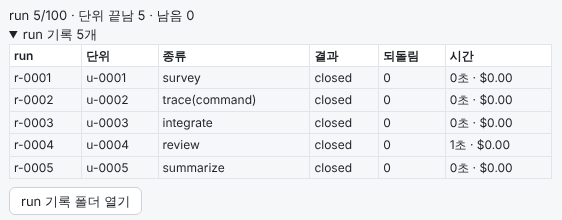
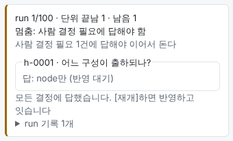
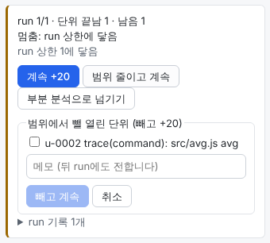
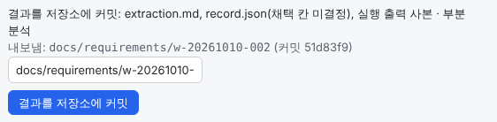

# 요구사항 추출 사용 안내

요구사항 추출은 레거시 펌웨어 저장소의 코드를 읽고, 그 코드가 지금 하는 일을 **요구사항 후보와 제약 후보**로 정리하는 업무 유형입니다. 후보마다 근거가 붙습니다. 근거는 기준 커밋의 원본 위치(`파일:줄`)나 실행한 명령과 그 출력입니다. 코드는 바꾸지 않습니다. 이 문서는 이 유형으로 일하는 방법을 처음부터 끝까지 설명합니다.

결과는 모두 **후보**입니다. 앱은 코드가 지금 그렇게 동작한다는 근거를 모을 뿐이고, 그것이 제품이 원하는 동작인지는 판단하지 않습니다. 무엇을 요구사항으로 채택할지는 사람이 정합니다. 내보낸 기록의 채택 칸도 "미결정"으로 남습니다.

## 이럴 때 쓰세요

- **문서가 없는 펌웨어를 넘겨받았을 때.** 명령 처리, 상태 전이, 타이밍, 통신 프로토콜, 기동과 리셋처럼 지금 코드가 하는 일을 근거와 함께 한곳에 모읍니다.
- **다시 만들거나 옮기기 전에.** 새 코드도 지켜야 할 동작과 제약(타임아웃 값, 프레이밍, 공유 자원 보호 등)을 빠짐없이 찾고 싶을 때 씁니다.
- **보드나 빌드 구성마다 동작이 다를 때.** 주장마다 어느 구성에 해당하는지 붙습니다. 구성끼리 다른 곳은 따로 살핍니다.

## 이럴 땐 맞지 않습니다

- **요구사항이 옳은지 정하는 일.** 코드에 버그가 있으면 그 버그도 "지금 동작"으로 나옵니다. 코드와 의도가 다른지는 사람이 봅니다.
- **코드를 고치는 일.** 이 유형은 코드를 바꾸지 않습니다. 고치려면 다른 유형의 Work를 만듭니다.
- **빨리 끝내야 하는 일.** 앱이 분석 run을 수십 개 돌립니다. 시범 기록에서 작은 저장소는 run 8개에 약 5분이 걸렸습니다. 1.6천 줄에 빌드 구성이 둘인 펌웨어는 분석 단위가 120개로 늘었고, run 41개(약 67분)로 그 가운데 3분의 1을 돌았습니다.

## 한눈에 보기

| 단계 | 누가 하나 | 사람이 할 일 |
|---|---|---|
| 01 의도 정리 | 에이전트 세션(터미널) | 범위와 제외할 것, 있는 자료, 빌드를 허용할지 답하고 [의도 승인] |
| 02 요구사항 추출 | 앱이 분석 run을 하나씩 돌림(세션 없음) | 사람 결정에 답하고, 멈추면 까닭을 보고 [재개]. 끝나면 결과를 보고 [승인] |
| 03 리뷰와 검증 | 에이전트 세션(터미널) | 표본 주장을 원본과 대조해 답하고, 지적을 고르고, 결과를 저장소로 내보낸 뒤 마침 |

세 단계 모두 사람이 승인합니다. 자동 승인은 없습니다. 사이드바와 머리 띠에는 유형이 `요구사항`으로 보입니다.

## 준비

- **Claude Code 로그인.** 요구사항 추출의 분석 run은 [설정]의 기본 엔진과 상관없이 늘 Claude Code(`claude`)로 돕니다. `claude`가 PATH에 없으면 `CLAUDE_BIN`에 경로를 줍니다.
- **프로젝트 등록.** 다른 유형과 같습니다. 서브모듈이 있으면 그 안은 분석하지 않는 경계로 둡니다([서브모듈이 있는 레포](submodules.md)).
- **빌드 도구(선택).** 저장소를 make 계열 명령으로 빌드하고 컴파일러가 설치돼 있으면, 앱이 구성별 빌드 인덱스를 만들어 분석을 검사할 수 있습니다([빌드 인덱스 질문](#빌드-인덱스-질문)). 없어도 분석은 됩니다.
- **자료(선택).** 데이터시트나 프로토콜 명세가 있으면 요청에 적습니다. 저장소 안에 있는 문서는 run이 읽을 수 있습니다. 문서에서 온 근거는 "코드에서 확인되지 않음(문서의 주장)"으로 따로 표시됩니다.
- **예산 확인.** [설정]의 "요구사항 추출" 절에서 Work당 run 상한(기본 100)을 봅니다([설정](#설정)).

## 1. Work 만들기

[새 Work]에서 유형 **요구사항 추출**을 고르고 요청을 적습니다. 이 유형만의 입력칸은 없습니다.

- **요청에 적을 것:** 분석할 범위, 제외할 것(벤더 HAL·RTOS 등), 있는 자료(데이터시트, 툴체인), 결과를 쓸 곳.
- **기준 브랜치:** 분석하는 코드는 Work를 만들 때의 기준 브랜치 커밋입니다. 모든 근거는 이 기준 커밋을 가리킵니다.

예:

```text
이 저장소 펌웨어의 지금 동작을 요구사항 후보와 제약으로 정리해 주세요.
제외: vendor/ 아래 HAL, third_party/FreeRTOS 커널
자료: docs/hw/ 아래 MCU 데이터시트(저장소 안)
툴체인: arm-none-eabi-gcc 12.2 설치됨. make로 빌드하고, 빌드는 돌려도 됩니다
결과: docs/requirements/에 내보내 PR로 공유
```

보드나 기능을 먼저 골라야 하는 것은 아닙니다. "모든 빌드 구성과 프로젝트 자체 코드"도 맞는 범위입니다.

## 2. 의도 정리

에이전트가 범위를 정할 만큼만 저장소를 훑고, 목표·비목표·완료조건 초안을 씁니다. 펌웨어를 분석하거나 요구사항을 나열하지는 않습니다. 그 일은 다음 단계의 몫입니다.

- **묻는 것:** 저장소의 빌드 명령을 돌려도 되는지, 설치된 툴체인의 이름과 버전. 이 답은 기록용입니다. 실제 빌드 전에는 앱이 명령을 보여 주고 다시 묻습니다.
- **경계:** 벤더 HAL, RTOS 커널, 서드파티 라이브러리는 기본으로 경계입니다. 설정과 호출 경계까지만 보고 안은 보지 않습니다. 안까지 봐야 하면 터미널에서 그렇게 말합니다. 초안의 `제약`에 "경계: …"로 적힙니다.
- **초안의 `제약` 세 줄:** 자료(없으면 "없음"), 빌드(허용과 툴체인, 또는 허용하지 않는 까닭), 경계(기본 외에 안까지 볼 것).
- **기본 완료조건:** 분석 대상과 제외 범위가 기준 커밋과 함께 있다, 분석 항목마다 끝난 상태가 있다, 모든 후보가 근거로 이어진다, 미확정·충돌이 따로 둔 절에 있다, 분석 범위·누락 가능성·검증 계획이 있다. 요청에 맞는 항목이 더해집니다.

초안이 맞으면 [의도 승인]을 누릅니다. 요약 탭 맨 위에서 목표·비목표·완료조건을, 산출물 탭에서 `제약`을 봅니다. 유형을 잘못 골랐으면 의도 승인 전에 [단계 선택] → 의도 정리에서 바꿉니다.

## 3. 요구사항 추출

이 단계에는 터미널이 없습니다. 가운데 칸에는 "이 단계는 세션 없이 앱이 분석 run을 하나씩 돌립니다"만 보이고, 진행과 할 일은 오른쪽 패널 맨 위의 진행 상자에 모입니다.



### 진행 상자 읽기

- **첫 줄 `run 5/100 · 단위 끝남 5 · 남음 0`:** 쓴 run 수와 상한, 끝난 분석 단위와 남은 단위입니다. 실패하거나 수렴하지 않아 멈춘 단위가 있으면 `· 멈춘 단위 N`이 붙습니다.
- **`r-0003 도는 중: u-02 …`:** 지금 도는 run과 그 단위의 목적, 쓰는 도구입니다.
- **`멈춤: …`:** 멈춘 까닭과 설명입니다([멈췄을 때](#멈췄을-때)).
- **`run 기록 N개`:** 펼치면 run마다 단위, 종류, 결과, 되돌림, 시간(과 비용)이 보입니다. run 이름을 누르면 검사 결과가 펼쳐집니다. [run 기록 폴더 열기]는 run의 원본 기록 폴더를 엽니다.

### run이 하는 일

앱은 분석을 작은 단위로 나눠 run 하나에 단위 하나씩 돌립니다. run은 서로의 대화를 모르고, 앱이 쌓은 기록만 받아 이어 갑니다.

| 종류 | 하는 일 |
|---|---|
| survey | 맨 처음에 돕니다(빌드 인덱스와 맞지 않으면 다시). 빌드 구성(빌드 파일로 확인된 것과 후보), 구성별 진입점(리셋, ISR, 메인 루프, 태스크, 명령 표 등), 인터페이스, 경계를 찾고 분석 단위를 제안합니다 |
| trace | 단위 하나를 한 관점으로 끝까지 따라갑니다. 관점(렌즈)은 command(명령 하나), state(상태 변수 하나), timing(시간 상수), shared(여러 문맥이 쓰는 자원), variant(구성 차이), lifecycle(기동·저전력·워치독·리셋), protocol(링크 하나의 프레이밍)입니다 |
| integrate | 주장 사이를 잇고(같은 말, 다시 본 주장, 충돌, 미확정의 답 후보), 관점마다 빈칸을 찾아 새 단위를 제안합니다. survey·trace 10번마다, 그리고 마지막에 돕니다 |
| review | 위험한 주장(수치, "없다"는 주장, 하드웨어·통신·동시성 제약, 요구사항 후보, 모든 구성에 대한 주장)과 나머지의 20% 표본을 앞 run의 답을 숨긴 채 다시 묻고 반박해 봅니다 |
| summarize | 맨 끝에 한 번. 개요와 다음 단계에 넘길 요약을 씁니다 |

- **차례:** survey → trace·integrate → review → summarize. 같은 차례에서는 우선순위가 높은 단위부터 돕니다.
- **제출 검사:** 앱은 run의 제출을 받기 전에 근거 경로가 기준 커밋에 있는지, 인용이 그 줄에 정말 있는지 등을 검사합니다. 틀리면 run에 두 번까지 돌려보내 고치게 합니다. 표의 "되돌림"이 그 횟수입니다.
- **run 하나의 시간:** 기본 15분이 지나면 탐색을 막고 지금까지 본 것을 미완료로 내게 합니다. 30분을 넘으면 run을 끝내고 실패로 셉니다.

### 사람 결정 필요

run이 코드만으로 정할 수 없는 것을 사람에게 물으면 진행 상자에 양식이 뜹니다. 사이드바 배지가 "사람 결정 필요"가 되고, 그 Work를 보고 있지 않으면 OS 알림("02 요구사항 추출: 사람 결정 필요")이 갑니다.



1. 칸마다 `h-0001 · 질문` 아래 선택지를 고르거나 "직접 적기"에 답을 적습니다.
2. [답 보내기]를 누릅니다. 보낸 답은 `답: … (반영 대기)`로 보이고 고칠 수 없습니다.
3. 답은 다음 run 전에 반영됩니다. 멈춰 있었으면 [재개]를 눌러야 이어서 돕니다.

기다리는 동안에도 그 결정에 걸리지 않은 단위는 계속 돕니다. 돌릴 단위가 남지 않으면 "멈춤: 사람 결정 필요에 답해야 함"으로 멈춥니다.

### 빌드 인덱스 질문

survey가 빌드 명령이 있는 구성을 찾았고 그 명령이 make 계열(`make`, `gmake`, `mingw32-make`)이면 앱이 한 번 묻습니다. "구성별 빌드 인덱스를 만들까요?" 아래에 구성마다 실제로 돌릴 명령이 보입니다.

- **허용하면:** 앱이 Work 폴더 아래의 별도 체크아웃(저장소 worktree가 아님)에 기준 커밋을 풀고, 구성마다 빌드 명령을 한 번 돌립니다. 그다음 `make -n -B`로 컴파일 명령을 모아 `.c` 소스마다 전처리와 컴파일을 해서, 구성마다 어떤 심볼이 정의되고 어떤 줄이 실제로 컴파일되는지 모읍니다. 앱은 이것으로 survey가 말한 구성을 검사하고, 맞지 않으면 survey를 다시 돌립니다. run 수에는 들지 않습니다.
- **허용하지 않으면:** 만들지 않고 이어서 돕니다. 구성 검사 없이 분석합니다.
- **판단할 것:** 빌드 명령은 이 컴퓨터에서 실제로 실행됩니다. 빌드가 네트워크나 저장소 밖 파일을 쓰는지 보고 정합니다.
- **답할 때까지:** survey가 낸 단위가 기다립니다.
- **컴파일러가 없으면:** 명령의 컴파일러가 없으면 `$CC`, `clang`, `zig cc` 차례로 찾아 대신 씁니다. 그래도 실패한 구성은 인덱스에서 빠집니다.

결과는 extraction.md의 "분석 범위"에 "만듦(구성 …)", "사람이 허용하지 않아 만들지 않음", "만들 수 없음"(make 계열이 아님), "만들지 못함"(빠진 구성과 까닭) 가운데 하나로 남습니다.

### 멈추고 잇기

| 하고 싶은 것 | 방법 |
|---|---|
| 바로 멈추기 | [즉시 중단]. 도는 run을 끝내고 그 결과를 버립니다. 버린 run은 세지 않습니다 |
| 지금 run까지만 돌고 멈추기 | [이 단계 끝나면 멈춤]을 체크합니다. 이 단계에서는 단계 끝이 아니라 지금 run이 끝나면 멈추고, 체크는 저절로 풀립니다 |
| 이어서 돌리기 | [재개] |

- **앱을 끄면:** 도는 run을 버리고 "사람이 멈춤"(설명 "앱 종료")으로 멈춥니다. 앱이 비정상으로 꺼졌으면 다시 켤 때 돌던 run을 버리고 "앱을 다시 켬"으로 멈춰 있습니다. 어느 쪽이든 저절로 잇지 않으니 [재개]를 누릅니다.
- **사용량 한도:** 5시간 한도에 걸리면 멈추지 않고 "사용량 한도: (시각)까지 기다렸다 같은 단위부터 잇습니다"를 보이며 기다립니다. 주간 한도이면 "주간 사용량 한도"로 멈춥니다. 한도에 걸린 run은 세지 않습니다.

### run 상한에 닿았을 때



"멈춤: run 상한에 닿음" 아래에 버튼 셋이 나옵니다.

- **[계속 +20]:** 이 Work의 상한만 20 늘리고 바로 이어서 돕니다.
- **[범위 줄이고 계속]:** 남은 단위 목록에서 뺄 단위를 체크하고 메모를 적은 뒤 [빼고 계속]을 누릅니다. 뺀 단위는 "범위 밖"으로 끝나고 메모가 까닭으로 남습니다. 메모는 뒤 run에도 전해집니다. 상한도 20 늘어납니다.
- **[부분 분석으로 넘기기]:** 남은 단위를 "보류: 예산 상한"으로 닫고 summarize run 하나를 상한 밖에서 돌려 끝냅니다. 답하지 않은 결정은 "답 없음"으로 남습니다. 결과 문서 맨 위에 부분 분석이라는 표시가 붙습니다.

[설정]에서 "Work당 run 상한"을 올리고 [재개]해도 됩니다. 상한을 올리지 않고 [재개]만 누르면 곧바로 다시 멈춥니다.

### 끝나면: 결과를 보고 승인

남은 단위와 답할 결정이 없으면 앱이 결과 문서 `extraction.md`를 쓰고 승인 대기로 넘어갑니다.

- **열린 질문:** 미확정·충돌·검토로 내려간 주장의 수, 끝나지 않은 단위, 부분 분석 여부가 보입니다. 여기서 답하는 질문이 아니라 extraction.md의 해당 절을 가리키는 요약입니다.
- **탭:** 요약(앱이 센 단위·주장·근거 수, 답한 사람 결정, 위험), 산출물(`extraction.md`), 변경.
- **[승인]:** 리뷰와 검증으로 넘어갑니다. 열린 질문이 있으면 한 번 확인합니다.
- **더 분석하고 싶으면:** 승인하지 말고 [단계 선택] → 요구사항 추출로 추가 지시를 줍니다([다시 돌리기](#다시-돌리기)).

## 4. 결과 읽기 (extraction.md)

| 절 | 볼 것 |
|---|---|
| (머리) | 기준 커밋, 기록 revision. 부분 분석이면 그 표시 |
| 개요 | summarize run이 쓴 서술. 상태와 근거는 아래 절이 기준입니다 |
| 구성 | 빌드 구성마다 확정(confirmed)인지 후보(candidate)인지, 고르는 방법과 빌드 명령 |
| 분석 범위 | 본 것, 경계로 두고 안은 보지 않은 것, 찾아봤으나 없던 것, 빌드 인덱스 상태 |
| 분석 단위 | 단위마다 종류, 목적, 끝난 상태와 까닭 |
| 관점별 범위 | 관점(진입점, 명령, 상태, 타이밍, 동시성, 구성 차이, 생명주기, 프로토콜, 오류 경로, 메모리)마다 구성별로 다뤘는지. **못 닿음**은 어느 단위도 다루지 않은 칸입니다 |
| 요구사항 후보 | "조건 → 동작 → 결과" 꼴의 후보와 근거 |
| 제약 후보, 관찰, 수치 | 지켜야 할 제약(까닭과 함께), 관찰한 사실, 구성별 상수 값 |
| 미확정 | 코드로 정하지 못한 것과 **필요한 자료**(외부 문서, 실제 하드웨어 측정, 돌리지 못한 빌드나 도구, 제품 의도 등) |
| 충돌 | 같은 구성에서 함께 설 수 없는 주장 |
| 부재 주장 | "없다"는 주장과 찾아본 방법 |
| 대체되거나 합쳐진 주장 | 같은 말이거나 다시 본 주장이라 접은 것. 기록에는 그대로 있습니다 |
| 검토 | review가 상태를 내린 주장 |
| 사람 결정, 사람 메모 | 답한 결정과 범위를 줄일 때 쓴 메모 |
| 누락 가능성 | 끝나지 않은 단위, 관점의 빈칸, 검토하지 않은 위험 주장 수 등 이 기록에 빠졌을 수 있는 것 |
| 검증 계획 | 사람이 다시 확인할 차례 |

주장 한 줄은 `- c-0012 (u-0004) [구성]: 글 — 근거: 경로:줄-줄` 꼴입니다. 상태는 이렇게 읽습니다.

- **코드에서 확인됨 / 코드에서 확인되지 않음:** 근거의 성격입니다. 앞은 기준 커밋의 코드나 실행 출력으로 확인한 지금 동작이고, 뒤는 문서·외부 명세·추론입니다. 어느 쪽이든 채택은 정해지지 않은 후보입니다.
- **검토로 내려간 주장:** review가 반증, 범위 과장, 보완 필요, 충돌을 찾은 주장입니다. 먼저 확인할 대상입니다.
- **검토에서 반박되지 않음 N회(확인 아님):** 반박에 실패했다는 이력일 뿐, 맞다는 확인이 아닙니다.
- **연결:** integrate가 이은 연결(답 후보, 같은 말 등)은 읽는 사람을 위한 표시입니다. 주장의 상태를 바꾸지 않습니다.

단위의 끝난 상태는 완료, 외부 근거 필요, 범위 밖, 보류: 연속 실패, 보류: 수렴 안 됨, 보류: 예산 상한 가운데 하나입니다. 완료가 아닌 단위는 누락 가능성 절에도 나옵니다.

## 5. 리뷰와 검증

다른 유형처럼 에이전트 세션이 돕니다. 코드 변경이 아니라 추출 결과를 리뷰합니다.

- **하는 일:** 인용한 원본 위치를 열어 기준 커밋의 코드가 그 구성에서 정말 그렇게 하는지 봅니다. 구성을 합쳐 말한 주장, 코드가 보이지 않는 보장을 말한 주장, 관측값을 보장으로 다룬 주장, 끝난 상태가 없는 단위, 필요한 자료가 빠진 미확정을 찾습니다. 요구사항이 좋은지는 판단하지 않습니다.
- **사람 표본 확인:** 위험한 주장 가운데 셋까지 골라 ID, 주장, `경로:줄`, 인용을 한 질문으로 보입니다. 원본을 열어 보고 터미널에서 `맞음`, `틀림`, `모름`으로 답합니다(Codex면 앱 질문창). `틀림`은 추출로 돌아갈 차단 지적이 됩니다.
- **지적 고르기:** 다른 유형처럼 "차단·권장만 반영 / 모두 반영 / 반영하지 않음"이나 번호로 고릅니다. 다만 이 유형은 **이 단계에서 고치지 않습니다.** 고른 지적은 `반영하지 않은 지적` 절에 관련 ID와 추출이 할 일(철회, 범위 좁힘, 단위 다시 보기, 자료 필요)과 함께 적힙니다. 되감을 때 추가 지시로 그대로 붙여 넣을 수 있는 문장입니다.
- **완료조건 판정:** extraction.md와 인용된 원본으로 완료조건마다 판정합니다.

추출이 틀렸거나 빠뜨린 것이 있으면 리뷰가 앞 단계로 돌아가자고 추천합니다. 완료 화면에 "이전 단계 추천"이 뜨면 [승인하고 멈춤]을 누른 뒤 [단계 선택]으로 요구사항 추출을 고르고, `반영하지 않은 지적`의 문장을 추가 지시에 붙여 넣습니다.

## 6. 결과 내보내기와 마치기

결과 문서와 기록은 내보내기 전에는 저장소에 없습니다. 리뷰와 검증의 완료 화면(승인 대기)이나 끝난 Work의 화면에 내보내기 상자가 있습니다.



1. 내보낼 폴더를 확인합니다. 기본은 `docs/requirements/<Work id>`이고, 저장소 안의 상대 경로면 바꿀 수 있습니다.
2. [결과를 저장소에 커밋]을 누릅니다. Work 브랜치에 그 폴더만 커밋합니다(메시지 "요구사항 추출 결과 내보내기: <폴더>"). 내보낸 뒤에는 `내보냄: <경로> (커밋 …)`이 보입니다.
3. 다른 유형처럼 [완료만], [push], [PR 생성] 가운데 하나로 마칩니다. 내보낸 뒤 만든 PR의 본문 끝에는 결과 위치가 한 줄 붙습니다.

내보내는 폴더의 내용:

| 파일 | 내용 |
|---|---|
| `extraction.md` | 승인한 결과 문서 |
| `record.json` | 구성, 단위, 모든 주장(채택 칸 "미결정"과 검토 이력), 근거, 사람 결정, 연결, 관점별 범위를 담은 기계용 기록 |
| `outputs/` | 실행 출력 근거의 사본 |
| `schemas/` | `record.json`을 읽을 스키마 |

## 7. 다시 돌리기

[단계 선택]에서 **요구사항 추출(extract)**을 고르면 "현재 기록 위에서 이어서"가 처음부터 체크되어 있습니다.

- **체크한 채로(이어서):** 지금까지의 기록을 그대로 두고, 추가 지시를 메모로 남긴 뒤 integrate부터 잇습니다. integrate가 지시를 새 단위로 바꿉니다. 예산 상한으로 보류했던 단위도 다시 열립니다. 리뷰의 지적을 반영하거나 범위를 넓힐 때 씁니다.
- **체크를 풀면(처음부터):** 앞 기록과 이어지지 않는 새 기록으로 survey부터 다시 돕니다. 추가 지시는 메모로 남습니다.
- **공통:** run 수는 이어서 셉니다. 상한이 빠듯하면 [설정]에서 올립니다. 미리 보기에서 되돌릴 커밋을 확인합니다. 체크를 풀면 내보내기 커밋이 되돌려질 수 있습니다. 되돌린 커밋은 백업 브랜치에 남습니다.

## 설정

[설정]의 "요구사항 추출" 절에서 분석 run의 예산을 정합니다. 바꾼 값은 다음 run부터 씁니다.

| 칸 | 기본 | 범위 | 뜻 |
|---|---|---|---|
| Work당 run 상한 | 100 | 1~1000 | 닿으면 멈춥니다. 멈춘 Work는 [계속 +20]으로 그 Work의 상한만 늘립니다 |
| run 하나의 시간 상한(분) | 30 | 2~240 | 넘으면 run을 끝내고 실패로 셉니다 |
| run 하나의 부드러운 마감(분) | 15 | 1~239 | 지나면 탐색을 막고 미완료로 내게 합니다. 시간 상한보다 짧아야 합니다 |
| 같은 단위 연속 실패 | 2 | 1~10 | 닿으면 그 단위를 "보류: 연속 실패"로 끝내고 다른 단위를 잇습니다 |
| 전체 연속 실패 | 3 | 1~10 | 단위와 관계없이 닿으면 전체를 멈춥니다 |
| 같은 단위 연속 미완료 | 3 | 1~10 | 닿으면 그 단위를 "보류: 수렴 안 됨"으로 끝내고 다른 단위를 잇습니다 |

- **모델과 추론 수준:** [설정] → 상세 설정의 "요구사항 추출 (extract)" 줄에서 고릅니다. 비워 두면 앱의 기본 모델을 따르고, 그것도 없으면 sonnet·medium으로 돕니다. run은 늘 Claude Code로 돌므로 Claude 모델을 고릅니다. 이 값은 단계가 시작될 때 정해지므로, 바꾸면 다음 extract 단계부터 씁니다.
- **동시 실행:** run 하나가 "세션 상한"(기본 3)의 자리 하나를 씁니다. 다른 Work가 자리를 다 쓰고 있으면 자리가 날 때까지 기다립니다.

## 데이터와 안전

- **저장소를 바꾸지 않습니다.** run은 기준 커밋의 저장소를 읽기만 하고, 쓰기는 Work 폴더 아래 run별 작업 폴더에만 합니다. run 앞뒤로 worktree를 비교해 바뀌었으면 그 run을 버리고 멈춥니다("기준 소스가 바뀜"). 저장소에 무엇을 쓰는 것은 [결과를 저장소에 커밋] 하나뿐입니다.
- **run은 셸 명령을 실행할 수 있습니다.** 분석에 필요한 명령(검색, 도구 실행 등)을 작업 폴더에서 돌립니다. 믿을 수 없는 저장소에는 쓰지 마세요.
- **기록 위치:** `RELAY_HOME/projects/<프로젝트>/works/<work-id>/` 아래에 둡니다.
  - `requirements/`: 기록의 변경분(revision), 사람의 답, run별 기록(`runs/r-NNNN/`), 실행 출력, 빌드 인덱스
  - `tasks/NN-extract/`: `extraction.md`와 `handoff.md`
  - [run 기록 폴더 열기]로 `requirements/runs`를 엽니다.
- **기록을 손으로 고치지 마세요.** 앱은 기록 파일의 해시를 재어 둡니다. 밖에서 바뀌면 "기록 무결성 오류"로 멈추고, 승인도 막힙니다. 에이전트 세션도 이 폴더를 고치지 못하게 막아 둡니다.
- **UTF-8이 아닌 파일:** EUC-KR 같은 파일은 인용의 ASCII 부분만 대조합니다. 한글 주석만 인용한 근거는 확인되지 않습니다.

## 멈췄을 때

멈추면 진행 상자에 `멈춤: <까닭>`과 설명이 보입니다. 사이드바 배지도 `멈춤: <까닭>`이 되고, 그 Work를 보고 있지 않으면 OS 알림이 갑니다. "사람이 멈춤"과 "앱을 다시 켬"은 배지에 "중단됨"으로만 보이고 알림이 없습니다.

| 까닭 | 언제 | 할 일 |
|---|---|---|
| 사람이 멈춤 | [즉시 중단], 앱 종료, [이 단계 끝나면 멈춤] | [재개] |
| 사람 결정 필요에 답해야 함 | 돌릴 단위가 없고 답할 결정만 남음 | 양식에 답하고 [재개] |
| run 상한에 닿음 | Work당 run 상한에 닿음 | [계속 +20], [범위 줄이고 계속], [부분 분석으로 넘기기] 가운데 하나 |
| 연속 실패 | 단위와 관계없이 run이 잇따라 실패(기본 3번) | 아래 참고 |
| 주간 사용량 한도 | 주간 한도, 또는 재설정 시각을 모르는 한도 | 한도가 풀린 뒤 [재개] |
| 앱을 다시 켬 | 앱이 꺼질 때 돌던 run이 있었음 | [재개] |
| run을 띄우지 못함 | `claude`를 찾지 못했거나 run을 시작하다 오류가 남 | 설명을 보고 고친 뒤 [재개]. `claude` 설치와 PATH, `CLAUDE_BIN`을 확인합니다 |
| 기준 소스가 바뀜 | run 도중 분석 대상 worktree가 바뀜(무시하는 파일 포함) | 아래 참고 |
| 기록 무결성 오류 | `requirements/` 안 파일이 없거나 바뀜 | 아래 참고 |

<details>
<summary>"연속 실패"로 멈췄습니다</summary>

로그인 만료나 CLI 변경처럼 모든 run에 걸리는 문제일 수 있습니다. run 기록 표의 "결과"(예: `exit_1`, `error_…`, `schema`)를 보고, [run 기록 폴더 열기]로 그 run 폴더의 `stderr.txt`와 `stdout.jsonl`을 봅니다. 원인을 고친 뒤 [재개]합니다. [재개]해도 연속 실패 수는 0으로 돌아가지 않습니다. 다음 run이 성공해야 0이 되고, 또 실패하면 바로 다시 멈춥니다.

</details>

<details>
<summary>"기준 소스가 바뀜"으로 멈췄습니다</summary>

분석하는 동안 누군가(또는 무엇인가) Work의 worktree를 바꾼 것입니다. 그 run은 버렸고 실패로 세지 않았습니다. 앱은 worktree를 되돌리지 않습니다. worktree에서 `git status --ignored`로 바뀐 것을 보고 되돌린 뒤 [재개]합니다.

</details>

<details>
<summary>"기록 무결성 오류"로 멈췄습니다</summary>

기록 파일이 앱 밖에서 바뀌었거나 손상된 것입니다. 이 기록으로 낸 결과는 근거를 믿을 수 없습니다. 파일을 손으로 고치지 말고, 새 Work로 다시 시작하세요. 앱 안에는 고치는 버튼이 없습니다.

</details>

<details>
<summary>run 기록 표의 "결과" 값이 무슨 뜻인가요</summary>

| 값 | 뜻 |
|---|---|
| `closed` | 단위를 끝냄 |
| `incomplete` | 미완료로 냄. 같은 단위가 다시 돕니다 |
| `apply_check` | 두 번 되돌려도 남은 제출 문제가 있어 반영하지 못함 |
| `hard_timeout` | 시간 상한을 넘음 |
| `exit_N`, `no_result`, `error_…` | `claude`가 오류로 끝나거나 결과를 내지 못함 |
| `schema`, `no_structured_output` | 결과의 형식이 틀림 |
| `stopped` | [즉시 중단]으로 버림(세지 않음) |
| `usage_limit` | 사용량 한도로 버림(세지 않음) |
| `worktree_changed` | worktree가 바뀌어 버림(세지 않음) |
| 그 밖의 값 | run이 정상으로 끝나지 않은 실패(`stop_fields_missing`, `background_tasks`, `stale_revision`) |

</details>

<details>
<summary>제출 "되돌림"이 많습니다</summary>

가장 흔한 까닭은 인용 줄이 어긋나는 것입니다. run은 대개 한 번 되돌림에 고칩니다. 턴과 비용이 더 들 뿐 따로 할 일은 없습니다. 같은 단위가 두 번 잇따라 실패하면 그 단위만 "보류: 연속 실패"로 닫히고 나머지는 계속 돕니다.

</details>

<details>
<summary>빌드 인덱스가 만들어지지 않았습니다</summary>

extraction.md의 "분석 범위"를 봅니다. "만들 수 없음"이면 빌드 명령이 make 계열이 아닌 것입니다. "만들지 못함"이면 뒤에 빠진 구성과 까닭(빌드 실패, 컴파일러 없음 등)이 적혀 있습니다. 질문 자체가 없었다면 survey가 빌드 명령이 있는 확정 구성을 찾지 못한 것입니다. 어느 경우든 분석은 구성 검사 없이 끝까지 돕니다.

</details>

## 잘 쓰는 법

- **제외할 것을 먼저 정합니다.** 벤더 코드, 생성 코드, 쓰지 않는 보드를 요청에서 빼면 단위 수와 run 수가 줄어듭니다.
- **상한은 기본 100으로 시작합니다.** 닿으면 [범위 줄이고 계속]으로 우선순위가 낮은 단위를 뺍니다. review는 trace 뒤에 돌므로, 상한이 빠듯해 부분 분석으로 넘기면 검토 없이 끝납니다. 검토가 꼭 필요하면 상한을 넉넉히 둡니다.
- **미확정의 "필요한 자료"를 모읍니다.** 데이터시트나 하드웨어 측정이 필요하다고 적힌 것은 코드만으로는 정할 수 없습니다. 사람이 자료를 구해 확인할 목록으로 씁니다.
- **검토로 내려간 주장부터 봅니다.** 그다음 "모든 구성"에 대한 주장, 수치, "없다"는 주장을 원본과 대조합니다. 검증 계획 절이 차례를 줍니다.
- **"반박되지 않음"을 확인으로 읽지 않습니다.** 채택은 사람이 근거를 보고 정합니다.
